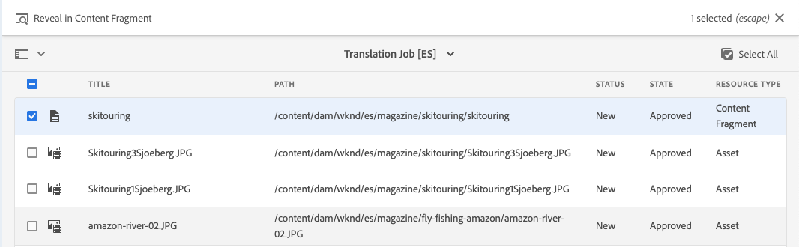

# 翻译内容 {#translate-content}

使用翻译连接器和规则翻译无头内容。

## 迄今为止的故事 {#story-so-far}

在AEM无头本地化历程的上一个文档中， [配置翻译规则](translation-rules.md)您学习了如何使用AEM翻译规则来识别翻译内容。 您现在应该：

* 了解翻译规则的用途。
* 能够定义您自己的翻译规则。

现在，连接器和翻译规则已设置完成，本文将引导您完成翻译无头内容的下一步。

## 目标 {#objective}

本文档可帮助您了解如何使用AEM翻译项目以及连接器和翻译规则来翻译内容。 阅读本文档后，您应：

* 了解翻译项目是什么。
* 能够创建新的翻译项目。
* 使用翻译项目来翻译您的无头内容。

## 创建翻译项目 {#creating-translation-project}

翻译项目使您能够管理无标题AEM内容的翻译。 翻译项目包含要翻译成其他语言的内容。

将内容添加到翻译项目后，将为其创建翻译作业。 作业提供命令和状态信息，您可以使用这些命令和状态信息来管理对资源执行的人工翻译和机器翻译工作流。

要创建翻译项目，请执行以下操作：

1. 导航到&#x200B;**导航** -> **资产** -> **文件**。 请记住，AEM中的无标题内容存储为称为内容片段的资产。
1. 选择项目的语言根。 在本例中，我们选择了`/content/dam/wknd/en`。
1. 点按或单击边栏选择器，并显示&#x200B;**引用**&#x200B;面板。
1. 点按或单击&#x200B;**语言副本**。
1. 选中&#x200B;**语言副本**&#x200B;复选框。
1. 展开引用面板底部的&#x200B;**更新语言副本**&#x200B;部分。
1. 在&#x200B;**项目**&#x200B;下拉列表中，选择&#x200B;**创建翻译项目**。
1. 为您的翻译项目提供适当的标题。
1. 点按或单击&#x200B;**开始**。


您会收到一则消息，表明项目已创建。

>[!NOTE]
>
>假定已在[内容结构定义中创建了翻译语言的必要语言结构。](getting-started.md#content-structure) 此操作应与内容架构师协作完成。

## 使用翻译项目 {#using-translation-project}

创建翻译项目时，AEM会根据您之前定义的规则评估您选择的路径下的无标题内容。 根据这些规则，它会提取需要翻译到新翻译项目的内容。

要查看翻译项目，请执行以下操作：

1. 导航到&#x200B;**Navigation** -&amp; **Projects**。
1. 点按或单击在上一部分中创建的项目。


项目分为多张卡片。

* **摘要**  — 此卡显示项目的基本标题信息，包括所有者、语言和翻译提供商。
* **翻译作业**  — 此卡片显示实际翻译作业的概述，包括状态、资产数量等。
* **团队**  — 此卡片显示正在协作处理此翻译项目的用户。此历程不涵盖此主题。
* **任务**  — 与翻译内容相关的其他任务，如执行项目或工作流项目。此历程不涵盖此主题。

要查看此项目中包含的无标题内容的详细信息：

1. 点按或单击&#x200B;**翻译作业**&#x200B;卡片底部的省略号按钮。
1. **翻译作业**窗口列出作业中的所有项。
   
1. 点按或单击某行可查看该行的详细信息，同时请记住，一行可能表示要翻译的多个内容项目。
1. 点按或单击行项目的选择复选框，以查看更多选项，例如从作业中删除行项目或在内容片段或资产控制台中查看行项目的选项。


通常，翻译作业的内容从&#x200B;**草稿**&#x200B;状态开始，如&#x200B;**翻译作业**&#x200B;窗口中的&#x200B;**状态**&#x200B;列所示。

要启动翻译作业，请返回到翻译项目概述，然后点按或单击&#x200B;**翻译作业**&#x200B;卡顶部的V形按钮，然后选择&#x200B;**开始**。


AEM现在可与您的翻译配置和连接器进行通信，以将内容发送到翻译服务。 您可以通过返回到“翻译作业&#x200B;**”窗口并查看条目的**&#x200B;状态&#x200B;**列来查看翻译进度。**


机器翻译会自动返回状态为&#x200B;**Approved**&#x200B;的状态。 人文翻译允许进行更多交互，但超出了此历程的范围。

## 审核翻译内容 {#reviewing}

[如前所示，](#using-translation-project) 机器翻译的内容将以“已批准”状态流回AEM，因为 **** 假定由于使用了机器翻译，因此无需人为干预。但是，当然仍然可以审阅翻译的内容。

只需转到已完成的翻译作业，然后通过点按或单击复选框来选择行项目。 内容片段&#x200B;**中的图标**&#x200B;显示显示在工具栏中。



点按或单击该图标可在其编辑器控制台中打开已翻译内容片段，以查看已翻译内容的详细信息。


如果您拥有适当的权限，则可以根据需要进一步修改内容片段，但编辑内容片段不在此历程的涵盖范围内。 有关此主题的更多信息，请参阅本文档末尾的[其他资源](#additional-resources)部分。

该项目的工作是在一个位置收集与翻译相关的所有资源，以便于访问和查看清晰的概述。 但是，正如您通过查看已翻译项目的详细信息所看到的，翻译本身会流回翻译语言的资产文件夹。 在本例中

```text
/content/dam/wknd/es
```

如果您通过&#x200B;**Navigation** -> **Files** -> **Assets**&#x200B;导航到此文件夹，您将看到翻译后的内容。


AEM翻译框架从翻译连接器接收翻译，然后基于语言根并使用连接器提供的翻译自动创建内容结构。

请务必了解此内容是否未发布。 它会一直保留在AEM的创作实例中，直到您确定它已准备好发布。 我们将在本地化历程的下一步中了解如何执行此操作。

## 人工翻译 {#human-translation}

如果您的翻译服务提供人工翻译，则审阅流程将提供更多选项。 例如，翻译将返回状态为&#x200B;**Draft**&#x200B;的项目，并且必须手动审核和批准或拒绝。

人文翻译超出了此本地化历程的范围。 有关此主题的更多信息，请参阅本文档末尾的[其他资源](#additional-resources)部分。

## 下一步 {#what-is-next}

现在，您已完成此部分无头本地化历程，接下来您应该：

* 了解翻译项目是什么。
* 能够创建新的翻译项目。
* 使用翻译项目来翻译您的无头内容。

在此知识的基础上，继续您的AEM无头本地化历程，方法是接下来查看文档[发布翻译内容](publish-content.md) ，您将在其中了解如何发布翻译内容，以及如何随着语言根内容的更改更新这些翻译。

## 其他资源 {#additional-resources}

虽然建议您通过查看文档[发布翻译内容来进入无头本地化历程的下一部分，但是](publish-content.md)下面是一些额外的可选资源，这些资源可以更深入地了解本文档中提到的一些概念，但并不需要继续在无头历程中继续。

* [管理翻译项目](/help/sites-cloud/administering/translation/managing-projects.md)  — 了解翻译项目和其他功能（如人文翻译工作流和多语言项目）的详细信息。
