# 翻译 Headless 内容 {#translate-content}

使用翻译集成翻译您的 Headless 内容。

## 迄今为止的故事 {#story-so-far}

在 AEM Headless 翻译历程的上一个文档[配置翻译连接器](configure-connector.md)中，您已了解 AEM 中的翻译框架。 您现在应：

* 了解 AEM 中翻译集成框架的重要参数。
* 能够自行建立与翻译服务的连接。

现在您的连接器已设置完毕，本文将引导您完成下一步，即翻译 Headless 内容。

## 目标 {#objective}

本文档可帮助您了解如何使用 AEM 的翻译项目以及连接器来翻译内容。阅读本文档后，您应：

* 了解什么是翻译项目。
* 能够创建新的翻译项目。
* 使用翻译项目来翻译 Headless 内容。

## 创建翻译项目 {#creating-translation-project}

翻译项目可让您管理 Headless AEM 内容的翻译。翻译项目将要翻译为其他语言的内容收集到一个位置，以便集中查看翻译工作。

在将内容添加到翻译项目时，将为其创建翻译作业。作业提供用于管理对资源执行的人工翻译和机器翻译工作流的命令和状态信息。

可通过两种方法创建翻译项目：

1. 选择内容的语言根并让 AEM 根据内容路径自动创建翻译项目。
1. 创建一个空项目并手动选择要添加到翻译项目的内容

两者都是有效的方法，通常只因执行翻译的角色而异：

* 翻译项目经理 (TPM) 通常需要灵活地手动选择要添加到翻译项目的内容。
* 如果内容所有者还负责翻译，则让 AEM 根据所选内容路径自动创建项目通常更轻松。

以下部分中将探讨这两种方法。

### 根据内容路径自动创建翻译项目 {#automatically-creating}

对于还负责翻译的内容所有者，让 AEM 自动创建翻译项目通常更轻松。要让 AEM 根据内容路径自动创建翻译项目，请执行以下操作：

1. 导航到&#x200B;**导航** > **资源** > **文件**。请记住，AEM 中的 Headless 内容将存储为称作内容片段的资源。
1. 选择项目的语言根。在此示例中，我们已选择 `/content/dam/wknd/en`。
1. 选择边栏选择器并显示&#x200B;**引用**&#x200B;面板。
1. 选择&#x200B;**语言副本**。
1. 选中&#x200B;**语言副本**&#x200B;复选框。
1. 展开“引用”面板底部的&#x200B;**更新语言副本**&#x200B;部分。
1. 在&#x200B;**项目**&#x200B;下拉列表中，选择&#x200B;**创建翻译项目**。
1. 为翻译项目提供适当的标题。
1. 选择&#x200B;**开始**。

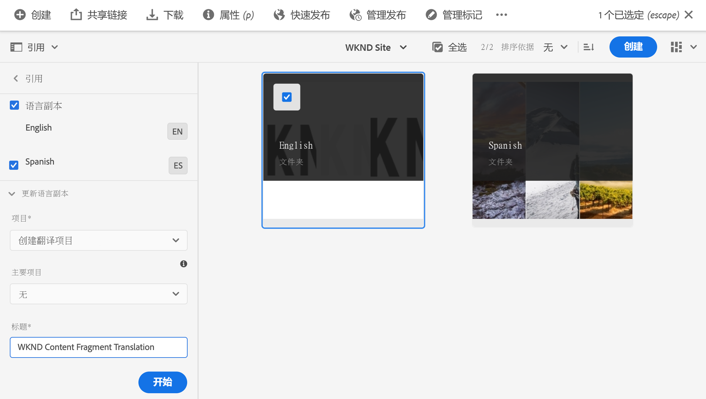

您会收到一条指示项目已创建的消息。

>[!NOTE]
>
>假定已创建翻译语言的必要语言结构作为[内容结构定义的一部分。](getting-started.md#content-structure)应与内容架构师协作来完成此操作。
>
>如果未提前创建语言文件夹，您将无法按照前面步骤中所述来创建语言副本。

### 通过选择内容而手动创建翻译项目 {#manually-creating}

对于翻译项目经理而言，通常需要手动选择要包含在翻译项目中的特定内容。要创建此类手动翻译项目，您必须首先创建一个空项目，然后选择要添加到该项目中的内容。

1. 导航到&#x200B;**导航** > **项目**。
1. 选择&#x200B;**创建** > **文件夹**，为您的项目创建文件夹。
   * 虽然这是一项可选操作，但有助于组织您的翻译工作。
1. 在&#x200B;**创建项目**&#x200B;窗口中，为文件夹添加&#x200B;**标题**，然后选择&#x200B;**创建**。

   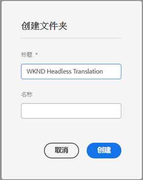

1. 选择该文件夹以将其打开。
1. 在新项目文件夹中，选择&#x200B;**创建** > **项目**。
1. 项目基于模板。选择&#x200B;**翻译项目**&#x200B;模板以将其选定，然后选择&#x200B;**下一步**。

   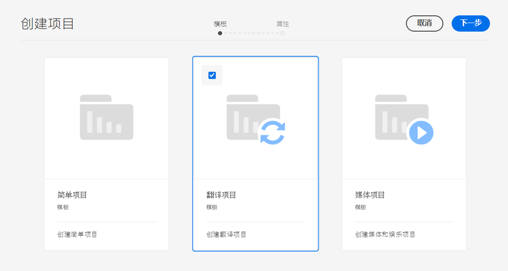

1. 在&#x200B;**基本**&#x200B;选项卡上，输入新项目的名称。

   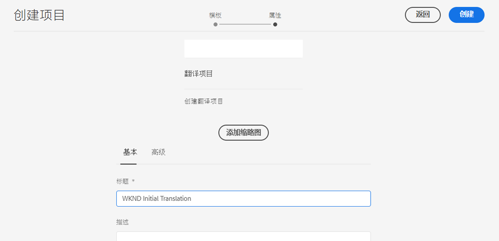

1. 在&#x200B;**高级**&#x200B;选项卡上，使用&#x200B;**目标语言**&#x200B;下拉列表选择应将内容翻译成的语言。选择&#x200B;**创建**。

   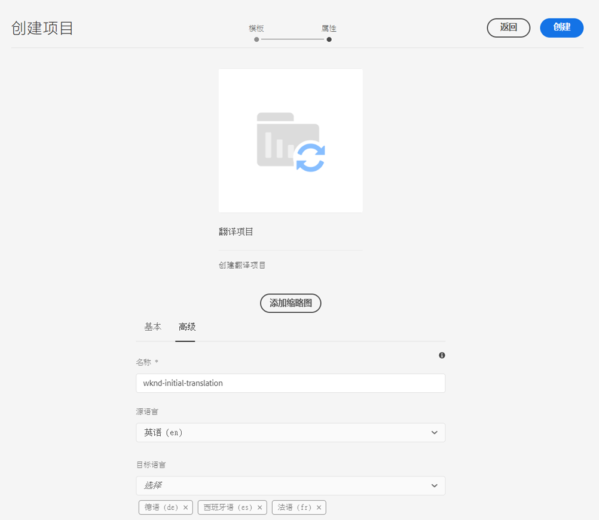

1. 在确认对话框中选择&#x200B;**打开**。

   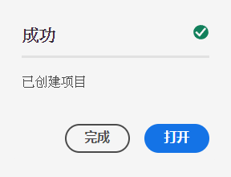

项目已创建，但未包含要翻译的内容。下一部分将详细介绍如何构建项目以及如何添加内容。

## 使用翻译项目 {#using-translation-project}

翻译项目旨在将与翻译工作相关的内容和任务集中到一个地方，使您的翻译变得简单且易于管理。

要查看翻译项目，请执行以下操作：

1. 导航到&#x200B;**导航** > **项目**。
1. 选择上一部分中创建的项目。

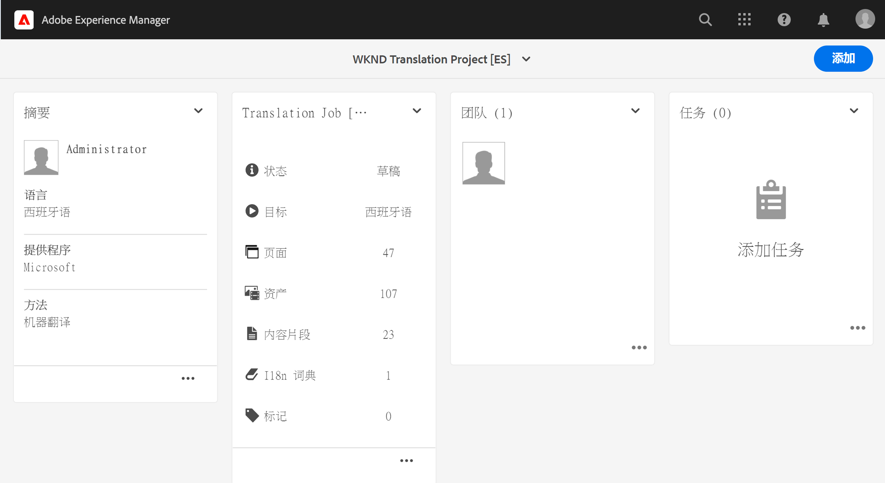

项目将分为多个信息卡。

* **摘要** – 此信息卡显示项目的基本标题信息，包括所有者、语言和翻译提供商。
* **翻译作业** – 此信息卡或这些信息卡概述了实际翻译作业，包括状态、资源数量等。一般每个语言有一个作业，并在作业名称后附加 ISO-2 语言代码。
* **团队** – 此信息卡显示正在协作处理此翻译项目的用户。该历程未涵盖此主题。
* **任务** – 与翻译内容相关的附加任务，例如待办事项或工作流项目。该历程未涵盖此主题。

翻译项目的使用方式取决于其创建方式：由 AEM 自动创建或手动创建。

### 使用自动创建的翻译项目 {#using-automatic-project}

在自动创建翻译项目时，AEM 会评估选定路径下的 Headless 内容。基于该评估，它将需要翻译的内容提取到新的翻译项目中。我已根据内容架构师标记为&#x200B;**可翻译**&#x200B;的字段获知要翻译的字段。

要查看此项目中包含的 Headless 内容的详细信息，请执行以下操作：

1. 选择&#x200B;**翻译作业**&#x200B;信息卡底部的省略号按钮。
1. **翻译作业**窗口将列出作业中的所有项目。
   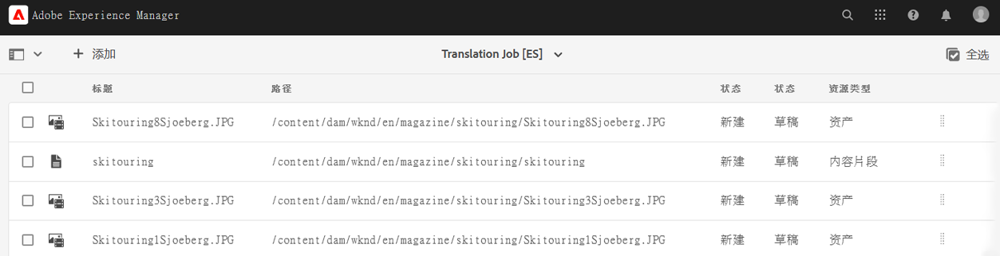
1. 选择一行以查看该行的详细信息，请记住，一行可能表示多个要翻译的内容项。
1. 选中某个行项的选择复选框以查看更多选项，例如，从作业中删除它或在“内容片段”或“资源”控制台中查看它的选项。

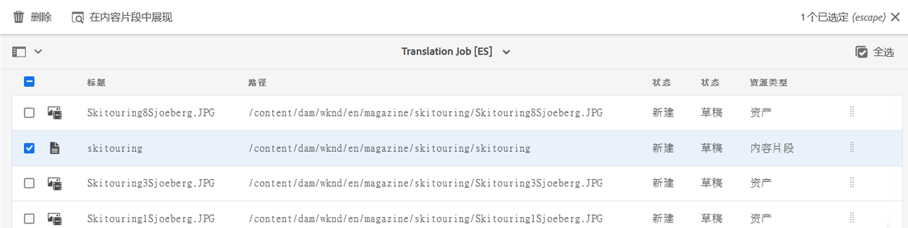

翻译作业的内容一般以&#x200B;**草稿**&#x200B;状态开始，如&#x200B;**翻译作业**&#x200B;窗口中的&#x200B;**状态**&#x200B;栏所示。

要开始翻译作业，请返回翻译项目概述并选择&#x200B;**翻译作业**&#x200B;信息卡顶部的 V 形按钮，然后选择&#x200B;**开始**。

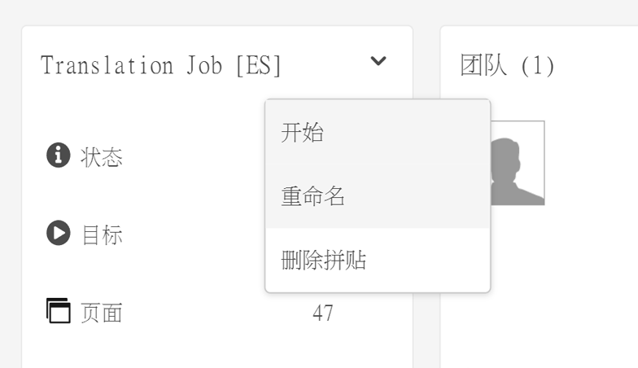

AEM 现在与您的翻译配置和连接器进行通信，将内容发送到翻译服务。您可以通过以下方式查看翻译进度，返回&#x200B;**翻译作业**&#x200B;窗口并查看条目的&#x200B;**状态**&#x200B;栏。

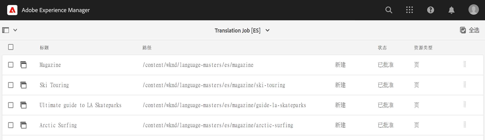

机器翻译将自动返回，状态为&#x200B;**已批准**。人工翻译允许更多的交互，但超出了此历程的范围。

### 使用手动创建的翻译项目 {#using-manual-project}

在手动创建翻译项目时，AEM 会创建必要的作业，但不会自动选择要包含的任何内容。这使翻译项目经理能够灵活地挑选要翻译的内容。

要将内容添加到翻译作业，请执行以下操作：

1. 选择某个&#x200B;**翻译作业**&#x200B;信息卡底部的省略号按钮。
1. 您将看到该作业不含任何内容。选择窗口顶部的&#x200B;**添加**&#x200B;按钮，然后从下拉列表中选择&#x200B;**资源/页面**。

   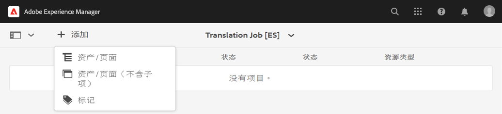

1. 这将打开一个路径浏览器，您可在其中选择要添加的具体内容。找到您的内容并使用“选择”以将其选定。

   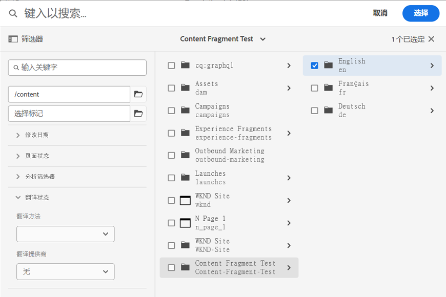

1. 选择&#x200B;**选择**&#x200B;以将所选内容添加到作业。
1. 在&#x200B;**翻译**&#x200B;对话框中，指定您要&#x200B;**创建语言副本**。

   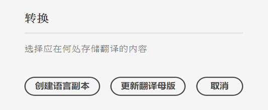

1. 此内容现已包含在作业中。

   

1. 选中某个行项的选择复选框以查看更多选项，例如，从作业中删除它或在“内容片段”或“资源”控制台中查看它的选项。


1. 重复这些步骤以在作业中包含所有必需的内容。

>[!TIP]
>
>路径浏览器是一个功能强大的工具，可让您搜索、过滤和导航您的内容。选择&#x200B;**仅内容/过滤器**&#x200B;按钮以切换侧面板并显示高级过滤器，如&#x200B;**修改日期**&#x200B;或&#x200B;**翻译状态**。
>
>可在[其他资源](#additional-resources)部分中详细了解路径浏览器。

可按上述步骤将必要内容添加到项目的所有语言（作业）。选择所有内容后，即可开始翻译。

翻译作业的内容一般以&#x200B;**草稿**&#x200B;状态开始，如&#x200B;**翻译作业**&#x200B;窗口中的&#x200B;**状态**&#x200B;栏所示。

要开始翻译作业，请返回翻译项目概述并选择&#x200B;**翻译作业**&#x200B;信息卡顶部的 V 形按钮，然后选择&#x200B;**开始**。


AEM 现在与您的翻译配置和连接器进行通信，将内容发送到翻译服务。您可以通过以下方式查看翻译进度，返回&#x200B;**翻译作业**&#x200B;窗口并查看条目的&#x200B;**状态**&#x200B;栏。


机器翻译将自动返回，状态为&#x200B;**已批准**。人工翻译允许更多的交互，但超出了此历程的范围。

## 审查已翻译的内容 {#reviewing}

[如前所述，](#using-translation-project)机器翻译的内容以&#x200B;**已批准**&#x200B;状态流回 AEM，因为假定使用的是机器翻译，无需人工干预。但仍可审查已翻译的内容。

只需转到已完成的翻译作业，并通过点按或单击复选框而选择行项。工具栏中将显示&#x200B;**在内容片段中展现**&#x200B;图标。

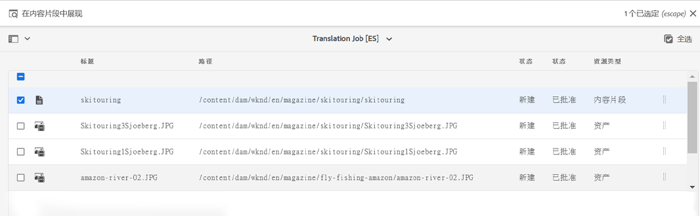

选择该图标以在其编辑器控制台中打开已翻译的内容片段，从而查看已翻译的内容的详细信息。


如果您有适当的权限，则可进一步修改必要的内容片段，但编辑内容片段超出了此历程的范围。有关此主题的更多信息，请参阅本文档末尾的[其他资源](#additional-resources)部分。

此项目旨在将与翻译相关的所有资源集中到一个地方，以便轻松访问和大致了解。但是，正如您通过查看已翻译项目的详细信息时所看到的那样，翻译本身将流回翻译语言的资源文件夹中。在此示例中，该文件夹为

```text
/content/dam/wknd/es
```

如果通过&#x200B;**导航** > **文件** > **资源**&#x200B;导航到此文件夹，则您将看到已翻译的内容。

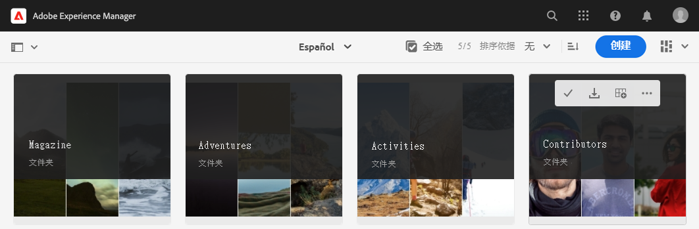

AEM 的翻译框架接收来自翻译连接器的翻译，然后使用连接器提供的翻译根据语言根来自动创建内容结构。

请务必了解一点，由于此内容未发布，因此不可用于您的 Headless 服务。您将了解此创作-发布结构，并了解如何在翻译历程的下一步发布已翻译的内容。

## 人工翻译 {#human-translation}

如果您的翻译服务提供人工翻译，则审查流程会提供更多选项。例如，翻译以&#x200B;**草稿**&#x200B;状态返回项目中，并且必须手动审查和批准或拒绝翻译。

人工翻译超出了此本地化历程的范围。有关此主题的更多信息，请参阅本文档末尾的[其他资源](#additional-resources)部分。不过，除了其他审批选项之外，人工翻译的工作流与此历程中描述的机器翻译相同。

## 后续内容 {#what-is-next}

现在，您已完成 Headless 翻译历程的这一部分，您应：

* 了解什么是翻译项目。
* 能够创建新的翻译项目。
* 使用翻译项目来翻译 Headless 内容。

在此知识的基础上继续您的 AEM Headless 翻译历程，接下来查看文档[发布已翻译的内容](publish-content.md)，其中您将了解如何发布您已翻译的内容以及如何随您的语言根内容变化而更新这些译文。

## 其他资源 {#additional-resources}

我们建议您查看文档[发布已翻译内容](publish-content.md)来继续 Headless 翻译历程的下一部分，以下是一些其他可选资源，这些资源对本文档中提到的一些概念进行了更深入的探究，但并非继续 Headless 历程所必需的。

* [管理翻译项目](/help/sites-cloud/administering/translation/managing-projects.md) – 了解翻译项目的详细信息以及人工翻译工作流和多语言项目等附加功能。
* [创作环境和工具](/help/sites-cloud/authoring/path-selection.md#path-selection) – AEM 提供各种机制来组织和编辑您的内容，包括强大的路径浏览器。
