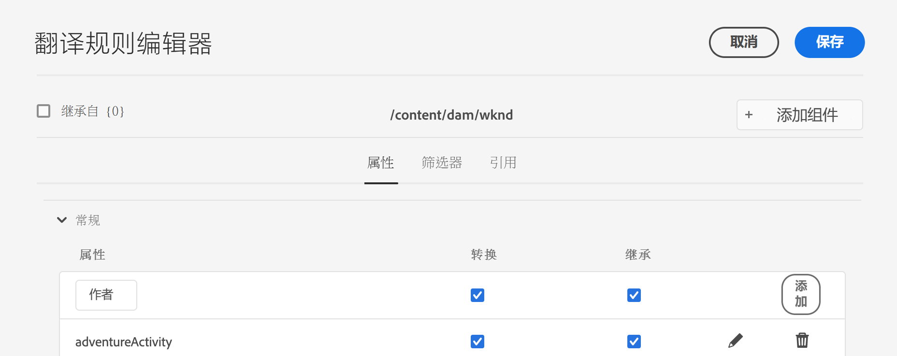

# 配置翻译规则 {#configure-translation-rules}

了解如何定义翻译规则以识别翻译内容。

## 迄今为止的故事 {#story-so-far}

在AEM无头翻译历程的上一个文档中， [配置翻译连接器](configure-connector.md)您学习了如何安装和配置翻译连接器，现在应该：

* 了解AEM中翻译集成框架的重要参数。
* 能够设置您自己与翻译服务的连接。

现在，您的连接器已设置完成，本文将引导您完成确定需要翻译的内容的下一步。

## 目标 {#objective}

本文档可帮助您了解如何使用AEM翻译规则来识别翻译内容。 阅读本文档后，您应：

* 了解翻译规则的用途。
* 能够定义您自己的翻译规则。

## 翻译规则 {#translation-rules}

内容片段（表示您的无头内容）可以包含许多由结构化字段组织的信息。 根据您的项目需求，可能并非内容片段中的所有字段都必须进行翻译。

翻译规则可识别翻译项目中包含或排除的内容。 翻译内容后，AEM会根据这些规则提取或收集内容。 这样，只有必须翻译的内容才会被发送到翻译服务。

翻译规则包括以下信息：

* 应用规则的内容路径
   * 该规则也适用于内容的子项
* 包含要翻译的内容的属性的名称
   * 该属性可以特定于特定资源类型或所有资源类型

由于定义内容片段结构的内容片段模型对于您自己的项目是唯一的，因此设置翻译规则至关重要，这样AEM才能知道要翻译的内容模型中的哪些元素。

>[!TIP]
>
>通常，内容架构师会为翻译专家提供翻译所需的所有字段的&#x200B;**属性名称** s。 配置翻译规则时需要这些名称。 作为翻译专家，您[可以按照此历程中先前所述找到这些&#x200B;**属性名称**&#x200B;自己](getting-started.md#content-modlels)。

## 创建翻译规则 {#creating-rules}

可以创建多个规则以支持复杂的翻译要求。 例如，您可能正在处理的一个项目要求翻译模型的所有字段，但在另一个项目上，只有描述字段必须翻译，而标题仍未翻译。

翻译规则旨在处理此类情景。 但是，在本示例中，我们通过重点介绍简单的单一配置来说明如何创建规则。

有一个&#x200B;**翻译配置**&#x200B;控制台可用于配置翻译规则。 要访问它，请执行以下操作：

1. 导航到&#x200B;**Tools** -> **General**。
1. 点按或单击&#x200B;**翻译配置**。

在&#x200B;**翻译配置** UI中，有许多选项可用于您的翻译规则。 这里，我们重点介绍了基本无头本地化配置所需的最必要和最典型的步骤。

1. 点按或单击&#x200B;**添加上下文**，用于添加路径。 这是受规则影响的内容路径。
   
1. 使用路径浏览器选择所需的路径，然后点按或单击要保存的&#x200B;**Confirm**&#x200B;按钮。 请记住，包含无标题内容的内容片段通常位于`/content/dam/<your-project>`下。
   
1. AEM保存配置。
1. 必须选择之前创建的上下文，然后点按或单击&#x200B;**编辑**。 此操作将打开&#x200B;**翻译规则编辑器**以配置属性。
   
1. 默认情况下，所有配置都继承自父路径，在此例中为`/content/dam`。 取消选中选项&#x200B;**从`/content/dam`**&#x200B;继承，以向配置添加其他字段。
1. 取消选中后，在列表的&#x200B;**General**&#x200B;部分下，添加您之前标识为翻译字段的内容片段模型的属性名称。](getting-started.md#content-models)[
   1. 在&#x200B;**New Property**&#x200B;字段中输入属性名称。
   1. 将自动选中选项&#x200B;**Translate**&#x200B;和&#x200B;**Inherit**。
   1. 点按或单击&#x200B;**添加**。
   1. 对必须翻译的所有字段重复这些步骤。
   1. 点按或单击&#x200B;**Save**。
      

您现在已配置翻译规则。

## 高级使用 {#advanced-usage}

还有许多其他属性可以配置为翻译规则的一部分。 此外，您还可以手动将规则指定为XML，这样可以更加专一和灵活。

通常，开始本地化无头内容并不需要此类功能，但如果您感兴趣，可以在[Additional Resources](#additional-resources)部分进一步阅读相关内容。

## 下一步 {#what-is-next}

现在，您已完成此部分无标题翻译历程，您应该：

* 了解翻译规则的用途。
* 能够定义您自己的翻译规则。

在此知识的基础上，继续您的AEM无头翻译历程，方法是接下来查看文档[翻译内容](translate-content.md) ，您将在其中了解连接器和规则如何协同工作来翻译无头内容。

## 其他资源 {#additional-resources}

虽然建议您通过查看文档[翻译内容来进入无头翻译历程的下一部分，但是](translate-content.md)以下是一些额外的可选资源，可更深入地了解本文档中提到的某些概念，但无需继续进行无头翻译历程。

* [识别要翻译的内容](/help/sites-cloud/administering/translation/rules.md)  — 了解翻译规则如何识别需要翻译的内容。
