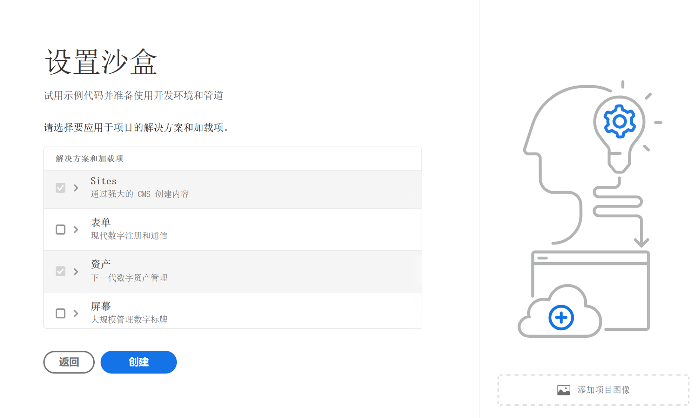

# 创建项目 {#create-program}

在[入门历程的这一可选部分中，](overview.md) 您将了解如何使用 Cloud Manager 创建第一个项目。

## 目标 {#objective}

在阅读了本次入门历程中的上一篇文档访问 [Cloud Manager](cloud-manager.md) 之后，已确保您有适当权限访问 Cloud Manager。现在您可以创建第一个项目。

阅读本文档后，您将能够：

* 理解并说明什么是项目。
* 了解生产和沙盒项目之间的区别。
* 创建您自己的项目。

## 什么是程序？ {#programs}

程序是 Cloud Manager 中最高级别的组织。 根据您的 Adobe 许可证，程序允许您梳理解决方案并授予特定团队成员访问这些程序的权限。

Cloud Manager 程序代表多组 Cloud Manager 环境。这些程序支持业务计划的逻辑集，通常对应于已授予许可的服务水平协议 (SLA)。例如，一个项目可能代表 Adobe Experience Manager (AEM) 资源，用以支持组织的全球公共网站，而另一个项目代表内部中央 DAM。

如果您还记得理论上的 WKND Travel and Adventure Enterprises 的例子，他们是一家专注于旅游相关媒体的租户，他们可能有两个项目。WKND Magazine 部门的一个 AEM Sites 项目和 WKND Media 部门的一个 AEM Assets 项目。由于不同的团队成员各自的分工要求，他们对不同的项目具有访问权限。

有两种不同类型的项目：

* 创建&#x200B;**生产程序**，以便为您的站点启用实时流量。 这是您的“真实”环境。
* 通常，创建&#x200B;**沙盒程序**&#x200B;是为了提供培训、运行演示、支持、概念验证 (POC) 或归档等目的。

由于用途不同，因此不同的环境有不同的选项。 然而，创建程序的过程是相似的。 对于此次入门历程，您将创建一个沙盒环境。

>[!TIP]
>
>如果您必须创建生产项目，请参阅[其他资源](#additional-resources)部分，获取详细描述项目的文档链接。

## 创建沙盒项目 {#create-sandbox}

1. 在 [my.cloudmanager.adobe.com](https://my.cloudmanager.adobe.com/) 登录 Cloud Manager 并选择适当的组织。

1. 从 Cloud Manager 的登陆页面，单击屏幕右上角的&#x200B;**添加项目**。

   

1. 从“创建项目向导”中，选择&#x200B;**设置沙盒**，然后提供项目名称并选择&#x200B;**继续**。

   

1. 在&#x200B;**设置沙盒**&#x200B;对话框中，您可以选择要在沙盒项目中启用的解决方案。**Sites** 和 **Assets** 解决方案始终包含在沙盒项目中并会自动选中。这对于您的入门示例来说已经足够了。单击&#x200B;**创建**。

   

在安装过程中，您会在登陆页面上看到一个带有状态指示器的新沙盒程序信息卡。

项目创建完成后，分配给&#x200B;**开发人员**&#x200B;的组织成员可以登录 Cloud Manager 并管理 Cloud Manager Git 存储库。

## 后续内容 {#whats-next}

现在您的第一个项目已经创建，您可以为该项目创建环境。通过进一步查看文档[创建环境](create-environments.md)来继续您的载入之旅。

## 其他资源 {#additional-resources}

如果您想了解入门历程以外的内容，以下是额外的可选资源。

* [程序和程序类型](/help/implementing/cloud-manager/getting-access-to-aem-in-cloud/program-types.md) – 了解 Cloud Manager 的层级，以及不同类型的程序如何适应其结构以及它们之间的差异。
* [创建沙盒程序](/help/implementing/cloud-manager/getting-access-to-aem-in-cloud/creating-sandbox-programs.md) – 了解如何使用 Cloud Manager 创建自己的沙盒程序，用于培训、演示、POC 或其他非生产目的。
* [创建生产程序](/help/implementing/cloud-manager/getting-access-to-aem-in-cloud/creating-production-programs.md) – 了解如何使用 Cloud Manager 创建自己的生产程序来托管实时流量。
* [使用 Adobe Cloud Manager – 程序](https://experienceleague.adobe.com/docs/experience-manager-learn/cloud-service/cloud-manager/programs.html) – 程序代表支持业务计划逻辑集的 AEM 环境集，通常与购买的服务水平协议 (SLA) 相对应。
* [AEM as a Cloud Service 团队和生产简介](/help/onboarding/aem-cs-team-product-profiles.md) – 了解 AEM as a Cloud Service 团队和产品简介，以及如何授予和限制对您许可的 Adobe 解决方案的访问权限。
