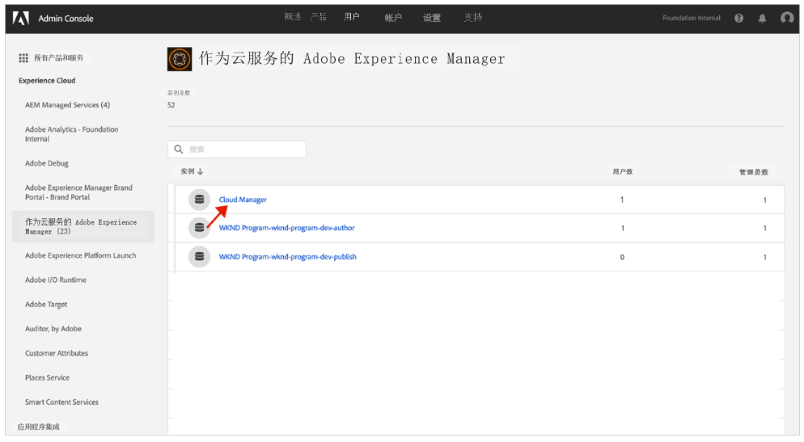

# 通知配置文件 {#notification-profiles}

了解如何在 Admin Console 中创建用户配置文件来管理重要电子邮件通知的接收。

## 概述 {#overview}

Adobe 有时会就 AEM as a Cloud Service 环境联系用户。除了产品内通知外，Adobe 偶尔也会使用电子邮件进行通知。此类电子邮件通知有两种类型：

* **事件通知** – 这些通知是在事件期间或 Adobe 发现您的 AEM as a Cloud Service 环境存在潜在可用性问题时发送的。
* **主动通知** – 当 Adobe 支持团队成员想要提供有关可使您的 AEM as a Cloud Service 环境受益的潜在优化或建议的指导时，将发送这些通知。

用户还可以根据他们收到的特定程序通知 [自定义群组权限。](/help/implementing/cloud-manager/custom-permissions.md)

此外，支持将组分配给主动通知，并且可以将用户和组直接分配给产品配置文件。

* 默认情况下，事件和主动通知组中的用户将收到所有程序的通知。
* 但是，如果用户不想接收所有通知，则可以使用自定义“读取”权限来指定他们希望接收哪些程序通知。

为了让正确的用户收到这些通知，您需要配置和分配用户配置文件，如本文档所述。

## 前提条件 {#prerequisites}

由于用户配置文件是在 Admin Console 中创建和维护的，因此在为通知创建配置文件之前，您必须：

* 具有添加和配置会员资格的权限。
* 拥有有效的 Adobe Admin Console 配置文件。

## 新建 Cloud Manager 产品配置文件 {#create-profiles}

要正确设置接收通知，请创建两个用户配置文件。这些步骤仅执行一次。

1. 登录到 Admin Console，网址是 [`https://adminconsole.adobe.com`。](https://adminconsole.adobe.com)

1. 确保您是否处于正确的组织中。

1. 在&#x200B;**概述**&#x200B;页面，从&#x200B;**产品和服务**&#x200B;信息卡中选择 **Adobe Experience Manager as a Cloud Service**。

   

1. 从所有实例列表中导航到 **Cloud Manager** 实例。

   

1. 您可看到所有已配置的 Cloud Manager 产品配置文件的列表。

   

1. 单击&#x200B;**新配置文件**&#x200B;并提供以下详细信息：

   * **产品配置文件名称**：`Incident Notification - Cloud Service`
   * **显示名称**：`Incident Notification - Cloud Service`
   * **描述**：Cloud Manager配置文件适用的用户，将在事件期间或Adobe发现您的AEMas a Cloud Service环境存在潜在可用性问题时收到通知。
      * 具有特定程序自定义读取权限的用户只有在选择使用自定义权限时，才会收到这些程序的通知。

1. 单击“**保存**”。

1. 再次单击&#x200B;**新配置文件**&#x200B;并提供以下详细信息：

   * **产品配置文件名称**：`Proactive Notification - Cloud Service`
   * **显示名称**：`Proactive Notification - Cloud Service`
   * **描述**：Cloud Manager 配置文件适用的用户，在 Adobe 支持团队成员想要提供有关您的 AEM as a Cloud Service 环境配置的潜在优化或推荐时会收到通知
      * 具有特定程序自定义读取权限的用户只有在选择使用自定义权限时，才会收到这些程序的通知。

1. 单击&#x200B;**保存**。

您的两个新通知配置文件已创建。

>[!NOTE]
>
>Cloud Manager **产品配置文件名称**&#x200B;必须与提供的完全一样。请复制并粘贴提供的产品配置文件名称以避免错误。任何偏差或拼写错误都将导致通知无法按要求发送。
>
>如果出现错误或未定义配置文件，Adobe 将默认通知分配给 **Cloud Manager 开发人员**&#x200B;或者&#x200B;**部署管理器**&#x200B;配置文件的现有用户。

## 将用户分配给通知配置文件 {#add-users}

现在已经创建了配置文件，您必须分配适当的用户。您可以在创建新用户或更新现有用户时执行此操作。

### 将新用户添加到配置文件 {#new-user}

按照以下步骤添加尚未为其设置 Federated ID 的用户。

1. 确定应接收事件或主动通知的用户或组。

1. 如果您还没有登录，请登录 Admin Console [`https://adminconsole.adobe.com`](https://adminconsole.adobe.com)。

1. 确保您选择了相应的组织。

1. 在&#x200B;**概述**&#x200B;页面，从&#x200B;**产品和服务**&#x200B;信息卡中选择 **Adobe Experience Manager as a Cloud Service**。

   

1. 如果您团队成员的 Federated ID 尚未设置，请从顶部导航选择&#x200B;**用户**&#x200B;选项卡，然后选择&#x200B;**添加用户**。否则，跳到[将现有用户添加到配置文件。](#existing-users)

   

1. 在&#x200B;**将用户添加到团队**&#x200B;对话框中，输入要添加的用户的电子邮件 ID，然后选择 `Adobe ID` 作为 **ID 类型**。

1. 单击&#x200B;**选择产品**&#x200B;标题下方的加号按钮，开始产品选择。

1. 选择 **Adobe Experience Manager as a Cloud Service**，并将一个或两个新配置文件分配给用户。

   * **事件通知 – Cloud Service**
   * **主动通知 – Cloud Service**

1. 单击&#x200B;**保存**，将向您添加的用户发送欢迎电子邮件。

受邀用户现在将收到通知。具有特定程序自定义读取权限的用户只有在选择使用自定义权限时，才会收到这些程序的通知。

对您团队中您希望接收通知的用户重复这些步骤。

### 将现有用户添加到配置文件 {#existing-user}

按照以下步骤添加已拥有 Federated ID 的用户。

1. 确定应接收事件或主动通知的用户或组。

1. 如果您还没有登录，请登录 Admin Console [`https://adminconsole.adobe.com`](https://adminconsole.adobe.com)。

1. 确保您选择了相应的组织。

1. 在&#x200B;**概述**&#x200B;页面，从&#x200B;**产品和服务**&#x200B;信息卡中选择 **Adobe Experience Manager as a Cloud Service**。

1. 从顶部导航中，选择&#x200B;**用户**&#x200B;选项卡。

1. 如果要添加到通知配置文件的团队成员的 Federated ID 已经存在，请在列表中找到该用户并单击它。否则，跳到[将新用户添加到配置文件。](#add-user)

1. 在用户详细信息窗口的&#x200B;**产品**&#x200B;分区，单击省略号按钮，然后选择&#x200B;**编辑**。

1. 在&#x200B;**编辑产品**&#x200B;窗口，单击&#x200B;**选择产品**&#x200B;标题下面的铅笔按钮，开始产品选择。

1. 选择 **Adobe Experience Manager as a Cloud Service**，并将一个或两个新配置文件分配给用户。

   * **事件通知 – Cloud Service**
   * **主动通知 – Cloud Service**

1. 单击&#x200B;**保存**，将向您添加的用户发送欢迎电子邮件。

受邀用户现在将收到通知。具有特定程序自定义读取权限的用户只有在选择使用自定义权限时，才会收到这些程序的通知。

对您团队中您希望接收通知的用户重复这些步骤。

## 其他资源 {#additional-resources}

如果您想了解上线历程以外的内容，以下是额外的可选资源。

* [操作中心](/help/operations/actions-center.md) - 利用操作中心方便地针对事件和其他重要信息采取行动。
