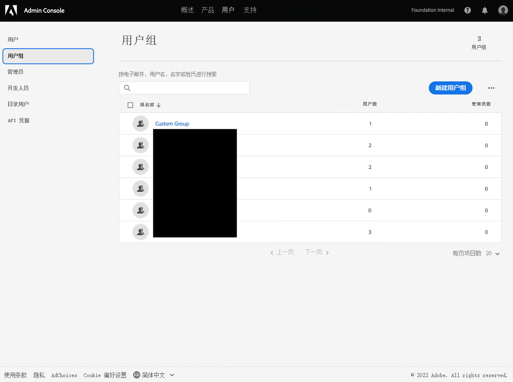
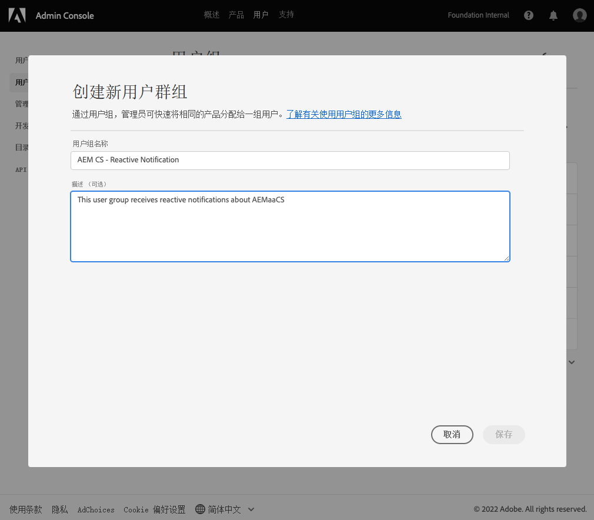
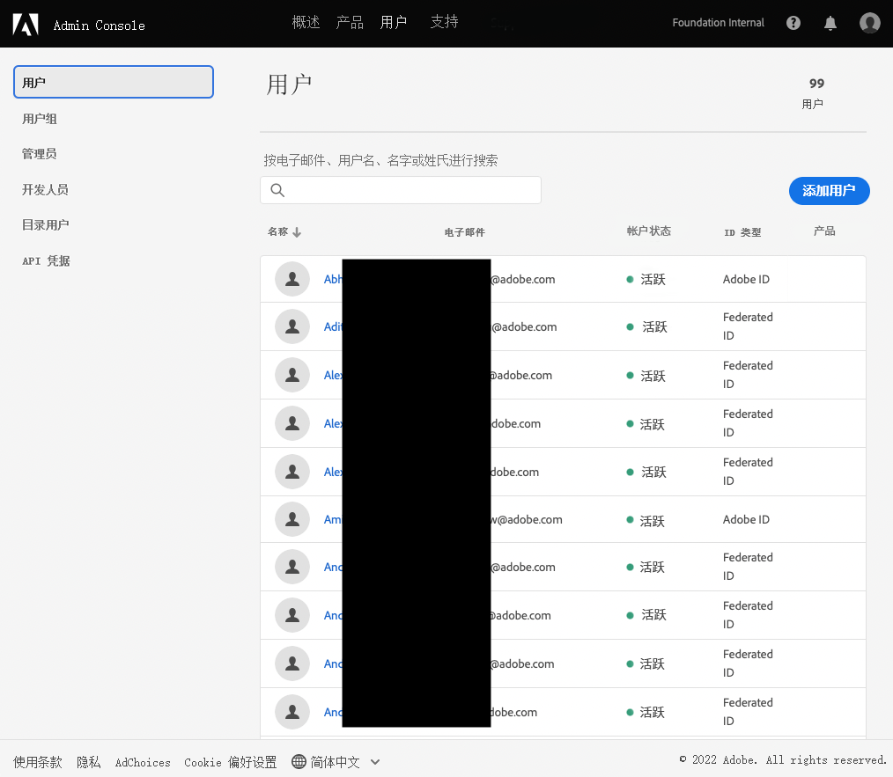
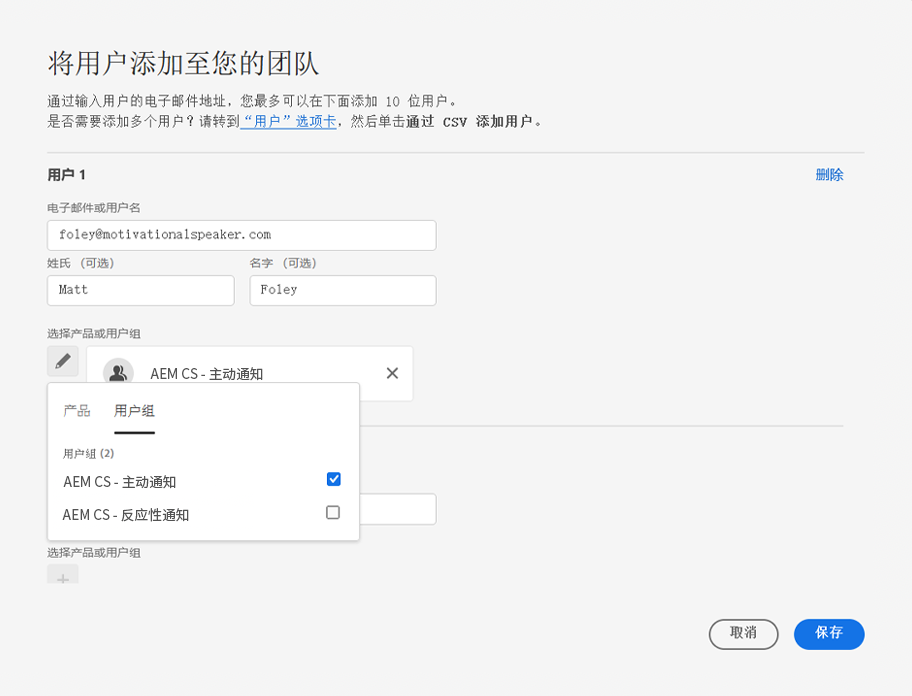
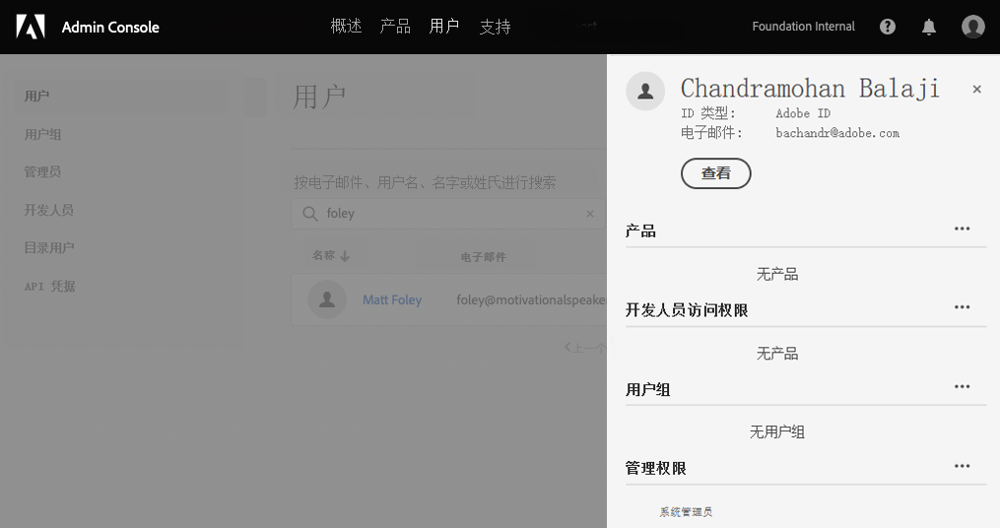

# 通知用户组 {#user-groups}

了解如何在Admin Console中创建用户组以管理重要电子邮件通知的接收情况。

## 概述 {#overview}

Adobe需要不时联系有关其AEMas a Cloud Service环境的联系。 除了产品内通知之外，Adobe有时还会使用电子邮件发送此类通知。 此类通知有两种类型：

* **反向通知**  — 这些通知在事件期间或Adobe发现AEMas a Cloud Service环境存在潜在可用性问题时发送。
* **主动通知**  — 当Adobe支持团队成员希望就可能对AEMas a Cloud Service环境有益的优化或推荐提供指导时，将发送这些通知。

要让正确的用户接收这些通知，您需要配置用户组。

## 前提条件 {#prerequisites}

由于用户组是在Admin Console中创建和维护的，因此在为通知创建用户组之前，您必须：

* 有权添加和编辑组成员关系。
* 拥有有效的Adobe Admin Console配置文件。

## 为通知创建用户组 {#create-groups}

要正确设置通知接收，您需要创建两个用户组。 这些步骤只能完成一次。

1. 登录Admin Console: [`https://adminconsole.adobe.com`.](https://adminconsole.adobe.com)

1. 单击 **用户** 选项卡，然后 **用户组** 选项。

   

1. 单击 **新建用户组** 按钮并提供 **用户组名称** 完全与指定的和可选的 **描述**.

   * 组名称必须与以下内容匹配。 请勿以任何方式调整或修改组名称。
      * `AEM CS - Reactive Notification`
      * `AEM CS - Proactive Notification`

   

1. 单击“**保存**”。

1. 对第二组重复这些步骤。

如果未定义群组，Adobe将通过Cloud Manager通知现有用户 **开发人员** 或 **部署** 用户档案。

## 将用户添加到组 {#add-users}

创建群组后，您必须分配相应的用户。 您可以在创建新用户或更新现有用户时执行此操作。

### 将新用户添加到群组 {#new-user}

1. 登录Admin Console: [`https://adminconsole.adobe.com`](https://adminconsole.adobe.com) 如果您尚未登录。

1. 单击 **用户** 选项卡，然后 **用户** 选项。

   

1. 单击 **添加用户** 按钮，并提供用户的电子邮件地址。 或者，您也可以提供名字和姓氏。

   * 如果用户已存在，则Admin Console将匹配电子邮件地址并预填充字段。

1. 单击用户名字段下方的加号，然后单击 **用户组** 选项卡来选择用户的群组。

   

1. 单击 **保存** 以保存新用户。

对需要为其分配通知群组的每个用户重复这些步骤。

### 将现有用户添加到群组 {#existing-user}

1. 登录Admin Console: [`https://adminconsole.adobe.com`](https://adminconsole.adobe.com) 如果您尚未登录。

1. 单击 **用户** 选项卡，然后 **用户** 选项。

   

1. 单击要添加到通知组的用户的行。 此时会打开显示用户详细信息的面板。

1. 单击右侧的省略号图标 **用户组** 的子菜单。