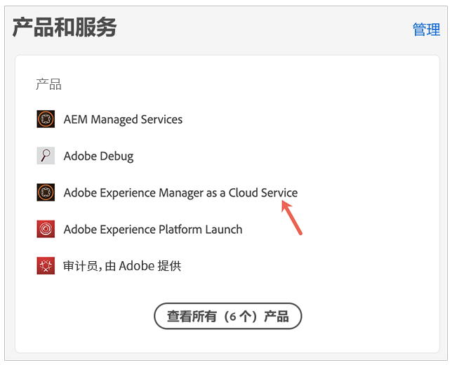
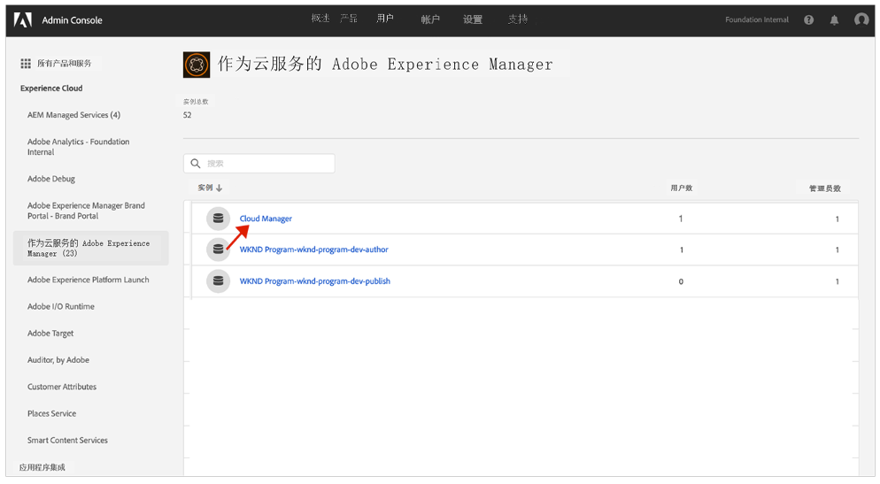
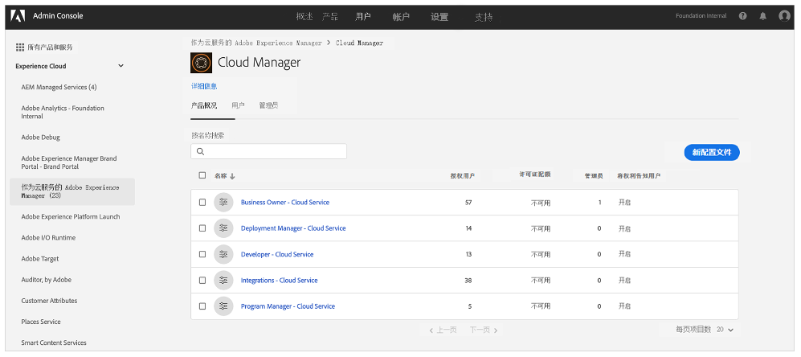
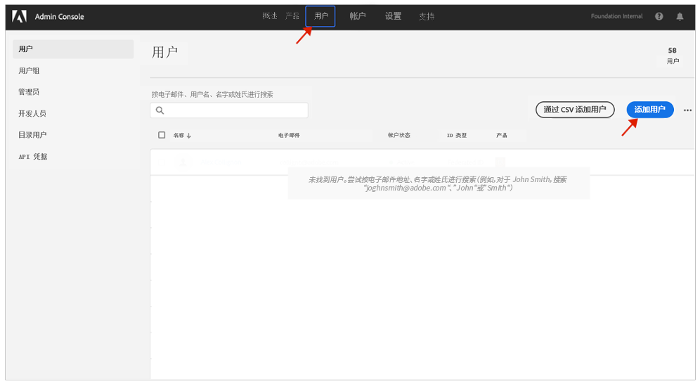

# 通知用户组 {#user-groups}

了解如何在Admin Console中创建用户组以管理重要电子邮件通知的接收情况。

## 概述 {#overview}

Adobe需要不时联系有关其AEMas a Cloud Service环境的联系。 除了产品内通知之外，Adobe有时还会使用电子邮件发送此类通知。 此类通知有两种类型：

* **事件通知 — Cloud Service**  — 这些通知在事件期间或Adobe发现AEMas a Cloud Service环境存在潜在可用性问题时发送。
* **主动通知 — Cloud Service**  — 当Adobe支持团队成员希望就可能对AEMas a Cloud Service环境有益的优化或推荐提供指导时，将发送这些通知。

要让正确的用户接收这些通知，您需要配置用户组。

## 前提条件 {#prerequisites}

由于用户组是在Admin Console中创建和维护的，因此在为通知创建用户组之前，您必须：

* 有权添加和编辑组成员关系。
* 拥有有效的Adobe Admin Console配置文件。

## 创建新的Cloud Manager产品配置文件 {#create-groups}

要正确设置通知接收，您需要创建两个用户组。 这些步骤只能完成一次。

1. 登录Admin Console: [`https://adminconsole.adobe.com`.](https://adminconsole.adobe.com)

1. 从 **概述** 页面，选择 **Adobe Experience Manager as a Cloud Service** 从 **产品和服务** 卡。

   

1. 导航到 **Cloud Manager** 实例。

   

1. 您将看到所有已配置的Cloud Manager产品配置文件的列表。 例如：

   

1. 单击 **新建用户档案** 并介绍以下详细信息：

   * 产品配置文件名称：事件通知 — Cloud Service
   * 显示名称：事件通知 — Cloud Service
   * 描述：Cloud Manager配置文件，用于在事件期间或Adobe发现AEMas a Cloud Service环境存在潜在可用性问题时接收通知的用户。

1. 单击 **保存** 和重复步骤5，并提供以下详细信息：

   * 产品配置文件名称：主动通知 — Cloud Service
   * 显示名称：主动通知 — Cloud Service
   * 描述：Cloud Manager配置文件，适用于当Adobe支持团队成员希望就可能的优化或建议与AEMas a Cloud Service环境配置有关的事宜提供指导时，将收到通知的用户。

>[!NOTE]
>
>Cloud Manager配置文件名称必须与上述内容完全相同。 请复制并粘贴所提供描述中的产品配置文件名称。 任何偏差或拼写错误都会导致通知未按需要发送。 如果出现错误或尚未定义配置文件，则默认Adobe通知分配给Cloud Manager开发人员（是、或和）部署管理器配置文件的现有用户。

## 将用户分配给新通知产品配置文件 {#add-users}

创建群组后，您必须分配相应的用户。 您可以在创建新用户或更新现有用户时执行此操作。

### 将新用户添加到群组 {#new-user}

1. 确定应接收事件通知或主动通知的用户。

1. 登录Admin Console: [`https://adminconsole.adobe.com`](https://adminconsole.adobe.com) 如果您尚未登录。

1. 从 **概述** 页面，选择 **Adobe Experience Manager as a Cloud Service** 从 **产品和服务** 卡。

   

1. 选择 **用户** 选项卡，然后选择 **添加用户**.

1. 在 **将用户添加到您的团队** 对话框中，输入要添加的用户的电子邮件ID。

   * 如果尚未设置团队成员的Federated ID，请为ID类型选择Adobe ID 。
   * 如果用户已存在，请参阅步骤9。

1. 单击 **选择产品** 开始产品选择和选择的标题 **Adobe Experience Manager as a Cloud Service** 分配 **事件通知 — Cloud Service** 或 **主动通知 — Cloud Service**，或两者都发送给用户。

1. 单击 **保存** 并向您添加的用户发送欢迎电子邮件。 受邀用户现在将收到通知。

1. 对团队中要接收通知的用户重复这些步骤。

1. 如果用户已存在，请搜索用户的名称并：

   * 单击用户的名称。
   * 在 **产品** ，单击 **编辑**.
   * 单击 **选择产品** 开始产品选择和选择的标题 **Adobe Experience Manager as a Cloud Service** 分配 **事件通知 — Cloud Service** 或 **主动通知 — Cloud Service**，或两者都发送给用户。
   * 单击 **保存** 并向您添加的用户发送欢迎电子邮件。 受邀用户现在将收到通知。
