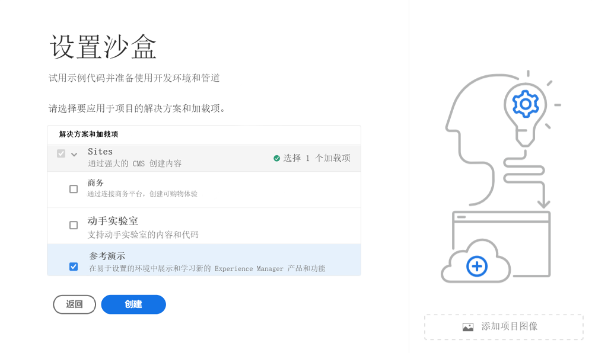
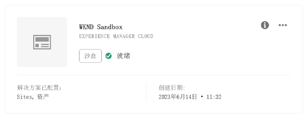
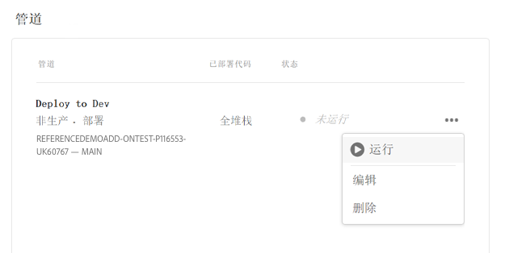

# 创建项目 {#creating-a-program}

了解如何设置新项目和管道以部署加载项。

## 迄今为止的故事 {#story-so-far}

在Adobe Experience Manager (AEM)参考演示加载项历程的上一个文档中， [了解参考演示加载项安装，](installation.md) 您已了解参考演示加载项安装过程的工作原理，并说明了各个部分的协作方式。 您现在应：

* 基本了解 Cloud Manager。
* 了解管道如何将内容和配置交付给 AEM。
* 了解如何通过单击几下来使用模板创建已预填充演示内容的站点。

本文基于这些基础知识之上，并执行第一个配置步骤来创建项目以进行测试，并使用管道部署加载项内容。

## 目标 {#objective}

本文档有助于您了解如何设置新项目和管道以部署加载项。阅读本文档后，您应该能够执行以下操作：

* 了解并解释如何使用Cloud Manager创建项目。
* 为新项目激活参考演示加载项。
* 运行管道，以便部署加载项内容。

## 创建程序 {#create-program}

登录Cloud Manager后，您可以创建一个沙盒项目来进行测试和演示。

>[!NOTE]
>
>您的用户必须是组织的 Cloud Manager 中的&#x200B;**业务负责人**&#x200B;角色成员才能创建项目。

1. 登录 Adobe Cloud Manager，网址为 [my.cloudmanager.adobe.com](https://my.cloudmanager.adobe.com/)。

1. 登录后，通过在屏幕右上角查看组织，确保您在正确的组织中。如果您只是一个组织的成员，则无需执行此步骤。

   

1. 点按或单击窗口右上方的&#x200B;**添加项目**。

1. 在&#x200B;**让我们创建项目**&#x200B;对话框中：

   1. 提供&#x200B;**项目名称**&#x200B;以描述您的项目。
   1. 为&#x200B;**项目目标**&#x200B;点按或单击&#x200B;**设置沙盒**
   1. 点按或单击&#x200B;**继续**。

   

1. 在 **设置沙盒** 中的对话框 **解决方案和加载项** 表，展开 **站点** 通过点按或单击在列表中条目，然后选中 **参考演示**.

   * 如果您还想为AEM Screens创建演示，请勾选 **Screens** 选项。 点按或单击&#x200B;**更新**。

   

1. 点按或单击&#x200B;**创建**，Cloud Manager 将开始设置沙盒项目。随后您将进入项目概述屏幕，其中有一个简短的横幅通知指示该过程已开始。一张卡片已添加到新项目的概述页面。安装过程需要几分钟才能完成。

1. 设置完毕后，概述页面上的环境卡片将其状态显示为&#x200B;**就绪**。点按或单击卡，以打开环境。

   

1. 您的环境准备就绪，并且现在启用了该附加组件作为一个选项，但必须将演示的内容部署到 AEM 才可用。为此，请在中点按或单击部署到开发管道旁边的省略号按钮 **管道** 卡片并选择 **运行**.

   

1. 管道将启动，并且您将进入一个详细说明部署进度的页面。您可以在创建项目的过程中退出此屏幕，并稍后返回（如有必要）。

   

完成该管道可能耗时数分钟。完成后，即可在AEM创作环境中使用该加载项及其演示内容。

## 后续内容 {#what-is-next}

现在您已完成 AEM 参考演示加载项历程的这一部分，您应：

* 了解如何使用Cloud Manager创建项目。
* 了解如何为项目激活参考演示加载项。
* 能够运行管道，以便部署加载项内容。

在此知识的基础上继续您的AEM参考演示加载项历程，接下来查看 [创建演示站点](create-site.md). 在这里，您将了解如何基于管道所部署的预配置模板库在AEM中创建演示站点。

## 其他资源 {#additional-resources}

* [Cloud Manager 文档](https://experienceleague.adobe.com/docs/experience-manager-cloud-service/content/onboarding/onboarding-concepts/cloud-manager-introduction.html) – 如果您想了解有关 Cloud Manager 功能的更多详细信息，您可能需要直接参阅深入的技术文档。
