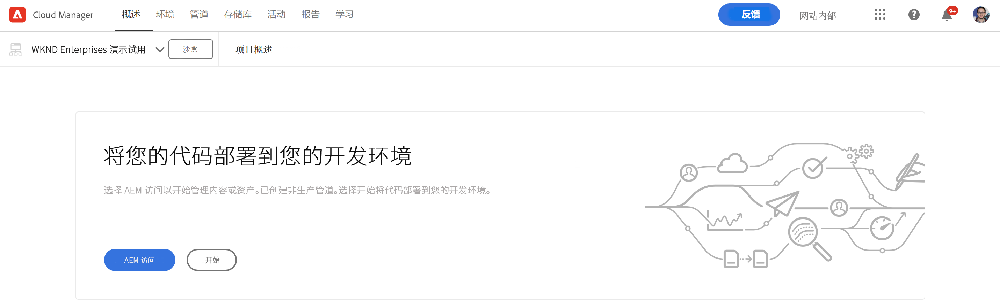

# 创建项目 {#creating-a-program}

了解如何设置新项目和管道以部署加载项。

## 迄今为止的故事 {#story-so-far}

在AEM参考演示附加组件历程的上一文档中， [了解参考演示附加组件安装，](installation.md) 您学习了参考演示附加组件的安装过程如何工作，展示了不同部分如何协同工作。 您现在应该：

* 对Cloud Manager有基本的了解。
* 了解管道如何将内容和配置交付到AEM。
* 了解模板如何通过单击几下即可创建预填充了演示内容的新站点。

本文基于这些基础知识，并采取第一个配置步骤来创建用于测试的程序，并使用管道来部署附加内容。

## 目标 {#objective}

本文档可帮助您了解如何设置新程序和管道以部署加载项。 阅读后，您应该：

* 了解如何使用Cloud Manager创建新项目。
* 了解如何激活新计划的参考演示附加组件。
* 能够运行管道以部署附加内容。

## 创建项目 {#create-program}

登录到Cloud Manager后，您可以创建一个新的沙盒项目，以供您进行测试和演示之用。

>[!NOTE]
>
>您的用户必须是 **业务所有者** 角色，以便创建项目。

1. 登录AdobeCloud Manager(位于 [my.cloudmanager.adobe.com](https://my.cloudmanager.adobe.com/).

1. 登录后，通过选中屏幕右上角的组织，确保您处于正确的组织中。 如果您只是一个组织的成员，则无需执行此步骤。

   

1. 点按或单击 **添加程序** 在窗口的右上方。

1. 在 **让我们创建您的项目** 对话框，确保 **Adobe Experience Manager** 在下选择 **产品** 然后，点按或单击 **继续**.

   

1. 在下一个对话框中：

   * 提供 **项目名称** 来描述你的计划。
   * 点按或单击 **设置沙盒** , **方案目标**

   然后，点按或单击 **创建**.

   

1. 您将转到项目概述屏幕，在该屏幕中可以观察项目的创建过程。 Cloud Manager提供剩余时间的估计值。 在创建程序时，您可以离开此屏幕，并在必要时稍后返回。

   

1. 完成后，Cloud Manager将提供一个概述，包括自动创建的环境和管道。

   

1. 单击页面左上角的项目名称，然后在下拉菜单中选择，以编辑项目详细信息 **编辑程序**.

   

1. 在 **编辑程序** 对话框，切换到 **解决方案和附加组件** 选项卡。

   

1. 在 **解决方案和附加组件** 选项卡，展开 **站点** 条目，然后检查 **参考演示**. 如果您还希望为AEM Screens创建演示，请查看 **Screens** 选项。 点按或单击 **更新**.

   

1. 加载项现在已作为一个选项启用，但其内容必须部署到AEM才可用。 返回项目概述页面，点按或单击 **开始** 以启动将附加内容部署到AEM的管道。

   

1. 管道将启动，您将转到详细描述部署进度的页面。 在创建程序时，您可以离开此屏幕，并在必要时稍后返回。

   

管道完成后，附加组件及其演示内容即可在AEM创作环境中使用。

## 下一步 {#what-is-next}

现在，您已完成AEM参考演示附加组件历程的这一部分，接下来您应该：

* 了解如何使用Cloud Manager创建新项目。
* 了解如何激活新计划的参考演示附加组件。
* 能够运行管道以部署附加内容。

在此知识的基础上，通过接下来审阅文档继续您的AEM参考演示附加组件历程 [创建演示网站，](create-site.md) 其中，您将学习如何根据管道部署的预配置模板库，在AEM中创建演示网站。

## 其他资源 {#additional-resources}

* [Cloud Manager文档](https://experienceleague.adobe.com/docs/experience-manager-cloud-service/onboarding/onboarding-concepts/cloud-manager-introduction.html)  — 如果您希望了解有关Cloud Manager功能的更多详细信息，则可能需要直接查阅深入的技术文档。
