# 创建演示站点 {#creating-a-site}

基于预配置的模板库在 AEM 中创建演示站点。

## 迄今为止的故事 {#story-so-far}

在 AEM 参考演示加载项历程的上一个文档[创建项目](create-program.md)中，您执行了第一个配置步骤来创建项目以进行测试并使用管道来部署加载项内容。您现在应：

* 了解如何使用 Cloud Manager 创建新项目。
* 了解如何为新项目激活参考演示加载项。
* 能够运行管道以部署加载项内容。

本文描述了此过程的下一步，即基于参考演示加载项的模板在 AEM 中创建新站点或 AEM Screens 项目。

## 目标 {#objective}

本文档有助于您了解如何基于参考演示加载项的模板创建新站点。阅读本文档后，您应：

* 了解如何访问 AEM 创作环境。
* 了解如何基于模板创建站点。
* 了解导航站点结构和编辑页面的基础知识。

## 创建演示站点或 Screens 项目 {#create-site}

在管道部署参考演示加载项后，您可以访问 AEM 创作环境以基于加载项内容创建演示站点。

1. 在 Cloud Manager 的项目概述页面中，点按或单击指向 AEM 创作环境的链接。

   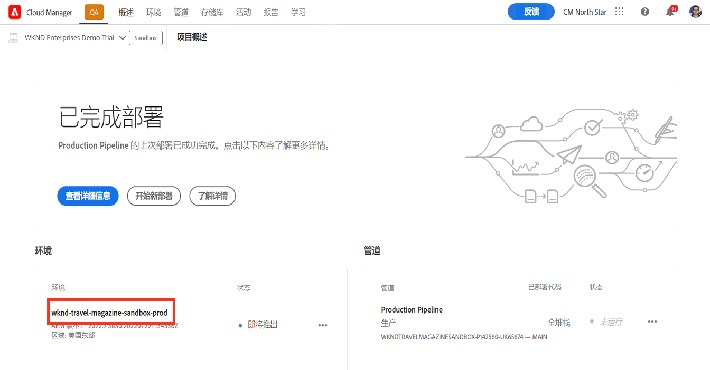

1. 从 AEM 主菜单中，点按或单击&#x200B;**站点**。

   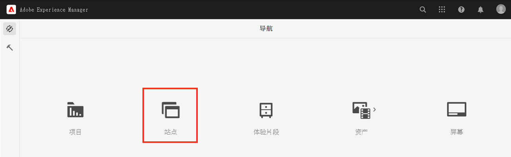

1. 从站点控制台中，点按或单击屏幕右上方的&#x200B;**创建**，然后在下拉菜单中选择&#x200B;**从模板创建站点**。

   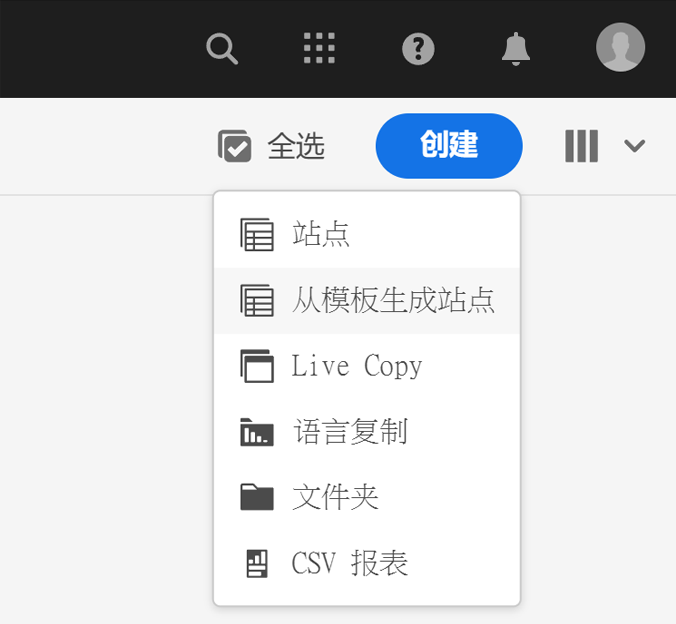

1. 站点创建向导随即启动。在左栏中，您可以看到由管道部署到创作实例的演示模板。点按或单击一个演示模板将其选定，并在右栏中显示详细信息。如果要测试或演示 AEM Screens，请确保选择 **We.Cafe 站点模板**。点按或单击&#x200B;**下一步**。

   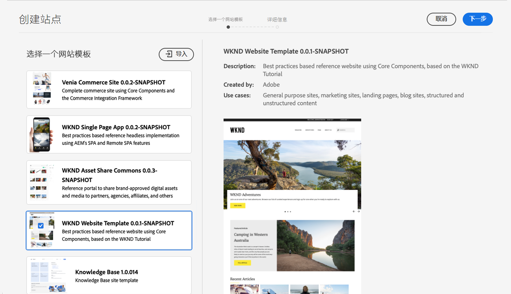

1. 在下一个屏幕中，为您的站点或 Screens 项目提供标题。可以提供站点名称，也可以从标题生成站点名称（如果被忽略）。点按或单击&#x200B;**创建**。

   * 站点标题显示在浏览器标题栏中。
   * 站点名称会成为 URL 的一部分。
   * 站点名称必须符合 AEM 的页面命名惯例，可参阅[其他资源](#additional-resources)部分了解详细信息。

   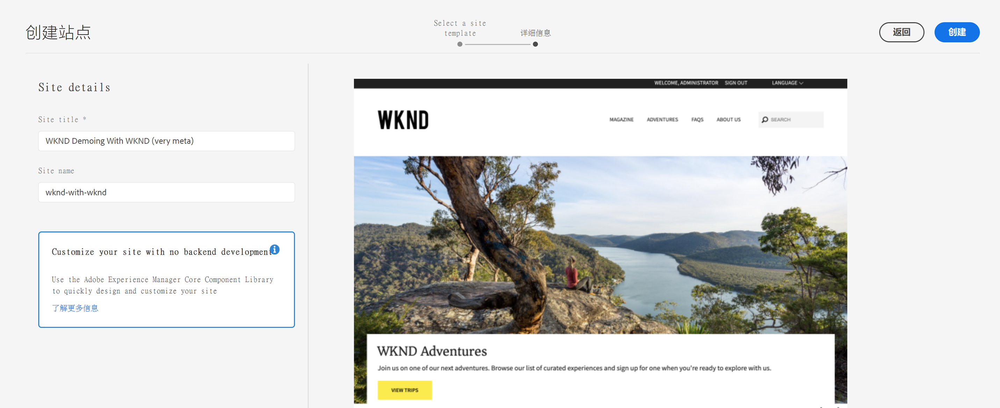

1. 通过对话框确认站点创建。点按或单击&#x200B;**完成**。

   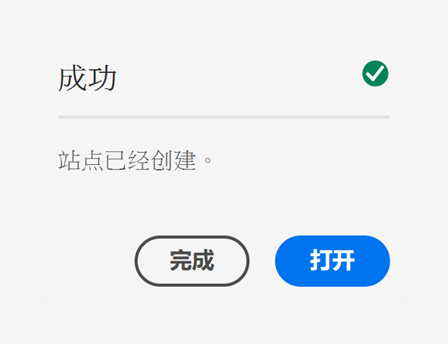

您现在已创建自己的演示站点！

## 使用演示站点 {#use-site}

现已创建您的演示站点，您可以像在 AEM 中导航和使用任何其他站点一样导航和使用您的站点。

1. 站点现在显示在站点控制台中。

   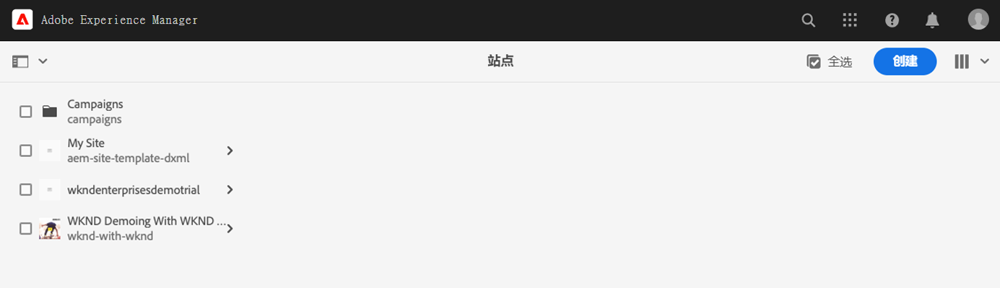

1. 在屏幕的右上角，确保控制台视图设置为&#x200B;**列视图**。

   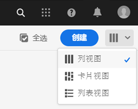

1. 点按或单击站点浏览其结构和内容。 当您浏览演示站点的内容树时，列视图会不断扩展。

   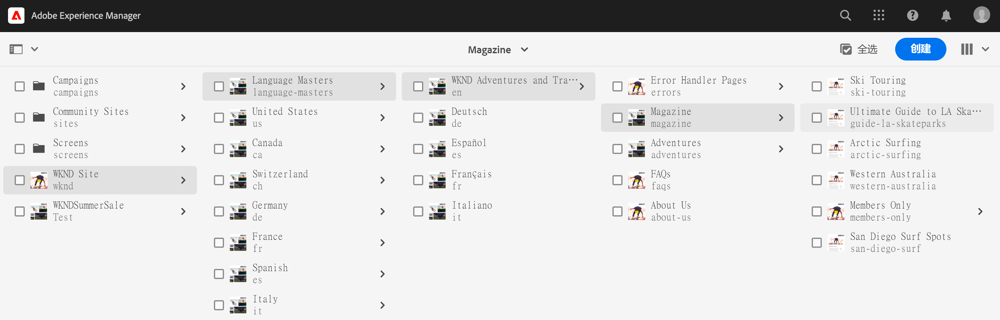

1. 点按或单击页面将其选中，然后点按或单击工具栏中的&#x200B;**编辑**。

   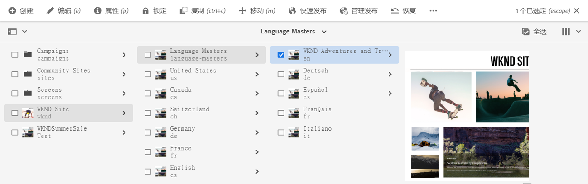

1. 您可以像编辑任何其他 AEM 内容页面一样编辑该页面，例如添加或编辑组件/资产以及测试 AEM 的功能。

   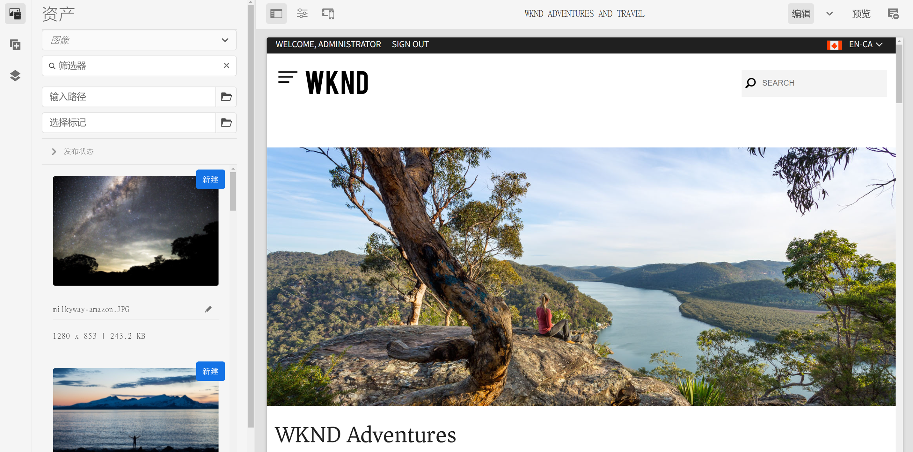

恭喜！您现在可以进一步浏览演示站点的内容，并通过参考演示加载项的最佳实践内容来发现 AEM 必须提供的一切。

基于其他模板创建额外的站点以探究更多 AEM 功能。

## 下一步 {#what-is-next}

现在您已完成 AEM 参考演示加载项历程的这一部分，您应：

* 了解如何访问 AEM 创作环境。
* 了解如何基于模板创建站点。
* 了解导航站点结构和编辑页面的基础知识。

您现在可以使用加载项内容测试 AEM 的功能。为您提供了两个选项以继续历程：

* 如果要完全演示和测试 AEM Screens 内容，请确保已部署基于 **We.Cafe 站点模板**&#x200B;的站点（如前所述），并继续[为演示站点启用 AEM Screens](screens.md)。
* 如果仅需演示 Sites 内容，请继续[管理您的演示站点](manage.md)，了解可用于帮助您管理演示站点的工具以及如何删除它们。

## 其他资源 {#additional-resources}

* [Cloud Manager 文档](https://experienceleague.adobe.com/docs/experience-manager-cloud-service/onboarding/onboarding-concepts/cloud-manager-introduction.html) – 如果您想了解有关 Cloud Manager 功能的更多详细信息，您可能需要直接参阅深入的技术文档。
* [创建站点](/help/sites-cloud/administering/site-creation/create-site.md) – 了解如何使用 AEM 创建站点，并使用站点模板定义站点的样式和结构。
* [AEM 的页面命名惯例。](/help/sites-cloud/authoring/fundamentals/organizing-pages.md#page-name-restrictions-and-best-practices) – 请参阅此页面，了解用于组织 AEM 页面的惯例。
* [AEM 基本操作](/help/sites-cloud/authoring/getting-started/basic-handling.md) – 如果您不熟悉 AEM，请参阅本文档了解导航和控制台组织等基本概念。
