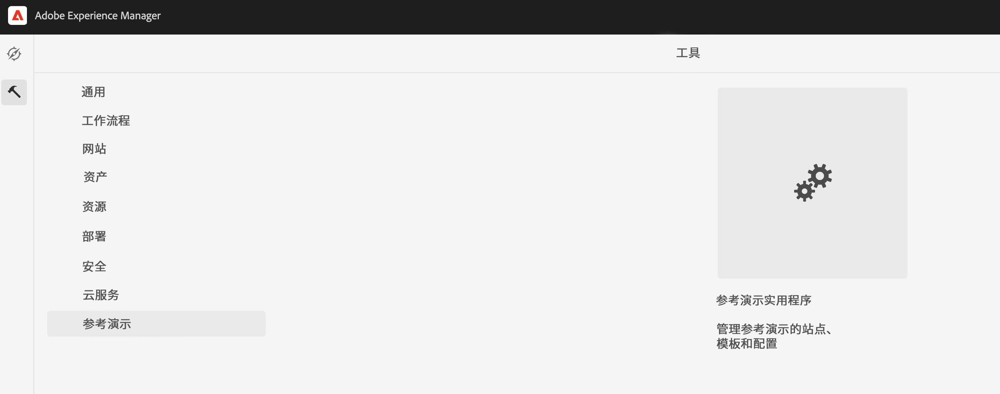
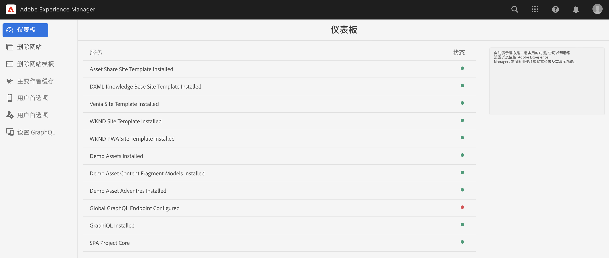
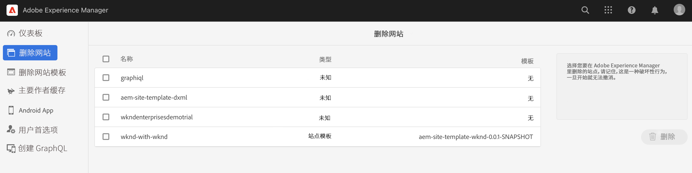
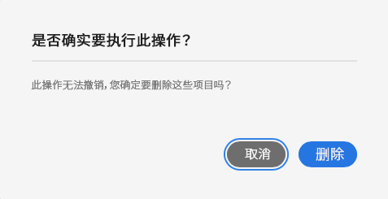
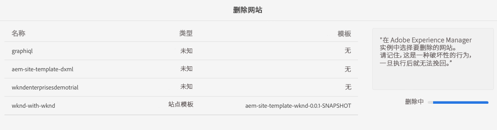

# 管理您的演示站点 {#manage-demo-sites}

了解可用于帮助您管理演示站点的工具以及如何删除它们。

## 迄今为止的故事 {#story-so-far}

在 AEM 参考演示插件历程的上一个文档[创建站点](create-site.md)中，您基于参考演示插件模板创建了一个新的演示站点。您现在应：

* 了解如何访问 AEM 创作环境。
* 了解如何基于模板创建站点。
* 了解导航站点结构和编辑页面的基础知识。

如果您还[为演示站点启用了 AEM Screens](screens.md)，您也应：

* 了解 AEM Screens 的基础知识。
* 了解 We.Cafe 演示内容。
* 了解如何为 We.Cafe 配置 AEM Screens。

现在您已拥有自己的演示站点以供探究，本文介绍了可用于帮助您管理演示站点的工具以及如何删除它们。

## 目标 {#objective}

本文档可帮助您了解如何管理您创建的演示站点。阅读本文档后，您应：

* 了解如何访问自助演示实用工具。
* 了解您可以使用哪些实用工具。
* 如何删除现有的演示站点或模板。

## 访问自助演示实用工具 {#accessing-utilities}

现在您已拥有自己的演示站点，您可能想知道如何管理这些站点。该管道不仅部署了站点模板来为演示站点提供内容，还部署了一组实用工具来管理这些站点。

1. 从 AEM 全局导航栏中，选择&#x200B;**工具** -> **参考演示** -> **参考演示实用工具**。

   

1. 参考演示实用工具是一组有用的功能，可帮助设置和监控您的 Adobe Experience Manager 环境。初始视图是&#x200B;**仪表板**，它用作环境及其演示功能的状态检查。

   

自助演示实用工具提供了大量工具。

* **删除站点** – 在此 Adobe Experience Manager 实例中选择要删除的站点。请记住，这是一项破坏性操作，一经启动便无法还原。
* **删除站点模板** – 在此 Adobe Experience Manager 实例中选择要删除的站点模板。在删除站点模板之前，请确保所有引用该模板的站点也被删除。请记住，这是一项破坏性操作，一经启动便无法还原。
* **主创作缓存** – 这将在 Adobe Experience Manager 实例中获取多个资源，从而加快其获取速度。这可能需要几秒钟的时间。
* **Android 应用程序** – 用于安装和启动演示 Android 应用程序的工具。创建基于 **WKND 单页面应用程序**&#x200B;的站点以填充此页面。从 Android 设备、模拟器或 Bluestacks 中使用。
* **用户偏好设置** – 关闭教程弹出对话框。
* **设置 GraphQL** – 快速设置全局 GraphQL 端点。

## 删除演示站点和模板 {#deleting}

在测试一组 AEM 功能后，您可能不再需要演示站点甚至它所基于的模板。可以轻松删除演示站点和站点模板。

1. 访问&#x200B;**参考演示实用工具**，然后点按或单击&#x200B;**删除站点**。

   

1. 列表中显示了可用的站点。选中要删除的一个或多个站点，然后点按或单击&#x200B;**删除**。

   >[!CAUTION]
   >
   >站点和模板删除是一项破坏性操作，一经启动便无法还原。

1. 在对话框中确认站点删除。

   

1. AEM 将删除选定的一个或多个站点，并在&#x200B;**删除**&#x200B;按钮之前所在的位置显示进度。

   

现已删除站点。

您可以通过相同方式在&#x200B;**参考演示实用工具**&#x200B;中的&#x200B;**删除站点模板**&#x200B;标题下删除模板。

>[!CAUTION]
>
>在删除站点模板之前，请确保所有引用该模板的站点也被删除。

## 历程结束？ {#end-of-journey}

恭喜！您已完成 AEM 参考演示加载项历程！您现在应：

* 基本了解 Cloud Manager，并了解管道如何将内容和配置交付给 AEM。
* 了解如何使用 Cloud Manager 创建新项目。
* 了解如何为新项目激活参考演示加载项，并能够运行管道来部署加载项内容。
* 了解如何访问 AEM 创作环境以基于模板创建站点。
* 了解如何访问自助演示实用工具。
* 了解如何删除现有的演示站点或模板。

您现在可以使用自己的演示站点来探索 AEM 的功能。不过，AEM 是一个功能强大的工具，并且提供了许多其他选项。查看[“其他资源”部分](#additional-resources)中的一些其他资源，详细了解您在此历程中看到的功能。

## 其他资源 {#additional-resources}

* [Cloud Manager 文档](https://experienceleague.adobe.com/docs/experience-manager-cloud-service/onboarding/onboarding-concepts/cloud-manager-introduction.html) – 如果您想了解有关 Cloud Manager 功能的更多详细信息，您可能需要直接参阅深入的技术文档。
* [创建站点](/help/sites-cloud/administering/site-creation/create-site.md) – 了解如何使用 AEM 创建站点，并使用站点模板定义站点的样式和结构。
* [AEM 的页面命名惯例。](/help/sites-cloud/authoring/fundamentals/organizing-pages.md#page-name-restrictions-and-best-practices) – 请参阅此页面，了解用于组织 AEM 页面的惯例。
* [AEM 基本操作](/help/sites-cloud/authoring/getting-started/basic-handling.md) – 如果您不熟悉 AEM，请参阅本文档，了解导航和控制台组织等基本概念。
* [AEM as a Cloud Service 技术文档](https://experienceleague.adobe.com/docs/experience-manager-cloud-service.html) – 如果您已对 AEM 有一定的了解，则可能需要直接参阅深入的技术文档。
* [站点模板](/help/sites-cloud/administering/site-creation/site-templates.md) – 如果您想详细了解站点模板的结构以及如何使用它们创建站点，请参阅本文档。
