# 为演示站点启用 AEM Screens {#enable-screens}

了解在您的演示站点上启用完整 AEM Screens as a Cloud Service 的步骤。

## 迄今为止的故事 {#story-so-far}

在 AEM 参考演示加载项历程的上一个文档[创建演示站点](create-site.md)中，您基于参考演示加载项模板创建了一个新的演示站点。您现在应：

* 了解如何访问 AEM 创作环境。
* 了解如何基于模板创建站点。
* 了解导航站点结构和编辑页面的基础知识。

现在您已拥有自己的演示站点，可以探索和了解有助于您管理演示站点的工具，您现在可以为演示站点启用完整的 AEM Screens as a Cloud Service 体验。

## 目标 {#objective}

AEM 参考演示加载项包含适用于咖啡店垂直业务 We.Cafe 的 AEM Screens 内容。本文档有助于您了解如何在 AEM Screens 的上下文中执行 We.Cafe 演示设置。阅读本文档后，您应：

* 了解 AEM Screens 的基础知识。
* 了解 We.Cafe 演示内容。
* 了解如何为 We.Cafe 配置 AEM Screens。
   * 了解如何为 We.Cafe 创建 Screens 项目。
   * 能够使用 Google Sheets 和 API 配置模拟的天气服务。
   * 根据您的“天气服务”模拟动态变化的 Screens 内容。
   * 安装和使用 Screens 播放器。

## 了解 Screens {#understand-screens}

AEM Screens as a Cloud Service 是一种数字标牌解决方案，允许营销人员大规模创建和管理动态数字体验。借助 AEM Screens as a Cloud Service，您可以创建旨在公共场所使用的引人入胜的动态数字标牌体验。

>[!TIP]
>
>有关 AEM Screens as a Cloud Service 的完整详细信息，请参阅本文档末尾的[其他资源](#additional-resources)部分。

通过安装 AEM 参考演示加载项，您可以在演示创作环境中自动获得适用于 AEM Screens 的 We.Cafe 内容。利用[部署演示 Screens 项目](#deploy-project)中描述的步骤，您可以通过发布该内容并将其部署到媒体播放器等来启用完整的 AEM Screens 体验。

## 了解演示内容 {#demo-content}

We.Cafe 咖啡店在美国有三家店，分别在三个不同的位置。这三家店提供了三种相似的体验：

* 柜台上方有一个菜单展示板，带有两个或三个垂直面板
* 配备了一个水平或垂直面板的当街入口显示，旨在邀请客户进店
* 配备了直立平板电脑的快速自助订餐亭，使客户无需排队

>[!NOTE]
>
>当前版本的演示中只能测试入口显示。其他显示将包含在将来的版本中。
>
>当前版本的演示中不包括该自助订餐亭。它将包含在将来的版本中。

假设纽约的店面较小，没有太多空间，因此：

* 菜单展示板只有两个垂直面板，而不是像旧金山和圣何塞的店面那样有三个
* 入口显示垂直放置，而不是水平放置

>[!NOTE]
>
>如果您决定连接到[连接 Screens as a Cloud Service](#connect-screens) 部分中的 Screens Cloud Service，请在显示下创建位置作为文件夹。有关显示的更多信息，请参阅本文档末尾的[其他资源](#additional-resources)部分。

### 咖啡馆布局 {#care-layouts}

We.Cafe 位置具有以下布局。


>[!NOTE]
>
>屏幕的尺寸以英寸为单位。

### 入口 {#entrance}

入口显示是分时段的，只会将第一张图像从早上更改为下午。在每次播放序列时，它还将宣传一种不同的特别咖啡制品，每次都使用计量的嵌入序列播放不同的物品。

入口渠道上的最后一个图像也是基于外部温度来确定的（即动态变化），可以像[创建模拟数据源](#data-source)部分中所述的那样进行模拟。

## 部署演示 Screens 项目 {#deploy-project}

要在您在[创建项目](create-program.md)步骤中创建的沙盒中使用演示内容，必须基于模板创建站点。

如果您尚未创建 We.Cafe 演示站点，只需执行[创建演示站点](create-site.md)部分中的相同步骤即可。在选择模板时，只需选择 **We.Cafe 网站模板**。

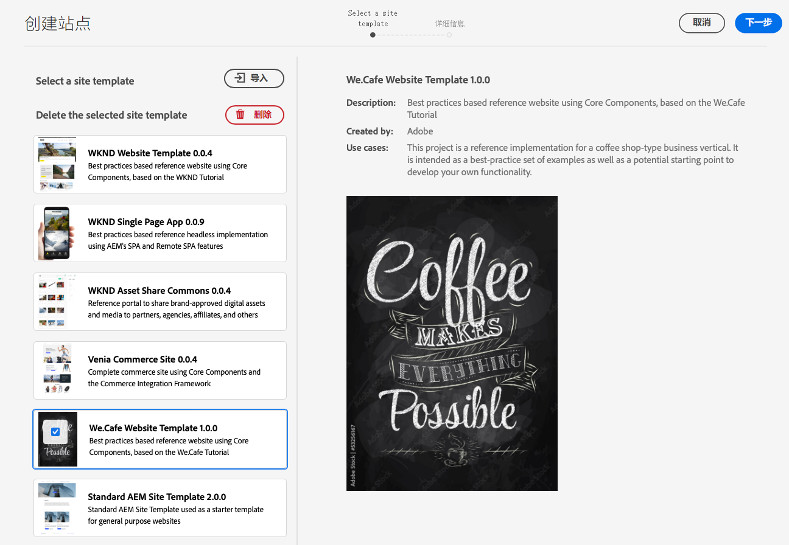

在向导完成后，您会发现内容已部署到站点下，并且可以像导航和浏览任何其他内容一样导航和浏览该内容。

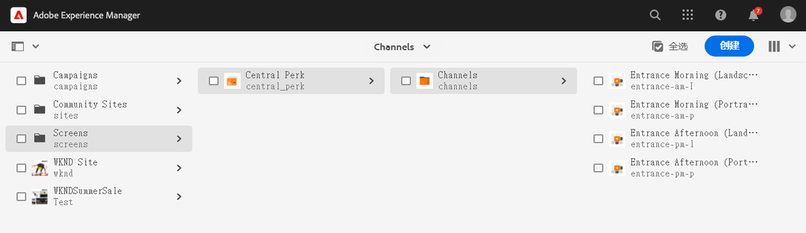

现在您已拥有 We.Cafe 演示内容，可以选择所需的测试 AEM Screens 的方式：

* 如果您只想浏览AEM Sites 控制台中的内容，只需在[其他资源](#additional-resources)部分中开始浏览和发现更多内容！无需执行其他操作。
* 如果要体验 AEM Screens 的完整动态功能，请继续下一部分，即[动态更改 Screens 内容](#dynamically-change)。

## 动态更改 Screens 内容 {#dynamically-change}

与AEM Sites 一样，AEM Screens 可以根据上下文动态更改内容。在 We.Cafe 演示中，已将渠道配置为根据当前温度显示不同的内容。为了模拟这一点，我们需要创建自己的简单天气服务。

### 创建模拟数据源 {#data-source}

由于在演示期间或测试时很难更改天气，因此必须模拟温度变化。我们通过将温度值存储在 AEM 的 ContextHub 将调用以检索温度的 Google Sheet 电子表格中来模拟天气服务。

#### 创建 Google API 密钥 {#create-api-key}

首先，我们需要创建一个 Google API 密钥来促进数据交换。

1. 登录 Google 帐户。
1. 使用以下链接打开 Cloud Console：`https://console.cloud.google.com`。
1. 通过单击 **Google Cloud Platform** 标签后面的工具栏左上方的当前项目名称来创建新项目。

   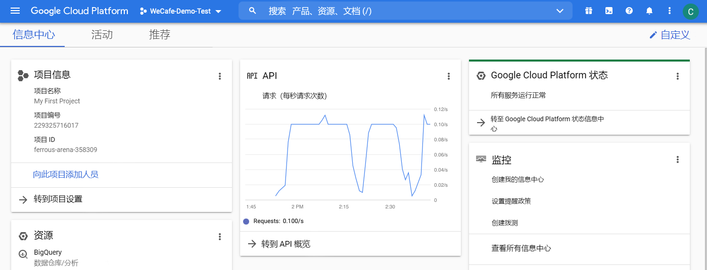

1. 在项目选择器对话框中，单击&#x200B;**新建项目**。

   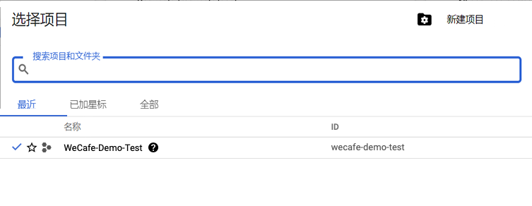

1. 为项目命名，然后单击&#x200B;**创建**。

   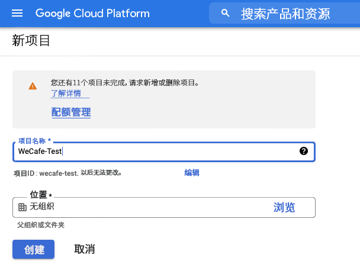

1. 确保已选择您的新项目，然后在 Cloud Console 的仪表板中的汉堡菜单中，选择 **API 和服务**。

   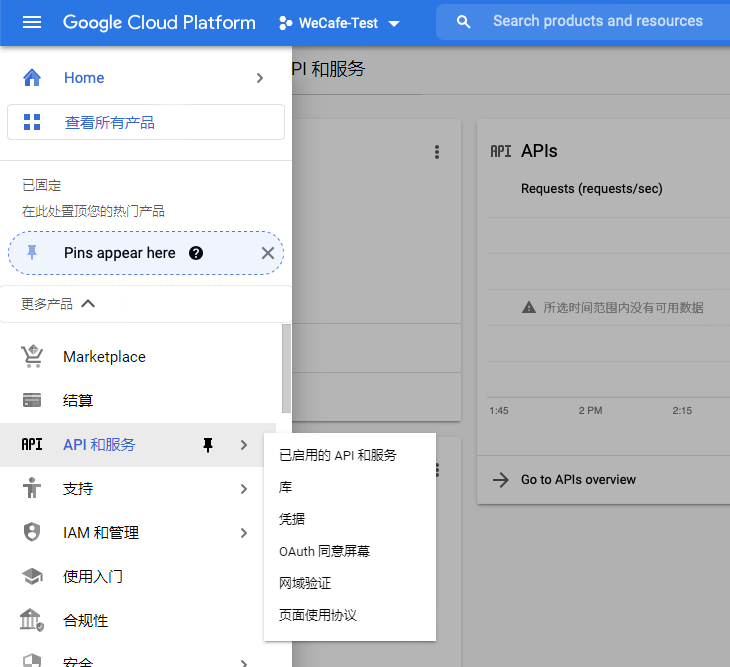

1. 在“API 和服务”窗口的左侧面板中，单击窗口顶部的&#x200B;**凭据**，然后单击&#x200B;**创建凭据**&#x200B;和 **API 密钥**。

   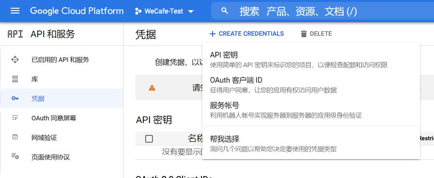

1. 在对话框中，复制新的 API 密钥并将其保存以供将来使用。单击&#x200B;**关闭**&#x200B;以关闭对话框。

#### 启用 Google Sheets API {#enable-sheets}

要允许使用 API 密钥交换 Google Sheets 数据，您需要启用 Google Sheets API。

1. 返回项目的 Google Cloud Console，网址为 `https://console.cloud.google.com`，然后使用汉堡菜单选择 **API 和服务 -> 库**。

   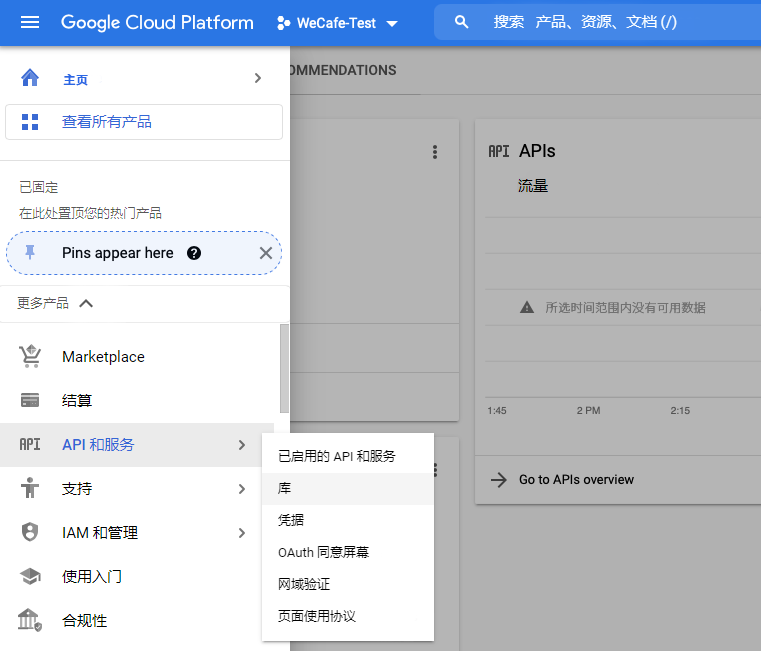

1. 在“API 库”屏幕中，滚动以查找对 **Google Sheets API** 的搜索。单击它。

   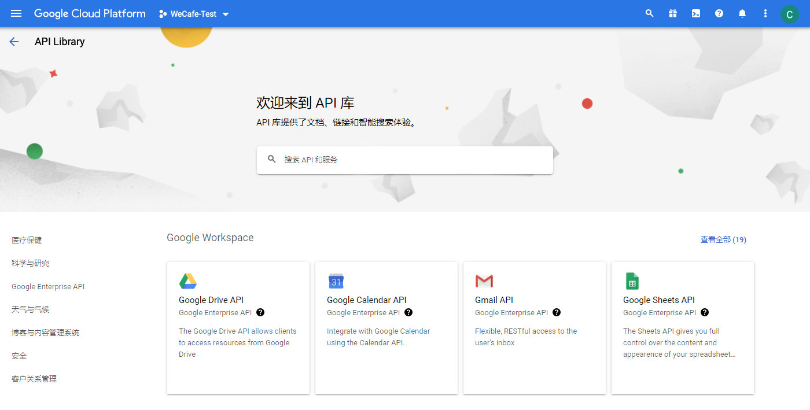

1. 在 **Google Sheets API** 窗口中，单击&#x200B;**启用**。

   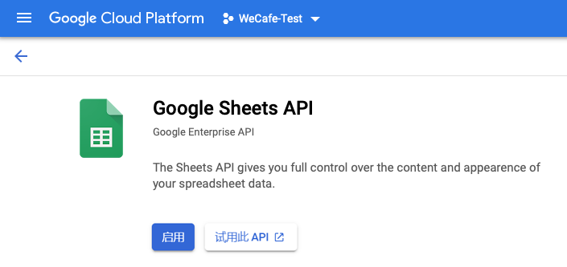

#### 创建 Google Sheets 电子表格 {#create-spreadsheet}

现在您可以创建 Google Sheets 电子表格来存储天气数据。

1. 转至 `https://docs.google.com` 并创建新的 Google Sheets 电子表格。
1. 在单元格 A2 中输入 `32` 来定义温度。
1. 通过单击窗口右上方的&#x200B;**共享**&#x200B;来共享文档，并在&#x200B;**获取链接**&#x200B;下，单击&#x200B;**更改**。

   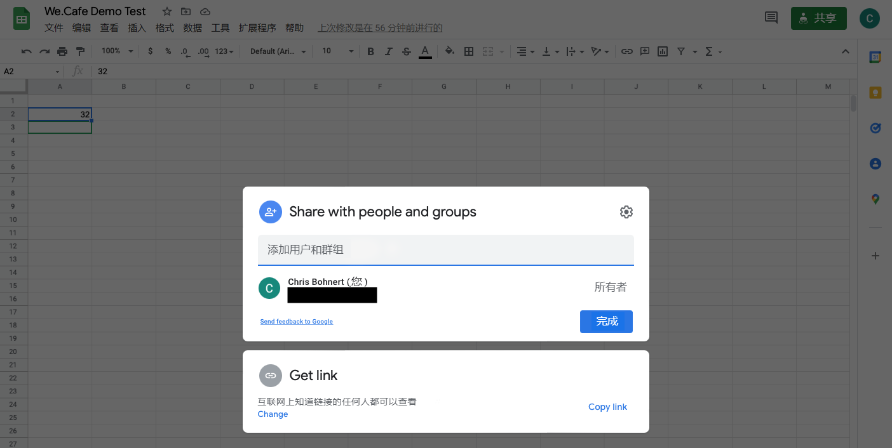

1. 复制链接以进行下一步。

   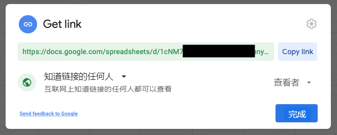

1. 找到表 ID。

   * 表 ID 是您在 `d/` 之后和 `/edit` 之前复制的表链接中的随机字符串。
   * 例如：
      * 如果您的 URL 为 `https://docs.google.com/spreadsheets/d/1cNM7j1B52HgMdsjf8frCQrXpnypIb8NkJ98YcxqaEP30/edit#gid=0`
      * 表 ID 为 `1cNM7j1B52HgMdsjf8frCQrXpnypIb8NkJ98YcxqaEP30`。

1. 复制表 ID 以供将来使用。

#### 测试您的天气服务 {#test-weather-service}

现在，您已将数据源创建为 Google Sheets 电子表格并支持通过 API 访问，请对其进行测试以确保您的“天气服务”可供访问。

1. 打开 Web 浏览器。

1. 输入以下请求，并替换您之前保存的表 ID 和 API 密钥值。

   ```
   https://sheets.googleapis.com/v4/spreadsheets/<yourSheetID>/values/Sheet1?key=<yourAPIKey>
   ```

1. 如果您收到类似于以下内容的 JSON 数据，则说明您已正确设置。

   ```json
   {
     "range": "Sheet1!A1:Z1000",
     "majorDimension": "ROWS",
     "values": [
       [],
       [
         "32"
       ]
     ]
   }
   ```

AEM Screens 可以使用此同一服务来访问模拟的天气数据。这将在下一步中进行配置。

### 配置 ContextHub {#configure-contexthub}

AEM Screens 可以根据上下文动态更改内容。在 We.Cafe 演示中，利用 AEM 的 ContextHub 将渠道配置为根据当前温度显示不同的内容。

>[!TIP]
>
>有关 ContextHub 的完整详细信息，请参阅本文档末尾的[其他资源](#additional-resources)部分。

在显示屏幕内容时，ContextHub 将调用天气服务来查找当前温度以决定要显示的内容。

在演示中，可以更改表中的值。ContextHub 将识别这一点，并且内容将根据更新后的温度在渠道中进行调整。

1. 在 AEMaaCS 创作实例上，转至&#x200B;**全局导航 -> 工具 ->站点-> ContextHub**。
1. 选择与您从 **We.Cafe 网站模板**&#x200B;创建的 Screens 项目同名的配置容器。
1. 选择&#x200B;**配置 -> ContextHub 配置 -> Google Sheets**，然后单击右上方的&#x200B;**下一步**。
1. 该配置应已具有预配置的 JSON 数据。有两个值需要更改：
   1. 将 `[your Google Sheets id]` 替换为您之前保存的表 ID[。](#create-spreadsheet)
   1. 将 `[your Google API Key]` 替换为您之前保存的 API 密钥[。](#create-api-key)
1. 单击&#x200B;**保存**。

现在您可以更改 Google Sheet 电子表格中的温度值，ContextHub 将在“显示天气变化”时动态更新 Screens。

### 测试动态数据 {#test-dynamic}

现在，AEM Screens 和 ContextHub 已连接到您的天气服务，您可以对其进行测试以了解 Screens 如何动态更新内容。

1. 访问您的沙盒创作实例。
1. 通过&#x200B;**全局导航 -> 站点** 导航到站点控制台，然后选择以下页面 **Screens -> &lt;project-name> -> 渠道 -> 入口早上显示(纵向)**。

   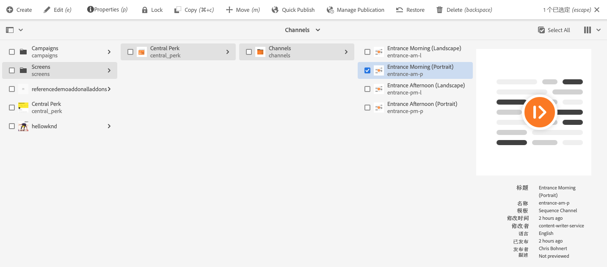

1. 单击工具栏中的“编辑”或键入快捷键 `e` 以编辑页面。

1. 在编辑器中，您可以查看内容。请注意，一个图像以蓝色突出显示，角落有一个定位图标。

   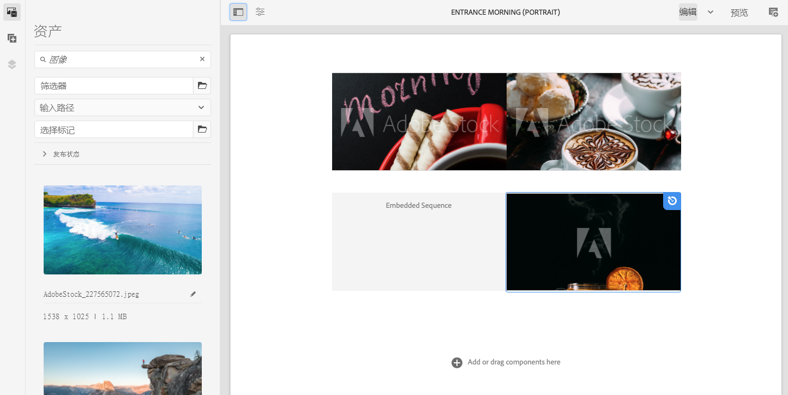

1. 将您在电子表格中输入的温度从 32 更改为 70，然后观察内容变化。

   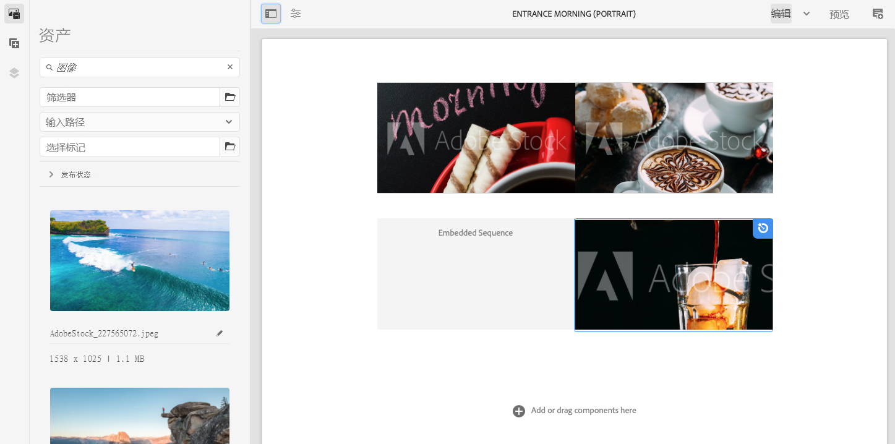

根据温度从冰冷的 32°F (0°C) 到舒适的 70°F (21°C) 的变化，此特色图像从一杯热茶变成了一杯凉爽的冰咖啡。

>[!IMPORTANT]
>
>仅使用描述的 Google Sheets 解决方案进行演示。Adobe 不支持在生产环境中使用 Google Sheets。

## 连接 Screens as a Cloud Service {#connect-screens}

如果您还想设置真正的数字标牌体验，包括在数字标牌设备或计算机上运行的播放器，请执行后续步骤。

或者，您可以在 AEMaaCS 上的渠道编辑器中预览演示。

>[!TIP]
>
>有关渠道编辑器的完整详细信息，请参阅本文档末尾的[其他资源](#additional-resources)部分。

### 配置 AEM Screens as a Cloud Service {#configure-screens}

首先，您需要将 Screens 演示内容发布到 AEM Screens as a Cloud Service 并配置该服务。

1. 发布演示 Screens 项目的内容。
1. 在 `https://experience.adobe.com/screens` 上导航到 Screens as a Cloud Service 并登录。
1. 在屏幕的右上方，确保您在正确的组织中。

   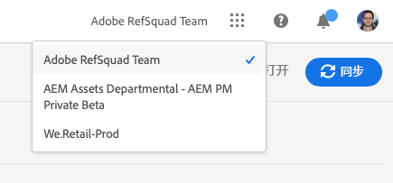

1. 单击左上方的齿轮型&#x200B;**编辑设置**&#x200B;图标。

   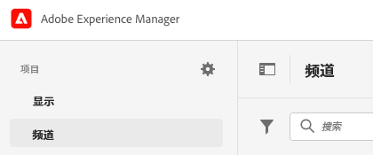

1. 提供已在其中创建演示站点的 AEMaaCS 创作和发布实例的 URL，并单击&#x200B;**保存**。

   

1. 连接到您的演示实例后，Screens 将拉入您的渠道内容。单击左侧面板中的&#x200B;**渠道**&#x200B;查看发布的渠道。填充信息可能需要一些时间。您可以单击屏幕右上方的蓝色&#x200B;**同步**&#x200B;按钮以更新信息。

   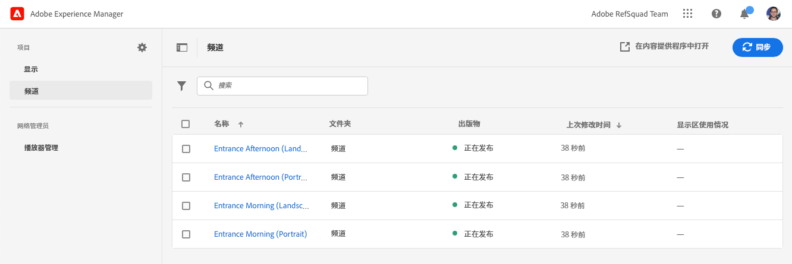

1. 单击左侧面板中的&#x200B;**显示**。您尚未为您的演示创建任何显示。我们将通过为每个显示创建文件夹来模拟 We.Cafe 的位置。单击屏幕右上方的&#x200B;**创建**，并选择&#x200B;**文件夹**。

   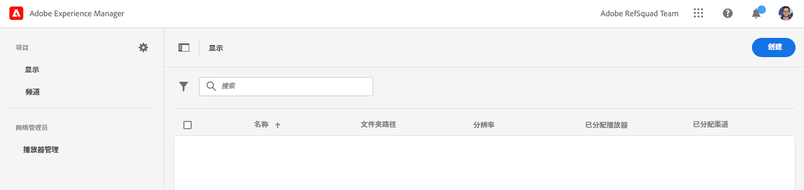

1. 在对话框中，提供文件夹名称，例如 **San Jose**，然后单击&#x200B;**创建**。

1. 通过单击文件夹以将其打开，然后单击右上方的&#x200B;**创建**&#x200B;并选择&#x200B;**显示**。

1. 提供显示名称，然后单击&#x200B;**创建**。

   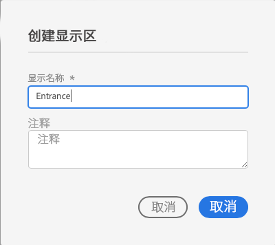

1. 创建显示后，单击显示屏的名称以打开显示详细信息屏幕。 必须为显示分配一个已从您的演示站点同步的渠道。单击屏幕右上方的&#x200B;**分配渠道**。

   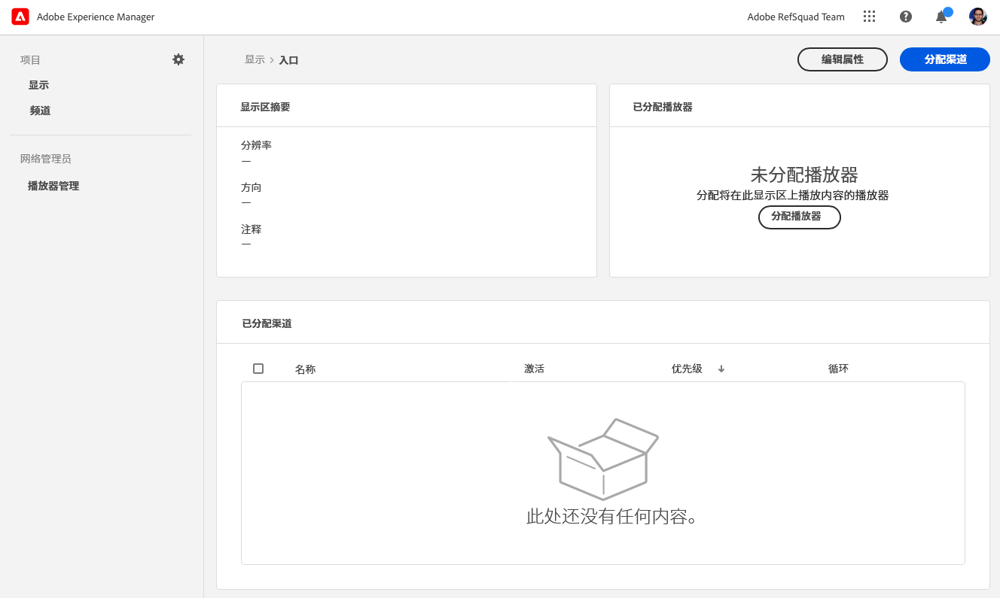

1. 在对话框中，选择渠道并单击&#x200B;**分配**。

   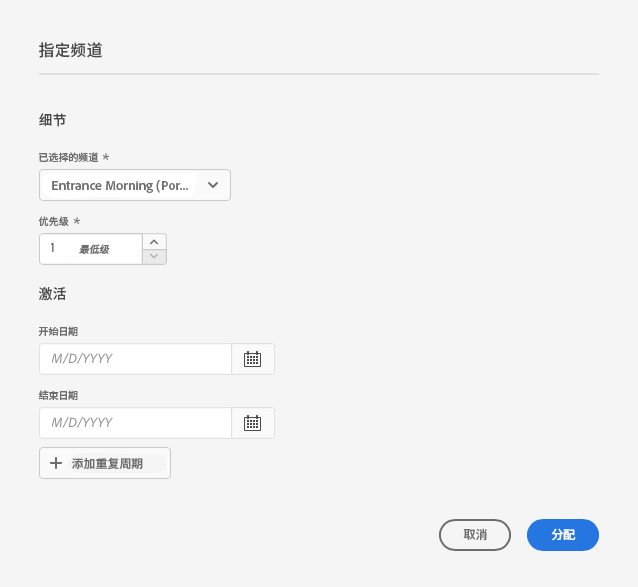

您可以对其他位置和显示重复这些步骤。完成这些步骤后，您的演示站点便与 AEM Screens 链接并且已完成必要的配置。

您可以在 AEMaaCS 上的渠道编辑器中预览演示。

### 使用 Screens 播放器 {#screens-player}

要在实际屏幕上查看内容，您可以下载播放器并在本地进行设置。之后，AEM Screens as a Cloud Service 会将内容投放给播放器

#### 生成注册码 {#registration-code}

首先，您需要创建一个注册码以将播放器安全地连接到 AEM Screens as a Cloud Service。

1. 在 `https://experience.adobe.com/screens` 上导航到 Screens as a Cloud Service 并登录。
1. 在屏幕的右上方，确保您在正确的组织中。

   

1. 在左侧面板中，单击&#x200B;**播放器管理 -> 注册码**，然后单击屏幕右上方的&#x200B;**创建代码**。


1. 输入此代码的名称，然后单击&#x200B;**创建**。

   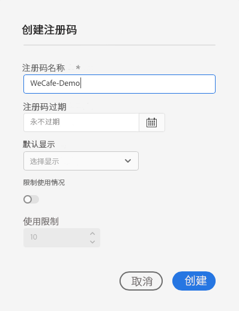

1. 创建此代码后，它将显示在列表中。单击以复制此代码。

   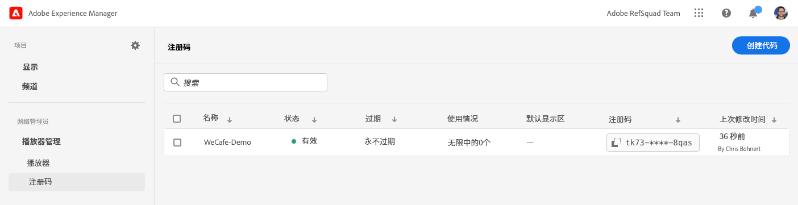

#### 安装和配置播放器 {#install-player}

1. 从 `https://download.macromedia.com/screens/` 下载并安装平台的播放器。
1. 运行播放器，然后切换到&#x200B;**配置**&#x200B;选项卡，滚动到底部以单击并确认&#x200B;**重置为出厂设置**&#x200B;和&#x200B;**更改为云模式**。

   

1. 播放器将自动变为&#x200B;**播放器注册**&#x200B;选项卡。输入您之前生成的代码，然后单击&#x200B;**注册**。

   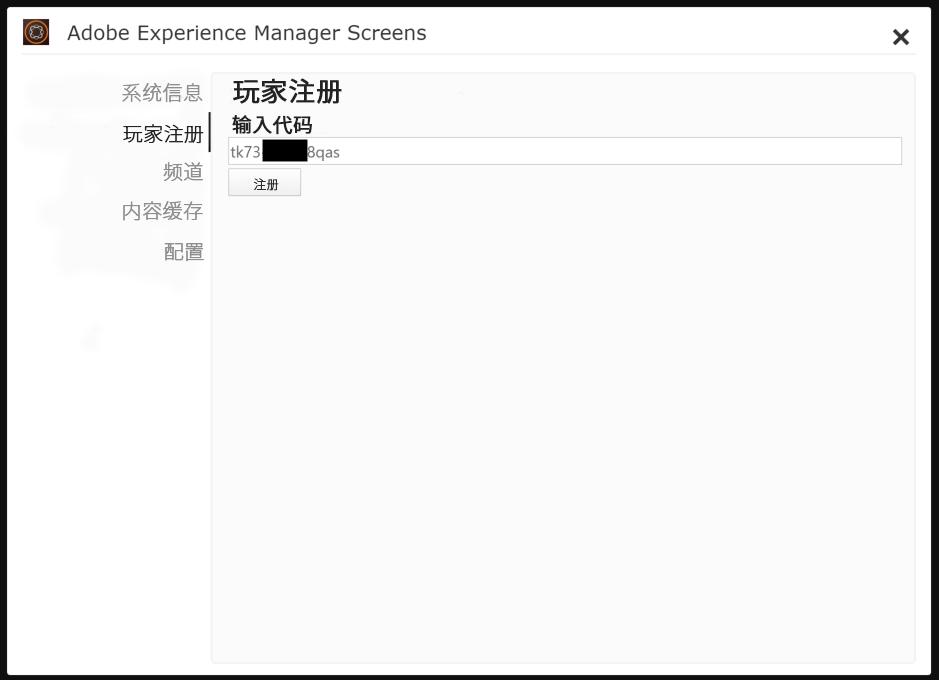

1. 切换到&#x200B;**系统信息**&#x200B;选项卡以确认播放器已注册。

   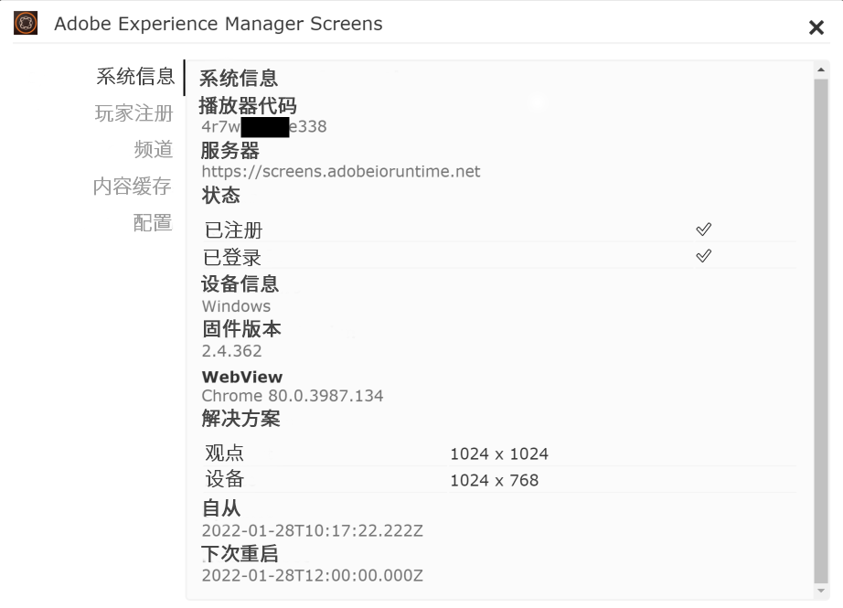

#### 将播放器分配给显示 {#assign-player}

1. 在 `https://experience.adobe.com/screens` 上导航到 Screens as a Cloud Service 并登录。
1. 在屏幕的右上方，确保您在正确的组织中。

   

1. 在左侧面板中，单击&#x200B;**播放器管理 -> 播放器**，您将看到之前安装并注册的播放器。

   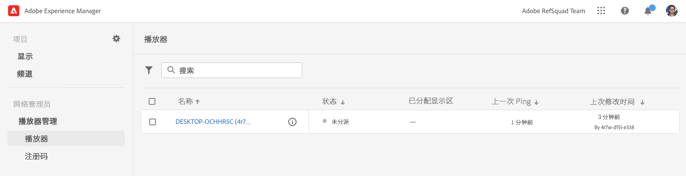

1. 单击播放器名称以打开其详细信息，然后单击屏幕右上方的&#x200B;**分配给显示**。

   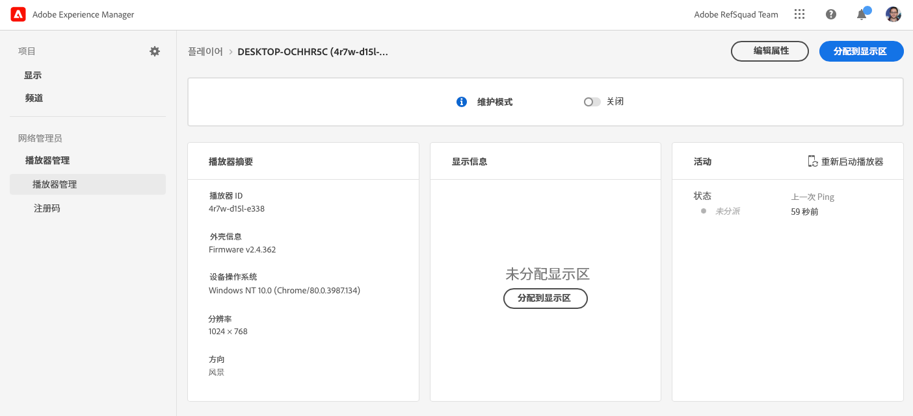

1. 在对话框中，选择您之前创建的显示，然后单击&#x200B;**选择**。

   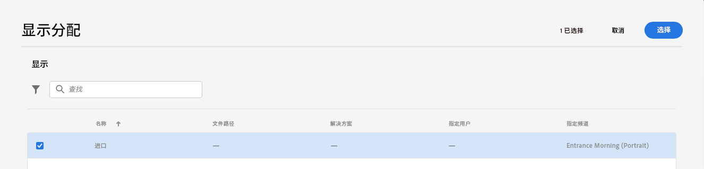

#### 播放！ {#playback}

将显示分配给播放器后，AEM Screens as a Cloud Service 会将内容投放给可显示它的播放器。


## 下一步 {#what-is-next}

现在您已完成 AEM 参考演示加载项历程的这一部分，您应：

* 了解 AEM Screens 的基础知识。
* 了解 We.Cafe 演示内容。
* 了解如何为 We.Cafe 配置 AEM Screens。

您现在可以使用自己的演示站点来探索 AEM Screens 的功能。 继续历程的下一部分，即[管理您的演示站点](manage.md)，了解可用于帮助您管理演示站点的工具以及如何移除它们。

您也可以查看[“其他资源”部分](#additional-resources)中的一些其他资源，详细了解您在此历程中看到的功能。

## 其他资源 {#additional-resources}

* [ContextHub 文档](/help/sites-cloud/authoring/personalization/contexthub.md) – 了解如何使用 ContextHub 根据天气条件之外的用户上下文来对内容进行个性化设置。
* [使用 API 密钥 – Google 文档](https://developers.google.com/maps/documentation/javascript/get-api-key) – 有关使用 Google API 密钥的详细信息的方便参考。
* [显示](/help/screens-cloud/creating-content/creating-displays-screens-cloud.md) – 详细了解 AEM Screens 中的显示及其用途。
* [下载播放器](/help/screens-cloud/managing-players-registration/installing-screens-cloud-player.md) – 了解如何访问和安装 Screens 播放器。
* [注册播放器](/help/screens-cloud/managing-players-registration/registering-players-screens-cloud.md) – 了解如何在 AEM Screens 项目中设置和注册播放器。
* [将播放器分配给显示](/help/screens-cloud/managing-players-registration/assigning-player-display.md) – 配置播放器以显示您的内容。
