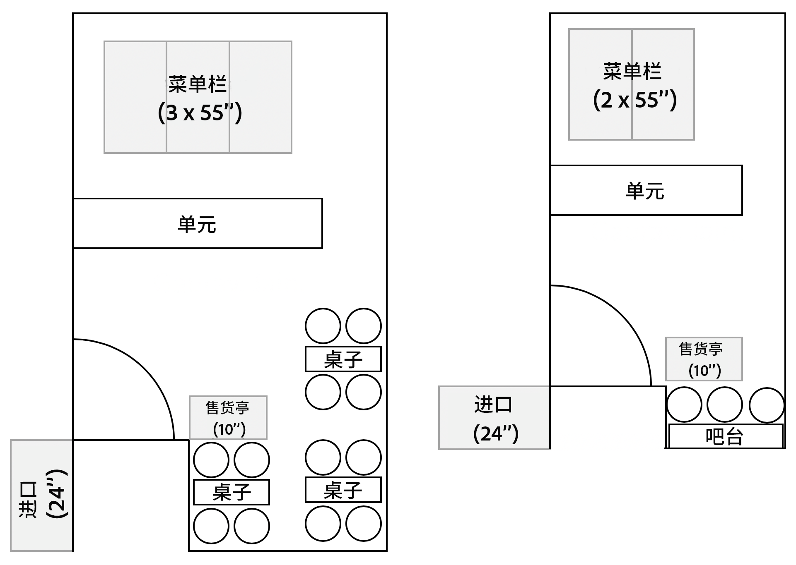
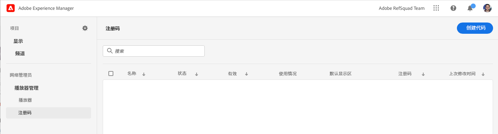
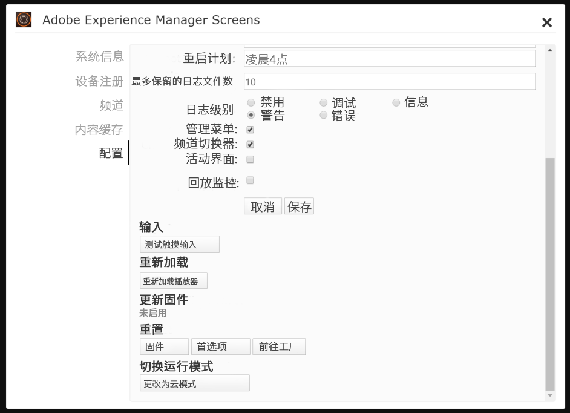

# 为演示网站启用AEM Screens {#enable-screens}

了解在演示网站上启用完整的AEM Screensas a Cloud Service体验的步骤。

## 迄今为止的故事 {#story-so-far}

在AEM参考演示附加组件历程的上一文档中， [创建演示网站、](create-site.md) 您基于“参考演示加载项”的模板创建了一个新的演示网站。 您现在应该：

* 了解如何访问AEM创作环境。
* 了解如何根据模板创建网站。
* 了解导航网站结构和编辑页面的基础知识。

现在，您拥有自己的演示网站来探索和了解可用于帮助您管理演示网站的工具，接下来，您便可以为演示网站启用完整的AEM Screensas a Cloud Service体验。

## 目标 {#objective}

AEM参考演示附加组件包含适用于We.Cafe（一家咖啡店垂直业务）的AEM Screens内容。 本文档可帮助您了解如何在AEM Screens上下文中执行We.Cafe演示设置。 阅读后，您应该：

* 了解AEM Screens的基础知识。
* 了解We.Cafe演示内容。
* 了解如何为We.Cafe配置AEM Screens。
   * 了解如何为We.Cafe创建Screens项目。
   * 能够使用Google表和API配置模拟天气服务。
   * 根据您的“天气服务”模拟动态更改的Screens内容。
   * 安装并使用screens播放器。

## 了解屏幕 {#understand-screens}

AEM Screensas a Cloud Service是一款数字标牌解决方案，允许营销人员大规模创建和管理动态数字体验。 借助AEM Screensas a Cloud Service，您可以创建引人入胜的动态数字标牌体验，以便在公共空间中使用。

>[!TIP]
>
>有关AEM Screensas a Cloud Service的完整详细信息，请参阅 [其他资源](#additional-resources) 文档末尾的章节。

通过安装AEM参考演示附加组件，您可以在演示创作环境中自动为您提供AEM Screens的We.Cafe内容。 中描述的步骤 [部署Demo Screens项目](#deploy-project) 允许您通过发布该内容并部署到媒体播放器等来启用完整的AEM Screens体验。

## 了解演示内容 {#demo-content}

We.Cafe咖啡店由位于美国三个地点的三间咖啡店组成。 这三家店都有三种相似的体验：

* 计数器上方的菜单板，带有两个或三个垂直面板
* 面向街道的入口显示屏，带有一个水平或垂直面板，邀请顾客进入商店
* 一个快速的自订亭亭，用一台垂直平板电脑绕过排队

>[!NOTE]
>
>只有进入显示屏才能在当前版本的演示中进行测试。 其他显示将在未来版本中显示。
>
>演示的当前版本中未包含网亭。 它将包含在未来版本中。

纽约的地点被认为是小店，空间不大，因此：

* 在旧金山和圣何塞，菜单板只有两个垂直面板，而不是三个
* 入口显示器垂直放置而不是水平放置

>[!NOTE]
>
>如果您决定在 [连接屏幕as a Cloud Service](#connect-screens) 部分，请在显示下将位置创建为文件夹。 请参阅 [其他资源](#additional-resources) 部分，以了解有关显示屏的详细信息。

### 咖啡馆布局 {#care-layouts}

We.Cafe的位置有以下布局。



>[!NOTE]
>
>屏幕的尺寸以英寸为单位。

### 入口 {#entrance}

入口展会分开一天，从早到下午只会改变第一张图像。 在序列的每次传递中，它还将宣传不同的特殊咖啡配方，每次使用按量计费的嵌入式序列来播放不同的产品。

在入口通道上的最后一幅图像也基于外部温度被定位（即动态改变），该图像可以如 [创建模拟数据源](#data-source) 中。

## 部署Demo Screens项目 {#deploy-project}

要在 [创建程序](create-program.md) 步骤中，必须基于模板创建网站。

如果您尚未创建We.Cafe演示网站，则只需按照 [创建演示网站](create-site.md) 中。 选择模板时，只需选择 **We.Cafe网站模板**.


向导完成后，您将在站点下找到部署的内容，并且可以像浏览任何其他内容一样进行导航和浏览。


现在，您已拥有We.Cafe演示内容，接下来可以选择如何测试AEM Screens:

* 如果您只想在AEM Sites控制台中浏览内容，则只需在 [其他资源](#additional-resources) 截！ 无需再执行任何操作。
* 如果您想要体验AEM Screens的完整动态功能，请继续下一部分， [动态更改屏幕内容。](#dynamically-change)

## 动态更改屏幕内容 {#dynamically-change}

与AEM Sites一样，AEM Screens也可以根据上下文动态更改内容。 We.Cafe演示的渠道配置为根据当前温度显示不同的内容。 为了模拟这种情况，我们需要创造我们自己的简单天气服务。

### 创建模拟数据源 {#data-source}

由于在演示期间或测试期间很难改变天气，因此必须模拟温度变化。 我们将模拟天气服务，方法是将温度值存储在Google工作表电子表格中，AEM ContextHub将调用该电子表格来检索温度。

#### 创建Google API密钥 {#create-api-key}

首先，我们需要创建Google API密钥，以便于数据交换。

1. 登录Google帐户。
1. 使用此链接打开云控制台 `https://console.cloud.google.com`.
1. 通过单击工具栏左上角的当前项目名称(位于 **Google Cloud平台** 标签。

   

1. 在项目选择器对话框中，单击 **新建项目**.

   

1. 为项目指定名称并单击 **创建**.

   

1. 确保已选择您的新项目，然后使用云控制台功能板中的汉堡包菜单，选择 **API和服务**.

   

1. 在API和服务窗口的左侧面板中，单击 **凭据** ，然后单击 **创建凭据** 和 **API密钥**.

   

1. 在对话框中，复制新的API密钥并保存以供将来使用。 单击 **关闭** 来关闭对话框。

#### 启用Google工作表API {#enable-sheets}

要允许使用API密钥交换Google表数据，您需要启用Google表API。

1. 返回Google云控制台(位于 `https://console.cloud.google.com` ，然后使用汉堡包菜单选择 **API和服务 — >库**.

   

1. 在API库屏幕中，滚动以查找我们的搜索 **Google工作表API**. 单击它。

   

1. 在 **Google工作表API** 窗口单击 **启用**.

   

#### 创建Google工作表电子表格 {#create-spreadsheet}

现在，您可以创建一个Google工作表电子表格来存储天气数据。

1. 转到 `https://docs.google.com` 并创建新的Google工作表电子表格。
1. 通过输入 `32` 单元格A2中。
1. 通过单击 **共享** 窗口右上方和下方 **获取链接** 单击 **更改**.

   

1. 复制链接以用于下一步。

   

1. 找到工作表ID。

   * 工作表ID是您复制之后的工作表链接中的随机字符串 `d/` 之前 `/edit`.
   * 例如：
      * 如果您的URL为 `https://docs.google.com/spreadsheets/d/1cNM7j1B52HgMdsjf8frCQrXpnypIb8NkJ98YcxqaEP30/edit#gid=0`
      * 工作表ID为 `1cNM7j1B52HgMdsjf8frCQrXpnypIb8NkJ98YcxqaEP30`.

1. 复制工作表ID以供将来使用。

#### 测试您的天气服务 {#test-weather-service}

现在，您已将数据源创建为Google工作表电子表格并启用通过API的访问，接下来对其进行测试，以确保“天气服务”是可访问的。

1. 打开Web浏览器。

1. 输入以下请求，替换您之前保存的工作表ID和API密钥值。

   ```
   https://sheets.googleapis.com/v4/spreadsheets/<yourSheetID>/values/Sheet1?key=<yourAPIKey>
   ```

1. 如果您收到与以下内容类似的JSON数据，则应正确设置该数据。

   ```json
   {
     "range": "Sheet1!A1:Z1000",
     "majorDimension": "ROWS",
     "values": [
       [],
       [
         "32"
       ]
     ]
   }
   ```

AEM Screens可以使用此相同服务访问模拟的天气数据。 将在下一步中配置此设置。

### 配置ContextHub {#configure-contexthub}

AEM Screens可以根据上下文动态更改内容。 We.Cafe演示的渠道配置为利用AEM ContextHub根据当前温度显示不同的内容。

>[!TIP]
>
>有关ContextHub的完整详细信息，请参阅 [其他资源](#additional-resources) 文档末尾的章节。

显示屏幕内容时， ContextHub将调用您的天气服务以查找当前温度，以确定要显示的内容。

出于演示目的，可以更改工作表中的值。 ContextHub将识别此内容，内容将根据更新后的温度在渠道中进行调整。

1. 在AEMaaCS创作实例中，转到 **全局导航 — >工具 — >站点 — > ContextHub**.
1. 选择与在从 **We.Cafe网站模板**.
1. 选择 **配置 — > ContextHub配置 — > Google工作表** 然后单击 **下一个** 在右上方。
1. 配置应已预配置JSON数据。 有两个值需要更改：
   1. 替换 `[your Google Sheets id]` 和工作表ID [您之前保存过。](#create-spreadsheet)
   1. 替换 `[your Google API Key]` 和API密钥 [您之前保存过。](#create-api-key)
1. 单击&#x200B;**保存**。

现在，您可以更改Google工作表电子表格中的温度值，ContextHub将在“看到天气变化”时动态更新Screens。

### 测试动态数据 {#test-dynamic}

现在，AEM Screens和ContextHub已连接到您的天气服务，您可以对其进行测试以查看屏幕如何动态更新内容。

1. 访问沙盒创作实例。
1. 通过导航到站点控制台 **全局导航 — >站点** 并选择以下页面 **屏幕 — > &lt;project-name> ->渠道 — >入口早晨（纵向）**.

   

1. 单击工具栏中的编辑或键入快捷键 `e` 以编辑页面。

1. 在编辑器中，您可以看到内容。 请注意，一个图像以蓝色高亮显示，且角部带有定位图标。

   

1. 将您在电子表格中输入的温度从32更改为70，然后观看内容变化。

   

根据温度从32°F(0°C)变为舒适70°F(21°C)的情况，特征图像从一杯暖茶变为一杯凉冰咖啡。

>[!IMPORTANT]
>
>仅将所述的Google工作表解决方案用于演示目的。 Adobe不支持在生产环境中使用Google工作表。

## 连接屏幕as a Cloud Service {#connect-screens}

如果您还希望设置真实的数字标牌体验，包括在数字标牌设备或您的计算机上运行的播放器，请执行后续步骤。

或者，您也可以仅在AEMaCS的渠道编辑器中预览演示。

>[!TIP]
>
>有关渠道编辑器的完整详细信息，请参阅 [其他资源](#additional-resources) 文档末尾的章节。

### 配置AEM Screensas a Cloud Service {#configure-screens}

首先，您需要将Screens演示内容发布到AEM Screensas a Cloud Service并配置服务。

1. 发布演示屏幕项目的内容。
1. 导航到as a Cloud Service于的屏幕 `https://experience.adobe.com/screens` 并登录。
1. 在屏幕的右上方，确保您所在的组织正确无误。

   

1. 在左上角，单击 **编辑设置** 图标，形状像齿轮。

   

1. 提供AEMaaCS创作和发布实例的URL，您可在其中创建演示网站并单击 **保存**.

   

1. 连接到演示实例后，Screens将提取您的渠道内容。 单击 **渠道** 来查看已发布的渠道。 填充信息可能需要一些时间。 您可以单击蓝色 **同步** 按钮以更新信息。

   

1. 单击 **显示** 中。 您尚未为演示创建任何内容。 我们将通过为每个We.Cafe创建文件夹来模拟We.Cafe的位置。 单击 **创建** ，然后选择 **文件夹**.

   

1. 在对话框中，提供文件夹名称，如 **圣何塞** 单击 **创建**.

1. 单击以打开文件夹，然后单击 **创建** ，然后选择 **显示**.

1. 提供显示名称并单击 **创建**.

   

1. 创建渠道后，单击该渠道以查看详细信息。 必须为显示屏分配从演示网站同步的渠道。 单击 **分配渠道** 中。

   

1. 在对话框中，选择渠道并单击 **分配**.

   

您可以对其他位置和显示内容重复这些步骤。 完成后，您将演示网站与AEM Screens链接起来，并完成了必要的配置。

您只需在AEMaCS的渠道编辑器中预览演示即可。

### 使用Screens播放器 {#screens-player}

要在实际屏幕上查看内容，您可以下载播放器并在本地进行设置。 AEM Screens as a Cloud Service随后会将内容交付到您的播放器

#### 生成注册代码 {#registration-code}

首先，您需要创建注册代码，以将播放器安全地连接到AEM Screensas a Cloud Service。

1. 导航到as a Cloud Service于的屏幕 `https://experience.adobe.com/screens` 并登录。
1. 在屏幕的右上方，确保您所在的组织正确无误。

   

1. 在左侧面板中，单击 **播放器管理 — >注册代码** 然后单击 **创建代码** 中。



1. 输入代码的名称，然后单击 **创建**.

   

1. 创建代码后，该代码会显示在列表中。 单击以复制代码。

   

#### 安装和配置播放器 {#install-player}

1. 从下载适用于您平台的播放器 `https://download.macromedia.com/screens/` 然后安装它。
1. 运行播放器并切换到 **配置** 选项卡，滚动到底部以单击并确认 **重置为工厂** 然后 **更改为云模式**.

   

1. 播放器将自动更改为 **播放器注册** 选项卡。 输入您之前生成的代码，然后单击 **注册**.

   

1. 切换到 **系统信息** 选项卡，以确认已注册播放器。

   

#### 将播放器分配给显示屏 {#assign-player}

1. 导航到as a Cloud Service于的屏幕 `https://experience.adobe.com/screens` 并登录。
1. 在屏幕的右上方，确保您所在的组织正确无误。

   

1. 在左侧面板中，单击 **播放器管理 — >播放器** 您将看到您之前安装和注册的播放器。

   

1. 单击播放器名称以打开其详细信息，然后单击 **指定为显示** 中。

   

1. 在对话框中，选择您之前创建的显示，然后单击 **选择**.

   

#### 播放! {#playback}

在您为播放器分配了显示屏后，AEM Screens as a Cloud Service会将内容交付到播放器中可见的位置。


## 下一步 {#what-is-next}

现在，您已完成AEM参考演示附加组件历程的这一部分，接下来您应该：

* 了解AEM Screens的基础知识。
* 了解We.Cafe演示内容。
* 了解如何为We.Cafe配置AEM Screens。

现在，您可以使用自己的演示网站探索AEM Screens的功能。 继续历程的下一节， [管理演示网站，](manage.md) 您将在此处了解可用于帮助您管理演示网站的工具以及如何删除这些工具。

您还可以在 [“其他资源”部分](#additional-resources) 以进一步了解您在此历程中看到的功能。

## 其他资源 {#additional-resources}

* [ContextHub文档](/help/sites-cloud/authoring/personalization/contexthub.md)  — 了解如何使用ContextHub根据天气条件以外的用户上下文对内容进行个性化。
* [使用API密钥 — Google文档](https://developers.google.com/maps/documentation/javascript/get-api-key)  — 有关使用Google API密钥的详细信息的便捷引用。
* [显示](/help/screens-cloud/creating-content/creating-displays-screens-cloud.md)  — 详细了解AEM Screens中的显示屏及其功能。
* [下载播放器](/help/screens-cloud/managing-players-registration/installing-screens-cloud-player.md)  — 了解如何访问Screens播放器以及如何安装。
* [注册播放器](/help/screens-cloud/managing-players-registration/registering-players-screens-cloud.md)  — 了解如何在您的AEM Screens项目中设置和注册播放器。
* [将播放器分配给显示屏](/help/screens-cloud/managing-players-registration/assigning-player-display.md)  — 配置播放器以显示内容。
