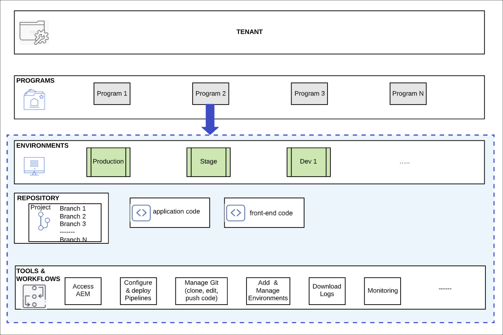

# 了解Cloud Manager和快速网站创建工作流程 {#understand-cloud-manager}

了解Cloud Manager以及它如何将新的快速站点创建过程联系起来。

>[!TIP]
>
>如果您的角色仅是前端开发，则可以跳转到文章 [检索Git存储库访问信息](retrieve-access.md) 在这个旅程中。
>
>如果您是AEM管理员（Cloud Manager管理员），同时负责前端开发和管理员任务，或者只想了解AEM中用于前端开发的端到端流程，请继续阅读当前文档并继续此历程。

## 目标 {#objective}

本文档可帮助您了解AEM快速网站创建工具的工作方式，并概述端到端流程。 阅读后，您应该：

* 了解AEM Sites和Cloud Manager如何协同工作来促进前端开发
* 了解前端自定义步骤如何与AEM完全分离，并且无需AEM知识。

本文档重点介绍在您开始配置的历程的下一步之前，了解快速站点创建解决方案的这些基本内容。

尽管建议您分步完成此历程，但如果您已经了解AEM Sites和Cloud Manager协同工作，并且希望直接开始配置，则可以 [跳到历程的下一步。](create-site.md)

## 负责任角色 {#responsible-role}

此部分历程适用于AEM管理员和Cloud Manager管理员。

## 要求和先决条件 {#requirements-prerequisites}

在您开始使用快速网站创建工具创建和自定义网站之前，需要满足以下几个要求。

由于此历程面向前端开发人员、管理员和所有角色的组合，因此此处列出了这两者的要求。

了解前端开发人员无需AEM访问或了解相关知识，这一点非常重要。

### 知识 {#knowledge}

| 知识 | 角色 |
|---|---|
| 了解前端开发的标准工具和流程 | 前端开发人员 |
| 有关如何在AEM中创建和管理站点的基本知识 | AEM 管理员 |
| Cloud Manager基本知识 | Cloud Manager管理员 |

对于前端开发人员，无需任何AEM知识。

### 工具 {#tools}

| 工具 | 角色 |
|---|---|
| 首选的前端开发环境 | 前端开发人员 |
| npm | 前端开发人员 |
| webpack | 前端开发人员 |
| 对Cloud Manager的访问权限 | Cloud Manager管理员 |
| 是 **业务所有者** Cloud Manager中的角色 | Cloud Manager管理员 |
| 在Cloud Manager中担任系统管理员 | Cloud Manager管理员 |
| 访问Admin Console | Cloud Manager管理员 |
| 是 **部署管理器** Cloud Manager中的角色 | Cloud Manager管理员 |
| 是 **部署管理器** Cloud Manager中的角色 | 前端开发人员 |

对于前端开发人员，无需使用AEM。

>[!TIP]
>
>如果您不熟悉Cloud Manager角色和角色管理，请参阅 [其他资源](#additional-resources) 中。

## Cloud Manager {#cloud-manager}

Cloud Manager是AEMas a Cloud Service的一个基本组件，是平台的单个入口点。

为了支持具有企业开发设置的客户，AEM  as a Cloud Service与Cloud Manager及其专门构建的CI/CD管道完全集成。 快速站点创建工具扩展了这些功能，以支持专用的前端开发管道。

在此历程中，无需完全了解Cloud Manager。 Cloud Manager在高级别包含多个级别的结构。

* **租户**  — 为每位客户配置了租户。 **WKND旅游和冒险企业** 可能是租户。
* **程序。**  — 每个租户都有一个或多个程序。 的 **WKND旅游和冒险企业** 租户可能 **WKND夜生活** 和 **WKND下午项目** 项目。
* **环境**  — 每个项目都有多个环境，例如用于实时内容的生产以及用于开发目的的暂存和开发环境。 **WKND夜生活** 和 **WKND下午项目** 程序将同时具有开发、暂存和生产环境。
* **存储库**  — 环境具有维护应用程序和前端代码的git存储库。
* **工具和工作流**  — 管道管理从存储库到环境的代码部署。

## 快速创建站点前端开发流程 {#flow}

即使您尚未拥有丰富的Cloud Manager使用经验，整个流程也非常简单直观。

1. AEM管理员登录到AEM环境，然后使用网站模板创建新网站。
1. Cloud Manager管理员在Cloud Manager中创建前端管道。 管道可协调从git存储库到AEM环境的代码部署。
1. AEM管理员从项目的AEM实例中导出网站主题，并将其提供给前端开发人员。
1. Cloud Manager管理员授予前端开发人员访问AEM git存储库的权限，以便提交自定义。
1. 前端开发人员检索用于访问git和管道的访问凭据。
1. 前端开发人员自定义主题，使用站点中的实际内容使用代理对其进行测试，然后将更改提交到git存储库。
1. 前端开发人员执行管道以将主题自定义部署到程序的生产环境。

使用快速站点创建工具的主要优势在于，纯前端开发人员只负责实际的自定义。 前端开发人员不与AEM进行交互，也不需要任何AEM知识。

## 下一步 {#what-is-next}

现在，您已完成AEM快速网站创建历程的这一部分，接下来您应该：

* 了解AEM Sites和Cloud Manager如何协同工作来促进前端开发
* 了解前端自定义步骤如何与AEM完全分离，并且无需AEM知识。

在此知识的基础上，通过下一步审阅文档，继续您的AEM快速网站创建历程 [从模板创建网站，](create-site.md) 在这里，您将学习如何使用模板快速创建新的AEM网站。

## 其他资源 {#additional-resources}

同时，建议您通过审阅文档来转到快速网站创建历程的下一部分 [从模板创建网站，](create-site.md) 以下是一些其他可选资源，可更深入地了解本文档中提到的某些概念，但无需继续访问这些概念。

* [Cloud Manager文档](https://experienceleague.adobe.com/docs/experience-manager-cloud-service/onboarding/onboarding-concepts/cloud-manager-introduction.html)  — 如果您希望了解有关Cloud Manager功能的更多详细信息，则可能需要直接查阅深入的技术文档。
* [基于角色的权限](https://experienceleague.adobe.com/docs/experience-manager-cloud-manager/using/requirements/role-based-permissions.html) - Cloud Manager已预先配置了具有相应权限的角色。 有关这些角色以及如何管理这些角色的详细信息，请参阅本文档。
* [npm](https://www.npmjs.com)  — 用于快速构建网站的AEM主题基于npm。
* [webpack](https://webpack.js.org)  — 用于快速构建网站的AEM主题依赖于webpack。
