# 从模板创建网站 {#create-site-from-template}

了解如何使用网站模板快速创建新的AEM网站。

>[!CAUTION]
>
>快速网站创建工具当前为技术预览。 它可用于测试和评估目的，并且除非与Adobe支持部门达成协议，否则不会用于生产。

## 迄今为止的故事 {#story-so-far}

在AEM快速网站创建历程的上一文档中， [了解Cloud Manager和快速网站创建工作流程，](cloud-manager.md) 您了解了Cloud Manager及其如何将新的快速站点创建过程联系起来，您现在应该：

* 了解AEM Sites和Cloud Manager如何协同工作来促进前端开发
* 了解前端自定义步骤如何与AEM完全分离，并且无需AEM知识。

本文基于这些基础知识，因此您可以执行第一个配置步骤，并从模板中创建新站点，之后您可以使用前端工具对模板进行自定义。

## 目标 {#objective}

本文档可帮助您了解如何使用网站模板快速创建新AEM网站。 阅读后，您应该：

* 了解如何获取AEM网站模板。
* 了解如何使用模板创建新站点。
* 了解如何从新站点下载模板以提供给前端开发人员。

## 负责任角色 {#responsible-role}

此部分历程适用于AEM管理员。

## 站点模板 {#site-templates}

网站模板是将基本网站内容整合到方便、可重用的包中的一种方式。 网站模板通常包含基本网站内容和结构以及网站样式信息，以便快速开始新网站。 实际结构如下：

* `files`:包含UI包、XD文件的文件夹，可能还包含其他文件
* `previews`:包含网站模板屏幕截图的文件夹
* `site`:为从此模板创建的每个网站（如页面模板、页面等）复制的内容包。
* `theme`:用于修改网站外观的模板主题的来源，包括CSS、JavaScript等。

模板功能强大，因为它们可重复使用，因此内容作者可以快速创建网站。 由于AEM安装中可以有多个模板，因此您可以灵活地满足各种业务需求。

>[!NOTE]
>
>网站模板不要与页面模板混淆。 此处介绍的网站模板定义网站的整体结构。 页面模板可定义单个页面的结构和初始内容。

## 获取网站模板 {#obtaining-template}

最简单的入门方法是 [从其GitHub存储库下载最新版的AEM标准站点模板。](https://github.com/adobe/aem-site-template-standard/releases)

下载后，您可以像上传任何其他包一样将其上传到AEM环境。 请参阅 [“其他资源”部分](#additional-resources) 有关如果您需要有关此主题的更多信息，请详细了解如何使用包。

>[!TIP]
>
>可以自定义AEM标准网站模板以满足您项目的需求，并且无需进一步自定义。 但是，此主题不在此历程的范围之内。 有关更多信息，请参阅标准站点模板的GitHub文档。

>[!TIP]
>
>您还可以选择在项目工作流中从源构建模板。 但是，此主题不在此历程的范围之内。 有关更多信息，请参阅标准站点模板的GitHub文档。

## 安装站点模板 {#installing-template}

使用模板创建新站点非常简单。

1. 登录到AEM创作环境，然后导航到站点控制台

   * `https://<your-author-environment>.adobeaemcloud.com/sites.html/content`

1. 点按或单击 **创建** 从屏幕右上方的下拉菜单中选择 **模板中的网站**.

   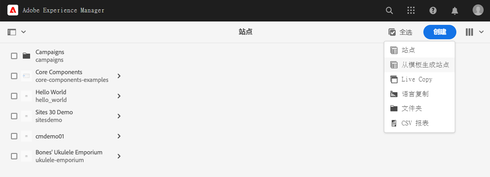

1. 在创建站点向导中，点按或单击 **导入** 列的顶部。

   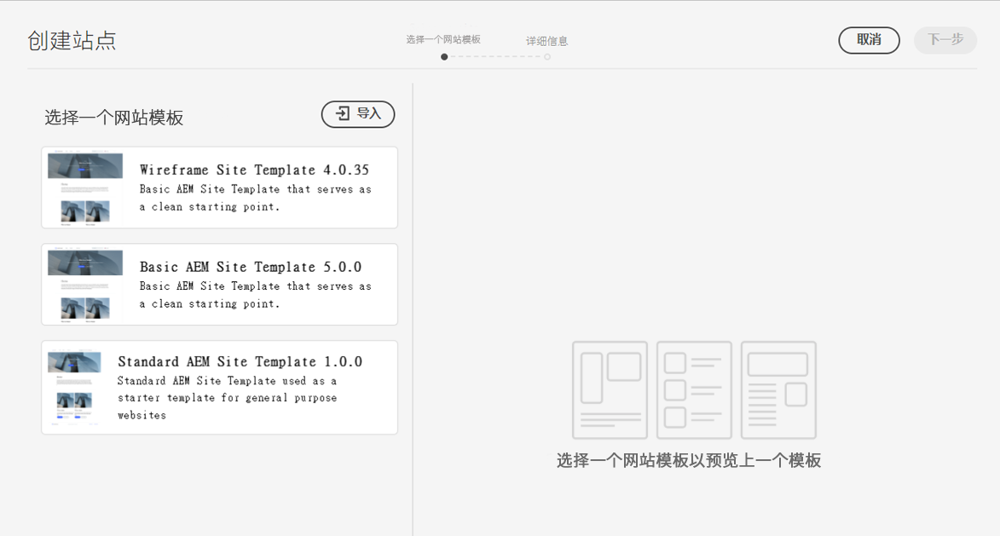

1. 在文件浏览器中，找到模板 [您之前下载过](#obtaining-template) 单击 **上传**.

1. 上传后，该模板会显示在可用模板列表中。 点按或单击该模板以将其选中（这也会显示右列中有关模板的信息），然后点按或单击 **下一个**.

   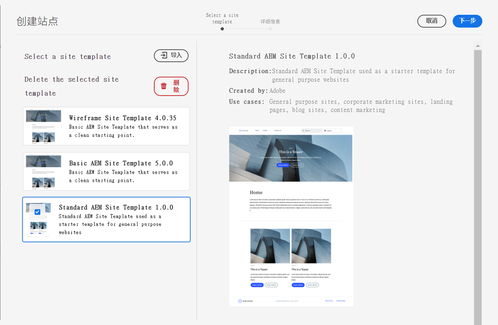

1. 为您的网站提供标题。 如果忽略，则可以提供或将从标题生成网站名称。

   * 网站标题会显示在浏览器标题栏中。
   * 网站名称将成为URL的一部分。

1. 点按或单击 **创建** 然后，使用网站模板创建新网站。

   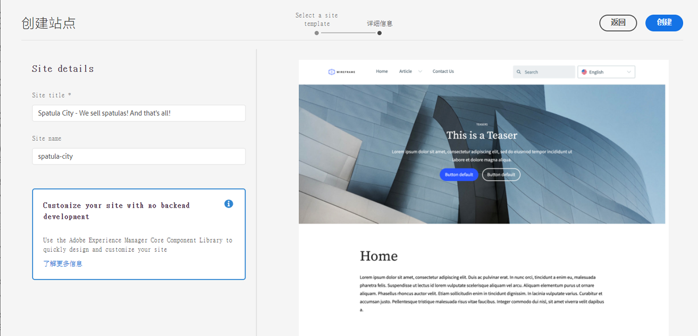

1. 在显示的确认对话框中，点按或单击 **完成**.

   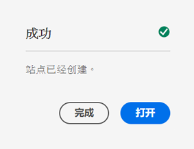

1. 在“站点”控制台中，新站点将可见，并可以导航到浏览其由模板定义的基本结构。

   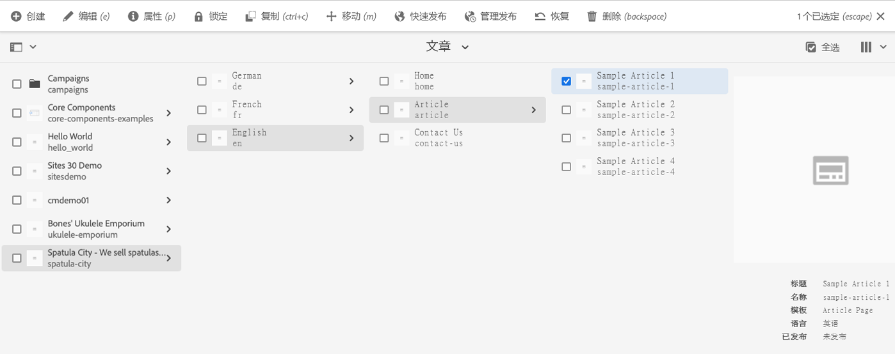

内容作者现在可以开始创作。

## 是否需要进一步自定义？ {#customization-required}

网站模板功能强大且灵活，可为项目创建任意数字，从而便于创建网站变体。 根据您在使用的站点模板上已执行的自定义级别，您甚至不需要额外的前端自定义。

* 如果您的网站不需要进行其他自定义，恭喜！ 你的旅程结束了！
* 如果您仍需要额外的前端自定义，或者如果您只想了解整个流程，以备将来需要自定义，请继续阅读。

## 示例页面 {#example-page}

如果您确实需要额外的前端自定义，请记住，前端开发人员可能不熟悉您内容的详细信息。 因此，最好向开发人员提供典型内容的路径，该路径可在主题被自定义时用作参考的基础。 网站主控语言的主页是一个典型示例。

1. 在站点浏览器中，导航到站点主控语言的主页，然后点按或单击相应的页面以将其选中，然后点按或单击 **编辑** 中。

   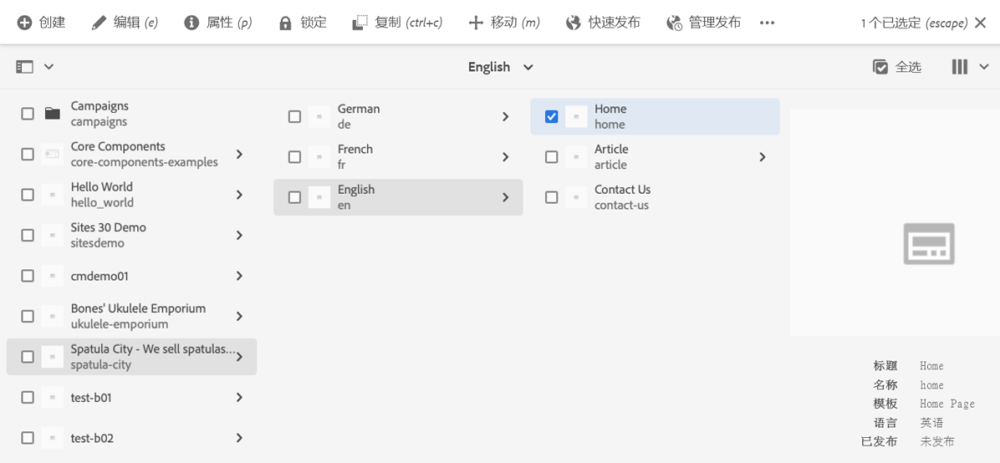

1. 在编辑器中，选择 **页面信息** 按钮，然后 **查看已发布的项目**.

   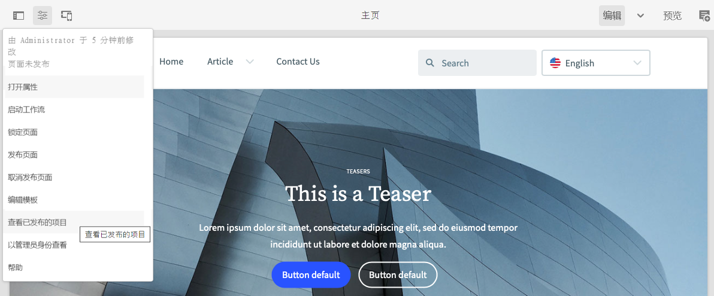

1. 在打开的选项卡中，从地址栏复制内容的路径。 看起来会象 `/content/<your-site>/en/home.html?wcmmode=disabled`.

   

1. 保存路径，以便稍后向前端开发人员提供。

## 下载主题 {#download-theme}

现在，站点已创建完成，接下来可以下载模板生成的站点主题，并将其提供给前端开发人员进行自定义。

1. 在站点控制台中，显示 **网站** 边栏。

   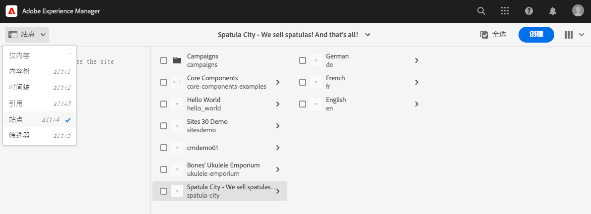

1. 点按或单击新站点的根，然后点按或单击 **下载主题源** 中。

   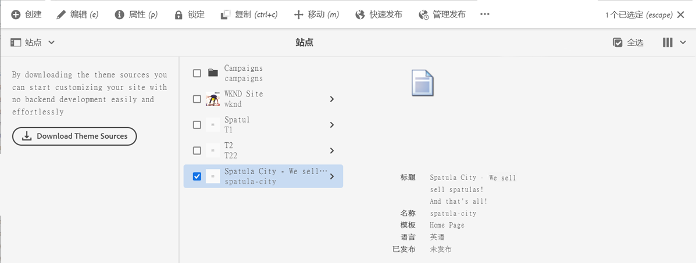

现在，您的下载文件中有主题源文件的副本。

## 设置代理用户 {#proxy-user}

为了让前端开发人员使用您网站中的实际AEM内容预览自定义，您必须设置代理用户。

1. 在AEM中，从主导航转到 **工具** -> **安全性** -> **用户**.
1. 在用户管理控制台中，点按或单击 **创建**.

   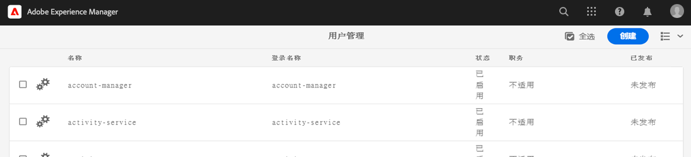
1. 在 **创建新用户** 窗口，则必须至少提供：
   * **ID**  — 请注意此值，因为您必须将其提供给前端开发人员。
   * **密码**  — 将此值安全地保存在密码保管库中，因为您必须将其提供给前端开发人员。

   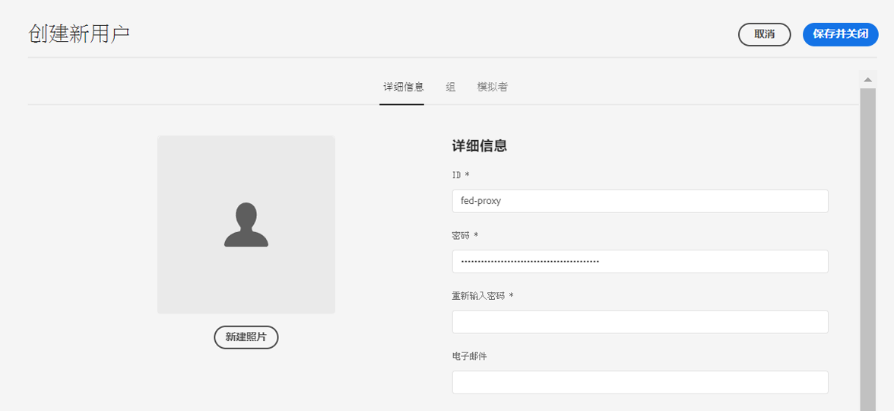

1. 在 **群组** 选项卡，将代理用户添加到 `contributors` 群组。
   * 在术语中键入 `contributors` 触发AEM自动完成功能，以便轻松选择组。

   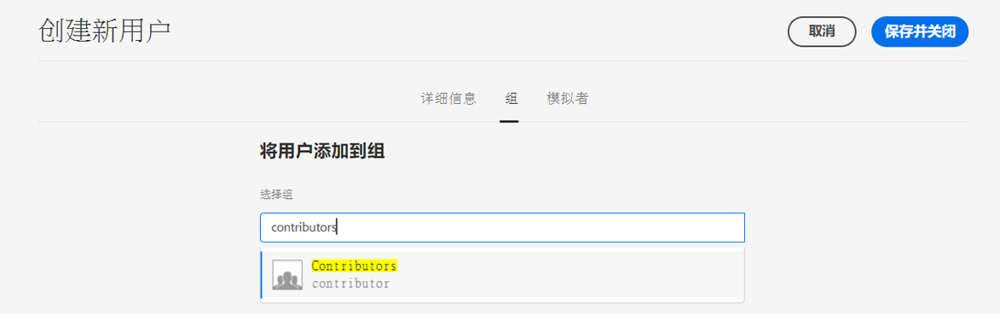

1. 点按或单击 **保存并关闭**.

您现在已完成配置。 内容作者现在可以在站点上开始准备内容，以便在历程的下一步中开始进行前端自定义。

## 下一步 {#what-is-next}

现在，您已完成AEM快速网站创建历程的这一部分，接下来您应该：

* 了解如何获取AEM网站模板。
* 了解如何使用模板创建新站点。
* 了解如何从新站点下载模板以提供给前端开发人员。

在此知识的基础上，通过下一步审阅文档，继续您的AEM快速网站创建历程 [设置管道，](pipeline-setup.md) 您将在其中创建前端管道以管理网站主题的自定义。

## 其他资源 {#additional-resources}

同时，建议您通过审阅文档来转到快速网站创建历程的下一部分 [设置管道，](pipeline-setup.md) 以下是一些其他可选资源，可更深入地了解本文档中提到的某些概念，但无需继续访问这些概念。

* [AEM标准网站模板](https://github.com/adobe/aem-site-template-standard)  — 这是AEM Standard Site模板的GitHub存储库。
* [创建和组织页面](/help/sites-cloud/authoring/fundamentals/organizing-pages.md)  — 本指南详细介绍在从模板创建AEM网站后，如果您希望进一步对其进行自定义，则如何管理其页面。
* [如何使用包](/help/implementing/developing/tools/package-manager.md)  — 包允许导入和导出存储库内容。 本文档介绍如何在AEM 6.5中使用包，该软件包也适用于AEMaCS。
* [站点管理文档](/help/sites-cloud/administering/site-creation/create-site.md)  — 有关快速网站创建工具功能的更多详细信息，请参阅网站创建技术文档。
