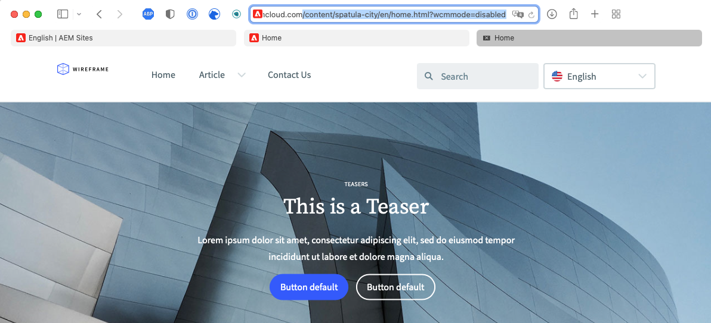

# 从模板创建站点 {#create-site-from-template}

了解如何使用站点模板快速创建AEM站点。

## 迄今为止的故事 {#story-so-far}

在 AEM 快速站点创建历程的上一个文档[了解 Cloud Manager 和快速站点创建工作流](cloud-manager.md)中，您已了解 Cloud Manager 以及它如何将新的快速站点创建流程联系起来，您现在应：

* 了解 AEM Sites 和 Cloud Manager 如何协作来推动前端开发
* 了解如何在不具有 AEM 知识的情况下将前端自定义步骤与 AEM 完全分离开来。

本文基于这些基础之上，因此您可以执行第一个配置步骤并为模板创建站点，之后您可以使用前端工具对其进行自定义。

## 目标 {#objective}

本文档可帮助您了解如何使用站点模板快速创建AEM站点。 阅读本文档后，您应：

* 了解如何获取 AEM 站点模板。
* 了解如何使用模板创建站点。
* 了解如何从新站点下载模板以提供给前端开发人员。

## 负责角色 {#responsible-role}

此历程的这一部分适用于 AEM 管理员。

## 站点模板 {#site-templates}

站点模板是一种将基本站点内容组合成方便且可重用的包的方法。站点模板通常包含基本站点内容和结构以及站点样式信息，以便快速启动新的站点。实际结构如下：

* `files`：包含 UI 套件、XD 文件和可能的其他文件的文件夹
* `previews`：包含站点模板的屏幕截图的文件夹
* `site`：为从此模板创建的每个站点复制的内容的内容包，例如页面模板、页面等。
* `theme`：用于修改站点外观的模板主题的来源，包括CSS、JavaScript等。

模板具有强大的功能，它们可重用，这使得内容作者能够快速创建站点。由于您可以在 AEM 安装中使用多个模板，因此可以灵活地满足各种业务需求。

>[!NOTE]
>
>不要将站点模板与页面模板混淆。此处描述的站点模板定义了站点的整体结构。页面模板定义了单个页面的结构和初始内容。

## 获取站点模板 {#obtaining-template}

最简单的入门方法是[从其 GitHub 存储库下载最新版本的 AEM 标准站点模板。](https://github.com/adobe/aem-site-template-standard/releases)

下载后，您可以像上传任何其他包一样将它上传到您的 AEM 环境。如果您想了解有关此主题的更多信息，请参阅[“其他资源”部分](#additional-resources)，了解有关如何使用包的详细信息。

>[!TIP]
>
>可以自定义 AEM 标准站点模板以满足您的项目需求，并且可以消除进一步自定义的需要。但这个主题超出了此历程的范围。有关更多信息，请参阅“标准站点模板”的 GitHub 文档。

>[!TIP]
>
>您也可以选择在项目工作流中从来源构建模板。但这个主题超出了此历程的范围。有关更多信息，请参阅“标准站点模板”的 GitHub 文档。

## 安装站点模板 {#installing-template}

使用模板创建站点很容易。

1. 登录您的 AEM 创作环境并导航到 Sites 控制台

   * `https://<your-author-environment>.adobeaemcloud.com/sites.html/content`

1. 选择 **创建** 在屏幕的右上角，从下拉菜单中选择 **从模板创建站点**.

   

1. 在创建站点向导中，选择 **导入** 左列的顶部。

   

1. 在文件浏览器中，找到模板 [您之前下载过](#obtaining-template) 并选择 **上传**.

1. 上传模板后，该模板将显示在可用模板列表中。选择该模板以将其选中（它还在右栏中显示有关模板的信息），然后选择 **下一个**.

   

1. 为站点提供标题。可以提供站点名称，也可以从标题生成站点名称（如果被忽略）。

   * 站点标题显示在浏览器标题栏中。
   * 站点名称会成为 URL 的一部分。

1. 选择 **创建** 并从站点模板创建新站点。

   

1. 在显示的确认对话框中，选择 **完成**.

   

1. 在 Sites 控制台中，新站点是可见的，并且可以导航以探索其由模板定义的基本结构。

   

内容作者现在可以开始创作。

## 是否需要进一步自定义？ {#customization-required}

站点模板非常强大且灵活，可以为一个项目创建任意数量的模板，从而轻松创建站点变体。根据对您使用的站点模板执行的自定义级别，您甚至可能不需要额外的前端自定义。

* 如果您的站点不需要额外的自定义，恭喜您！您的历程到此结束！
* 如果您仍需进行额外的前端自定义，或者您只是希望了解整个流程，以防将来需要进行自定义，请继续阅读。

## 示例页面 {#example-page}

如果您确实需要额外的前端自定义，请记住，前端开发人员可能不熟悉您的内容的详细信息。因此，最好是为开发人员提供典型内容，在自定义主题时，该内容可以用作参考基础。一个典型示例是站点主语言的主页。

1. 在站点浏览器中，导航到站点主语言的主页，然后选择页面以将其选定，然后选择 **编辑** 在菜单栏中。

   

1. 在编辑器中，选择工具栏中的&#x200B;**页面信息**&#x200B;按钮，然后选择&#x200B;**以发布的形式查看**。

   

1. 在打开的选项卡中，从地址栏中复制内容的路径。它类似于 `/content/<your-site>/en/home.html?wcmmode=disabled`。

   

1. 保存路径以便稍后提供给前端开发人员。

## 下载主题 {#download-theme}

现已创建站点，可以下载模板生成的站点主题，并将它提供给前端开发人员进行自定义。

1. 在 Sites 控制台上，显示&#x200B;**站点**&#x200B;边栏。

   

1. 选择新站点的根，然后选择 **下载主题源** 在站点边栏中。

   

您的下载文件中现已拥有主题源文件的副本。

## 设置代理用户 {#proxy-user}

为了让前端开发人员使用您站点中的实际 AEM 内容预览自定义项，您必须设置代理用户。

1. 在AEM中，从主导航转到 **工具** > **安全性** > **用户**.
1. 在用户管理控制台中，选择 **创建**.

   
1. 在&#x200B;**创建新用户**&#x200B;窗口中，您必须至少提供：
   * **ID** – 记下此值，因为您必须将它提供给前端开发人员。
   * **密码** – 将此值安全地保存在密码库中，因为您必须将它提供给前端开发人员。

   

1. 在&#x200B;**组**&#x200B;选项卡上，将代理用户添加到 `contributors` 组。
   * 键入 `contributors` 一词会触发 AEM 的自动完成功能，以便轻松选择组。

   

1. 选择 **保存并关闭**.

您现在已完成配置。内容作者现在可以开始在站点上创建内容，为历程的下一步中的前端自定义做准备。

## 后续内容 {#what-is-next}

现在您已完成 AEM 快速站点创建历程的这一部分，您应：

* 了解如何获取 AEM 站点模板。
* 了解如何使用模板创建站点。
* 了解如何从新站点下载模板以提供给前端开发人员。

在此知识的基础上继续您的 AEM 快速站点创建历程，接下来查看文档[设置您的管道](pipeline-setup.md)，其中您将创建前端管道来管理站点主题的自定义。

## 其他资源 {#additional-resources}

我们建议您查看文档[设置管道](pipeline-setup.md)来继续快速站点创建历程的下一部分，以下是一些其他可选资源，这些资源对本文档中提到的一些概念进行了更深入的探究，但并非继续此历程所必需的。

* [AEM 标准站点模板](https://github.com/adobe/aem-site-template-standard) – 这是 AEM 标准站点模板的 GitHub 存储库。
* [创建和组织页面](/help/sites-cloud/authoring/fundamentals/organizing-pages.md)  — 如果您要在从模板创建AEM站点后进一步对其进行自定义，可参考本指南以详细了解如何管理该站点的页面。
* [如何使用包](/help/implementing/developing/tools/package-manager.md) – 可使用包导入和导出存储库内容。本文档说明了在 AEM 6.5 中使用包的方式，此方式也适用于 AEMaaCS。
* [站点管理文档](/help/sites-cloud/administering/site-creation/create-site.md) – 查看有关站点创建的技术文档，了解有关快速站点创建工具的功能的更多详细信息。
* [创建表格或将表格添加到 AEM Sites 页面](/help/forms/create-or-add-an-adaptive-form-to-aem-sites-page.md) - 分步学习将表单集成到您的网站中并优化您的数字体验以尽量提高影响力的技巧和最佳实践。
