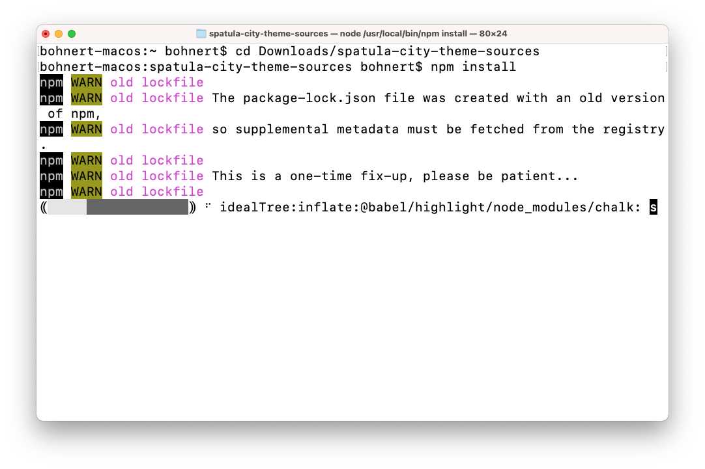

# 自定义网站主题 {#customize-the-site-theme}

了解如何构建网站主题、如何自定义以及如何使用实时AEM内容进行测试。

## 迄今为止的故事 {#story-so-far}

在AEM快速网站创建历程的上一文档中， [检索Git存储库访问信息，](retrieve-access.md) 您了解了前端开发人员用户Cloud Manager如何访问git存储库信息，您现在应该：

* 深入了解Cloud Manager的概念。
* 已检索您的凭据以访问AEM git，以便您能够提交自定义设置。

此部分历程将采取下一步骤并深入到网站主题，并向您展示如何自定义该主题，然后使用您检索的访问凭据提交这些自定义设置。

## 目标 {#objective}

本文档介绍如何构建AEM网站主题、如何对其进行自定义，以及如何使用实时AEM内容对其进行测试。 阅读后，您应该：

* 了解网站主题的基本结构以及如何对其进行编辑。
* 请参阅如何通过本地代理使用真实的AEM内容测试主题自定义设置。
* 了解如何将更改提交到AEM git存储库。

## 负责任角色 {#responsible-role}

此部分历程适用于前端开发人员。

## 了解主题结构 {#understand-theme}

将AEM管理员提供的主题提取到要编辑该主题并在首选编辑器中打开该主题的位置。


您会看到，主题是典型的前端项目。 结构中最重要的部分是：

* `src/main.ts`:JS和CSS主题的主要入口点
* `src/site`:应用于整个网站的JS和CSS文件
* `src/components`:特定于AEM组件的JS和CSS文件
* `src/resources`:静态文件，如图标、徽标和字体

>[!TIP]
>
>如果您想进一步了解标准AEM网站主题，请参阅 [其他资源](#additional-resources) 文档末尾的章节。

熟悉主题项目的结构后，请启动本地代理，以便您能够根据实际的AEM内容实时查看任何主题自定义。

## 启动本地代理 {#starting-proxy}

1. 从命令行中，导航到本地计算机上主题的根。
1. 执行 `npm install` 和npm会检索依赖项并安装项目。

   

1. 执行 `npm run live` 并启动代理服务器。

   

1. 代理服务器启动时，会自动打开浏览器 `http://localhost:7001/`. 点按或单击 **在本地登录（仅限管理员任务）** 并使用AEM管理员为您提供的代理用户凭据登录。

   

1. 登录后，请更改浏览器中的URL，以指向AEM管理员为您提供的示例内容的路径。

   * 例如，如果提供的路径是 `/content/<your-site>/en/home.html?wcmmode=disabled`
   * 您将URL更改为 `http://localhost:7001/content/<your-site>/en/home.html?wcmmode=disabled`

   

您可以导航站点以浏览内容。 网站是从实时AEM实例中实时提取的，因此您可以根据实际内容自定义主题。

## 自定义主题 {#customize-theme}

现在，您可以开始自定义主题。 以下示例简单说明了如何通过代理实时查看您所做的更改。

1. 在编辑器中，打开文件 `<your-theme-sources>/src/site/_variables.scss`

   

1. 编辑变量 `$color-background` 并将其设置为“白色”以外的值。 在本例中， `orange` 中，将使用。

   

1. 保存文件时，您会看到代理服务器通过行识别更改 `[Browsersync] File event [change]`.

   

1. 切换回代理服务器的浏览器后，更改会立即显示。

   

您可以根据AEM管理员向您提供的要求继续自定义主题。

## 提交更改 {#committing-changes}

自定义完成后，您可以将其提交到AEM git存储库。 首先，必须将存储库克隆到本地计算机。

1. 在命令行中，导航到要克隆存储库的位置。
1. 执行您的命令 [之前从Cloud Manager中检索到的。](retrieve-access.md) 它应类似于 `git clone https://git.cloudmanager.adobe.com/<my-org>/<my-program>/`. 使用git用户名和密码， [您在此历程的上一部分中进行了检索。](retrieve-access.md)

   

1. 使用类似于 `mv <site-theme-sources> <cloned-repo>`
1. 在克隆存储库的目录中，使用以下命令提交您刚刚移入的主题文件。

   ```text
   git add .
   git commit -m "Adding theme sources"
   git push
   ```

1. 自定义项会推送到AEM git存储库。

   

现在，您的自定义项可安全地存储在AEM git存储库中。

## 下一步 {#what-is-next}

现在，您已完成AEM快速网站创建历程的这一部分，接下来您应该：

* 了解网站主题的基本结构以及如何对其进行编辑。
* 请参阅如何通过本地代理使用真实的AEM内容测试主题自定义设置。
* 了解如何将更改提交到AEM git存储库。

在此知识的基础上，通过下一步审阅文档，继续您的AEM快速网站创建历程 [部署您的自定义主题，](deploy-theme.md) 您将在此处了解如何使用前端管道部署主题。

## 其他资源 {#additional-resources}

同时，建议您通过审阅文档来转到快速网站创建历程的下一部分 [部署您的自定义主题，](deploy-theme.md) 以下是一些其他可选资源，可更深入地了解本文档中提到的某些概念，但无需继续访问这些概念。

* [AEM网站主题](https://github.com/adobe/aem-site-template-standard-theme-e2e)  — 这是AEM网站主题的GitHub存储库。
* [npm](https://www.npmjs.com)  — 用于快速构建网站的AEM主题基于npm。
* [webpack](https://webpack.js.org)  — 用于快速构建网站的AEM主题依赖于webpack。