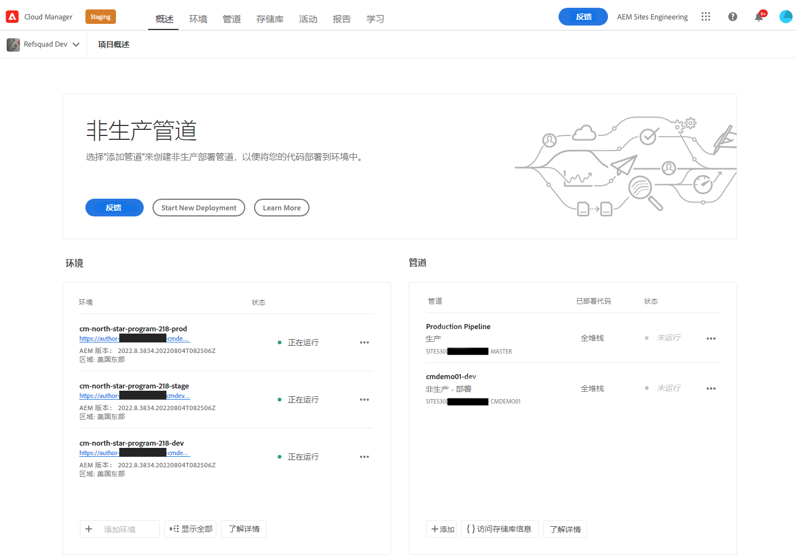
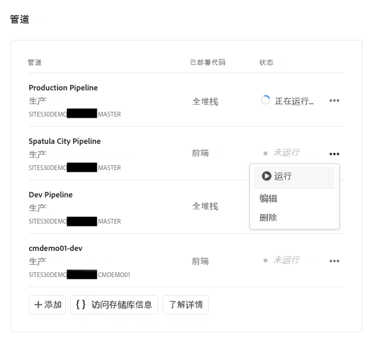
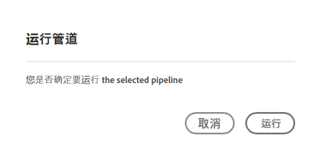
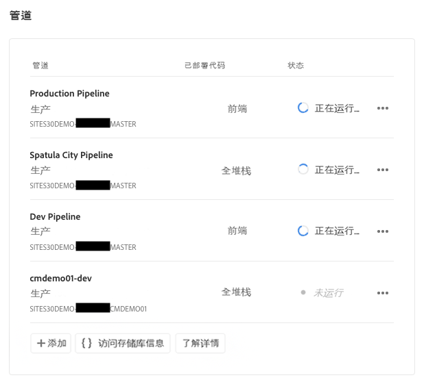
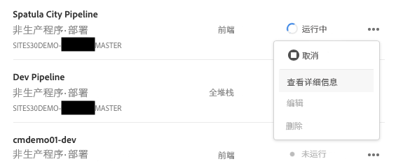
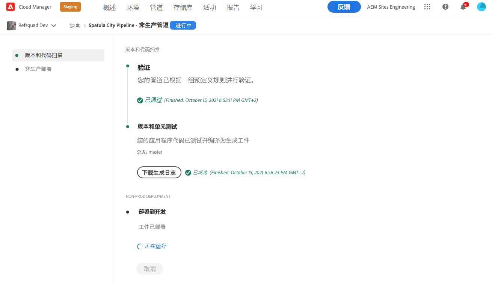

# 部署自定义主题 {#deploy-your-customized-theme}

了解如何使用管道部署站点主题。

>[!CAUTION]
>
>快速网站创建工具当前为技术预览。 它可用于测试和评估目的，并且除非与Adobe支持部门达成协议，否则不会用于生产。

## 迄今为止的故事 {#story-so-far}

在AEM快速网站创建历程的上一文档中， [自定义网站主题，](customize-theme.md) 您学习了如何构建主题、如何对其进行自定义以及如何使用实时AEM内容对其进行测试，您现在应该：

* 了解网站主题的基本结构以及如何对其进行编辑。
* 请参阅如何通过本地代理使用真实的AEM内容测试主题自定义设置。
* 了解如何将更改提交到AEM git存储库。

您现在可以采取最后一步，并使用管道来部署它们。

## 目标 {#objective}

本文档介绍如何使用管道部署主题。 阅读后，您应该：

* 了解如何触发管道部署。
* 请参阅如何检查部署状态。

## 负责任角色 {#responsible-role}

此部分历程适用于前端开发人员。

## 启动管道 {#start-pipeline}

将主题自定义更改提交到AEM git存储库后，即可运行 [管理员创建的管道](pipeline-setup.md) 以部署更改。

1. 访问Cloud Manager [与检索git访问信息时一样。](retrieve-access.md) 在 **概述** 选项卡，您将看到 **管道**.

   

1. 点按或单击您需要开始的管道旁边的省略号。 从下拉菜单中，选择 **运行**.

   

1. 在 **运行管道** 确认对话框，点按或单击 **是**.

   

1. 在管道列表中，状态列指示管道当前正在运行。

   

## 检查管道状态 {#pipeline-status}

您可以随时检查管道的状态，以查看其进度的详细信息。

1. 点按或单击管道旁边的省略号。

   

1. 管道详细信息窗口显示管道进度的划分。

   

>[!TIP]
>
>在管道详细信息窗口中，您可以点按或单击 **下载日志** ，以在任何步骤应失败时进行调试。 调试管道不在此历程的范围之内。 请参阅 [其他资源](#additional-resources) 部分。

## 验证已部署的自定义 {#view-customizations}

管道完成后，您可以通知管理员验证更改。 然后，管理员将：

1. 打开AEM创作环境。
1. 导航到 [管理员之前创建的网站。](create-site.md)
1. 编辑其中一个内容页面。
1. 查看应用的更改。

## 历程结束？ {#end-of-journey}

恭喜！ 您已完成AEM快速网站创建历程！ 您现在应该：

* 了解Cloud Manager和前端管道如何工作以管理和部署前端自定义。
* 了解如何基于模板创建AEM网站以及如何下载网站主题。
* 如何载入前端开发人员，以便他们能够访问AEM git存储库。
* 如何使用代理的AEM内容自定义和测试主题，并将这些更改提交到AEM git。
* 如何使用管道部署前端自定义。

现在，您可以自定义自己AEM网站的主题。 但是，AEM是一款功能强大的工具，还有许多其他选项可供使用。 请查看 [“其他资源”部分](#additional-resources) 以进一步了解您在此历程中看到的功能。

## 其他资源 {#additional-resources}

同时，建议您通过审阅文档来转到快速网站创建历程的下一部分 [部署您的自定义主题，](deploy-theme.md) 以下是一些其他可选资源，可更深入地了解本文档中提到的某些概念，但无需继续访问这些概念。

* [AEMas a Cloud Service技术文档](https://experienceleague.adobe.com/docs/experience-manager-cloud-service.html)  — 如果您已经对AEM有了很深的了解，则可能需要直接查阅深入的技术文档。
* [Cloud Manager文档](https://experienceleague.adobe.com/docs/experience-manager-cloud-service/onboarding/onboarding-concepts/cloud-manager-introduction.html)  — 如果您希望了解有关Cloud Manager功能的更多详细信息，则可能需要直接查阅深入的技术文档。
* [基于角色的权限](https://experienceleague.adobe.com/docs/experience-manager-cloud-manager/using/requirements/role-based-permissions.html) - Cloud Manager已预先配置了具有相应权限的角色。 有关这些角色以及如何管理这些角色的详细信息，请参阅本文档。
* [Cloud Manager存储库](/help/implementing/cloud-manager/managing-code/cloud-manager-repositories.md)  — 如果您需要有关如何为AEMaaCS项目设置和管理git存储库的更多信息，请参阅此文档。
* [配置CI/CD管线 — Cloud Services](/help/implementing/cloud-manager/configuring-pipelines/introduction-ci-cd-pipelines.md)  — 在本文档中了解有关设置完整堆栈和前端管道的更多详细信息。
* [AEM标准网站模板](https://github.com/adobe/aem-site-template-standard)  — 这是AEM Standard Site模板的GitHub存储库。
* [AEM网站主题](https://github.com/adobe/aem-site-template-standard-theme-e2e)  — 这是AEM网站主题的GitHub存储库。
* [npm](https://www.npmjs.com)  — 用于快速构建网站的AEM主题基于npm。
* [webpack](https://webpack.js.org)  — 用于快速构建网站的AEM主题依赖于webpack。
* [创建和组织页面](/help/sites-cloud/authoring/fundamentals/organizing-pages.md)  — 本指南详细介绍在从模板创建AEM网站后，如果您希望进一步对其进行自定义，则如何管理其页面。
* [如何使用包](/help/implementing/developing/tools/package-manager.md)  — 包允许导入和导出存储库内容。 本文档介绍如何在AEM 6.5中使用包，该软件包也适用于AEMaCS。
* [入门历程](/help/journey-onboarding/home.md)  — 本指南将作为您的起点，确保您的团队已设置并有权访问AEMas a Cloud Service。
* [Adobe Experience Manager Cloud Manager文档](https://experienceleague.adobe.com/docs/experience-manager-cloud-manager/using/introduction-to-cloud-manager.html?lang=zh-Hans)  — 浏览Cloud Manager文档，以获取其功能的完整详细信息。
* [站点管理文档](/help/sites-cloud/administering/site-creation/create-site.md)  — 有关快速网站创建工具功能的更多详细信息，请参阅网站创建技术文档。
