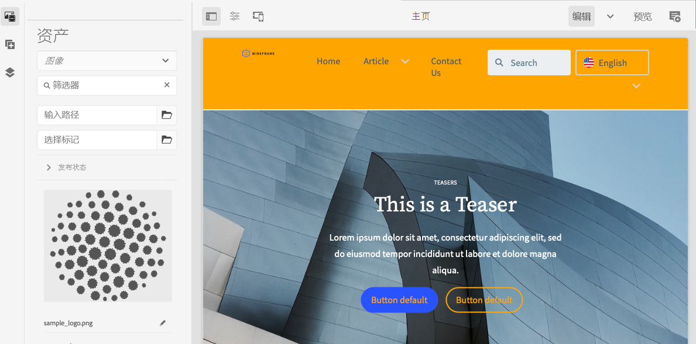

# 部署自定义主题 {#deploy-your-customized-theme}

了解如何使用管道部署站点主题。

## 迄今为止的故事 {#story-so-far}

在 AEM 快速站点创建历程的上一个文档[自定义站点主题](customize-theme.md)中，您已了解如何构建主题、如何对主题进行自定义以及如何使用实时 AEM 内容测试主题，您现在应：

* 了解站点主题的基本结构以及如何对其进行编辑。
* 了解如何通过本地代理使用实际 AEM 内容测试您的主题自定义。
* 了解如何将更改提交到 AEM Git 存储库。

您现在可以执行最后一步并使用管道来部署这些主题。

## 目标 {#objective}

本文档说明如何使用管道部署主题。阅读本文档后，您应：

* 了解如何触发管道部署。
* 了解如何检查部署状态。

## 负责角色 {#responsible-role}

此历程的这一部分适用于前端开发人员。

## 启动管道 {#start-pipeline}

在将主题自定义更改提交到 AEM Git 存储库后，您可以运行[管理员创建的管道](pipeline-setup.md)来部署更改。

1. [像检索 Git 访问信息时所做的那样](retrieve-access.md)登录 Cloud Manager，并访问您的项目。在&#x200B;**概述**&#x200B;选项卡上，您将看到&#x200B;**管道**&#x200B;的信息卡。

   

1. 点按或单击需要启动的管道旁边的省略号。从下拉菜单中选择&#x200B;**运行**。

   

1. 在&#x200B;**运行管道**&#x200B;确认对话框中，点按或单击&#x200B;**是**。

   

1. 在管道列表中，状态列指示您的管道正在运行。

   

## 检查管道状态 {#pipeline-status}

您可以随时检查管道的状态以查看其进度的详细信息。

1. 点按或单击管道旁边的省略号。

   

1. 管道详细信息窗口显示管道进度的细分。

   

>[!TIP]
>
>在管道详细信息窗口中，您可以点按或单击&#x200B;**下载日志**&#x200B;以查看管道的任意步骤以进行调试（如果任意步骤失败）。调试管道超出了此历程的范围。请参阅此页面的[其他资源](#additional-resources)部分中的适用于 Cloud Manager 的技术文档。

## 验证部署的自定义项 {#view-customizations}

管道完成后，您可以通知管理员验证更改。之后，管理员将：

1. 打开 AEM 创作环境。
1. 导航到[管理员之前创建的站点](create-site.md)。
1. 编辑某个内容页面。
1. 查看应用的更改。

## 历程结束？ {#end-of-journey}

恭喜！您已完成 AEM 快速站点创建历程！您现在应：

* 了解 Cloud Manager 和前端管道如何管理和部署前端自定义项。
* 了解如何基于模板创建 AEM 站点以及如何下载站点主题。
* 如何载入前端开发人员以便他们能够访问 AEM Git 存储库。
* 如何使用代理的 AEM 内容自定义和测试主题并将这些更改提交到 AEM Git。
* 如何使用管道部署前端自定义项。

您现在已准备好自定义自己的 AEM 站点的主题。但在您开始使用多个前端管道创建不同的工作流之前，请查看文档[使用前端管道开发站点。](/help/implementing/developing/introduction/developing-with-front-end-pipelines.md)它将通过以下方式帮助您充分利用前端开发：

* 维护单个真实来源。
* 维护关注点分离。

AEM 是一个功能强大的工具，并且提供了许多其他选项。查看[“其他资源”部分](#additional-resources)中的一些其他资源，详细了解您在此历程中看到的功能。

## 其他资源 {#additional-resources}

以下是一些附加资源，它们对本文档中提及的一些概念进行了更深入的探讨。

* [使用站点边栏管理站点主题](/help/sites-cloud/administering/site-creation/site-rail.md) – 了解站点边栏的强大功能，这可帮助您轻松自定义和管理站点主题，包括下载主题源和管理主题版本。
* [AEM as a Cloud Service 技术文档](https://experienceleague.adobe.com/docs/experience-manager-cloud-service.html) – 如果您已对 AEM 有一定的了解，则可能需要直接参阅深入的技术文档。
* [Cloud Manager 文档](https://experienceleague.adobe.com/docs/experience-manager-cloud-service/onboarding/onboarding-concepts/cloud-manager-introduction.html) – 如果您想了解有关 Cloud Manager 功能的更多详细信息，您可能需要直接参阅深入的技术文档。
* [基于角色的权限](https://experienceleague.adobe.com/docs/experience-manager-cloud-manager/using/requirements/role-based-permissions.html) – Cloud Manager 预配置了一些具有适当权限的角色。有关这些角色及其管理方式的详细信息，请参阅本文档。
* [Cloud Manager 存储库](/help/implementing/cloud-manager/managing-code/cloud-manager-repositories.md) – 如果您想详细了解如何为 AEMaaCS 项目设置和管理 Git 存储库，请参阅此文档。
* [配置 CI/CD 管道 – 云服务](/help/implementing/cloud-manager/configuring-pipelines/introduction-ci-cd-pipelines.md) – 在此文档中了解有关设置全堆栈管道和前端管道的更多详细信息。
* [AEM 标准站点模板](https://github.com/adobe/aem-site-template-standard) – 这是 AEM 标准站点模板的 GitHub 存储库。
* [AEM 站点主题](https://github.com/adobe/aem-site-template-standard-theme-e2e) – 这是 AEM 站点主题的 GitHub 存储库。
* [npm](https://www.npmjs.com) – 用于快速构建站点的 AEM 主题基于 npm。
* [webpack](https://webpack.js.org) – 用于快速构建站点的 AEM 主题依赖 webpack。
* [创建和组织页面](/help/sites-cloud/authoring/fundamentals/organizing-pages.md) – 如果您希望在从模板创建 AEM 站点后进一步对其进行自定义，可参考本指南以详细了解如何管理 AEM 站点的页面。
* [如何使用包](/help/implementing/developing/tools/package-manager.md) – 可使用包导入和导出存储库内容。本文档说明了在 AEM 6.5 中使用包的方式，此方式也适用于 AEMaaCS。
* [载入历程](/help/journey-onboarding/overview.md) – 本指南可作为您的起点，确保您的团队已建立并有权访问 AEM as a Cloud Service。
* [Adobe Experience Manager Cloud Manager 文档](https://experienceleague.adobe.com/docs/experience-manager-cloud-manager/using/introduction-to-cloud-manager.html?lang=zh-Hans) – 浏览 Cloud Manager 文档，了解其功能的完整详细信息。
* [站点管理文档](/help/sites-cloud/administering/site-creation/create-site.md) – 查看有关站点创建的技术文档，了解有关快速站点创建工具的功能的更多详细信息。
* [使用前端管道开发站点](/help/implementing/developing/introduction/developing-with-front-end-pipelines.md) – 本文档描述了一些需要注意的事项，以便使用前端管道充分发挥前端开发过程的潜力。
