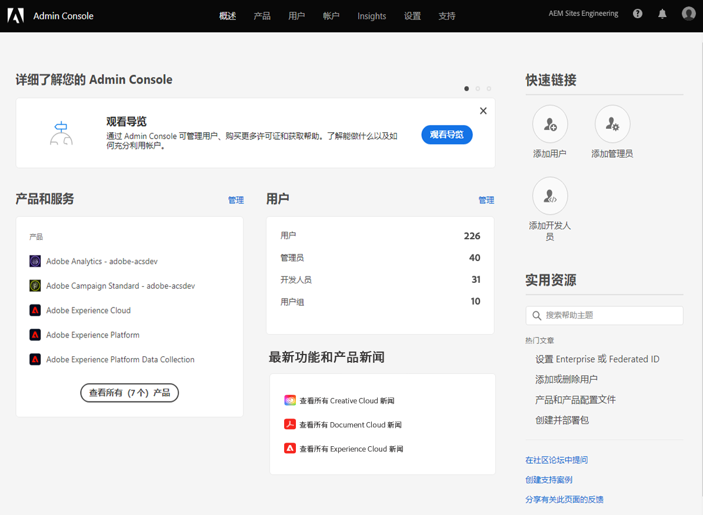
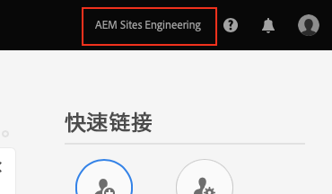
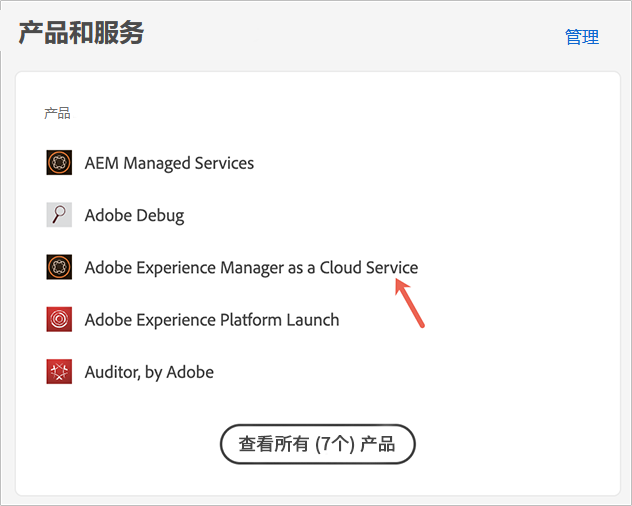
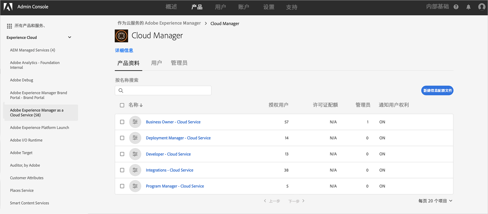
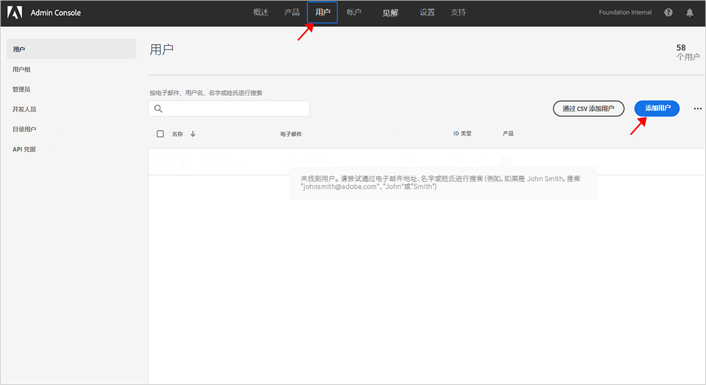
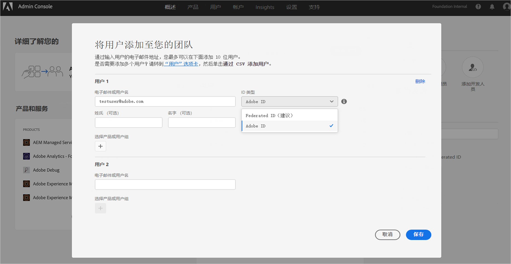
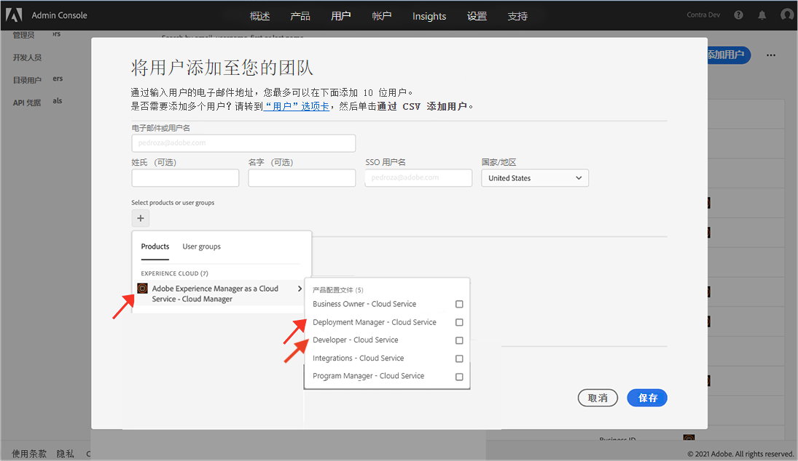

# 授予对前端开发人员的访问权限 {#grant-fed-access}

将前端开发人员载入Cloud Manager，以便他们能够访问您的AEM站点git存储库和管道。

>[!CAUTION]
>
>快速网站创建工具当前为技术预览。 它可用于测试和评估目的，并且除非与Adobe支持部门达成协议，否则不会用于生产。

## 迄今为止的故事 {#story-so-far}

在AEM快速网站创建历程的上一文档中， [设置管道，](pipeline-setup.md) 您学习了如何创建前端管道以管理网站主题的自定义，您现在应该：

* 了解前端管道是什么。
* 了解如何在Cloud Manager中设置前端管道。

现在，您需要通过载入过程向前端开发人员授予对Cloud Manager的访问权限，以便前端开发人员可以访问您创建的AEM git存储库和管道。

## 目标 {#objective}

授予对Cloud Manager的访问权限并为用户分配用户角色的过程称为入门。 本文档将概述入门前端开发人员最重要的步骤，阅读后，您将了解：

* 如何添加前端开发人员作为用户。
* 如何向前端开发人员授予所需的角色。

>[!TIP]
>
>整个文档历程都专门用于将您的团队载入AEM as a Cloud Service，该历程位于 [“其他资源”部分](#additional-resources) ，如果您需要有关该过程的其他详细信息。

## 负责任角色 {#responsible-role}

此部分历程适用于Cloud Manager管理员。

## 要求 {#requirements}

* 你必须是 **业务所有者** 角色。
* 你需要成为 **系统管理员** 在Cloud Manager中。
* 您需要拥有Admin Console的访问权限。

## 将前端开发人员添加为用户 {#add-fed-user}

首先，您需要使用Admin Console将前端开发人员添加为用户。

1. 登录Admin Console: [https://adminconsole.adobe.com/](https://adminconsole.adobe.com/).

1. 登录后，您将看到与下图类似的概述页面。

   

1. 通过检查屏幕右上角的组织名称，确保您位于相应的组织中。

   

1. 选择 **Adobe Experience Manager as a Cloud Service** 从 **产品和服务** 卡。

   

1. 您会看到预配置的Cloud Manager产品配置文件列表。 如果您看不到这些配置文件，请联系您的Cloud Manager管理员，因为您的组织中可能没有正确的权限。

   

1. 要将前端开发人员分配到正确的配置文件，请点按或单击 **用户** 选项卡，然后 **添加用户** 按钮。

   

1. 在 **将用户添加到您的团队** 框中，键入要添加用户的电子邮件ID。 对于ID类型，如果尚未设置团队成员的Federated ID，请选择Adobe ID。

   

1. 在 **产品** 选择，点按或单击加号，然后选择 **Adobe Experience Manager as a Cloud Service** 并指定 **部署管理器** 和 **开发人员** 将产品配置文件发送给用户。

   

1. 点按或单击 **保存** 随后，您作为用户添加的前端开发人员将收到一封欢迎电子邮件。

受邀的前端开发人员可以通过单击欢迎电子邮件中的链接，然后使用其Adobe ID登录来访问Cloud Manager。

## 切换到前端开发人员 {#handover}

在前往前端开发人员的过程中，您和AEM管理员会向前端开发人员发送电子邮件邀请，以便向其提供开始自定义的其余必需信息。

* A [典型内容路径](#example-page)
* 主题来源 [你下载了](#download-theme)
* 的 [代理用户凭据](#proxy-user)
* 项目的名称或指向该项目的URL [从Cloud Manager复制](pipeline-setup.md#login)
* 前端设计要求

## 下一步 {#what-is-next}

现在，您已完成AEM快速网站创建历程的这一部分，您应该知道：

* 如何添加前端开发人员作为用户。
* 如何向前端开发人员授予所需的角色。

在此知识的基础上，通过下一步审阅文档，继续您的AEM快速网站创建历程 [检索Git存储库访问信息，](retrieve-access.md) 该指南专门面向前端开发人员，并说明前端开发人员用户Cloud Manager如何访问git存储库信息。

## 其他资源 {#additional-resources}

同时，建议您通过审阅文档来转到快速网站创建历程的下一部分 [检索前端开发人员凭据，](retrieve-access.md) 以下是一些其他可选资源，可更深入地了解本文档中提到的某些概念，但无需继续访问这些概念。

* [入门历程](/help/journey-onboarding/home.md)  — 本指南将作为您的起点，确保您的团队已设置并有权访问AEMas a Cloud Service。

