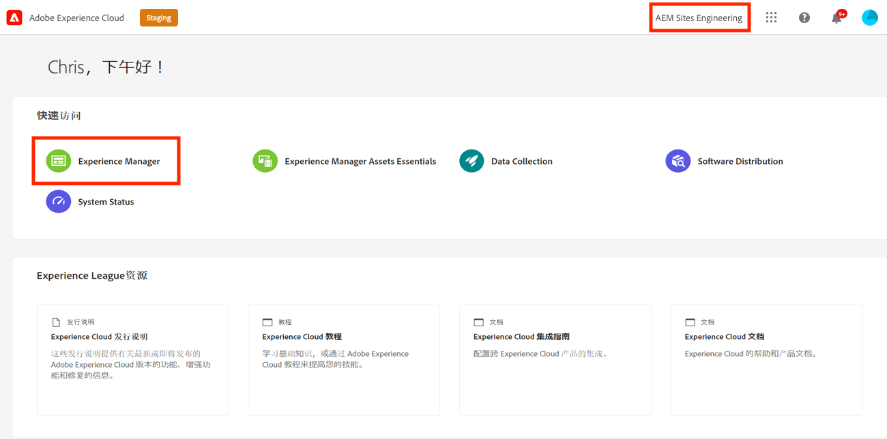
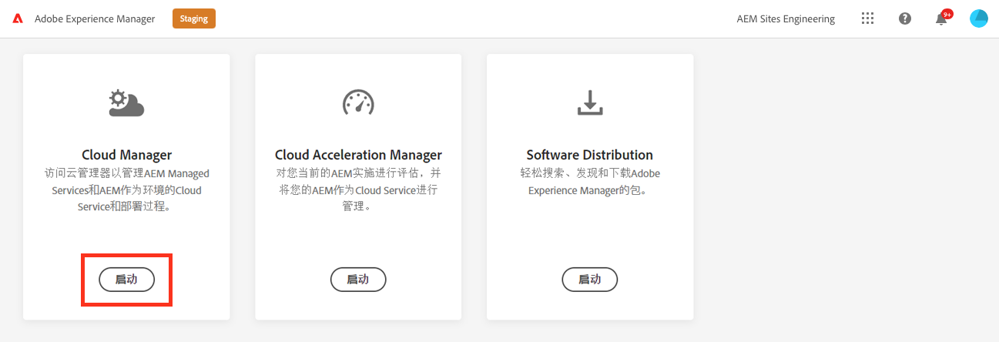

# 设置管道 {#set-up-your-pipeline}

创建前端管道以管理网站主题的自定义。

>[!CAUTION]
>
>快速网站创建工具当前为技术预览。 它可用于测试和评估目的，并且除非与Adobe支持部门达成协议，否则不会用于生产。

## 迄今为止的故事 {#story-so-far}

在AEM快速网站创建历程的上一文档中， [从模板创建网站，](create-site.md) 您学习了如何使用网站模板快速创建可使用前端工具进一步自定义的AEM网站，现在您应该：

* 了解如何获取AEM网站模板。
* 了解如何使用模板创建新站点。
* 了解如何从新站点下载模板以提供给前端开发人员。

本文基于这些基础知识，因此您可以设置前端管道，前端开发人员将在历程的稍后阶段使用该管道来部署前端自定义设置。

## 目标 {#objective}

本文档可帮助您了解前端管道以及如何创建管道以管理网站自定义主题的部署。 阅读后，您应该：

* 了解前端管道是什么。
* 了解如何在Cloud Manager中设置前端管道。

## 负责任角色 {#responsible-role}

此部分历程适用于Cloud Manager管理员。

## 要求 {#requirements}

* 您需要拥有Cloud Manager的访问权限。
* 您需要成为 **部署管理器** 角色。
* 必须在Cloud Manager中设置AEM环境的git存储库。
   * 通常，任何活动项目都已出现这种情况。 但是，如果没有，请参阅 [其他资源](#additional-resources) 中。

## 什么是前端管道 {#front-end-pipeline}

前端开发涉及自定义JavaScript、CSS和静态资源，这些资源定义AEM站点的样式。 前端开发人员将在自己的本地环境中工作，以进行这些自定义。 准备就绪后，将将更改提交到AEM git存储库。 但它们只承诺使用源代码。 他们还没有生存。

前端管道会获取这些提交的自定义设置并将它们部署到AEM环境（通常是生产环境或非生产环境）。

这样，前端开发就可以与AEM上的任何全栈后端开发分开工作，并且可以与这些开发并行工作，因为后端开发有自己的部署管道。

>[!NOTE]
>
>前端管道只能部署JavaScript、CSS和静态资源来设置您的AEM站点的样式。 无法在管道中部署网站内容（如页面或资产）。

## 访问Cloud Manager {#login}

1. 登录Adobe Experience Cloud(位于 [my.cloudmanager.adobe.com](https://my.cloudmanager.adobe.com/).

1. 登录后，通过选中屏幕右上角的组织，确保您处于正确的组织中。 如果您只是一个组织的成员，则无需执行此步骤。 然后，点按或单击 **Experience Manager**.

   

1. 在下一页，点按或单击 **Launch** 开始 **Cloud Manager** 应用程序。

   

1. 下一页列出了各种可用程序。 点按或单击要管理的。 如果您刚刚开始使用AEMas a Cloud Service，则可能只有一个可用程序。

   

您现在可以看到Cloud Manager的概述。 您的页面将有所不同，但与以下示例类似。

记下您访问或复制URL的程序的名称。 您以后需要将此内容提供给前端开发人员。

## 创建前端管线 {#create-front-end-pipeline}

现在，您已访问Cloud Manager，接下来可以创建用于前端部署的管道。

1. 在 **管道** ，点按或单击 **添加** 按钮。

   

1. 在 **添加** 按钮选择 **添加非生产管道** 用于此历程的目的。

1. 在 **配置** 选项卡 **添加非生产管道** 对话框：
   * 选择 **部署管道**.
   * 在中为管道提供一个名称 **非生产管道名称** 字段。

   

1. 点按或单击 **继续**.

1. 在 **源代码** 选项卡：
   * 选择 **前端代码** 作为要部署的代码类型。
   * 确保在 **符合条件的部署环境**.
   * 选择正确的 **存储库**.
   * 定义 **Git分支** 管道应与关联。
   * 定义 **代码位置** 如果前端开发位于选定存储库中的特定路径下。 默认值是存储库的根，但前端开发和后端通常位于不同的路径下。

   

1. 点按或单击 **保存**.

新管道将在 **管道** 的子菜单。 点按管道名称后的省略号会显示一些选项，可根据需要进一步编辑或查看详细信息。

>[!TIP]
>
>如果您已经熟悉AEMaCS中的管道，并且想要进一步了解不同类型管道之间的差异，包括有关前端管道的更多详细信息，请参阅配置CI/CD管道 — 链接在 [其他资源](#additional-resources) 部分。

## 下一步 {#what-is-next}

现在，您已完成AEM快速网站创建历程的这一部分，接下来您应该：

* 了解前端管道是什么。
* 了解如何在Cloud Manager中设置前端管道。

在此知识的基础上，通过下一步审阅文档，继续您的AEM快速网站创建历程 [授予对前端开发人员的访问权限，](grant-access.md) 在Cloud Manager中，您将前端开发人员载入Cloud Manager，以便他们能够访问您的AEM站点git存储库和管道。

## 其他资源 {#additional-resources}

同时，建议您通过审阅文档来转到快速网站创建历程的下一部分 [自定义网站主题，](customize-theme.md) 以下是一些其他可选资源，可更深入地了解本文档中提到的某些概念，但无需继续访问这些概念。

* [Cloud Manager文档](https://experienceleague.adobe.com/docs/experience-manager-cloud-service/onboarding/onboarding-concepts/cloud-manager-introduction.html)  — 如果您希望了解有关Cloud Manager功能的更多详细信息，则可能需要直接查阅深入的技术文档。
* [Cloud Manager存储库](/help/implementing/cloud-manager/managing-code/cloud-manager-repositories.md)  — 如果您需要有关如何为AEMaaCS项目设置和管理git存储库的更多信息，请参阅此文档。
* [配置CI/CD管线 — Cloud Services](/help/implementing/cloud-manager/configuring-pipelines/introduction-ci-cd-pipelines.md)  — 在本文档中了解有关设置完整堆栈和前端管道的更多详细信息。