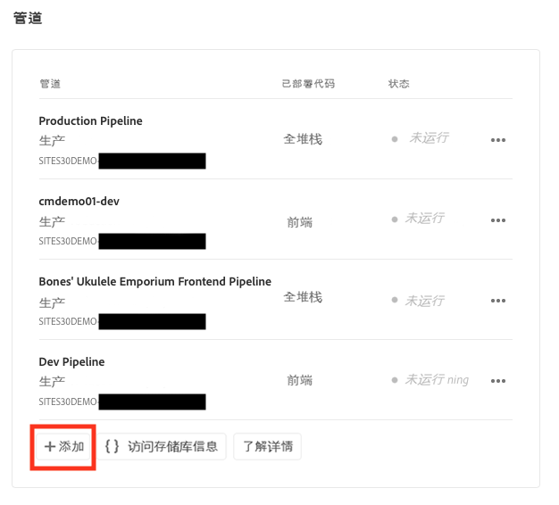
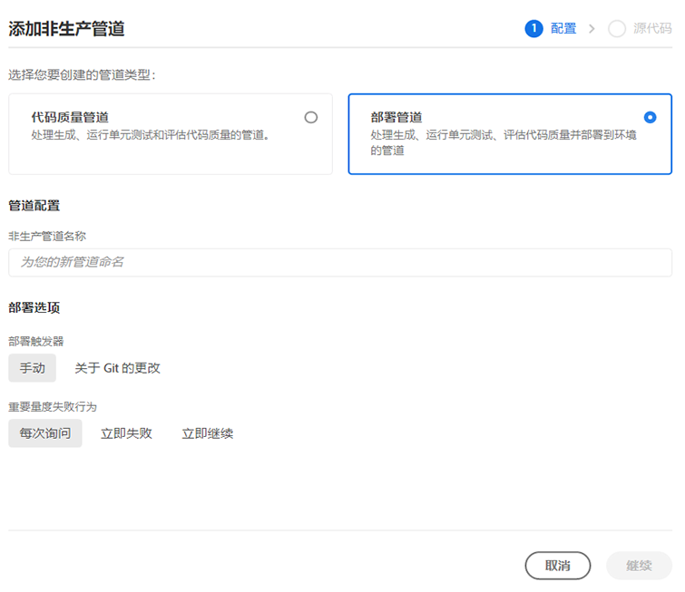
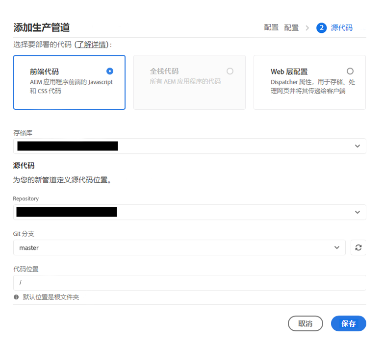
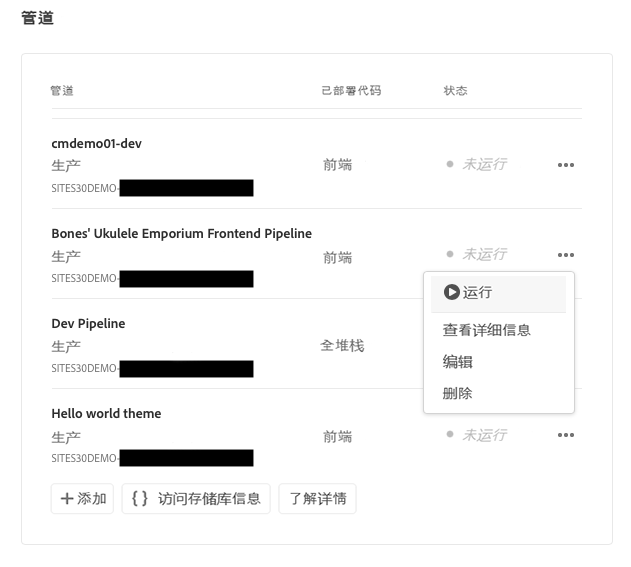

# 设置您的管道 {#set-up-your-pipeline}

创建前端管道来管理站点主题的自定义。

## 迄今为止的故事 {#story-so-far}

在 AEM 快速站点创建历程的上一个文档[从模板创建站点](create-site.md)中，您已了解如何使用站点模板快速创建可通过前端工具进行详细自定义的 AEM 站点，现在您应：

* 了解如何获取 AEM 站点模板。
* 了解如何使用模板创建新站点。
* 了解如何从新站点下载模板以提供给前端开发人员。

本文基于这些基础之上，因此您可以设置前端管道，前端开发人员在历程中稍后将使用此管道来部署前端自定义项。

## 目标 {#objective}

本文档可帮助您了解前端管道以及如何创建一个前端管道来管理站点的自定义主题的部署。阅读本文档后，您应：

* 了解什么是前端管道。
* 了解如何在 Cloud Manager 中设置前端管道。

## 负责角色 {#responsible-role}

此历程的这一部分适用于 Cloud Manager 管理员。

## 要求 {#requirements}

* 您需要具有对 Cloud Manager 的访问权限。
* 您需要成为 Cloud Manager 中的&#x200B;**部署管理器**&#x200B;角色的成员。
* 必须在 Cloud Manager 中设置 AEM 环境的 Git 存储库。
   * 对于任何活动项目，通常会是这种情况。但如果不是这种情况，请参阅[其他资源](#additional-resources)部分下提供的 Cloud Manager 存储库文档。

## 什么是前端管道 {#front-end-pipeline}

前端开发涉及定义 AEM 站点样式的 JavaScript、CSS 和静态资源的自定义。前端开发人员将在他们的本地环境中工作，进行这些自定义设置。准备就绪后，更改将提交到 AEM Git 存储库。但它们只能提交到源代码， 因为它们处于非活动状态。

前端管道采用这些已提交的自定义项并将其部署到 AEM 环境（通常是生产环境或非生产环境）中。

通过这种方式，前端开发可以与拥有自己的部署管道的 AEM 上的任何全栈后端开发分开和并行工作。

>[!NOTE]
>
>前端管道只能部署 JavaScript、CSS 和静态资源来设置 AEM 站点的样式。无法在管道中部署页面或资产等站点内容。

## 访问 Cloud Manager {#login}

1. 登录 Adobe Cloud Manager，网址为 [my.cloudmanager.adobe.com](https://my.cloudmanager.adobe.com/)。

1. Cloud Manager 列出了可用的各种项目。点按或单击要管理的某个项目。如果您刚开始使用 AEM as a Cloud Service，则可能只有一个可用项目。

   

您现在可以看到您的项目概述。您的页面的外观会有所不同，但与此示例相似。

记下您已访问的项目的名称或复制 URL。稍后您需要将它提供给前端开发人员。

## 创建前端管道 {#create-front-end-pipeline}

现在您已访问 Cloud Manager，可以为前端部署创建管道。

1. 在 Cloud Manager 页面的&#x200B;**管道**&#x200B;分区中，点按或单击&#x200B;**添加**&#x200B;按钮。

   

1. 在&#x200B;**添加**&#x200B;按钮下方显示的弹出菜单中，为此历程选择&#x200B;**添加非生产管道**。

1. 在打开的&#x200B;**添加非生产管道**&#x200B;对话框的&#x200B;**配置**&#x200B;选项卡上：
   * 选择&#x200B;**部署管道**。
   * 在&#x200B;**非生产管道名称**&#x200B;字段中提供带名称的管道。

   

1. 点按或单击&#x200B;**继续**。

1. 在&#x200B;**源代码**&#x200B;选项卡上：
   * 选择&#x200B;**前端代码**&#x200B;作为要部署的代码类型。
   * 确保在&#x200B;**符合条件的部署环境**&#x200B;下选择正确的环境。
   * 选择正确的&#x200B;**存储库**。
   * 定义管道应关联到的 **Git 分支**。
   * 定义&#x200B;**代码位置**（如果前端开发位于所选存储库中的特定路径下）。默认值是存储库的根，但通常前端开发和后端将位于不同的路径下。

   

1. 点按或单击&#x200B;**保存**。

在 Cloud Manager 窗口的&#x200B;**管道**&#x200B;分区中创建和显示新管道。点按或单击管道名称后的省略号会显示选项，以便根据需要进一步编辑或查看详细信息。

>[!TIP]
>
>如果您已熟悉 AEMaaCS 中的管道并希望详细了解不同类型管道之间的差异，包括有关前端管道的更多详细信息，请参阅以下[其他资源](#additional-resources)部分中链接的“配置 CI/CD 管道 – 云服务”。

## 下一步 {#what-is-next}

现在您已完成 AEM 快速站点创建历程的这一部分，您应：

* 了解什么是前端管道。
* 了解如何在 Cloud Manager 中设置前端管道。

在此知识的基础上继续您的 AEM 快速站点创建历程，接下来查看文档[向前端开发人员授予访问权限](grant-access.md)，其中您会将前端开发人员加入 Cloud Manager，以便他们有权访问您的 AEM 站点 Git 存储库和管道。

## 其他资源 {#additional-resources}

我们建议您查看文档[自定义站点主题](customize-theme.md)来继续快速站点创建历程的下一部分，以下是一些其他可选资源，这些资源对本文档中提到的一些概念进行了更深入的探究，但并非继续此历程所必需的。

* [Cloud Manager 文档](https://experienceleague.adobe.com/docs/experience-manager-cloud-service/onboarding/onboarding-concepts/cloud-manager-introduction.html) – 如果您想了解有关 Cloud Manager 功能的更多详细信息，您可能需要直接参阅深入的技术文档。
* [Cloud Manager 存储库](/help/implementing/cloud-manager/managing-code/cloud-manager-repositories.md) – 如果您想详细了解如何为 AEMaaCS 项目设置和管理 Git 存储库，请参阅此文档。
* [配置 CI/CD 管道 – 云服务](/help/implementing/cloud-manager/configuring-pipelines/introduction-ci-cd-pipelines.md) – 在此文档中了解有关设置全堆栈管道和前端管道的更多详细信息。
