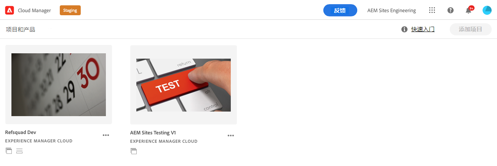

# 检索 Git 存储库访问信息 {#retrieve-access}

了解前端开发人员如何使用 Cloud Manager 访问 Git 存储库信息。

## 迄今为止的故事 {#story-so-far}

如果您是只负责站点主题自定义的前端开发人员，则无需了解 AEM 的设置方式，可以直接跳至本文档的[目标](#objective)部分。

如果您还担任 Cloud Manager 或 AEM 管理员以及前端开发人员的角色，您已在 AEM 快速站点创建历程的上一个文档[向前端开发人员授予访问权限](grant-access.md)中了解如何载入前端开发人员，以便他们能够访问 Git 存储库，现在应知道：

* 如何将前端开发人员添加为用户。
* 如何向前端开发人员授予所需的角色。

本文接下来介绍了前端开发人员如何使用 Cloud Manager 访问权限来检索凭据以访问 AEM Git 存储库。

现在已基于模板创建一个站点，设置了一个管道，前端开发人员已载入并拥有他们所需的一切信息，本文将从管理员的视角转向前端开发人员角色的视角。

## 目标 {#objective}

本文档说明您如何以前端开发人员角色访问 Cloud Manager 并检索 AEM Git 存储库的访问凭据。阅读本文档后，您将：

* 从较高层面了解什么是 Cloud Manager。
* 已检索您的凭据来访问 AEM Git，以便您能提交自定义项。

## 负责角色 {#responsible-role}

此历程的这一部分适用于前端开发人员。

## 要求 {#requirements}

利用快速站点创建工具，前端开发人员可以独立工作，而无需了解 AEM 或其设置方式。但是，Cloud Manager 管理员必须将前端开发人员载入项目团队，并且 AEM 管理员必须为您提供一些必需的信息。在继续之前，请确保您拥有以下信息。

* AEM 管理员提供：
   * 要自定义的主题源文件
   * 用作参考基础的示例页面的路径
   * 用于针对实时 AEM 内容测试自定义项的代理用户凭据
   * 前端设计要求
* Cloud Manager 管理员提供：
   * 来自 Cloud Manager 的欢迎电子邮件，为您提供了访问信息
   * Cloud Manager 中的项目的名称或 URL

如果您缺少这些项目中的任何一项，请联系 AEM 管理员或 Cloud Manager 管理员。

假设前端开发人员在前端开发工作流以及安装的常用工具方面具有丰富的经验，包括：

* git
* npm
* webpack
* 首选编辑器

## 了解 Cloud Manager {#understanding-cloud-manager}

Cloud Manager 使组织能够在云中自行管理 AEM。它包含一个持续集成和持续交付 (CI/CD) 框架，使 IT 团队和实施合作伙伴能够在不影响性能或安全性的情况下快速交付自定义或更新。

对于前端开发人员来说，它是实现以下目标的途径：

* 访问 AEM Git 存储库信息，以便您能提交前端自定义项。
* 启动部署管道，部署您的自定义项。

Cloud Manager 管理员会将您作为 Cloud Manager 用户载入。您应该已收到类似于以下内容的欢迎电子邮件。

如果您没有收到此电子邮件，请联系 Cloud Manager 管理员。

## 访问 Cloud Manager {#access-cloud-manager}

1. 在 [my.cloudmanager.adobe.com](https://my.cloudmanager.adobe.com/) 上登录 Adobe Experience Cloud，或单击欢迎电子邮件中提供的链接。

1. Cloud Manager 列出了可用的各种项目。点按或单击 Cloud Manager 管理员提供的您需要访问的项目。如果这是您的第一个 AEMaaCS 前端项目，则您可能只有一个可用项目。

   

您现在可以看到您的项目概述。您的页面的外观会有所不同，但与此示例相似。

## 检索存储库访问信息 {#repo-access}

1. 在 Cloud Manager 页面的&#x200B;**管道**&#x200B;部分中，点按或单击&#x200B;**访问存储库信息**&#x200B;按钮。

   

1. 这将打开&#x200B;**存储库信息**&#x200B;对话框。

   

1. 点按或单击&#x200B;**生成密码**&#x200B;按钮以自行创建密码。

1. 将生成的密码保存到安全密码管理器。此密码将永不再显示。

1. 此外，复制&#x200B;**用户名**&#x200B;和 **Git 命令行**&#x200B;字段。稍后您将使用此信息来访问存储库。

1. 点按或单击&#x200B;**关闭**。

## 下一步 {#what-is-next}

现在您已完成 AEM 快速站点创建历程的这一部分，您应：

* 从较高层面了解什么是 Cloud Manager。
* 已检索您的凭据来访问 AEM Git，以便您能提交自定义项。

在此知识的基础上继续您的 AEM 快速站点创建历程，接下来查看文档[自定义站点主题](customize-theme.md)，其中您将了解如何使用实时 AEM 内容构建、自定义和测试站点主题。

## 其他资源 {#additional-resources}

我们建议您查看文档[自定义站点主题](customize-theme.md)来继续快速站点创建历程的下一部分，以下是一些其他可选资源，这些资源对本文档中提到的一些概念进行了更深入的探究，但并非继续此历程所必需的。

* [Adobe Experience Manager Cloud Manager 文档](https://experienceleague.adobe.com/docs/experience-manager-cloud-manager/using/introduction-to-cloud-manager.html?lang=zh-Hans) – 浏览 Cloud Manager 文档，了解其功能的完整详细信息。
