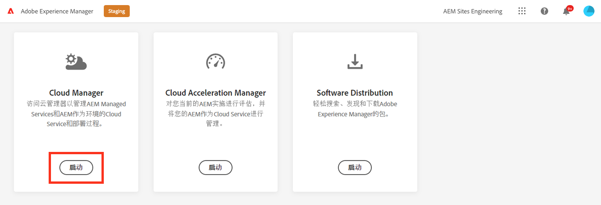
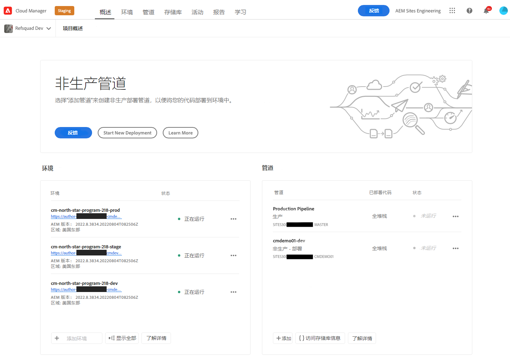

# 检索Git存储库访问信息 {#retrieve-access}

了解前端开发人员如何使用Cloud Manager访问git存储库信息。

>[!CAUTION]
>
>快速网站创建工具当前为技术预览。 它可用于测试和评估目的，并且除非与Adobe支持部门达成协议，否则不会用于生产。

## 迄今为止的故事 {#story-so-far}

如果您是仅负责自定义网站主题的前端开发人员，则无需了解AEM的设置方式，即可跳转到 [目标](#objective) 文档的部分。

如果您还担任Cloud Manager或AEM管理员以及前端开发人员的角色，则您在AEM快速网站创建历程的上一文档中了解到， [授予对前端开发人员的访问权限，](grant-access.md) 如何载入前端开发人员，以便他们能够访问git存储库，您现在应该知道：

* 如何添加前端开发人员作为用户。
* 如何向前端开发人员授予所需的角色。

本文将进行下一步，显示前端开发人员如何使用Cloud Manager访问权限检索凭据以访问AEM git存储库。

现在，已有一个基于模板创建的站点，已设置管道，前端开发人员已载入并拥有他们所需的所有信息，因此本文将视角从管理员转移到前端开发人员角色。

## 目标 {#objective}

本文档介绍您如何以前端开发人员的角色访问Cloud Manager并检索对AEM git存储库的访问凭据。 阅读后，您将：

* 深入了解Cloud Manager的概念。
* 已检索您的凭据以访问AEM git，以便您能够提交自定义设置。

## 负责任角色 {#responsible-role}

此部分历程适用于前端开发人员。

## 要求 {#requirements}

“快速站点创建”工具允许前端开发人员在不了解AEM或其设置情况的情况下独立工作。 但是，Cloud Manager管理员必须将前端开发人员载入项目团队，并且AEM管理员必须向您提供一些必需的信息。 在继续操作之前，请确保您具有以下信息。

* AEM管理员：
   * 要自定义的主题源文件
   * 用作引用基础的示例页面的路径
   * 用于针对实时AEM内容测试自定义设置的代理用户凭据
   * 前端设计要求
* Cloud Manager管理员提供：
   * Cloud Manager发送的欢迎电子邮件，通知您有权访问
   * 程序的名称或Cloud Manager中指向该程序的URL

如果您缺少其中的任何项目，请联系AEM管理员或Cloud Manager管理员。

我们假定前端开发人员在前端开发工作流程以及安装的常用工具方面拥有丰富的经验，包括：

* git
* npm
* webpack
* 首选编辑器

## 了解Cloud Manager {#understanding-cloud-manager}

Cloud Manager允许组织在云中自行管理AEM。 它包含一个持续集成和持续交付 (CI/CD) 框架，使 IT 团队和实施合作伙伴能够在不影响性能或安全性的情况下快速交付自定义或更新。

对于前端开发人员，它是访问以下内容的网关：

* 访问AEM git存储库信息，以便能够提交前端自定义设置。
* 启动部署管道以部署自定义设置。

Cloud Manager管理员将以Cloud Manager用户的身份载入您。 您应该收到类似于以下内容的欢迎电子邮件。

如果您尚未收到此电子邮件，请联系Cloud Manager管理员。

## 访问Cloud Manager {#access-cloud-manager}

1. 登录Adobe Experience Cloud(位于 [my.cloudmanager.adobe.com](https://my.cloudmanager.adobe.com/) 或单击欢迎电子邮件中提供的链接。

1. 登录后，通过选中屏幕右上角的组织，确保您处于正确的组织中。 如果您只是一个组织的成员，则无需执行此步骤。 然后，点按或单击 **Experience Manager**.

   

1. 在下一页，点按或单击 **Launch** 按钮 **Cloud Manager** 应用程序。

   

1. 下一页列出了各种可用程序。 点按或单击Cloud Manager管理员提供的您需要访问的页面。 如果这是您的AEMaaCS的第一个前端项目，则您可能只有一个项目可用。

   

您现在可以看到Cloud Manager的概述。 您的页面将有所不同，但与以下示例类似。

## 检索存储库访问信息 {#repo-access}

1. 在 **管道** ，点按或单击 **访问存储库信息** 按钮。

   

1. 的 **存储库信息** 对话框。

   

1. 点按或单击 **生成密码** 按钮为自己创建密码。

1. 将生成的密码保存到安全密码管理器。 密码将不再显示。

1. 另请复制 **用户名** 和 **Git命令行** 字段。 您稍后将使用此信息访问存储库。

1. 点按或单击 **关闭**.

## 下一步 {#what-is-next}

现在，您已完成AEM快速网站创建历程的这一部分，接下来您应该：

* 深入了解Cloud Manager的概念。
* 已检索您的凭据以访问AEM git，以便您能够提交自定义设置。

在此知识的基础上，通过下一步审阅文档，继续您的AEM快速网站创建历程 [自定义网站主题，](customize-theme.md) 您将在何处了解如何构建网站主题、如何自定义以及如何使用实时AEM内容进行测试。

## 其他资源 {#additional-resources}

同时，建议您通过审阅文档来转到快速网站创建历程的下一部分 [自定义网站主题，](customize-theme.md) 以下是一些其他可选资源，可更深入地了解本文档中提到的某些概念，但无需继续访问这些概念。

* [Adobe Experience Manager Cloud Manager文档](https://experienceleague.adobe.com/docs/experience-manager-cloud-manager/using/introduction-to-cloud-manager.html?lang=zh-Hans)  — 浏览Cloud Manager文档，以获取其功能的完整详细信息。
