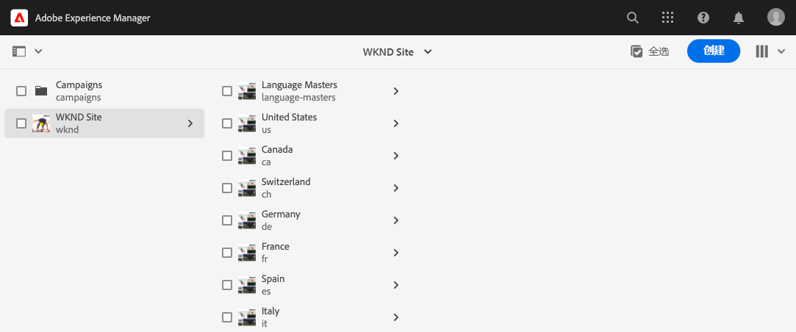
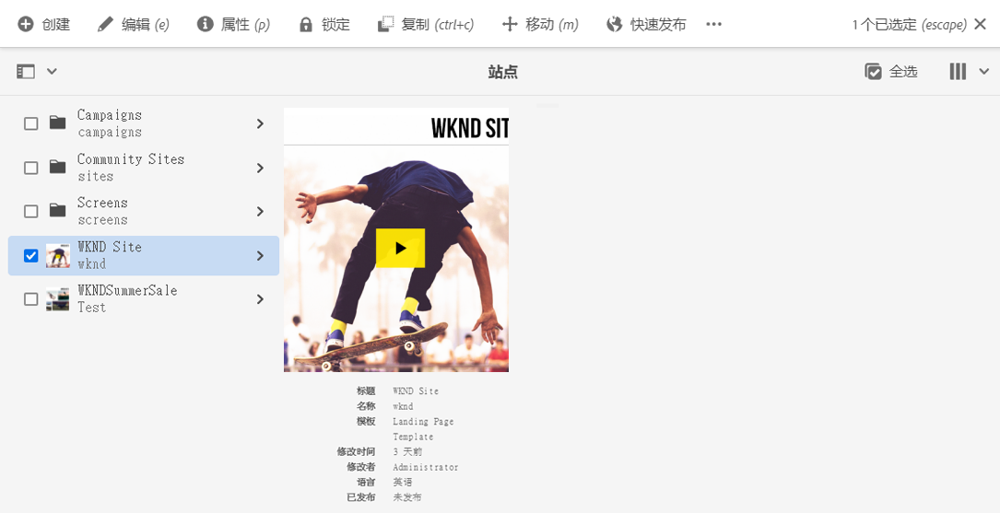
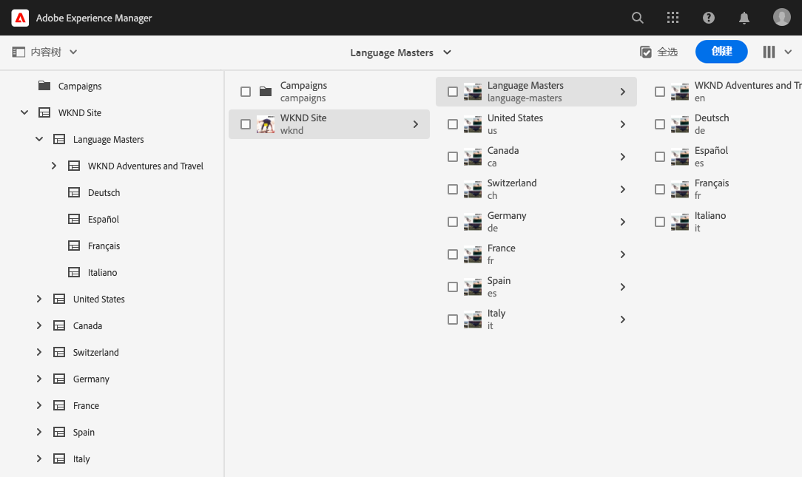
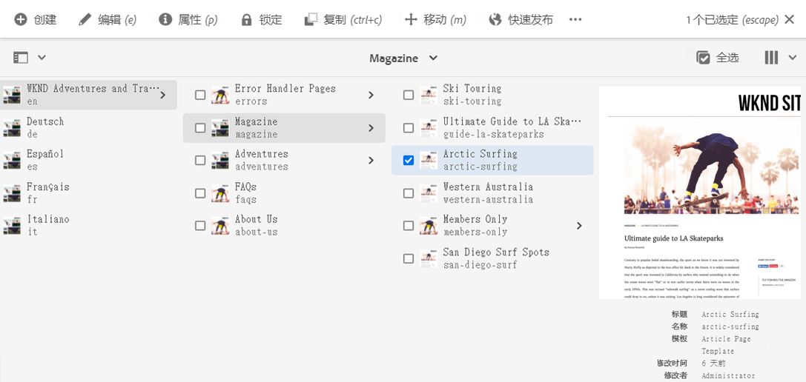
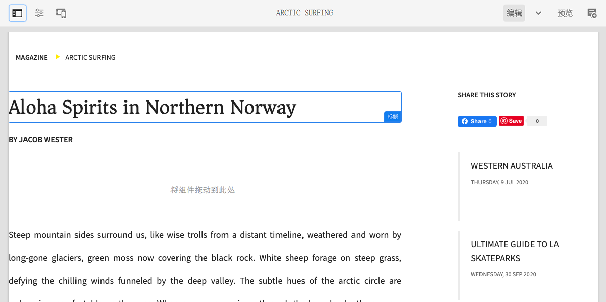

# AEM Sites 翻译快速入门 {#getting-started}

了解如何梳理您的 AEM Sites 内容以及 AEM 的翻译工具的工作原理。

## 迄今为止的故事 {#story-so-far}

在 AEM Sites 翻译历程的上一个文档[了解 AEM Sites 内容以及如何在 AEM 中进行翻译](learn-about.md)中，您学习了 AEM Sites 的基本理论，现在应：

* 了解 AEM Sites 内容创建的基本概念。
* 熟悉 AEM 支持翻译的方式。

本文基于这些基础知识之上，以便您了解 AEM 如何存储和管理内容以及您如何使用 AEM 的翻译工具来翻译该内容。

## 目标 {#objective}

本文档可帮助您了解如何开始在 AEM 中翻译站点内容。阅读本文档后，您应：

* 了解内容结构对翻译的重要性。
* 了解 AEM 如何存储内容。
* 熟悉 AEM 的翻译工具。

## 要求和先决条件 {#requirements-prerequisites}

在开始翻译 AEM 内容之前，需要满足许多要求。

### 知识 {#knowledge}

* 在 CMS 中翻译内容的经验
* 在使用大型 CMS 的基本功能方面的经验
* 具有 AEM 基本操作的应用知识
* 了解您正在使用的翻译服务
* 基本理解正在翻译的内容

>[!TIP]
>
>如果您不能熟练使用 AEM 等大型 CMS，请考虑先查看[基本操作](/help/sites-cloud/authoring/getting-started/basic-handling.md)文档，然后再继续。“基本操作”文档不是历程的一部分，因此，请在完成后返回此页面。

### 工具 {#tools}

* 用于测试翻译内容的沙盒访问
* 用于连接到您的首选翻译服务的凭据
* 成为 AEM 中的 `project-administrators` 组的成员

## AEM 存储内容的方式 {#content-in-aem}

对于翻译专家来说，深入了解 AEM 管理内容的方式并不重要。但是，在您以后使用 AEM 的翻译工具时，熟悉基本概念和术语会很有帮助。最重要的是，您需要了解自己的内容及其结构，以便有效地翻译该内容。

### 站点控制台 {#sites-console}

站点控制台提供了内容结构的概览，可让您通过创建新页面、移动并复制页面以及发布内容来轻松浏览和管理内容。

要访问站点控制台，请执行以下操作：

1. 在全局导航菜单中，单击或点按&#x200B;**导航** -> **站点**。
1. 站点控制台将打开以显示内容的顶层。
1. 确保使用窗口右上方的视图选择器来选择&#x200B;**列视图**。

   

1. 通过点按或单击列中的项目，它会在右侧列的层次结构中显示其下方的内容。

   

1. 通过点按或单击列中某个项目的复选框，它会选择该项目并在右侧列中显示所选项目的详细信息，以及在上面的工具栏中显示许多可用于所选项目的操作。

   

1. 通过点按或单击左上方的边栏选择器，您还可以显示内容树概览的&#x200B;**内容树**&#x200B;视图。

   

通过使用这些简单工具，您可以直观地浏览您的内容结构。

>[!NOTE]
>
>内容架构师通常会定义内容结构，内容作者会在该结构中创建内容。
>
>作为翻译专家，重要的是要了解如何浏览该结构以及内容所在的位置。

### 页面编辑器 {#page-editor}

站点控制台可让您浏览内容并提供其结构的概述。要查看单个页面的详细信息，您需要使用站点编辑器。

要编辑页面，请执行以下操作：

1. 使用站点控制台查找并选择页面。请记住，您需要点按或单击单个页面的复选框才能将其选定。

   

1. 点按工具栏中的&#x200B;**编辑**&#x200B;选项。
1. 站点编辑器将打开，并加载所选页面以在新的浏览器选项卡中进行编辑。
1. 将鼠标指针悬停在内容上方或点按内容将显示各个组件的选择器。组件是构成页面的拖放构建基块。

   

您可以随时通过在浏览器中切换回该选项卡来返回站点控制台。利用站点编辑器，您可以快速查看页面内容，因为内容作者和您的受众将看到该页面。

>[!NOTE]
>
>内容作者使用站点编辑器创建您的站点内容。
>
>作为翻译专家，请务必了解如何使用站点编辑器查看该内容的详细信息。

## 结构是关键所在 {#content-structure}

AEM 的内容由其结构驱动。AEM 对内容结构的要求很少，但在项目规划中仔细考虑您的内容层次结构会让翻译变得更轻松。

>[!TIP]
>
>在 AEM 项目的一开始就规划翻译。尽早与项目经理和内容架构师密切合作。
>
>国际化项目经理可能需为一个单独的角色，其职责是定义应翻译的内容、不应翻译的内容以及哪些已翻译内容可由区域或本地内容制作者修改。

## 建议的内容结构 {#recommended-structure}

按照之前的建议，与您的内容架构师协作，确定适合您项目的内容结构。但是，以下是经验证的、简单且直观的结构，此结构非常有效。

在 `/content` 下定义项目的基本文件夹。

```text
/content/<your-project>
```

用于创作内容的语言称为语言根。在我们的示例中，语言根为英语，并且应位于此路径的下方。

```text
/content/<your-project>/en
```

应将所有可能需要本地化的项目内容置于语言根下。

```text
/content/<your-project>/en/<your-project-content>
```

应将翻译创建为语言根旁边的同级文件夹，其文件夹名称代表该语言的 ISO-2 语言代码。例如，德语将具有以下路径。

```text
/content/<your-project>/de
```

>[!NOTE]
>
>内容架构师通常负责创建这些语言文件夹。如果未创建这些语言文件夹，AEM 以后将无法创建翻译作业。

最终结构可能如下所示。

```text
/content
    |- your-project
        |- en
            |- some
            |- exciting
            |- sites
            |- content
        |- de
        |- fr
        |- it
        |- ...
    |- another-project
    |- ...
```

您应记下内容的特定路径，因为稍后需要使用此路径来配置翻译。

>[!NOTE]
>
>一般来说，内容架构师负责定义内容结构，并且经常与翻译专家合作。
>
>为了完整起见，这里进行了详细说明。

## AEM 翻译工具 {#translation-tools}

现在，您已了解站点控制台和编辑器以及内容结构的重要性，我们可以来看看如何翻译内容。AEM 中的翻译工具非常强大，这些工具从高层次上更易于理解。

* **翻译连接器** – 此连接器旨在将 AEM 与您使用的翻译服务联系起来。
* **翻译规则** – 规则定义了特定路径下的应翻译的内容。
* **翻译项目** – 翻译项目收集应作为单个翻译工作处理的内容并跟踪翻译进度，与连接器连接以传输要翻译的内容并重新从翻译服务接收此内容。

您通常只为每个项目的实例和规则设置一次连接器。之后，您可以使用翻译项目来翻译内容并不断更新其翻译。

## 下一步 {#what-is-next}

现在您已完成 AEM Sites 翻译历程的这一部分，您应：

* 了解内容结构对翻译的重要性。
* 了解 AEM 如何存储内容。
* 熟悉 AEM 的翻译工具。

在此知识的基础上继续您的 AEM Sites 翻译历程，接下来查看文档[配置翻译连接器](configure-connector.md)，了解如何将 AEM 连接到翻译服务。|

## 其他资源 {#additional-resources}

我们建议您查看文档[配置翻译连接器](configure-connector.md)来继续翻译历程的下一部分，以下是一些其他可选资源，这些资源对本文档中提到的一些概念进行了更深入的探究，但并非继续此历程所必需的。

* [AEM 基本操作](/help/sites-cloud/authoring/getting-started/basic-handling.md) – 了解 AEM UI 的基础知识，以便能够舒适地导航和执行基本任务，例如查找内容。
* [标识要翻译的内容](/help/sites-cloud/administering/translation/rules.md) – 了解翻译规则如何标识需要翻译的内容。
* [配置翻译集成框架](/help/sites-cloud/administering/translation/integration-framework.md) – 了解如何配置翻译集成框架以与第三方翻译服务集成。
* [管理翻译项目](/help/sites-cloud/administering/translation/managing-projects.md) – 了解如何在 AEM 中创建和管理机器翻译项目和人工翻译项目。
