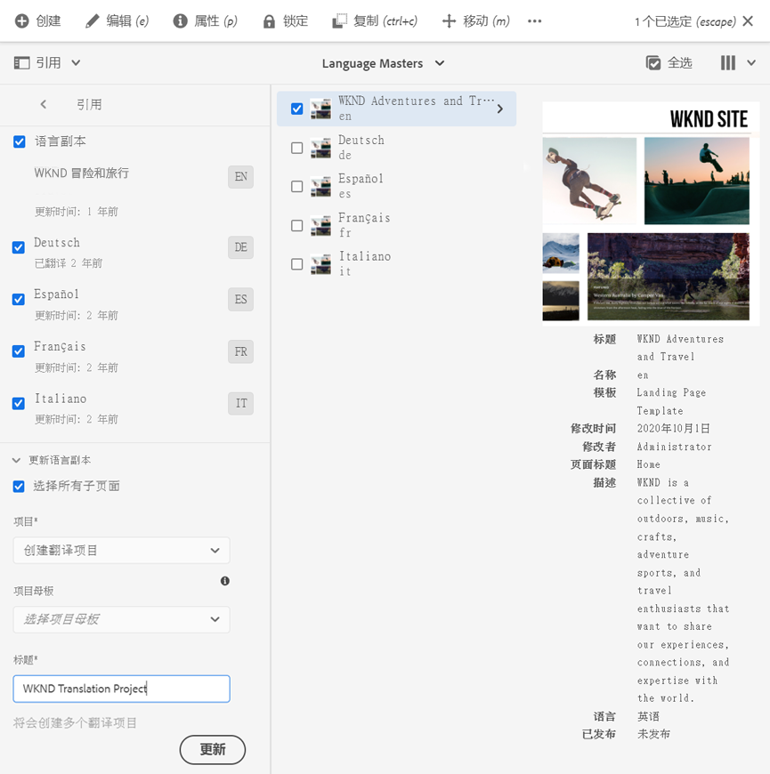
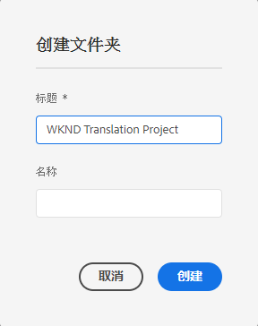
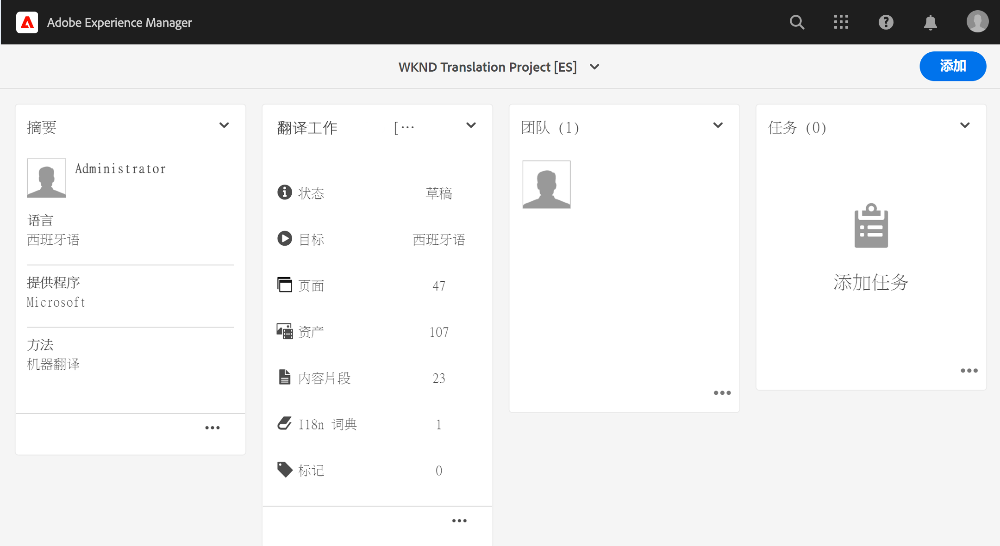
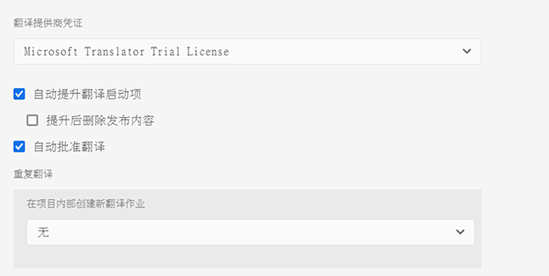
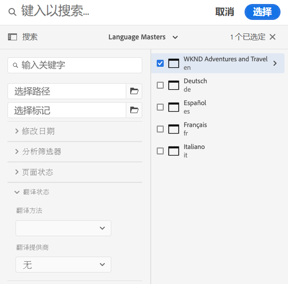
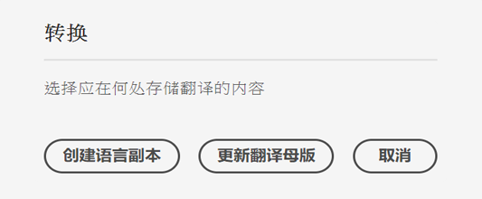
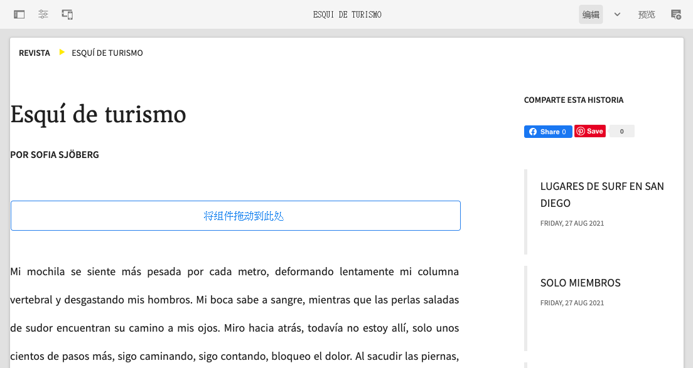
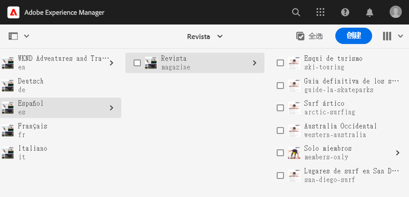

# 翻译内容 {#translate-content}

使用翻译连接器和规则来翻译内容。

## 迄今为止的故事 {#story-so-far}

在 AEM Sites 翻译历程的上一个文档[配置翻译规则](translation-rules.md)中，您已了解如何使用 AEM 的翻译规则来标识翻译内容。您现在应：

* 了解翻译规则的用途。
* 能够定义您自己的翻译规则。

现在您的连接器和翻译规则已设置完毕，本文将引导您完成下一步，即翻译 AEM Sites 内容。

## 目标 {#objective}

本文档可帮助您了解如何使用 AEM 的翻译项目以及连接器和翻译规则来翻译内容。阅读本文档后，您应：

* 了解什么是翻译项目。
* 能够创建新的翻译项目。
* 使用翻译项目来翻译 AEM Sites 内容。

## 创建翻译项目 {#creating-translation-project}

翻译项目可让您管理 AEM 内容的翻译。翻译项目将要翻译的内容收集到一个位置，以便集中查看翻译工作。

在将内容添加到翻译项目时，将为其创建翻译作业。作业提供用于管理对资源执行的人工翻译和机器翻译工作流的命令和状态信息。

可通过两种方法创建翻译项目：

1. 选择内容的语言根并让 AEM 根据内容路径自动创建翻译项目。
1. 创建一个空项目并手动选择要添加到翻译项目的内容

两者都是有效的方法，通常只因执行翻译的角色而异：

* 翻译项目经理 (TPM) 通常需要灵活地手动选择要添加到翻译项目的内容。
* 如果内容所有者还负责翻译，则让 AEM 根据所选内容路径自动创建项目通常更轻松。

以下部分中将探讨这两种方法。

### 根据内容路径自动创建翻译项目 {#automatically-creating}

对于还负责翻译的内容所有者，让 AEM 自动创建翻译项目通常更轻松。要让 AEM 根据内容路径自动创建翻译项目，请执行以下操作：

1. 导航到&#x200B;**导航** -> **站点**，然后点按或单击您的项目。
1. 找到项目的语言根。例如，如果语言根是英语，则为 `/content/<your-project>/en`。
   * 请注意，在第一次翻译之前，其他语言文件夹是空占位符。它们通常由内容架构师创建。
1. 找到项目的语言根。
1. 点按或单击边栏选择器，这将显示&#x200B;**引用**&#x200B;面板。
1. 点按或单击&#x200B;**语言副本**。
1. 选中&#x200B;**语言副本**&#x200B;复选框。
1. 展开“引用”面板底部的&#x200B;**更新语言副本**&#x200B;部分。
1. 在&#x200B;**项目**&#x200B;下拉列表中，选择&#x200B;**创建翻译项目**。
1. 为翻译项目提供适当的标题。
1. 点按或单击&#x200B;**更新**。



您会收到一条指示项目已创建的消息。

>[!NOTE]
>
>假定已创建翻译语言的必要语言结构作为[内容结构定义的一部分。](getting-started.md#content-structure)应与内容架构师协作来完成此操作。
>
>如果未提前创建语言文件夹，您将无法按照前面步骤中所述来创建语言副本。

### 通过选择内容来手动创建翻译项目 {#manually-creating}

对于翻译项目经理而言，通常需要手动选择要包含在翻译项目中的特定内容。要创建此类手动翻译项目，您必须首先创建一个空项目，然后选择要添加到该项目中的内容。

1. 导航到&#x200B;**导航** -> **项目**。
1. 点按或单击&#x200B;**创建** -> **文件夹**，为您的项目创建文件夹。
   * 虽然这是一项可选操作，但有助于组织您的翻译工作。
1. 在&#x200B;**创建项目**&#x200B;窗口中，为文件夹添加&#x200B;**标题**，然后点按或单击&#x200B;**创建**。

   

1. 点按或单击该文件夹将其打开。
1. 在新项目文件夹中，点按或单击&#x200B;**创建** -> **项目**。
1. 项目是基于模板的。点按或单击&#x200B;**翻译项目**&#x200B;模板以将其选定，然后点按或单击&#x200B;**下一步**。

   

1. 在&#x200B;**基本**&#x200B;选项卡上，输入新项目的名称。

   

1. 在&#x200B;**高级**&#x200B;选项卡上，使用&#x200B;**目标语言**&#x200B;下拉列表选择应将内容翻译成的语言。点按或单击&#x200B;**创建**。

   

1. 在确认窗口中，点按或单击&#x200B;**打开**。

   

项目已创建，但未包含要翻译的内容。下一部分将详细介绍如何构建项目以及如何添加内容。

## 使用翻译项目 {#using-translation-project}

翻译项目旨在将与翻译工作相关的所有内容和任务集中到一个地方，使您的翻译变得简单且易于管理。

要查看翻译项目，请执行以下操作：

1. 导航到&#x200B;**导航** -> **项目**。
1. 点按或单击上一部分中创建的项目（[根据内容路径自动创建翻译项目](#automatically-creating)或[通过选择内容来手动创建翻译项目](#manually-creating)，具体取决于您所处的情况）。



项目将分为多个信息卡。

* **摘要** – 此信息卡显示项目的基本标题信息，包括所有者、语言和翻译提供商。
* **翻译作业** – 此信息卡或这些信息卡概述了实际翻译作业，包括状态、资源数量等。通常，每种语言均对应一个作业，作业名称后附有 ISO-2 语言代码。
   * 请注意，在[自动创建翻译作业](#automatically-creating)时，AEM 将异步创建作业，并且这些作业可能不会立即出现在项目中。
* **团队** – 此信息卡显示正在协作处理此翻译项目的用户。该历程未涵盖此主题。
* **任务** – 与翻译内容相关的附加任务，例如待办事项或工作流项目。该历程未涵盖此主题。

要更好地理解 AEM 中的翻译流程，对项目设置进行一项更改很有用。虽然生产翻译不需要此步骤，但它有助于理解该流程。

1. 在&#x200B;**摘要**&#x200B;信息卡上，点按或单击该信息卡底部的省略号按钮。
1. 在&#x200B;**高级**&#x200B;信息卡上，取消选中&#x200B;**提升后删除启动项**&#x200B;选项。

   

1. 点按或单击&#x200B;**保存并关闭**。

现在，您可以使用您的翻译项目了。翻译项目的使用方式取决于其创建方式：由 AEM 自动创建或手动创建。

### 使用自动创建的翻译项目 {#using-automatic-project}

在自动创建翻译项目时，AEM 会根据您之前定义的翻译规则评估选定路径下的内容。基于该评估，它将需要翻译的内容提取到新的翻译项目中。

要查看此项目中包含的内容的详细信息，请执行以下操作：

1. 点按或单击&#x200B;**翻译作业**&#x200B;信息卡底部的省略号按钮。
1. **翻译作业**&#x200B;窗口将列出作业中的所有项目。

   

1. 点击或单击一行可查看该行的详细信息，请记住，一个行可能表示要翻译的多个内容项。
1. 点击或单击行项的选择复选框可查看更多选项，例如，从作业中删除行项或在 Sites 控制台中查看行项的选项。

   

通常，翻译作业的内容最初处于&#x200B;**草稿**&#x200B;状态，如&#x200B;**翻译作业**&#x200B;窗口中的&#x200B;**状态**&#x200B;栏中所示。

要开始翻译作业，请返回翻译项目概述并点按或单击&#x200B;**翻译作业**&#x200B;信息卡顶部的 V 形按钮，然后选择&#x200B;**开始**。


AEM 现在与您的翻译配置和连接器进行通信，将内容发送到翻译服务。您可以通过以下方式查看翻译进度，返回&#x200B;**翻译作业**&#x200B;窗口并查看条目的&#x200B;**状态**&#x200B;栏。


机器翻译将自动返回，状态为&#x200B;**已批准**。人工翻译允许更多的交互，但超出了此历程的范围。

>[!TIP]
>
>翻译作业的处理需要花费一些时间，您会看到翻译项目的状态从&#x200B;**草稿**&#x200B;转为&#x200B;**正在翻译**，再转为&#x200B;**准备好审查**，最后转为&#x200B;**已批准**。这是正常情况。

>[!NOTE]
>
>如果您未按照上一部分所述停用项目选项&#x200B;**提升后删除启动项**，[](#using-translation-project)则已翻译项目将以&#x200B;**已删除**&#x200B;状态出现。这是正常的，因为在获得已翻译项目后，AEM 会自动丢弃翻译记录。已将翻译项目作为语言副本导入，并且仅删除了翻译记录，因为不再需要这些记录。
>
>如果不清楚，请不要担心。这些是 AEM 的工作原理的深入详细信息，不会影响您对历程的理解。如果您想深入了解 AEM 处理翻译的方式，请参阅本文结尾的[其他资源](#additional-resources)部分。

### 使用手动创建的翻译项目 {#using-manual-project}

在手动创建翻译项目时，AEM 会创建必要的作业，但不会自动选择要包含在这些作业中的任何内容。这使翻译项目经理能够灵活地挑选要翻译的内容。

要将内容添加到翻译作业，请执行以下操作：

1. 点按或单击某个&#x200B;**翻译作业**&#x200B;信息卡底部的省略号按钮。
1. 您会看到，该作业未包含任何内容。点按或单击窗口顶部的&#x200B;**添加**&#x200B;按钮，然后从下拉列表中选择&#x200B;**资源/页面**。

   

1. 这将打开一个路径浏览器，您可在其中选择要添加的具体内容。找到您的内容，然后点按或单击该内容将其选定。

   

1. 点按或单击&#x200B;**选择**&#x200B;将选定内容添加到作业。
1. 在&#x200B;**翻译**&#x200B;对话框中，指定您希望&#x200B;**创建语言副本**。

   

1. 此内容现已包含在作业中。

   

1. 点击或单击行项的选择复选框可查看更多选项，例如，从作业中删除行项或在 Sites 控制台中查看行项的选项。

   

1. 重复这些步骤以在作业中包含所有必需的内容。

>[!TIP]
>
>路径浏览器是一个功能强大的工具，可让您搜索、过滤和导航您的内容。点按或单击&#x200B;**仅内容/过滤器**&#x200B;按钮切换到侧面板并显示高级过滤器，例如&#x200B;**修改日期**&#x200B;或&#x200B;**翻译状态**。
>
>有关路径浏览器的更多信息，请参阅[“其他资源”部分。](#additional-resources)

您可以使用前面的步骤向项目的所有语言（作业）添加必要的内容。选择所有内容后，便可开始翻译。

通常，翻译作业的内容最初处于&#x200B;**草稿**&#x200B;状态，如&#x200B;**翻译作业**&#x200B;窗口中的&#x200B;**状态**&#x200B;栏中所示。

要开始翻译作业，请返回翻译项目概述并点按或单击&#x200B;**翻译作业**&#x200B;信息卡顶部的 V 形按钮，然后选择&#x200B;**开始**。


AEM 现在与您的翻译配置和连接器进行通信，将内容发送到翻译服务。您可以通过以下方式查看翻译进度，返回&#x200B;**翻译作业**&#x200B;窗口并查看条目的&#x200B;**状态**&#x200B;栏。


机器翻译将自动返回，状态为&#x200B;**已批准**。人工翻译允许更多的交互，但超出了此历程的范围。

>[!TIP]
>
>翻译作业的处理需要花费一些时间，您会看到翻译项目的状态从&#x200B;**草稿**&#x200B;转为&#x200B;**正在翻译**，再转为&#x200B;**准备好审查**，最后转为&#x200B;**已批准**。这是正常情况。

>[!NOTE]
>
>如果您未按照上一部分所述停用项目选项&#x200B;**提升后删除启动项**，[](#using-translation-project)则已翻译项目将以&#x200B;**已删除**&#x200B;状态出现。这是正常的，因为在获得已翻译项目后，AEM 会自动丢弃翻译记录。已将翻译项目作为语言副本导入，并且仅删除了翻译记录，因为不再需要这些记录。
>
>如果不清楚，请不要担心。这些是 AEM 的工作原理的深入详细信息，不会影响您对历程的理解。如果您想深入了解 AEM 处理翻译的方式，请参阅本文结尾的[其他资源](#additional-resources)部分。

## 审查已翻译的内容 {#reviewing}

[如前所述，](#using-translation-project)机器翻译的内容以&#x200B;**已批准**&#x200B;状态流回 AEM，因为假定使用的是机器翻译，无需人工干预。但仍可以查看已翻译的内容。

只需转到已完成的翻译作业，并通过点按或单击复选框来选择一个行项目。工具栏中将显示&#x200B;**在站点中预览**&#x200B;图标。


点按或单击该图标可在其控制台中打开已翻译内容，查看已翻译内容的详细信息。



如果您有适当的权限，则可进一步修改必要的翻译内容，但编辑内容超出了此历程的范围。有关此主题的更多信息，请参阅本文档末尾的[其他资源](#additional-resources)部分。

此项目旨在将与翻译相关的所有资源集中到一个地方，以便轻松访问和大致了解。但是，正如您通过查看已翻译项目的详细信息时所看到的那样，翻译本身将流回翻译语言的站点文件夹中。在此示例中，该文件夹为

```text
/content/<your-project>/es
```

如果通过&#x200B;**导航** -> **站点**&#x200B;导航到此文件夹，您将看到已翻译内容。



AEM 的翻译框架接收来自翻译连接器的翻译，然后使用连接器提供的翻译根据语言根来自动创建内容结构。

请务必了解一点，由于此内容未发布，因此不可供使用。我们将了解此创作-发布结构，以及如何在翻译历程的下一步发布我们的已翻译内容。

## 人工翻译 {#human-translation}

如果您的翻译服务提供人工翻译，则审查流程会提供更多选项。例如，翻译以&#x200B;**草稿**&#x200B;状态返回项目中，并且必须手动审查和批准或拒绝翻译。

人工翻译超出了此本地化历程的范围。有关此主题的更多信息，请参阅本文档末尾的[其他资源](#additional-resources)部分。不过，除了其他审批选项之外，人工翻译的工作流与此历程中描述的机器翻译相同。

## 下一步 {#what-is-next}

现在您已完成 AEM Sites 翻译历程的这一部分，您应：

* 了解什么是翻译项目。
* 能够创建新的翻译项目。
* 使用翻译项目来翻译内容。

在此知识的基础上继续您的 AEM Sites 翻译历程，接下来查看文档[发布已翻译内容](publish-content.md)，了解如何发布您的已翻译内容以及如何在语言根内容发生更改时更新这些翻译。

## 其他资源 {#additional-resources}

我们建议您查看文档[发布已翻译内容](publish-content.md)来继续翻译历程的下一部分，以下是一些其他可选资源，这些资源对本文档中提到的一些概念进行了更深入的探究，但并非继续此历程所必需的。

* [管理翻译项目](/help/sites-cloud/administering/translation/managing-projects.md) – 了解翻译项目的详细信息以及人工翻译工作流和多语言项目等附加功能。
* [创作环境和工具](/help/sites-cloud/authoring/fundamentals/environment-tools.md##path-selection) – AEM 提供各种机制来组织和编辑您的内容，包括强大的路径浏览器。
