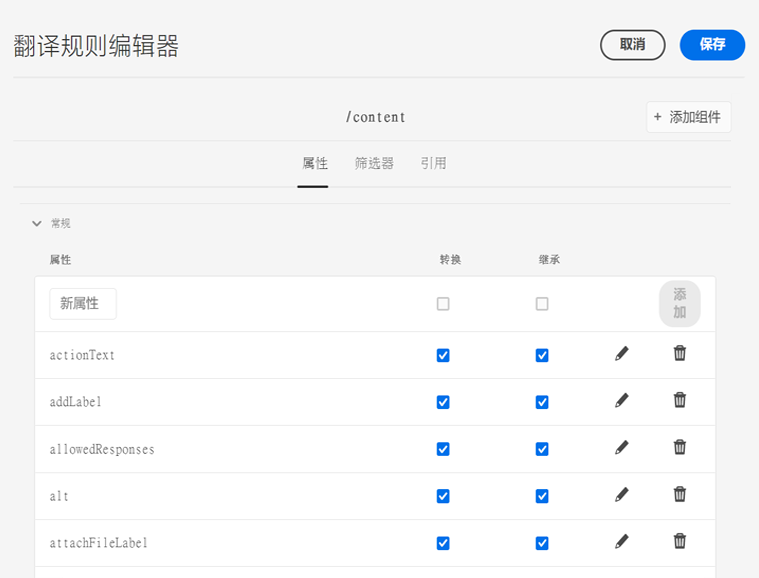

# 配置翻译规则 {#configure-translation-rules}

了解如何定义翻译规则以识别翻译内容。

## 迄今为止的故事 {#story-so-far}

在AEM Sites翻译历程的上一个文档中， [配置翻译连接器](configure-connector.md)您学习了如何安装和配置翻译连接器，现在应该：

* 了解AEM中翻译集成框架的重要参数。
* 能够设置您自己与翻译服务的连接。

现在，您的连接器已设置完成，本文将引导您完成确定需要翻译的内容的下一步。

## 目标 {#objective}

本文档可帮助您了解如何使用AEM翻译规则来识别翻译内容。 阅读本文档后，您应：

* 了解翻译规则的用途。
* 能够定义您自己的翻译规则。

## 翻译规则 {#translation-rules}

AEM Sites页面可以包含许多信息。 根据您的项目需求，可能并非必须翻译页面中的所有信息。

翻译规则可识别翻译项目中包含或排除的内容。 翻译内容后，AEM会根据这些规则提取或收集内容。 这样，只有必须翻译的内容才会被发送到翻译服务。

翻译规则包括以下信息：

* 应用规则的内容路径
   * 该规则也适用于内容的子项
* 包含要翻译的内容的属性的名称
   * 该属性可以特定于特定资源类型或所有资源类型

AEM会自动为站点页面创建翻译规则，但由于每个项目的要求不同，因此您务必了解如何根据项目需要审核和调整规则。

## 创建翻译规则 {#creating-rules}

可以创建多个规则以支持复杂的翻译要求。 例如，您可能正在处理的一个项目要求翻译所有页面信息，但在另一个页面上，只能翻译描述，而标题却未翻译。

翻译规则旨在处理此类情景。 但是，在本示例中，我们通过重点介绍简单的单一配置来说明如何创建规则。

有一个&#x200B;**翻译配置**&#x200B;控制台可用于配置翻译规则。

要访问它，请执行以下操作：

1. 导航到&#x200B;**Tools** -> **General**。
1. 点按或单击&#x200B;**翻译配置**。

AEM会自动为所有内容创建翻译规则。 要查看这些规则，请执行以下操作：

1. 选择`/content`上下文，然后选择工具栏中的&#x200B;**编辑**&#x200B;选项。
1. 将打开翻译规则编辑器，其中包含AEM为`/content`路径自动创建的规则。

   

1. 要翻译的页面属性位于列表的&#x200B;**General**&#x200B;部分下。 您可以添加或更新要明确包含在翻译中的现有属性名称。
   1. 在&#x200B;**New Property**&#x200B;字段中输入属性名称。
   1. 将自动选中选项&#x200B;**Translate**&#x200B;和&#x200B;**Inherit**。
   1. 点按或单击&#x200B;**添加**。
   1. 对必须翻译的所有字段重复这些步骤。
   1. 点按或单击&#x200B;**Save**。

您现在已配置翻译规则。

>[!NOTE]
>
>AEM会自动创建翻译规则。 对于简单的翻译设置或测试翻译工作流，无需创建新规则，甚至无需修改自动创建的现有规则。 这些步骤的详细信息用于解释规则的工作方式，并提供AEM如何处理翻译的上下文。

>[!TIP]
>
>也可以通过点按或单击翻译配置控制台中的&#x200B;**添加上下文**&#x200B;按钮，为特定路径或项目创建规则。 这超出了此历程的范围。

## 高级使用 {#advanced-usage}

还有许多其他属性可以配置为翻译规则的一部分。 此外，您还可以手动将规则指定为XML，这样可以更加专一和灵活。

通常，在开始本地化内容时不需要此类功能，但是如果您感兴趣，可以在[Additional Resources](#additional-resources)部分进一步阅读相关内容。

## 下一步 {#what-is-next}

现在，您已完成AEM Sites翻译历程的这一部分，接下来您应该：

* 了解翻译规则的用途。
* 能够定义您自己的翻译规则。

在此知识的基础上，通过下一步查看文档[翻译内容](translate-content.md)来继续您的AEM Sites翻译历程，您将在其中了解连接器和规则如何协同工作来翻译内容。

## 其他资源 {#additional-resources}

虽然建议您通过查看文档[翻译内容来进入翻译历程的下一个部分，但是](translate-content.md)以下是一些其他的可选资源，这些资源可以更深入地了解本文档中提到的一些概念，但并不需要继续访问这些概念。

* [识别要翻译的内容](/help/sites-cloud/administering/translation/rules.md)  — 了解翻译规则如何识别需要翻译的内容。
