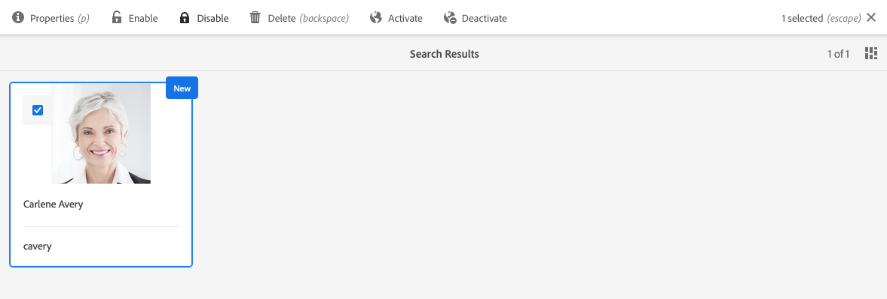

# Adobe Experience Manager作为Cloud Service基础，为数据保护和数据隐私法规做好准备 {#aem-foundation-readiness-for-data-protection-and-data-privacy-regulations}

>[!WARNING]
>
>本文档的内容不构成法律咨询，不能代替法律咨询。
>
>请咨询您的公司的法律部门，以获取有关数据保护和数据隐私法规的建议。

>[!NOTE]
>
>有关Adobe对隐私权问题的回应，以及这对您作为Adobe客户意味着什么的更多信息，请 [参阅Adobe隐私中心](https://www.adobe.com/privacy.html)。

## AEM Foundation数据隐私和保护支持 {#aem-foundation-data-privacy-and-protection-support}

在AEM Foundation级别，存储的个人数据保留在用户用户档案中。 因此，本文所介绍的信息主要是如何访问和删除用户用户档案，分别解决访问和删除请求。

## 访问用户用户档案 {#accessing-a-user-profile}

### 手动步骤 {#manual-steps}

1. 通过浏览至“工具”-“安全”-“ **[!UICONTROL 用户”，或直接浏览至]** “用户管理”控制台 `https://<serveraddress>:<serverport>/security/users.html`

<!--
   
-->

1. 然后，通过在页面顶部的搜索栏中键入名称来搜索相关用户：

   

1. 最后，通过单击打开用户用户档案，然后查看“详细信息”选 **[!UICONTROL 项卡]** 。

   

### HTTP API {#http-api}

如前所述，Adobe为访问用户数据提供API，以促进自动化。 您可以使用几种类型的API:

**用户属性API**

```shell
curl -u user:password http://localhost:4502/libs/granite/security/search/profile.userproperties.json\?authId\=cavery
```

**Sling API**

**发现用户主页：**

```xml
curl -g -u user:password 'http://localhost:4502/libs/granite/security/search/authorizables.json?query={"condition":[{"named":"cavery"}]}'
     {"authorizables":[{"type":"user","authorizableId_xss":"cavery","authorizableId":"cavery","name_xss":"Carlene Avery","name":"Carlene Avery","home":"/home/users/we-retail/DSCP-athB1NYLBXvdTuN"}],"total":1}
```

**检索用户数据：**

使用从上述命令返回的JSON有效负荷的主属性中的节点路径：

```shell
curl -u user:password  'http://localhost:4502/home/users/we-retail/DSCP-athB1NYLBXvdTuN/profile.-1.json'
```

```shell
curl -u user:password  'http://localhost:4502/home/users/we-retail/DSCP-athB1NYLBXvdTuN/profiles.-1.json'
```

## 禁用用户并删除关联的用户档案 {#disabling-a-user-and-deleting-the-associated-profiles}

### 禁用用户 {#disable-user}

1. 打开“用户管理”控制台并搜索相关用户，如上所述。
2. 将鼠标悬停在用户上并单击选择图标。 用户档案将变为灰色，表示已选择它。

3. 按上 **方菜** 单中的“Disable（禁用）”按钮以禁用用户：

   

4. 最后，确认操作。

   然后，用户界面将指示已通过擦除并向用户档案卡添加锁定来取消激活用户帐户：

   

### 删除用户用户档案信息 {#delete-user-profile-information}

>[!NOTE]
>
>对于AEM作为Cloud Service,UI中没有可用于删除用户用户档案的手动过程，因为CRXDE不可访问。

### HTTP API {#http-api-1}

以下过程使用 `curl` 命令行工具说明如何使用 **[!UICONTROL cavery]** `userId` 禁用用户，并删除默认位置提供的配置文件。

**发现用户主页：**

```shell
curl -g -u user:password 'http://localhost:4502/libs/granite/security/search/authorizables.json?query={"condition":[{"named":"cavery"}]}'
     {"authorizables":[{"type":"user","authorizableId_xss":"cavery","authorizableId":"cavery","name_xss":"Carlene Avery","name":"Carlene Avery","home":"/home/users/we-retail/DSCP-athB1NYLBXvdTuN"}],"total":1}
```

**禁用用户：**

使用从上述命令返回的JSON有效负荷的主属性中的节点路径：

```shell
curl -X POST -u user:password -FdisableUser="describe the reasons for disabling this user (Data Privacy in this case)" 'http://localhost:4502/home/users/we-retail/DSCP-athB1NYLBXvdTuN.rw.userprops.html'
```

**删除用户用户档案**

使用从帐户发现命令返回的JSON有效负荷的主属性中的节点路径和已知的现成用户档案节点位置：

```shell
curl -X POST -u user:password -H "Accept: application/json,**/**;q=0.9" -d ':operation=delete' 'http://localhost:4502/home/users/we-retail/DSCP-athB1NYLBXvdTuN/profile'
```

```shell
curl -X POST -u user:password -H "Accept: application/json,**/**;q=0.9" -d ':operation=delete' 'http://localhost:4502/home/users/we-retail/DSCP-athB1NYLBXvdTuN/profile'
```
