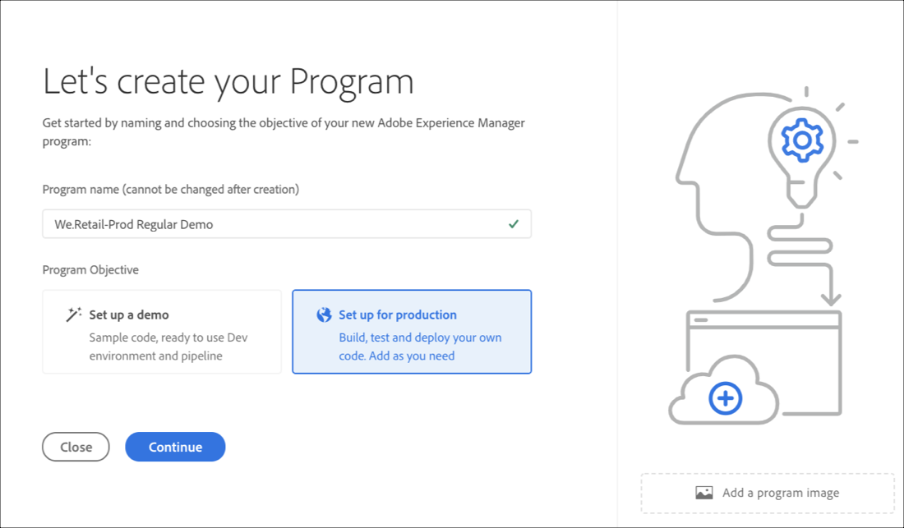

# 创建程序 {#create-a-program}

云本机解决方案为用户提供了必要的权限，并能够在自助服务模型上创建项目。

项目创建向导将要求用户提交详细信息，具体取决于用户在特定客户或组织可用内容范围内创建项目的目标。

在首次访问Cloud Manager的事件中，或如果租户中不存在项目，用户将看到创建您的第 **一个项目屏幕** 。 如果用户选 *择* Esc或者单击出对话框，将显示以下屏幕：

## 使用创建项目向导 {#using-create-program-wizard}

根据用户在特定客户／组织可用内容范围内创建项目的目标，项目创建向导将要求用户提交一个或多个详细信息。

>[!NOTE]
>If a program already exists, then you will see **Add Program** on the top right of the landing page, as shown in the figure below.

## 创建演示项目 {#create-demo-program}

>[!NOTE]
>演示项目类似于Cloud Manager UI中的沙箱项目。

请按照以下步骤创建沙箱项目:

1. 从创建项目向导中，选择 **设置演示**。 用户在选择创建之前提交项目 **名称**。

   

1. 用户将在登陆页上看到新的沙箱项目卡，并可以将鼠标悬停在沙箱卡上以选择云管理器图标，以导航到云管理器概述页面。 卡将通知用户新创建的沙箱项目的自动设置状态。 用户将看到进度。

   

1. 在项目设置和项目创建步骤完成后，用户可以访问 **Manage Git** （管理Git）链接，如下图所示：

   

   >[!NOTE]
   >
   >要进一步了解如何通过Cloud Manager UI使用自助服务Git帐户管理访问和管理您的Git存储库，请参阅 [访问Git](/help/implementing/cloud-manager/accessing-git.md)。

1. 创建开发环境后，用户便可 **以访问AEM** 链接，如下图所示：

   

1. 完成部署到开发的非生产渠道部署后，向导会指导用户访问AEM（在开发中）或将代码部署到开发环境:

   

   >[!NOTE]
   >您还可以从Cloud Manager概述页面编辑、切换或添加项目，如下所示：

   

## 创建常规项目 {#create-regular-program}

常规 ** 项目适用于熟悉AEM和Cloud Manager的用户，他们准备好开始编写、构建和测试代码，以将其部署到生产。

请按照以下步骤创建常规项目:

1. 在创 **建项目向导中** ，选择为生产设置以创建常规项目。 用户可以接受默认的项目名称，或在选择继续之前对其进行 **编辑**。

   

1. 用户将选择要包含在项目中的解决方案，该解决方案将显示在上述屏幕后面。

   >[!NOTE]
   >
   >以下屏幕仅针对已购买多个解决方案的客户细分显示。 对于只购买了一个解决方案的客户，将不显示以下解决方案选择屏幕。

   

1. 选择解决方案后，单击“创 **建”**。

   

1. 在项目上看到登陆页卡后，将鼠标悬停在该卡上以选择云管理器图标，以导航到云管理器概 **述页** 。

   

1. 主行动动员卡将引导用户创建环境、创建非生产管道，最后创建生产管道。
   

   >[!NOTE]
   >
   >A regular program does not have **Auto-setup** feature.

