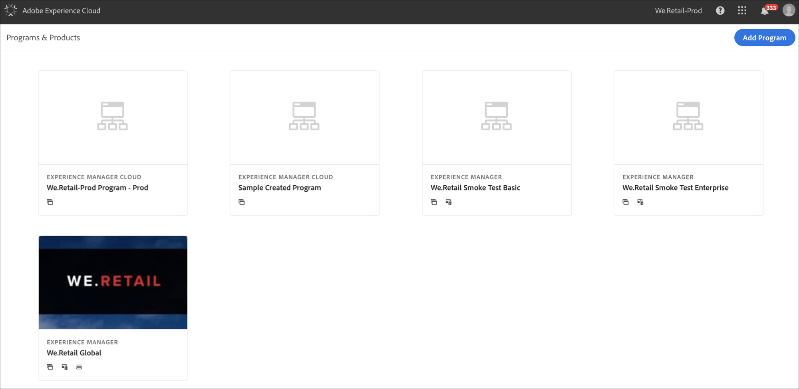
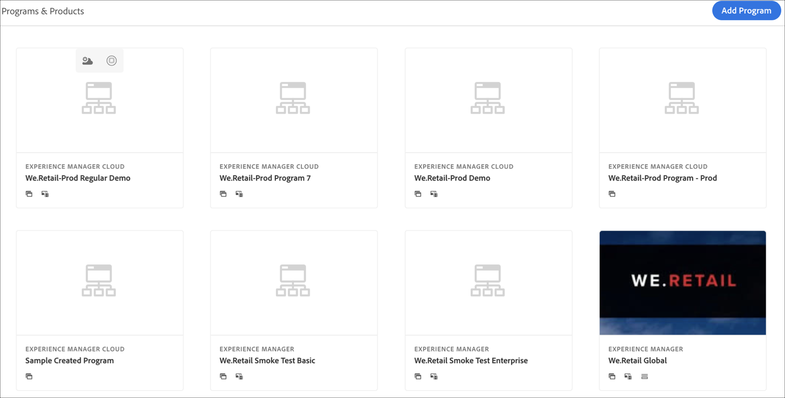

# 创建生产程序 {#create-production-program}

*生产*&#x200B;程序面向熟悉AEM和Cloud Manager的用户，该用户可以开始编写、构建和测试代码，以将代码部署到生产环境。

观看下面两部分教程视频，了解如何在Cloud Manager中创建项目：

>[!VIDEO](https://video.tv.adobe.com/v/334953)

>[!VIDEO](https://video.tv.adobe.com/v/334954)

此外，

按照以下步骤创建生产程序：

1. 启动Cloud Manager的登陆页面，然后单击屏幕右上角的&#x200B;**添加项目** 。

   

   >[!NOTE]
   >要了解如何访问Cloud Manager，请参阅[Cloud Manager登录页面](/help/onboarding/what-is-required/navigate-to-cloud-manager.md)以获取更多详细信息。

1. 在“创建程序”向导中选择&#x200B;**为生产设置**&#x200B;以创建生产程序。 用户可以接受默认程序名称或在选择&#x200B;**创建**&#x200B;之前对其进行编辑。

   

1. 用户将在屏幕上选择要包含在程序中的解决方案，该屏幕将在上面的屏幕后面显示。 选择所需的解决方案后，单击&#x200B;**创建**。

   

   此外，您还可以选择&#x200B;**Sites**&#x200B;下的&#x200B;**Commerce**&#x200B;附加选项，如下图所示，然后单击&#x200B;**Create**。

   

1. 在登陆页面上看到项目卡后，将鼠标悬停在其上方以选择Cloud Manager图标，以导航到Cloud Manager **Overview**&#x200B;页面。

   

1. 主行动动员卡将指导用户创建环境、创建非生产管道，最后是生产管道。
   

   >[!NOTE]
   >生产程序没有&#x200B;**自动设置**&#x200B;功能。
