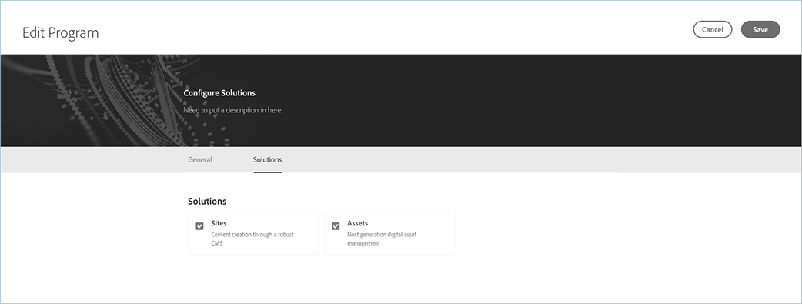

# 编辑沙箱项目{#create-sandbox-program}

拥有必需权限的用户现在可以编辑生产项目，允许他们以自助方式执行以下操作：

* 将“站点”解决方案添加到包含资产的现有项目（反之亦然）。
* 将站点（或资产）从包含站点和资产的现有项目中删除。
* 将第二个未使用的解决方案授权添加到现有项目或作为新项目。

   >[!NOTE]
   >必须登录业务所有者角色中的用户，才能成功编辑项目。

请按照以下步骤编辑沙箱项目:

1. 导航到&#x200B;**编辑项目**&#x200B;页。

1. **“编辑项目**”页显示两个用于“生产”和“沙箱”项目的选项卡（“常规”和“解决方案”）。
   

   >[!NOTE]
   >当站点和资产都将显示时，根据已购买和未使用的内容，其中一个可能会被禁用。 具体而言，如果组织没有特定解决方案的未使用授权，则将显示该解决方案，但将禁用该解决方案。

## 编辑项目{#considerations-editing}时的注意事项

编辑项目时，应查看以下几点注意事项：

* 对于项目，必须至少选择一个解决方案，即，在编辑项目工作流程中，不允许使用来取消选择所有解决方案。

* 单击&#x200B;**保存**&#x200B;按钮，如果选定的解决方案已更改，则对环境的解决方案更新将在下次部署后生效。