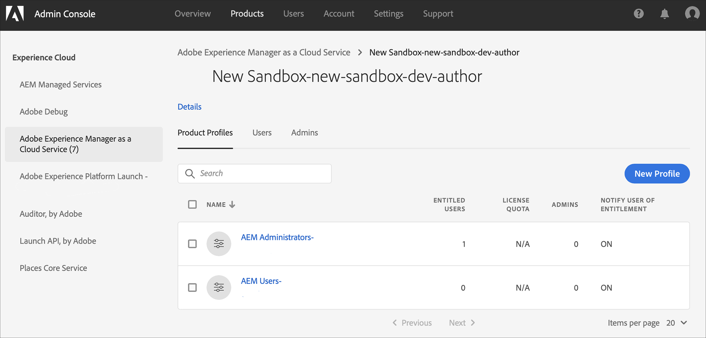

# 访问 Experience Manager 云服务 {#navigation}

在系统管理员授予您访问Cloud Manager的权限后，您将收到一封电子邮件，将您带到Cloud Manager登录页面，也可通过Adobe Experience Cloud访 [问该页面](https://my.cloudmanager.adobe.com/)。

成功登录后，您将被定向到Cloud Manager的登陆页，如下所示。

## SysAdmin任务 {#sysadmin-tasks}

具有SysAdmin角色的用户现在可以直接访问Admin Console来管理角色和权限以及访问AEM实例。

### 管理角色 {#manage-roles}

作为SysAdmin角色的用户，您可以通过一键访问Admin Console中的 **位置** ，管理Cloud Manager的用户角色或权限。

有关如何 [将用户添加到用户档案](https://docs.adobe.com/content/help/en/experience-manager-cloud-service/security/ims-support.html#accessing-cloud-manager) ，请参阅访问云管理器。

>[!NOTE]
>对于在2020年1月之前获得AEM云服务访问权限的某些组织，这些组织将转至Adobe Admin Console，并且必须选择产品和环境产品用户档案。

1. 导航到云管理器的登陆页，然后单击管 **理访问**。

   

1. 单击管理访 **问权**，即可导航到Admin Console **** ，从中可以管理Cloud Manager的用户角色或权限。

   

### 管理对作者实例的访问 {#manage-access-aem}

作为SysAdmin角色的用户，您只需单击一下即可访问Admin **Console** ，从中可以直接导航到作者实例并管理访问权限。

>[!NOTE]
>对于在2020年1月之前获得AEM云服务访问权限的某些组织，这些组织将转至Adobe Admin Console，并且必须选择产品和环境产品用户档案。

有关更 [多详细信息，请参阅将AEM中的实例作为云服务访问](https://docs.adobe.com/content/help/en/experience-manager-cloud-service/security/ims-support.html#accessing-instance-cloud-service) 。

1. 从“环境 **概述** ”页面导 **航到项目卡** ，然后单击“管 **理访问权限**”。

   

   或者，

   **如果单击** 环境卡中的“详细信 **息”，则也可** 以从“管理 **”按钮访问** “管理 **访问** ”。

   

1. 单击“管 **理访问**”后，您将从您有权 **访问该环境的作者实例的Admin Console** 。

   

## 针对现有AMS客户 {#existing-aem}

如果您是现有AMS(Adobe Managed Services)客户并且有权访问云服务，您将看到现有项目，并在登陆页右上角 **显示** “添加项目”按钮。

如果看不到“添加 **项目** ”按钮，并对访问云服务有疑问，请与Adobe代表联系。

有关更 [多详细信息，请参阅在云服务中使用现有项目添加新项目](/help/onboarding/getting-access-to-aem-in-cloud/first-time-login.md#existing-program) 。

## 对于新的云服务客户 {#new-cloud-services}

如果您是新的云服务客户，则您将在空 **项目** 右上角看到添加登陆页按钮。 您需要向云服务添加新项目。

有关详 [细信息，请参阅在无现有项目的云服务中添加新项目](/help/onboarding/getting-access-to-aem-in-cloud/first-time-login.md#no-program) 。

