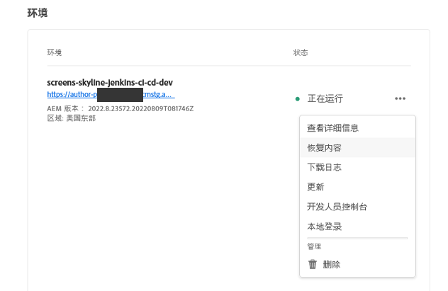
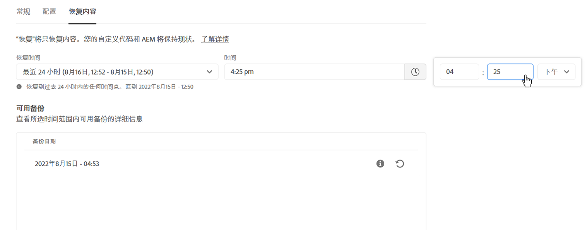
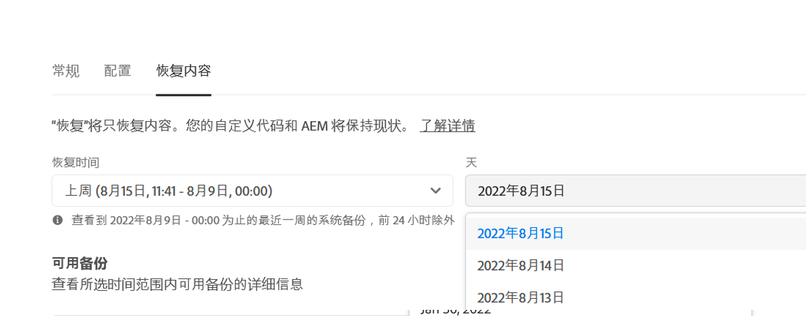
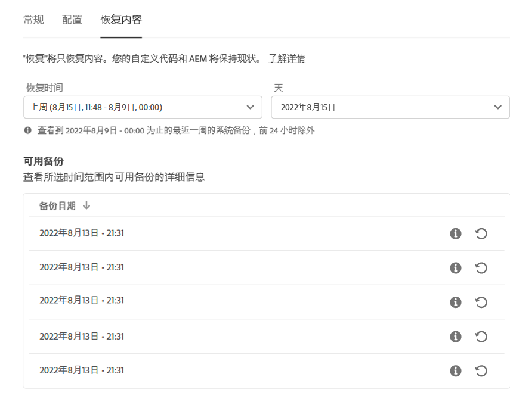
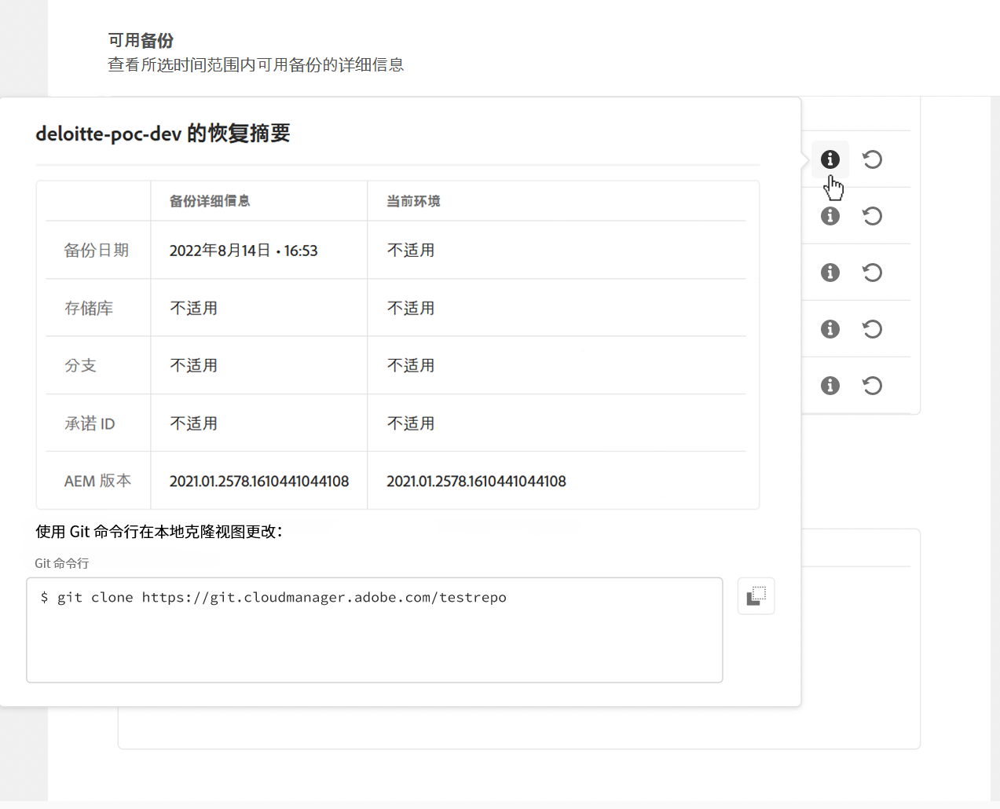
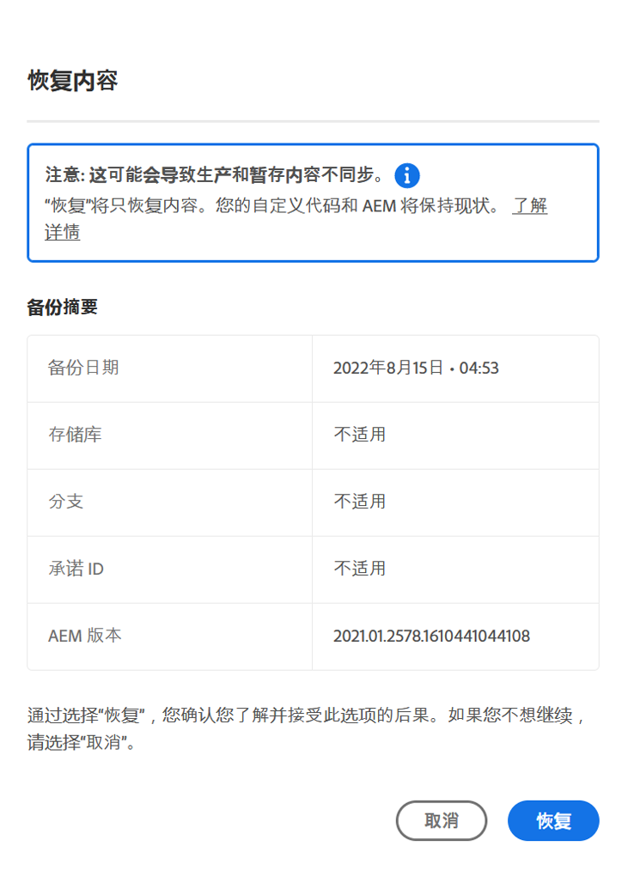
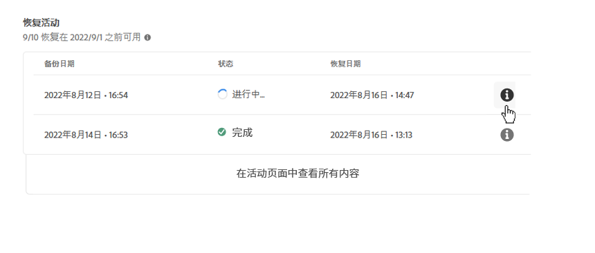

# AEMas a Cloud Service中的内容恢复 {#content-restore}

>[!CONTEXTUALHELP]
>id="aemcloud_golive_backuprestore"
>title="备份和恢复"
>abstract="了解如何使用Cloud Manager从备份中恢复AEMas a Cloud Service内容。"

了解如何使用Cloud Manager从备份中恢复AEMas a Cloud Service内容。

## 概述 {#overview}

Cloud Manager的自助恢复过程将数据从Adobe系统备份中复制并还原到其原始环境。 执行恢复，将丢失、损坏或意外删除的数据返回到其原始状态。

恢复过程只影响内容，而不会更改您的代码和AEM版本。 您可以随时启动单个环境的恢复操作。

Cloud Manager提供两种类型的备份，您可以从中恢复内容。

* **时间点(PIT):** 此类型从从当前时间起的最近24小时内连续系统备份中恢复。
* **上周：** 此类型在过去七天内从系统备份进行恢复，但前24小时除外。

在这两种情况下，自定义代码版本和AEM版本均保持不变。

在AEM as a ContentService中恢复内容的性能量度是指标准化的基准：

* **恢复时间目标(RTO):** 恢复时间目标因存储库的大小而异，但根据经验，一旦恢复序列开始，则大约需要30分钟。
* **恢复点目标(RPO):** 恢复点目标最长为24小时

>[!TIP]
>
>还可以恢复备份 [使用公共API。](https://developer.adobe.com/experience-cloud/cloud-manager/reference/api/)

## 限制 {#limitations}

自助恢复机制的使用受以下限制。

* 恢复操作限制为七天，这意味着无法恢复七天以前的快照。
* 每个日历月，一个计划中的所有环境最多允许10次成功恢复。
* 创建环境后，需要6个小时才能创建第一个备份快照。 在创建此快照之前，不能对环境执行恢复。
* 如果当前为环境运行了完整堆栈或网层配置管道，则不会启动还原操作。
* 如果同一环境中已运行另一个还原，则无法启动还原。
* 在极少数情况下，由于备份时间限制为24小时/7天，因此所选备份可能由于从选择备份到启动恢复之间的延迟而变得不可用。
* 来自已删除环境的数据将永久丢失且无法恢复。

## 恢复内容 {#restoring-content}

首先确定要恢复的内容的时间范围。 然后，要从备份中恢复环境的内容，请执行这些步骤。

>[!NOTE]
>
>具有 **业务所有者** 或 **部署管理器** 必须登录角色才能启动还原操作。

1. 登录Cloud Manager(位于 [my.cloudmanager.adobe.com](https://my.cloudmanager.adobe.com/) 并选择相应的组织。

1. 单击要启动还原的程序。

1. 从 **计划概述** 页面，在 **环境** 卡片中，单击要启动还原的环境旁边的省略号按钮，然后选择 **恢复内容**.

   

   * 或者，您也可以直接导航到 **恢复内容** 选项卡。

1. 在 **恢复内容** “环境详细信息”页面的选项卡中，首先在 **恢复时间** 下拉列表。

   1. 如果您选择 **最近24小时** 相邻 **时间** 字段中，您可以指定在过去24小时内进行恢复的确切时间。

      

   1. 如果您选择 **上周** 相邻 **日** 字段可让您选择过去七天内的日期（不包括之前的24小时）。

      

1. 选择日期或指定时间后， **备份可用** 以下部分显示了可恢复的可用备份列表

   

1. 使用信息图标查看有关该备份中包含的代码和AEM版本版本的信息，并考虑在 [选择备份。](#choosing-the-right-backup)

   

   * 请注意，为还原选项显示的时间戳都基于用户计算机的时区。

1. 单击 **还原** 图标，该图标表示要恢复以启动恢复过程的备份。

1. 查看 **恢复内容** 对话框，然后单击以确认您的请求 **还原**.

   

备份过程已启动，您可以在 **[还原活动](#restore-activity)** 表。 恢复操作完成所需的时间取决于要恢复的内容的大小和配置文件。

成功恢复后，环境将：

* 运行与启动还原操作时相同的代码和AEM版本。
* 具有与所选快照的时间戳上可用的内容相同，并重新构建索引以匹配当前代码。

## 选择正确的备份 {#choosing-backup}

仅恢复将内容恢复到AEM。 因此，您必须仔细考虑在所需还原点与当前时间之间所做的代码更改，方法是查看当前提交ID与要还原到的提交ID之间的提交历史记录。

有几种情况。

* 环境和还原中的自定义代码位于同一存储库和同一分支上。
* 环境和还原中的自定义代码位于同一存储库上，但位于具有相同提交的其他分支上。
* 环境和还原中的自定义代码位于不同的存储库中。
   * 在这种情况下，将不显示提交ID。
   * 强烈建议您克隆两个存储库，然后使用差异工具来比较分支。

此外，请记住，恢复可能会导致您的生产和暂存环境脱离同步。 恢复内容的后果由您负责。

## 还原活动 {#restore-activity}

的 **还原活动** 表显示十个最近的还原请求的状态，包括任何活动的还原操作。

通过单击备份的信息图标，您可以下载该备份的日志，并检查代码详细信息，包括在启动还原时快照和数据之间的差异。

## 异地备份 {#offsite-backup}

常规备份涵盖AEM云服务中意外删除或技术故障的风险，但区域故障可能会带来其他风险。 除了可用性外，此类区域中断的最大风险是数据丢失。

AEM as a Cloud Service通过连续将所有AEM内容复制到远程区域并使其可在三个月的时间内进行恢复，来缓解所有AEM生产环境的这一风险。 此功能称为站外备份。

在数据区域发生中断时，AEM服务可靠性工程部门会执行从异地备份恢复用于暂存和生产环境的AEM云服务的操作。
