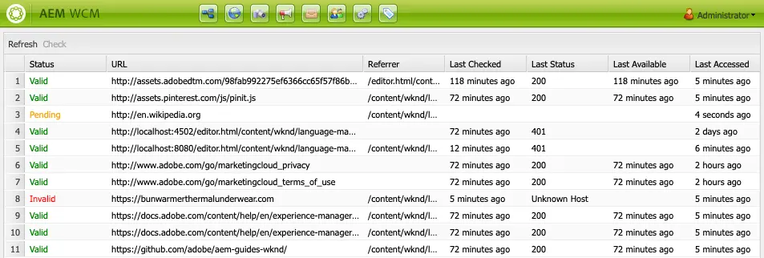

# 链接检查器 {#link-checker}

了解Link Checker如何通过在将链接添加到内容时对其进行验证来帮助作者，以及它提供了哪些配置选项。

## 概述 {#overview}

内容作者无需自行验证他们包含在内容中的每个链接。 Link Checker会自动运行以帮助内容作者使用其链接，包括：

* 在链接添加到内容时对其进行验证
* 显示内容中所有外部链接的列表
* 执行链接转换

Link Checker具有多个[配置选项](#configuring)，例如定义内部链接的验证，允许验证中忽略某些链接或链接模式，以及定义链接重写规则。

链接检查器验证[内部链接](#internal)和[外部链接。](#external)

>[!NOTE]
>
>由于Link Checker会检查每个内容页面的链接，因此Link Checker可能会影响大型存储库的性能。 在这种情况下，您可能需要[配置链接检查器运行的频率](#configuring)或[禁用它。](#disabling)

## 内部链接检查 {#internal}

内部链接是指向AEM存储库中其他内容的链接。 可以使用路径选取器、富文本编辑器或使用自定义组件添加内部链接。 例如：

* 您创建页面`/content/wknd/us/en/adventures/ski-touring`
* 该页包含指向[文本组件中的`/content/wknd/us/en/adventures/extreme-ironing`的链接。](https://experienceleague.adobe.com/zh-hans/docs/experience-manager-core-components/using/wcm-components/text)

内容作者向页面添加此类链接后，将立即验证内部链接。 如果链接无效：

* 已从发布器中将其删除。
   * 已删除链接本身。
   * 链接的文本会保留。
* 在创作界面中，该链接显示为断开的链接。

## 外部链接检查 {#external}

外部链接是指向AEM存储库外部内容的链接。 可以使用富文本编辑器或自定义组件添加外部链接。 例如：

* 您创建页面`/content/wknd/us/en/adventures/ski-touring`
* 该页包含指向[文本组件中的`https://bunwarmerthermalunderwear.com`的链接。](https://experienceleague.adobe.com/zh-hans/docs/experience-manager-core-components/using/wcm-components/text)

验证外部链接的语法和检查其可用性。 此检查以可配置的间隔异步完成。 如果Link Checker发现外部链接无效：

* 已从发布器中将其删除。
   * 已删除链接本身。
   * 链接的文本会保留。
* 在创作界面中，该链接显示为断开的链接。

### 外部链接检查器的工作方式 {#external-details}

外部链接检查器依赖于多个服务，了解它们的工作方式有助于您了解如何[配置链接检查器以满足您的需求。](#configuring)

1. 每当内容作者保存指向页面的任何链接时，都会触发事件处理程序。
1. 事件处理程序遍历`/content`下的所有内容，检查新链接或更新后的链接，并将它们添加到链接检查器的缓存中。
1. 然后，**Day CQ Link Checker Service**&#x200B;会定期执行以检查缓存中的条目是否为有效语法。
1. 经过语法验证的链接随后显示在[外部链接检查器窗口中。](#external-using)，但是它们将处于&#x200B;**待处理**&#x200B;状态。
1. 然后，定期执行&#x200B;**Day CQ Link Checker任务**，以通过进行GET调用来验证链接。
1. **天CQ链接检查器任务**&#x200B;随后将使用GET调用的结果更新[外部链接检查器窗口](#external-using)中的条目。

### 使用外部链接检查器 {#external-using}

外部链接检查器是一个控制台，可提供AEM内容中所有外部链接的概述。 要使用外部链接检查器，请执行以下操作：

1. 从全局导航中，选择&#x200B;**工具** -> **站点**。
1. 选择&#x200B;**外部链接检查器**，将显示所有外部链接的列表。

表中的每个条目都表示链接检查器服务检测到的外部链接。 将显示以下列：

* **状态** — 链接的验证状态，可以是以下状态之一：
   * **有效** — 链接检查器可以访问外部链接。
   * **挂起** — 外部链接已添加到站点内容，但尚未通过链接检查器验证。
   * **无效** — 链接检查器无法访问外部链接。
* **URL** — 外部链接
* **反向链接** — 包含外部链接的内容页面
   * 如果配置，则仅填充[。](#configuring)
* **上次检查时间** — 上次链接检查器验证外部链接的时间
   * 可配置检查链接的频率[。](#configuring)
* **上次状态** — 链接检查上次检查外部链接时返回的最后HTML状态代码
* **上次可用时间** — 链接检查器上次使用该链接的时间
* **上次访问时间** — 自上次在创作界面中访问带有外部链接的页面以来的时间

您可以使用链接列表顶部的两个按钮来处理窗口的内容：

* **刷新** — 刷新列表的内容
* **Check** — 检查列表中选定的单个外部链接

“外部链接检查器”窗口中的所有其它图标均处于非活动状态。

## 配置链接检查器 {#configuring}

链接检查器在AEM中自动开箱即用。 但是，可以修改几个OSGi配置以更改其行为：

* **天CQ链接检查器信息存储服务** — 此服务定义存储库中链接检查器缓存的大小。
* **Day CQ Link Checker Service** — 此服务对外部链接的语法执行异步检查。
   * 除其他选项外，您还可以定义检查时段以及检查器跳过的链接类型。
* **天CQ链接检查器任务** — 此服务执行外部链接的GET验证。
   * 它允许单独定义间隔，以检查其他选项中的坏链接和好链接。
* **Day CQ Link Checker Transformer** — 此服务根据用户定义的规则集转换链接。

有关如何更改OSGi设置的更多详细信息，请参阅文档[配置OSGi](/help/implementing/deploying/configuring-osgi.md)。

## 禁用链接检查器 {#disabling}

您可以选择完全禁用Link Checker。 为此，请执行以下操作：

1. 打开OSGi控制台。
1. 编辑&#x200B;**天CQ链接检查器转换器**
1. 选中要禁用的选项：
   * **禁用检查** — 禁用链接验证
   * **禁用重写** — 禁用链接转换
