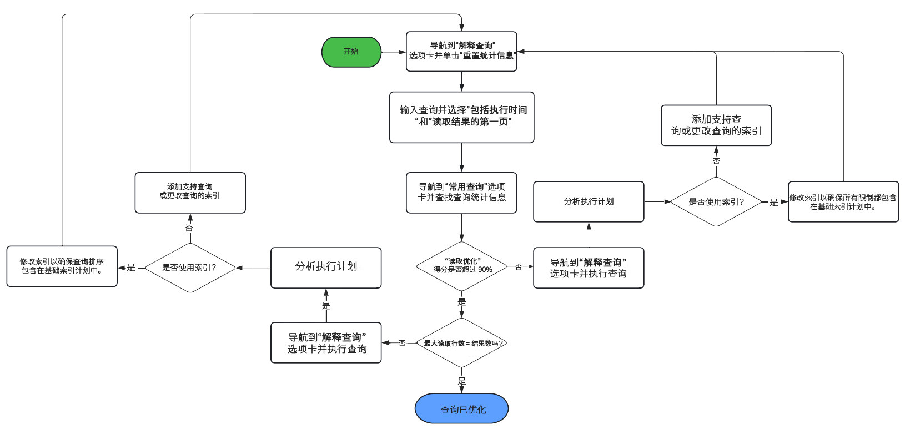

# 查询和索引最佳实践 {#query-and-indexing-best-practices}

在AEMas a Cloud Service中，与索引相关的所有操作方面都实现了自动化。 这允许开发人员专注于创建高效查询及其相应的索引定义。

## 何时使用查询 {#when-to-use-queries}

查询是一种访问内容的方式，但并非唯一的可能。 在许多情况下，可以通过其他方式更有效地访问存储库中的内容。 查询是否是访问用例内容的最佳、最有效的方法，您应当考虑这一点。

### 存储库和分类设计 {#repository-and-taxonomy-design}

在设计存储库的分类时，需要考虑几个因素。 这些功能包括访问控制、本地化、组件和页面属性继承等。

在设计解决这些问题的分类时，还必须考虑索引设计的“可遍历性”。 在此环境中，可遍历性是分类的功能，该功能允许根据内容的路径进行可预测的访问。 这样可以提供比需要执行多个查询的系统更易于维护的高效系统。

此外，在设计分类时，务必考虑排序是否重要。 如果不需要显式排序且需要大量同级节点，则最好使用未排序的节点类型，例如 `sling:Folder` 或 `oak:Unstructured`. 如果需要订购， `nt:unstructured` 和 `sling:OrderedFolder` 更合适。

### 组件中的查询 {#queries-in-components}

由于查询是在AEM系统上执行的较为繁琐的操作之一，因此最好在组件中避免查询操作。 每次渲染页面时执行多个查询通常会降低系统性能。 有两种策略可用于在渲染组件时避免执行查询： **[遍历节点](#traversing-nodes)** 和 **[预取结果。](#prefetching-results)**

### 遍历节点 {#traversing-nodes}

如果以允许事先了解所需数据位置的方式设计存储库，则可以部署从必要路径检索此数据的代码，而无需运行查询以便找到它。

例如，渲染符合特定类别的内容。 一种方法是使用可查询的类别属性来组织内容，以填充显示类别中项目的组件。

更好的方法是按类别在分类中构建此内容，以便可以手动检索。

例如，如果内容存储在类似于以下内容的分类中：

```xml
/content/myUnstructuredContent/parentCategory/childCategory/contentPiece
```

the `/content/myUnstructuredContent/parentCategory/childCategory` 节点可以简单地进行检索，其子项可进行解析并用于渲染组件。

此外，处理小的或同构的结果集时，可以更快地遍历存储库和收集所需的节点，而不是精心编制查询以返回相同的结果集。 作为一般考虑事项，在可能的情况下应避免提出查询。

### 预取结果 {#prefetching-results}

有时，组件的内容或要求不允许将节点遍历用作检索所需数据的方法。 在这种情况下，需要在渲染组件之前执行所需的查询，以确保最佳性能。

如果在创作组件时可以计算组件所需的结果，并且内容没有更改的预期，则可以在更改完成后执行查询。

如果数据或内容会定期更改，则可以按计划或通过侦听器执行查询，以更新基础数据。 然后，结果可写入存储库中的共享位置。 然后，任何需要此数据的组件都可以从此单个节点中提取值，而无需在运行时执行查询。

可使用类似策略来保留内存中的缓存结果，该缓存在启动时填充，并在更改完成时更新（使用JCR） `ObservationListener` 或Sling `ResourceChangeListener`)。

## 优化查询 {#optimizing-queries}

Oak文档提供了 [有关如何执行查询的概述。](https://jackrabbit.apache.org/oak/docs/query/query-engine.html#query-processing) 这构成本文档中描述的所有优化活动的基础。

AEMas a Cloud Service提供了查询性能工具，该工具旨在支持实施高效查询。

* 它显示已执行的查询及其相关性能特征和查询计划。
* 它允许在不同级别执行临时查询，从仅显示查询计划到执行完整查询。

查询性能工具可通过 [Cloud Manager中的开发人员控制台。](https://experienceleague.adobe.com/docs/experience-manager-learn/cloud-service/debugging/debugging-aem-as-a-cloud-service/developer-console.html#queries) AEMas a Cloud Service的查询性能工具提供了有关AEM 6.x版本上查询执行详细信息的更多信息。

此图表说明了使用查询性能工具优化查询的一般流程。



### 使用索引 {#use-an-index}

每个查询都应使用索引来提供最佳性能。 在大多数情况下，现有的现成索引应该足以处理查询。

有时，需要将自定义属性添加到现有索引，因此可以使用索引查询其他约束。 查看文档 [内容搜索和索引](/help/operations/indexing.md#changing-an-index) 以了解更多详细信息。 的 [JCR查询备忘单](#jcr-query-cheatsheet) 本文档的章节介绍了索引上的属性定义如何必须查找才能支持特定查询类型。

### 使用正确的标准 {#use-the-right-criteria}

任何查询的主要约束应该是属性匹配，因为这是最有效的类型。 添加更多属性约束会进一步限制结果。

查询引擎仅考虑单个索引。 这意味着可以通过向现有索引添加更多自定义索引属性来自定义现有索引。

的 [JCR查询备忘单](#jcr-query-cheatsheet) 本文档的章节列出了可用的约束，并概述了索引定义在选取时需要如何进行查找。 使用 [查询性能工具](#query-performance-tool) 要测试查询，并确保使用了正确的索引，并且查询引擎不需要在索引之外评估约束。

### 订购 {#ordering}

如果请求了结果的特定顺序，查询引擎可通过两种方式来实现此目的：

1. 索引可以按正确的顺序完整地传递结果。
   * 如果用于排序的属性在注释中添加了 `ordered=true` 在索引定义中。
1. 查询引擎执行排序过程。
   * 如果查询引擎在索引外部执行筛选，或者排序属性未使用 `ordered=true` 属性。
   * 这要求将完整的结果集读入内存进行排序，这比第一个选项慢得多。

### 限制结果大小 {#restrict-result-size}

查询结果的检索大小是影响查询性能的一个重要因素。 由于以延迟方式获取结果，因此在运行时和内存使用情况下，仅获取前20个结果与获取10,000个结果存在差异。

这也意味着仅当获取了所有结果时，才能正确确定结果集的大小。 因此，无论是通过增加查询，都应始终对获取的结果集进行限制(请参阅 [JCR查询备忘单](#jcr-query-cheatsheet) 部分)或通过限制结果的读取。

这种限制还防止查询引擎命中 **遍历限制** 100,000个节点，这会导致查询被强制停止。

请参阅部分 [具有大结果的查询](#queries-with-large-result-sets) 文档中的“如果必须完全处理可能较大的结果集”。

## JCR查询备忘单 {#jcr-query-cheatsheet}

为支持创建有效的JCR查询和索引定义， [JCR查询备忘单](https://experienceleague.adobe.com/docs/experience-manager-65/deploying/practices/best-practices-for-queries-and-indexing.html#jcrquerycheatsheet) 可供下载，并在开发过程中用作参考。

它包含QueryBuilder、XPath和SQL-2的示例查询，涵盖在查询性能方面行为不同的多种情况。 它还为如何构建或自定义Oak索引提供了建议。 本备忘录的内容适用于AEMas a Cloud Service和AEM 6.5。

## 具有大结果集的查询 {#queries-with-large-result-sets}

尽管建议避免使用大结果集进行查询，但在有效情况下，必须处理大结果集。 结果大小往往事先不知道，因此应当采取一些预防措施，使处理过程可靠。

* 不应在请求内执行查询。 查询而是应作为Sling作业或AEM工作流的一部分执行。 它们的总运行时没有任何限制，并在实例在处理查询及其结果期间关闭时重新启动。
* 要克服100,000个节点的查询限制，您应考虑使用 [键集分页](https://jackrabbit.apache.org/oak/docs/query/query-engine.html#Keyset_Pagination) 并将查询拆分为多个子查询。

## 存储库遍历 {#repository-traversal}

遍历存储库的查询不使用索引，并且日志中会显示与以下内容类似的消息。

```text
28.06.2022 13:32:52.804 *WARN* [127.0.0.1 [1656415972414] POST /libs/settings/granite/operations/diagnosis/granite_queryperformance.explain.json HTTP/1.1] org.apache.jackrabbit.oak.plugins.index.Cursors$TraversingCursor Traversed 98000 nodes with filter Filter(query=select [jcr:path], [jcr:score], * from [nt:base] as a /* xpath: //* */, path=*) called by com.adobe.granite.queries.impl.explain.query.ExplainQueryServlet.getHeuristics; consider creating an index or changing the query
```

通过此日志代码片段，您可以确定：

* 查询本身： `//*`
* 执行此查询的Java代码： `com.adobe.granite.queries.impl.explain.query.ExplainQueryServlet::getHeuristics` 以帮助识别查询的创建者。

根据此信息，可以使用 [优化查询](#optimizing-queries) 部分。
