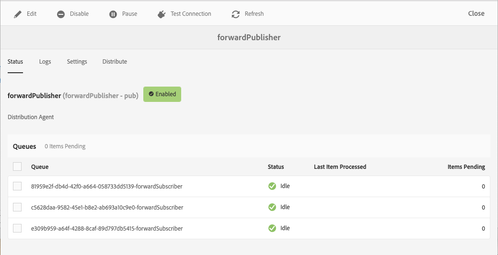

# 复制 {#replication}

Adobe Experience manager作为云服务，使用 [Sling Content Distribution](https://sling.apache.org/documentation/bundles/content-distribution.html) （Sling内容分发）功能将要复制的内容移动到AEM运行时以外的Adobe I/O上运行的管道服务。

>[!NOTE]
>
> 阅读 [分发](/help/core-concepts/architecture.md#content-distribution) ，了解更多信息。

## 发布内容的方法 {#methods-of-publishing-content}

### 快速取消／发布——计划取消／发布 {#publish-unpublish}

作者的这些标准AEM功能不会随AEM Cloud服务而更改。

### 树激活 {#tree-activation}

执行树激活：

1. 从AEM开始菜单，导航到工具> **部署>分发**
2. 选择卡转发发 **布者**
3. 进入forwardPublisher web控制台UI后，选择“ **分发”**
   
4. 在路径浏览器中选择路径，根据需要选择添加节点、树或删除，然后选择提 **交**

## 疑难解答 {#troubleshooting}

要对复制进行疑难解答，请导航到AEM作者服务Web UI中的复制队列：

1. 从AEM开始菜单，导航到工具> **部署>分发**
2. 选择卡转发发 **布者**
   
3. 检查应为绿色的队列状态
4. 您可以测试到复制服务的连接
5. 选择“ **日志** ”选项卡，其中显示内容发布的历史记录

如果内容无法发布，则将从AEM发布服务还原整个发布。
在这种情况下，应检查队列，以确定哪些项目导致取消发布。 通过单击显示红色状态的队列，将显示包含待处理项目的队列，如果需要，可从中清除单个或所有项目。
