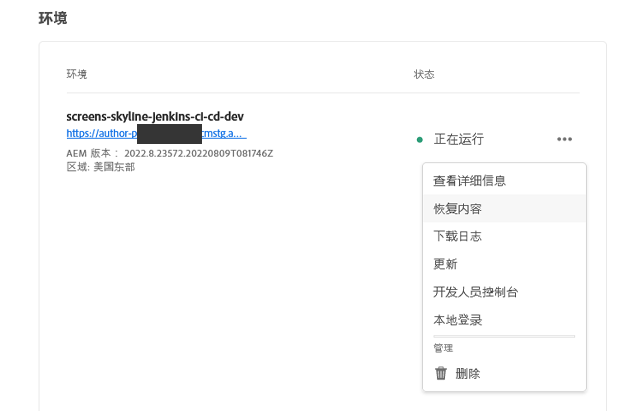
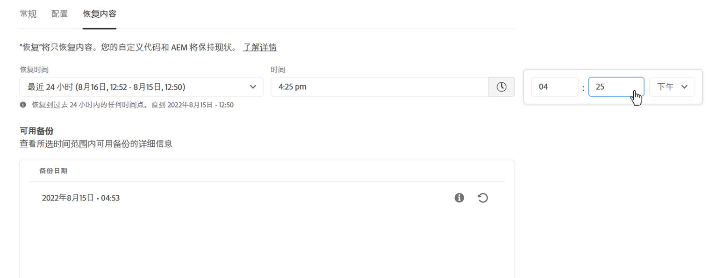
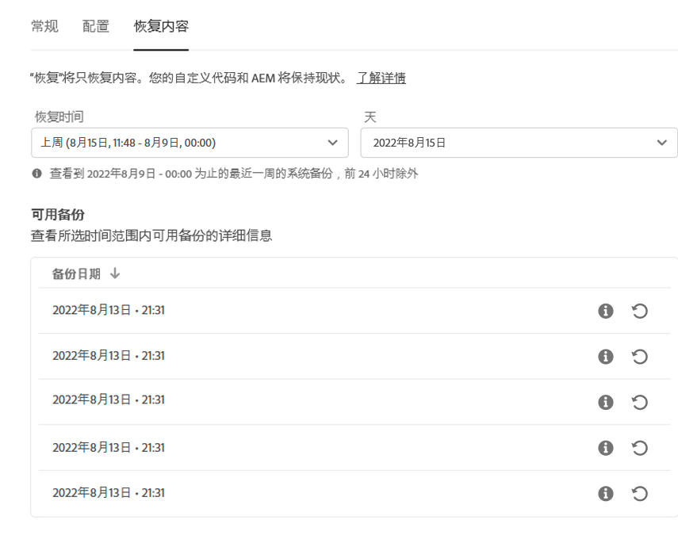
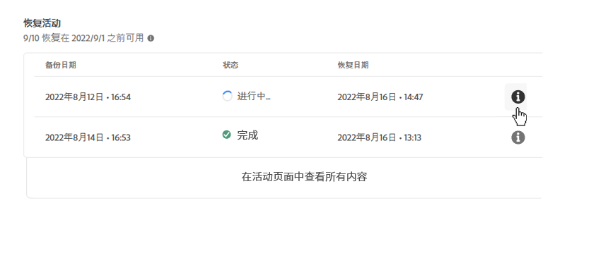

# AEM as a Cloud Service 中的内容恢复 {#content-restore}

了解如何使用 Cloud Manager 从备份中恢复 AEM as a Cloud Service 内容。

## 概述 {#overview}

Cloud Manager 的自助恢复过程将数据从 Adobe 系统备份中复制并还原到其原始环境。执行恢复，将丢失、损坏或意外删除的数据返回到其原始状态。

恢复过程只影响内容，而不会更改您的代码和 AEM 版本。您可以随时启动单个环境的恢复操作。

Cloud Manager 提供两种类型的备份，您可以从中恢复内容。

* **时间点 (PIT)：**&#x200B;此类型从当前时间的最后 24 小时的连续系统备份中恢复。
* **上周：** 此类型在过去七天内从系统备份进行恢复，但前 24 小时除外。

在这两种情况下，自定义代码版本和 AEM 版本均保持不变。

>[!TIP]
>
>还可以[使用公共 API 恢复备份。](https://developer.adobe.com/experience-cloud/cloud-manager/reference/api/)

>[!WARNING]
>
>* 仅当代码或内容存在严重问题时，才应使用此功能。
>* 恢复备份将导致从备份到当前之间的最近数据丢失。 暂存内容也会恢复到旧版本。
>* 在启动内容恢复之前，请考虑其他选择性内容恢复选项。

## 选择性内容恢复选项 {#selective-options}

在还原到完全内容还原之前，请考虑以下选项以更轻松地还原您的内容。

* 如果已删除路径的软件包可用，请使用再次安装该软件包 [包管理器。](/help/implementing/developing/tools/package-manager.md)
* 如果删除的路径是Sites中的页面，请使用 [恢复树功能。](/help/sites-cloud/authoring/sites-console/page-versions.md)
* 如果删除的路径是一个资源文件夹，并且原始文件可用，请通过以下方式重新上传它们 [资产控制台。](/help/assets/add-assets.md)
* 如果删除内容是资源，请考虑以下事项 [恢复资产的早期版本。](/help/assets/manage-digital-assets.md)

如果以上选项都不起作用，并且已删除路径的内容很重要，请按照以下部分中的详细说明执行内容恢复。

## 创建用户角色 {#user-role}

默认情况下，任何用户都没有权限在开发、生产或暂存环境中执行内容恢复。 为了将此权限委派给特定用户或组，请执行以下步骤。

1. 创建一个产品配置文件，其表达式名称引用了内容恢复。
1. 提供 **项目访问** 所需程序的权限。
1. 提供 **内容恢复** 访问所需的环境或项目的所有环境，具体取决于您的用例。
1. 将用户分配给该配置文件配置文件。

有关管理权限的详细信息，请参阅 [自定义权限](/help/implementing/cloud-manager/custom-permissions.md) 文档。

## 恢复内容 {#restoring-content}

首先确定要恢复的内容的时间范围。 然后，要从备份中恢复环境的内容，请执行这些步骤。

>[!NOTE]
>
>用户必须具有 [适当权限](#user-role) 以启动还原操作。

1. 在 [my.cloudmanager.adobe.com](https://my.cloudmanager.adobe.com/) 登录 Cloud Manager 并选择适当的组织。

1. 单击要启动还原的程序。

1. 从 **项目概述** 页面，在 **环境** 信息卡，单击要启动还原的环境旁边的省略号按钮，然后选择 **恢复内容**.

   

   * 或者，您也可以直接导航到&#x200B;**还原内容**&#x200B;选项卡。

1. 在 **恢复内容** 环境详细信息页面的选项卡中，首先在 **恢复时间** 下拉列表。

   1. 如果您选择&#x200B;**过去 24 小时**，则相邻的&#x200B;**时间**&#x200B;字段让您指定过去 24 小时内的准确时间来恢复。

      

   1. 如果您选择 **上周**，相邻的&#x200B;**天**&#x200B;字段可让您选择过去七天内的日期（不包括之前的 24 小时）。

      

1. 选择日期或指定时间后，**备份可用**&#x200B;以下部分显示了可恢复的可用备份列表

   

1. 使用信息图标查找要还原的备份，以查看有关该备份中包含的代码版本和AEM版本的信息，并考虑以下情况下还原的影响 [选择备份。](#choosing-the-right-backup)

   

   * 为还原选项显示的时间戳全部基于用户计算机的时区。

1. 单击 **恢复** 图标，表示要恢复以启动恢复过程的备份。

1. 查看&#x200B;**恢复内容**&#x200B;对话框，然后单击&#x200B;**还原**&#x200B;以确认您的请求。

   

备份过程已启动，您可以在&#x200B;**[还原活动](#restore-activity)**&#x200B;列表中查看其状态。恢复操作完成所需的时间取决于要恢复的内容的大小和配置文件。

成功恢复后，环境将：

* 运行与启动还原操作时相同的代码和 AEM 版本。
* 具有与所选快照的时间戳上可用的内容相同，并重新构建索引以匹配当前代码。

## 选择合适的备份 {#choosing-backup}

Cloud Manager 的自助服务恢复过程仅将内容恢复到 AEM。因此，您必须仔细考虑在所需还原点与当前时间之间所做的代码更改，方法是查看当前提交 ID 与要还原到的提交 ID 之间的提交历史记录。

有几种情况。

* 环境和还原中的自定义代码位于同一存储库和同一分支上。
* 环境和还原中的自定义代码位于同一存储库上，但位于具有相同提交的其他分支上。
* 环境和还原中的自定义代码位于不同的存储库中。
   * 在这种情况下，将不显示提交 ID。
   * 强烈建议您克隆两个存储库，然后使用差异工具来比较分支。

此外，请记住，恢复可能会导致您的生产和暂存环境不同步。 恢复内容的后果由您负责。

## 还原活动 {#restore-activity}

**还原活动**&#x200B;列表显示最近十个恢复请求的状态，包括任何活动的恢复操作。

通过单击备份的信息图标，您可以下载该备份的日志并检查代码详细信息，包括在启动还原时快照和数据之间的差异。

## 异地备份 {#offsite-backup}

常规备份涵盖 AEM Cloud Service 中意外删除或技术故障的风险，但区域故障可能会带来其他风险。除了可用性外，此类区域中断的最大风险是数据丢失。

AEM as a Cloud Service 通过连续将所有 AEM 内容复制到远程区域并使其可在三个月的时间内进行恢复，来缓解所有 AEM 生产环境的这一风险。此功能称为异地备份。

在数据区域发生中断时，AEM 服务可靠性工程部门会执行从异地备份恢复用于暂存和生产环境的 AEM Cloud Service 的操作。

## 限制 {#limitations}

自助恢复机制的使用受以下限制。

* 恢复操作限制为七天，这意味着无法恢复七天以前的快照。
* 每个日历月，一个计划中的所有环境最多允许 10 次成功恢复。
* 创建环境后，需要 6 个小时才能创建第一个备份快照。在创建此快照之前，不能对环境执行恢复。
* 如果当前为环境运行了完整堆栈或网层配置管道，则不会启动还原操作。
* 如果同一环境中已运行另一个还原，则无法启动还原。
* 在极少数情况下，由于备份时间限制为 24 小时/7 天，因此所选备份可能由于从选择备份到启动恢复之间的延迟而变得不可用。
* 来自已删除环境的数据将永久丢失且无法恢复。
