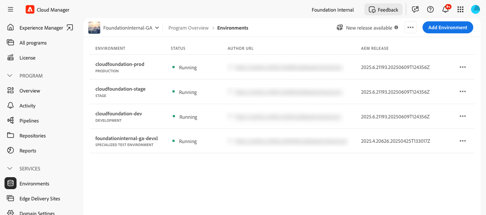

# 将 AEM 中的内容恢复为云服务 {#content-restore}

您可以使用云管理器从备份中将 AEM 还原为云服务内容。

Cloud Manager 的自助恢复过程将数据从 Adobe 系统备份中复制并还原到其原始环境。执行恢复，将丢失、损坏或意外删除的数据返回到其原始状态。

恢复过程只影响内容，而不会更改您的代码和 AEM 版本。您可以随时启动单个环境的恢复操作。

如果需要以简单快捷的方式还原以前部署的源代码，而无需开始新的管道执行，则可以使用 [“还原已部署](/help/operations/restore-previous-code-deployed.md)的先前代码”。

Cloud Manager 提供两种类型的备份，您可以从中恢复内容。

* **时间点 （PIT）：** 此选项可还原过去 24 小时内捕获的连续备份。
* **上周：** 此类型在过去七天内从系统备份进行恢复，但前 24 小时除外。

在这两种情况下，自定义代码版本和 AEM 版本均保持不变。

>[!TIP]
>
>也可以使用公共 API[ 还原备份](https://developer.adobe.com/experience-cloud/cloud-manager/reference/api/)。

>[!WARNING]
>
>* 仅当代码或内容存在严重问题时，才应使用此功能。
>* 还原备份会删除在该备份之后添加的所有数据。 “暂存”也会恢复到以前的版本。
>* 在启动内容还原之前，请考虑其他选择性内容还原选项。

## 选择性内容恢复选项 {#selective-options}

在还原到完整内容还原之前，请考虑以下选项以更轻松地还原内容。

* 如果已删除路径的包可用，请使用包管理器[再次](/help/implementing/developing/tools/package-manager.md)安装该包。
* 如果删除的路径是站点中的页面，请使用 [恢复树功能](/help/sites-cloud/authoring/sites-console/page-versions.md)。
* 如果删除的路径是 assets 文件夹，并且原始文件可用，请通过 [Assets 控制台](/help/assets/add-assets.md)重新上传。
* 如果删除的内容是资产，请考虑 [恢复资产](/help/assets/manage-digital-assets.md)的先前版本。

如果上述选项都不起作用，并且已删除路径的内容很重要，请按照以下部分中所述执行内容还原。

## 创建用户角色 {#user-role}

默认情况下，没有用户有权在开发、生产或暂存环境中执行内容还原。 若要将此权限委派给特定用户或组，请使用以下常规步骤。

1. 使用引用内容恢复的表达性名称创建产品配置。
1. **提供所需程序的程序访问权限**。
1. **根据您的用例，为程序的所需环境或所有环境提供环境还原创建**&#x200B;权限。
1. 将用户分配到该配置文件。

有关管理权限的详细信息，请参阅 [自定义权限](/help/implementing/cloud-manager/custom-permissions.md)。

## 还原环境的内容 {#restoring-content}

>[!NOTE]
>
>用户必须具有 [适当的权限](#user-role) 才能启动还原作。

**要恢复环境的内容，请执行以下作：**

1. 在 [my.cloudmanager.adobe.com](https://my.cloudmanager.adobe.com/) 登录 Cloud Manager 并选择适当的组织。

1. 单击要为其启动还原的程序。

1. 通过执行下列作之一列出程序的所有环境：

   * 从左侧菜单中的“服务”下&#x200B;**，单击“数据”**&#x200B;图标“环境&#x200B;**”。**

     

   * 在左侧菜单中的“程序”下&#x200B;**，单击“概述**”**，然后在“环境**”卡中&#x200B;**，单击“工作流”图标“**&#x200B;全部显示&#x200B;**”。**

     

     >[!NOTE]
     >
     >“环境”****&#x200B;卡仅列出三个环境。单击卡片中的“全部&#x200B;**显示”**&#x200B;以查看&#x200B;*程序的所有*&#x200B;环境。

1. 在“环境”表中，在要还原其内容的环境的右侧，单击“更多”，然后单击“还原内容&#x200B;**”。**

   

1. 在环境页面的“ **还原内容** ”选项卡上的“ **还原** 时间”下拉列表中，选择还原的时间范围。

   

   * 如果选择了 **“过去 24 小时**”，请在相邻 **的“时间** ”字段中指定过去 24 小时内要还原的确切时间。
   * 如果您选择“上周&#x200B;**”**，则在相邻&#x200B;**的“日期**”字段中，选择过去 7 天内的日期（不包括前 24 小时）。

1. 选择日期或指定时间后，**备份可用**&#x200B;以下部分显示了可恢复的可用备份列表

1. 单击  以查看其代码版本和AEM版本，然后在选择备份之前权衡还原影响（请参阅 [选择正确的备份](#choosing-backup)）。

   

   为还原选项显示的时间戳基于用户的计算机时区。

1. 在表示要还原的备份的行的右端，单击“旋转 CCW 粗体”或“还原以开始还原过程。

1. 查看“**恢复内容**”对话框中的详细信息，然后单击“恢复&#x200B;**”。**

   

备份过程已启动。 您可以在“ **[还原活动](#restore-activity)** ”列表中查看其状态。 恢复操作完成所需的时间取决于要恢复的内容的大小和配置文件。

还原成功完成后，环境将执行以下作：

* 运行与启动还原作时相同的代码和 AEM 版本。
* 它具有在所选快照的时间戳处可用的相同内容，并重新构建索引以匹配当前代码。

## 选择正确的备份 {#choosing-backup}

Cloud Manager 的自助服务恢复过程仅将内容恢复到 AEM。因此，必须仔细考虑在所需还原点和当前时间之间进行的代码更改。 查看当前提交 ID 和要还原到的提交 ID 之间的提交历史记录。

有几种情况。

* 环境自定义代码和还原位于同一存储库和同一分支上。
* 环境自定义代码和还原共享一个存储库，使用单独的分支，并且源自一个共同提交。
* 环境自定义代码和还原位于不同的存储库中。
   * 在这种情况下，不会显示提交 ID。
   * Adobe 强烈建议您克隆两个存储库并使用 diff 工具比较分支。

此外，请记住，还原可能会导致生产和过渡环境不同步。 恢复内容的后果由您负责。

## 恢复活动 {#restore-activity}

**还原活动**&#x200B;列表显示最近十个恢复请求的状态，包括任何活动的恢复操作。

通过单击  ，可以下载该备份的日志并检查代码详细信息，包括在启动还原时快照和数据之间的差异。

## 异地备份 {#offsite-backup}

常规备份涵盖 AEM Cloud Service 中意外删除或技术故障的风险，但区域故障可能会带来其他风险。除了可用性外，此类区域中断的最大风险是数据丢失。

AEM即云服务可减轻所有AEM生产环境的这种风险。 也就是说，它会连续地将所有 AEM 内容复制到远程区域。 此过程使内容在三个月内可供恢复。 此功能称为异地备份。

AEM 服务可靠性工程可在数据区域中断期间从异地备份中恢复暂存和生产 AEM 云服务环境。

## 数据区域映射原则 {#data-region-mapping-principles}

Adobe 遵循一组内部准则来确定 AEM 即云服务&#x200B;**的数据**&#x200B;区域映射。这些准则旨在支持运营效率，确保符合区域法规要求，并在全球市场提供一致的客户体验。

### 区域映射透明度 {#region-mapping-transparency}

Adobe 不会公开披露详细的区域到区域映射信息。\
如果客户对区域部署、数据驻留或合规性影响有具体或合理的疑问，建议通过官方支持或帐户渠道直接与 Adobe 联系。

### 数据区域映射的核心原则 {#core-principles}

在确定合适的数据区域映射时，Adobe 会应用几个优先条件：

1. **不要离开全球区域**\
   部署保留在全球主要区域之一：亚太地区、欧洲、中东和非洲&#x200B;****&#x200B;以及美洲&#x200B;**。******

2. **不要离开大陆**\
   只要有可能，数据复制和故障转移都保留在同一大洲。

3. **不要离开这个国家**\
   如果技术上可行，数据将保留在同一国界内。

### 处理异常 {#handling-exceptions}

当由于技术或基础设施限制而无法满足上述条件时，Adobe 会应用其他注意事项：

* **欧洲特定指南**\
  备份或次要区域不应位于非欧盟国家/地区。\
  （相反的情况 - 使用欧盟国家作为非欧盟主要国家的备份 - 如果没有更好的同国选项，可能是可以接受的。

* **避开某些地区**\
  应避免将数据策略限制性或监管风险较高的区域作为备份或故障转移位置。

如果客户需要澄清或有合规性驱动的需求，Adobe 建议您联系 Adobe 帐户团队或支持组织，以获取针对其特定情况量身定制的指导。

## 限制 {#limitations}

自助恢复机制的使用受以下限制。

* 恢复操作限制为七天，这意味着无法恢复七天以前的快照。
* 每个日历月，一个计划中的所有环境最多允许 10 次成功恢复。
* 创建环境后，需要 6 个小时才能创建第一个备份快照。在创建此快照之前，不能对环境执行恢复。
* 如果当前为环境运行完整堆栈或 Web 层配置管道，则不会启动还原作。
* 如果同一环境中已运行另一个还原，则无法启动还原。
* 在极少数情况下，由于备份时间限制为 24 小时/7 天，因此所选备份可能由于从选择备份到启动恢复之间的延迟而变得不可用。
* 来自已删除环境的数据将永久丢失且无法恢复。
