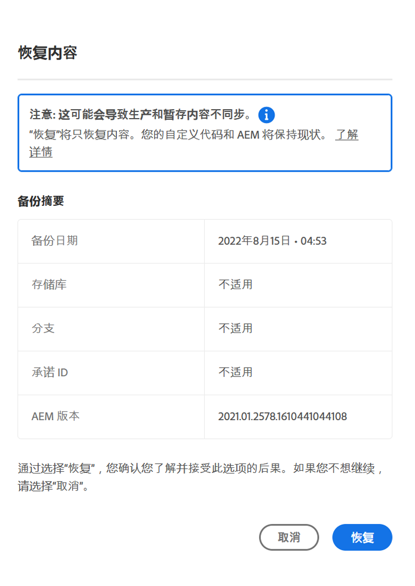

# 在AEM as a Cloud Service中恢复内容 {#content-restore}

您可以使用Cloud Manager从备份中恢复AEM as a Cloud Service内容。

## 概述 {#overview}

Cloud Manager 的自助恢复过程将数据从 Adobe 系统备份中复制并还原到其原始环境。执行恢复，将丢失、损坏或意外删除的数据返回到其原始状态。

恢复过程只影响内容，而不会更改您的代码和 AEM 版本。您可以随时启动单个环境的恢复操作。 （如果您需要轻松快速地恢复以前部署的源代码，而无需启动新的管道执行，则可以使用[恢复以前部署的代码](/help/operations/restore-previous-code-deployed.md)）。

Cloud Manager 提供两种类型的备份，您可以从中恢复内容。

* **时间点(PIT)：**&#x200B;此选项还原过去24小时内捕获的连续备份。
* **上周：** 此类型在过去七天内从系统备份进行恢复，但前 24 小时除外。

在这两种情况下，自定义代码版本和 AEM 版本均保持不变。

>[!TIP]
>
>还可以使用公共API[还原备份](https://developer.adobe.com/experience-cloud/cloud-manager/reference/api/)。

>[!WARNING]
>
>* 仅当代码或内容存在严重问题时，才应使用此功能。
>* 恢复备份会删除在该备份之后添加的任何数据。 暂存也恢复到其以前的版本。
>* 在启动内容恢复之前，请考虑其他选择性内容恢复选项。

## 选择性内容恢复选项 {#selective-options}

在还原到完全内容还原之前，请考虑以下选项以更轻松地还原您的内容。

* 如果已删除路径的包可用，请使用[包管理器](/help/implementing/developing/tools/package-manager.md)再次安装该包。
* 如果删除的路径是Sites中的页面，请使用[还原树功能](/help/sites-cloud/authoring/sites-console/page-versions.md)。
* 如果删除的路径是一个资源文件夹，并且原始文件可用，请通过[Assets控制台](/help/assets/add-assets.md)重新上传它们。
* 如果删除内容是资源，请考虑恢复[资源的早期版本](/help/assets/manage-digital-assets.md)。

如果以上选项都不起作用，并且已删除路径的内容很重要，请按照以下部分中的详细说明执行内容恢复。

## 创建用户角色 {#user-role}

默认情况下，没有任何用户有权在开发、生产或暂存环境中执行内容恢复。 要将此权限委派给特定用户或组，请使用以下常规步骤。

1. 创建一个产品配置文件，其表达式名称引用了内容恢复。
1. 提供所需程序的&#x200B;**程序访问权限**&#x200B;权限。
1. 根据您的用例，对程序的所需环境或所有环境提供&#x200B;**环境还原创建**&#x200B;权限。
1. 将用户分配给该配置文件。

有关管理权限的详细信息，请参阅[自定义权限](/help/implementing/cloud-manager/custom-permissions.md)。

## 恢复环境的内容 {#restoring-content}

>[!NOTE]
>
>用户必须具有[适当的权限](#user-role)才能启动还原操作。

**还原环境的内容：**

1. 在 [my.cloudmanager.adobe.com](https://my.cloudmanager.adobe.com/) 登录 Cloud Manager 并选择适当的组织。

1. 单击要启动还原的程序。

1. 通过执行以下操作之一，列出程序的所有环境：

   * 从左侧菜单的&#x200B;**服务**&#x200B;下，单击 **环境**。

     

   * 从左侧菜单的&#x200B;**程序**&#x200B;下，单击&#x200B;**概述**，然后从&#x200B;**环境**&#x200B;信息卡中，单击 **显示所有**。

     

     >[!NOTE]
     >
     >**环境**&#x200B;信息卡仅列出三个环境。 单击卡片中的&#x200B;**显示全部**&#x200B;以查看程序的&#x200B;*全部*&#x200B;环境。

1. 在“环境”表格中，在要恢复其内容的环境的右侧，单击，然后单击&#x200B;**恢复内容**。

   从省略号菜单

1. 在环境页面的&#x200B;**还原内容**&#x200B;选项卡的&#x200B;**还原时间**&#x200B;下拉列表中，选择还原的时间范围。

   

   * 如果您在相邻的&#x200B;**时间**&#x200B;字段中选择&#x200B;**最近24小时**，请指定最近24小时内的确切时间来恢复。
   * 如果您在相邻的&#x200B;**天**&#x200B;字段中选择&#x200B;**上周**，请选择过去七天内的日期（不包括之前的24小时）。

1. 选择日期或指定时间后，**备份可用**&#x200B;以下部分显示了可恢复的可用备份列表

1. 单击备份旁边的以查看其代码版本和AEM版本，然后在选择备份之前权衡还原影响（请参阅[选择正确的备份](#choosing-backup)）。

   

   为还原选项显示的时间戳基于计算机的用户时区。

1. 在表示要还原的备份的行右端，单击开始还原过程。

1. 查看&#x200B;**还原内容**&#x200B;对话框中的详细信息，然后单击&#x200B;**还原**。

   

备份过程已启动。 您可以在&#x200B;**[还原活动](#restore-activity)**&#x200B;列表中查看其状态。 恢复操作完成所需的时间取决于要恢复的内容的大小和配置文件。

成功完成恢复后，环境将执行以下操作：

* 运行与启动还原操作时相同的代码和AEM版本。
* 它具有与所选快照的时间戳上可用的内容相同，并重新构建索引以匹配当前代码。

## 选择正确的备份 {#choosing-backup}

Cloud Manager 的自助服务恢复过程仅将内容恢复到 AEM。因此，您必须仔细考虑在所需还原点与当前时间之间所做的代码更改。 查看当前提交ID与要还原到的提交ID之间的提交历史记录。

有几种情况。

* 环境自定义代码和还原位于同一存储库和同一分支上。
* 环境自定义代码和还原共享一个存储库，使用单独的分支，并源自公共提交。
* 环境自定义代码和还原位于不同的存储库中。
   * 在这种情况下，不会显示提交ID。
   * Adobe强烈建议您克隆两个存储库，然后使用差异工具来比较分支。

此外，请记住，恢复可能会导致您的生产和暂存环境不同步。 恢复内容的后果由您负责。

## 恢复活动 {#restore-activity}

**还原活动**&#x200B;列表显示最近十个恢复请求的状态，包括任何活动的恢复操作。

通过单击备份的，您可以下载该备份的日志并检查代码详细信息，包括在启动还原时快照和数据之间的差异。

## 异地备份 {#offsite-backup}

常规备份涵盖 AEM Cloud Service 中意外删除或技术故障的风险，但区域故障可能会带来其他风险。除了可用性外，此类区域中断的最大风险是数据丢失。

AEM as a Cloud Service缓解了所有AEM生产环境的这一风险。 也就是说，它可以不断将所有AEM内容复制到远程区域。 此过程可使内容在三个月内可用于恢复。 此功能称为异地备份。

AEM服务可靠性工程部门在数据区域中断期间，从异地备份中恢复暂存和生产AEM Cloud Service环境。

## 限制 {#limitations}

自助恢复机制的使用受以下限制。

* 恢复操作限制为七天，这意味着无法恢复七天以前的快照。
* 每个日历月，一个计划中的所有环境最多允许 10 次成功恢复。
* 创建环境后，需要 6 个小时才能创建第一个备份快照。在创建此快照之前，不能对环境执行恢复。
* 如果当前为环境运行了完整栈栈或Web层配置管道，则不会启动还原操作。
* 如果同一环境中已运行另一个还原，则无法启动还原。
* 在极少数情况下，由于备份时间限制为 24 小时/7 天，因此所选备份可能由于从选择备份到启动恢复之间的延迟而变得不可用。
* 来自已删除环境的数据将永久丢失且无法恢复。
