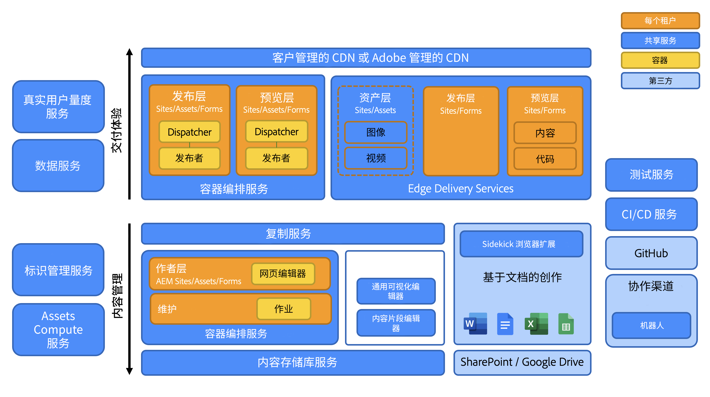
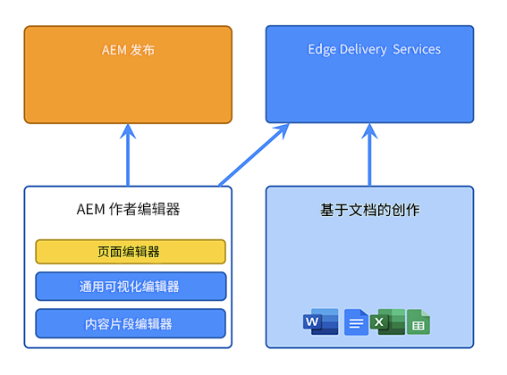
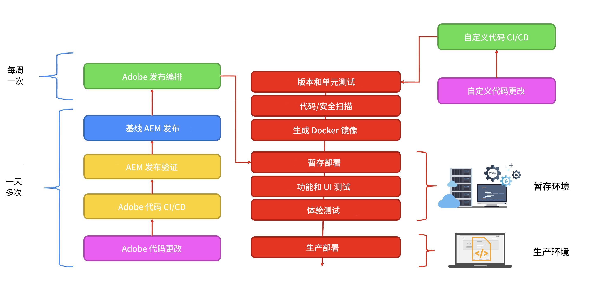

# Adobe Experience Manager as a Cloud Service 的架构简介 {#an-introduction-to-the-architecture-adobe-experience-manager-as-a-cloud-service}

>[!CONTEXTUALHELP]
>id="intro_aem_cloudservice_architecture"
>title="AEM as a Cloud Service 架构简介"
>abstract="在此选项卡中，您可以查看 AEM as a Cloud Service 的新架构并了解更改。AEM 产生了一种动态架构，其中具有可变数量的图像，因此花时间了解云架构很重要。"
>additional-url="https://video.tv.adobe.com/v/330542/" text="架构概述"

Adobe Experience Manager (AEM) as a Cloud Service 提供一组可组合的服务，以创建和管理极具影响力的体验。

本页面介绍 AEM as a Cloud Service 的逻辑架构、服务架构、系统架构和开发架构。

## 逻辑架构 {#logical-architecture}

AEM as a Cloud Service 由 AEM Sites、AEM Assets 和 AEM Forms 等高级解决方案组成。虽然单独许可这些服务，但可协同使用它们。每个解决方案都使用 AEM as a Cloud Service 提供的可组合服务的某种组合，具体取决于其各自的用例。

### 项目 {#programs}

AEM 应用程序具体表现为您根据自身的许可权利在 Cloud Manager 应用程序中创建的[项目](/help/implementing/cloud-manager/getting-access-to-aem-in-cloud/program-types.md)。利用这些项目，可以在特定项目的上下文中完全控制关联的 AEM 应用程序的命名和配置方式以及权限的分配方式。

Adobe 一般将客户视为&#x200B;**租户**，也称为 *IMS 组织* (Identity Management System)。租户需要多少个项目，就能许可多少个项目。例如，一般可看到 AEM Assets 有一个主要项目，而可在与多种在线体验对应的多个项目中使用 AEM Sites。

>[!NOTE]
>
>AEM Edge Delivery Services 在 Cloud Manager 中显示为顶级解决方案，而从许可的角度来看，它是其他主要解决方案的一部分。例如，具有 Edge Delivery Services 的 AEM Sites。

可用高级解决方案的任意组合配置项目，并且每个解决方案可支持一个到多个附加组件。例如，适用于 AEM Sites 的 Commerce 或 Screens、适用于 AEM Assets 的 Dynamic Media 或 Brand Portal。

### 环境 {#environments}

用 AEM Sites、AEM Assets 或 AEM Forms 解决方案创建一个项目后，将在此项目中以 AEM 环境的形式表示关联的 AEM 实例。

AEM as a Cloud Service 有四种类型的[环境](/help/implementing/cloud-manager/manage-environments.md)可用：

* 生产环境：

   * 生产环境为业务从业者托管应用程序并运行实时体验。

* 暂存环境：

   * 暂存环境一般以 1:1 的关系与生产环境相结合。
   * 暂存环境主要旨在执行自动化测试后再将对应用程序作出的更改推送到生产环境。
      * 这与 Adobe 在维护更新中发起的更改或由您的代码部署发起的更改无关。
      * 在代码部署的情况下，您还可执行手动测试。
   * 一般使用自助内容复制功能将暂存环境的内容与生产内容保持同步。
* 开发环境：
   * 利用开发环境，开发人员能够在与暂存环境和生产环境相同的运行时条件下实施和测试 AEM 应用程序。
   * 这些更改经历一个部署管道，其中的代码质量和安全审核可达到生产部署管道中的相同水平。
* 快速开发环境 (RDE)：
   * 通过 RDE 环境，可在将新代码或现有代码部署到 RDE 实例中时快速地进行开发迭代，无需经历常规开发环境中的正式部署管道。

### Edge Delivery Services {#logical-architecture-edge-delivery-services}

也可以使用 [Edge Delivery Services](/help/edge/overview.md) 配置 AEM 项目。

配置后，AEM 可以引用用于通过 Edge Delivery Services 构建体验的 GitHub 代码存储库。于是，相关的体验将有新的配置选项可用。其中包括设置 Adobe 管理的 CDN 以及访问许可量度或 SLA 报告。

## 服务架构 {#service-architecture}

可用两个区段表示 AEM as a Cloud Service 中高级可组合服务的列表 - 内容管理和体验投放：

对于内容管理，主要有两组内容用于创作服务，二者都表现为&#x200B;*内容源*：

* AEM 创作层：
提供一个基于 Web 的界面（具有关联的 API）以管理 Web 内容。这对于两种方法都起作用：
   * Headful - 通过页面编辑器和 Universal Editor
   * Headless - 通过内容片段编辑器
* 基于文档的创作层：
使您可使用标准应用程序创作内容，如：
   * Microsoft Word 和 Excel - 通过 SharePoint
   * Google 文档和表格 - 通过 Google 云端硬盘

对于体验投放，在使用 AEM Sites 或 AEM Forms 时，也是主要有两组服务互不排斥，并在一个共用的受 Adobe 管理的 CDN（内容交付网络）下作为不同的源运行：

* AEM 发布层：
   * 运行一个由标准 AEM 发布程序和调度程序组成的场，使得可动态地渲染与已发布的内容组装在一起的网页和 API 内容（例如 GraphQL）。
   * 主要基于服务器端应用程序逻辑。
* Edge Delivery 发布层：
   * 使得可动态地渲染来自多种内容源（如 AEM 创作层或基于文档的创作层）的网页和 API 内容。
   * 基于客户端应用程序逻辑，旨在尽量提高性能。

还有若干关键的相邻服务：

* Edge Delivery 资源层：
   * 使得可从 AEM Assets 投放已批准并发布的媒体项。例如，图像和视频。
   * 一般从运行在 AEM 发布层或 Edge Delivery 发布层上的体验引用媒体项，或从任何其他与 AEM Assets 集成的 Adobe Experience Cloud 应用程序引用媒体项。
* AEM 预览层和 Edge Delivery Services 预览层：
   * 还适用于分别使用 AEM 发布层或 Edge Delivery 发布层构建的体验。
   * 使内容作者可在发布操作之前在上下文中预览内容。

>[!NOTE]
>
>默认情况下，仅限资源的项目没有发布层，也没有预览层。

还有若干其他相邻服务：

* 复制服务：
   * 位于内容管理层和体验投放层之间。
   * 负责处理由内容作者发出的&#x200B;*发布*&#x200B;操作，然后将发布的内容提供给发布层（AEM 或 Edge Delivery）。

  >[!NOTE]
  >由于不再使用 AEM 的低版本中的复制框架发布内容，因此复制服务经历了一个与 AEM 的 6.x 版相比完全重新设计的过程。
  >
  >最新架构基于一种&#x200B;*发布和订阅*&#x200B;方法，其中具有基于云的内容队列。对于 AEM 发布层，它使得可变数量的发布者可订阅发布内容，并且是实现真实而快速地自动扩展 AEM as a Cloud Service 的重要组成部分

* 内容存储库服务：
   * 供 AEM 创作层使用。
   * 是符合 JCR 标准的内容存储库的一个基于云的实例，并由 Apache Oak 技术实现。
   * 内容是否持久主要依靠基于 Blob 的云存储。
* CI/CD 服务：
   * 代表专用于管理部署到 AEM 环境的管道的 Cloud Manager 功能子集。
* 测试服务：
   * 代表用于执行以下测试的底层基础设施：
      * 功能测试、
      * UI 测试：例如，基于 Selenium 或 Cypress 脚本、
      * 体验审核测试：例如，Lighthouse 分数、

     作为部署到 AEM 环境的管道的一部分，或作为对 Edge Delivery 代码存储库的 GitHub 拉取请求的一部分。
* 数据服务：
   * 负责公开客户数据，例如许可量度（例如内容请求、存储、用户）或使用情况报告（例如上传和下载次数）。
   * 可通过 API 公开客户数据，也可在产品用户界面（如 Cloud Manager）中公开客户数据。
* Real-User Metric (RUM) 服务：
   * 负责从客户体验收集关键量度（如页面查看次数、Core Web Vital、转化事件数）并对相关的查询（例如过去 7 天内给定域的页面查看次数前几名）作出回应。
* 资源计算服务：
   * 负责处理上传的图像、视频和文档；例如，PDF 和 Adobe Photoshop 文件。处理操作可使用 Adobe Sensei 提取图像和视频元数据（例如描述性标记或原色色调），然后通过访问 Adobe Photoshop 和 Adobe Lightroom API 等 API 生成演绎版（如各种大小或格式）。
* Identity Management Service (IMS)：
   * 集中在一处负责为给定的 Adobe Experience Cloud 应用程序（例如，Cloud Manager 或 AEM 创作层）管理用户和用户组以及验证其身份。
   * 通过 Adobe Admin Console 被访问。

## 系统架构 {#system-architecture}

### AEM 创作层、预览层和发布层 {#aem-author-preview-publish-tiers}

作为一组 Docker 容器实现 AEM 创作层和发布层，并由标准容器编排服务操作它们。由此产生的容器化架构意味着一个完全动态的系统，其中 Pod 的数量可变，具体取决于实际活动（对于内容管理）和实际流量（对于体验投放）。这样使得 AEM as a Cloud Service 可适应您不断变化的流量模式。

作为共用一个内容存储库的一群 AEM 创作 Pod 操作 AEM 创作层。当正在运行维护任务或正在进行部署过程时，至少要有两个 Pod 才能保证业务连续性。

作为 AEM 发布实例的场操作 AEM 发布层，其中每个实例对于已发布的内容都有自己的内容存储库。每个发布者都与一个配有 AEM Dispatcher 模块的 Apache 实例相结合，以供具体地查看内容，并充当受 Adobe 管理的 CDN 的来源。还至少要有两个 Pod 才能保证业务连续性，但在大流量时期看到此数字变大也并不罕见。

AEM 预览层由单个 AEM 节点构成。这用于在发布到发布层之前保证内容质量。预览层偶尔会发生停机，尤其是在部署期间。

### Edge Delivery Services {#system-architecture-edge-delivery-services}

在 CDN 和无服务器基础设施之上操作 Edge Delivery Services，以供高效地组装页面。在请求资源时，无服务器基础设施负责将发布的内容转换为语义 HTML，并充当 CDN 的来源。

将从 AEM 创作层或基于文档的创作环境提供的已发布内容转换为语义 HTML。

下图说明如何在 Microsoft Word 中编辑 Sites 内容（基于文档的创作）并将其发布到 Edge Delivery。其中还展示使用各种编辑器的传统 AEM 发布方法。

由于 Edge Delivery Services 是 Adobe Experience Manager 的一部分，因此 Edge Delivery、AEM Sites 和 AEM Assets 可在相同的域上共存。这是大型网站的常见用例。例如，客户可能要将特定的大流量页面迁移到 Edge Delivery Services，而所有其他页面仍可能保留在 AEM 发布层上。

## 开发架构 {#development-architecture}

### 代码存储库 {#code-repositories}

AEM 项目的代码和配置存储在一个代码存储库中，在作出更改时从该存储库发出部署管道。代码存储库有若干不同的类型：

* AEM 全栈：
   * 用于存储 AEM 创作层和发布层的服务器端 Java 代码和 OSGI 配置。
* AEM 前端：
   * 用于存储 AEM 创作层和发布层的客户端 JS、CSS 和 HTML 代码。
有关 clientlibs 的更多详细信息，请参阅[在 AEM as a Cloud Service 上使用客户端库](/help/implementing/developing/introduction/clientlibs.md)。
* AEM Web 层：
   * 存储 AEM 发布层的调度程序配置文件。
* AEM 配置：
   * 使得可存储 AEM 发布层和 Edge Delivery Services 发布层的各种配置选项（如 CDN 设置或维护任务设置）。
* AEM Edge Delivery：
   * 用于存储使用 Edge Delivery Services 构建的站点的客户端 JS、CSS 和 HTML 代码

### 部署管道 {#deployment-pipelines}

开发人员和管理员使用通过 Cloud Manager 提供的持续集成/持续交付 (CI/CD) 服务管理 AEM as a Cloud Service 应用程序。Cloud Manager 还公开与监测、维护、疑难解答（例如，访问日志文件）和许可相关的任何内容。

Cloud Manager 管理对您的 AEM as a Cloud Service 实例的所有更新。由于只有这样才能构建、测试客户应用程序和将其部署到创作层、预览层和发布层，因此必须这样做。可在 AEM Cloud Service 的新版本准备就绪时或在您的应用程序的新版本准备就绪时，由 Adobe 或您自己触发这些更新。

通过与项目中的每个环境相结合的部署管道实现这一点。Cloud Manager 管道在运行时为创作层和发布层都创建客户应用程序的一个新版本。通过将最新的客户包与最新的基准 Adobe 映像组合在一起实现这一点。

当客户正在更改代码或当 Adobe 正在部署新的维护版本时触发部署管道。

在这两种情况下都执行同一组自动化测试。它由以下测试组成：

* Adobe 提供的测试，用于确保产品完整性
* 客户提供的测试
   * 功能测试：通过对 AEM 创作层或发布层的 http 请求
   * UI 测试：基于 Selenium 或 Cypress 技术

在暂存环境上运行这些自动化测试 - 因此使暂存环境内容尽可能靠近生产实例上的内容很重要。

一旦成功通过所有测试，即将新代码部署到生产环境。

### 滚动更新 {#rolling-updates}

Cloud Manager 通过使用滚动更新模式更新所有服务节点，完全自动化地割接到 AEM 应用程序的最新版本。这意味着创作或发布服务&#x200B;**不会出现停机**。

## AEM 6.x 以来的重大创新 {#major-innovations-since-aem-6x}

与前几代产品（AEM 6.x 和更低版本）相比，AEM as a Cloud Service 的最新架构引入了一些根本性的变化和创新：

* 所有文件直接上传到云数据存储，并直接从云数据存储提供所有文件。关联的位流从不经过 AEM 创作和发布服务的 JVM。于是 AEM 创作和发布服务的节点可变得更小，并因此更符合快速自动缩放的预期。对于业务从业者而言，这样可体验更快地上传和下载图像、视频和其他任务。

* 现在，包括发布内容的所有操作都包含一个遵循订阅模式的管道。已发布内容会推送到管道中的各个队列，发布服务的所有节点都会订阅这些队列。因此，创作层无需了解发布服务中的节点数；这样可以快速自动缩放发布层。

* 该架构将应用程序内容与应用程序代码和配置完全分离。所有代码和配置几乎都不可更改，并且都植入到用于创建各种创作和发布服务节点的基准图像中。因此，可以绝对保证每个节点都相同，并且只能通过运行 Cloud Manager 管道在全局范围内对代码和配置进行更改。

* 此架构包括多种在无服务器技术上（尤其用 Adobe I/O 运行时）构建的微服务

## 更多信息 {#further-information}

另请参阅：

* Edge Delivery Services：

   * [AEM as a Cloud Service 概述 - 带 Edge Delivery Services](/help/edge/overview.md)
   * [使用 Edge Delivery Services](/help/edge/using.md)
   * [探索带 Edge Delivery Services 的 AEM as a Cloud Service 的底层架构和重要部分](https://experienceleague.adobe.com/docs/experience-manager-learn/cloud-service/introduction/architecture.html?lang=zh-Hans)
