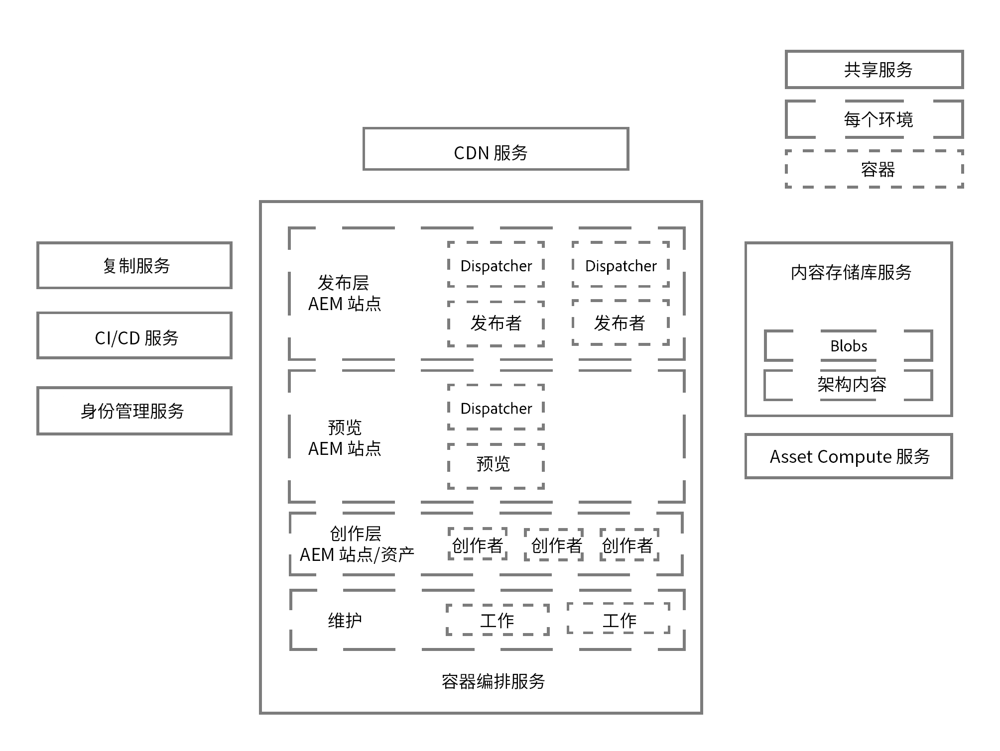
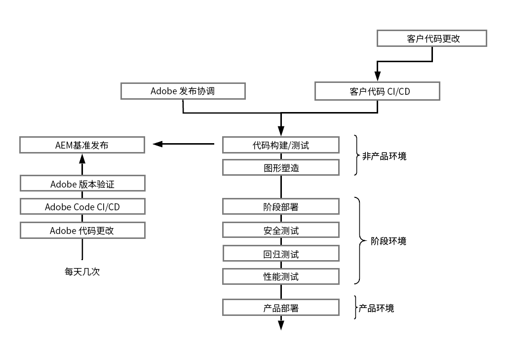
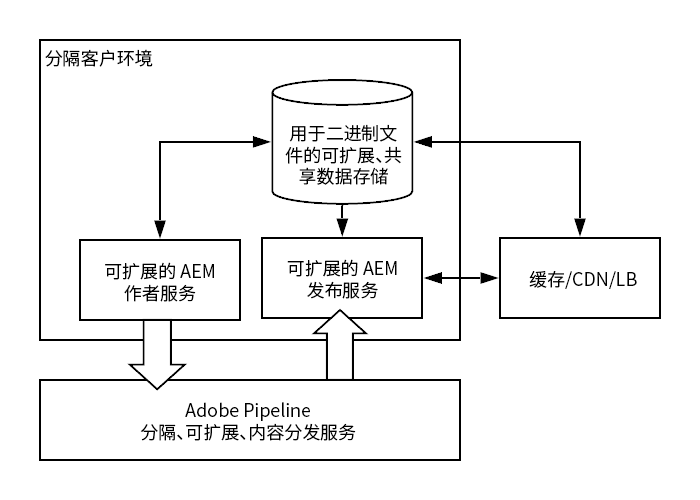

# Adobe Experience Manager as a Cloud Service 的架构简介 {#an-introduction-to-the-architecture-adobe-experience-manager-as-a-cloud-service}

>[!CONTEXTUALHELP]
>id="intro_aem_cloudservice_architecture"
>title="AEM as a Cloud Service 架构简介"
>abstract="在此选项卡中，您可以查看 AEM as a Cloud Service 的新架构并了解更改。AEM 带来了具有可变数量图像的动态架构，因此花时间了解云架构是很重要的"
>additional-url="https://video.tv.adobe.com/v/330542/" text="架构概述"

Adobe Experience Manager (AEM) as a Cloud Service 已对架构进行了更改。

## 缩放 {#scaling}

AEM as a Cloud Service 现在具有：

* 具有可变数量的 AEM 图像的动态架构。

此架构：

* 可根据&#x200B;*实际*&#x200B;流量和&#x200B;*实际*&#x200B;活动进行缩放。

* 各个实例仅在需要时运行。

* 使用模块化应用程序。

* 默认具有创作聚类；这可避免执行维护任务时出现停机。

此项可为不同的使用模式启用自动缩放功能：

要实现此操作，为 AEM as a Cloud Service 创建的所有实例都是相同的，每个实例在节点数、分配的内存和分配的计算容量方面都具有相同的默认大小调整特征。

AEM as a Cloud Service 基于使用一个编排引擎，该引擎可以：

* 持续监测服务状态。

* 根据实际需要动态缩放每个服务实例；根据需要进行放大或缩小。

此功能：

* 适用于每个节点的节点数、内存量和分配的 CPU 容量。

* 允许 AEM as a Cloud Service 随流量模式变化进行对其进行调整。

可以在两个坐标轴上自动或手动缩放服务的每个租户实例：

* 垂直：对于固定数量的节点，可以放大或缩小已分配的内存和 CPU 容量。

* 水平：可以增加或减少给定服务的节点数。

## 环境 {#environments}

>[!NOTE]
>有关详细信息，请参阅[部署 - 运行模式](/help/implementing/deploying/overview.md#runmodes)

AEM as a Cloud Service 可用作单个实例，每个实例代表一个完整的 AEM 环境。

AEM as a Cloud Service 可提供三种类型的环境：

* **生产环境**：为业务从业者托管应用程序。

* **暂存环境**：始终以 1:1 的关系与单个生产环境成对出现。在将对应用程序所做的更改推送到生产环境之前，可先通过暂存环境进行各种性能和质量测试。

* **开发环境**：允许开发人员在与暂存环境和生产环境相同的运行时条件下实施 AEM 应用程序。

   有关更多详细信息，请参阅[管理环境](https://experienceleague.adobe.com/docs/experience-manager-cloud-service/implementing/using-cloud-manager/manage-environments.html?lang=zh-hans#using-cloud-manager)。

## 程序 {#programs}

任何新 AEM 项目始终只能绑定到一个特定的代码库，您可以在该代码库中存储项目的配置和自定义代码。此信息存储在代码存储库中，可通过常用 Git 客户端访问，并在创建新程序时提供给您使用。

AEM 程序是包含以下内容的容器：

| 程序元素 | 个数 |
|--- |--- |
| 代码存储库 (Git) |  1 |
| 基准图像（站点或资产） |  1 |
| 暂存和生产环境集 (1:1) | 0 或 1 |
| 非生产环境（开发或演示） | 0 到 N |
| 每个环境的管道 | 0 或 1 |

AEM as a Cloud Service 最初提供两种类型的程序：

* AEM 云站点服务

* AEM 云资产服务

这两类程序都允许访问许多特性和功能。所有程序的创作层将包含所有 Sites 和 Assets 功能，但 Assets 程序默认将没有发布层和预览层。

## 运行时架构 {#runtime-architecture}

此新架构包含各种主要组件：

<!--- needs reworking -->

* 对于 AEM Sites as a Cloud Service：

   * 每个环境（在高级别）仍存在创作层和发布层的概念。

   * 创作层由单个创作聚类中的两个或多个节点组成。它会根据创作活动自动缩放。

      * 内容作者/创建者可登录 AEM 创作层来创建、编辑和管理内容。

      * 登录到创作层由 Adobe Identity Management Services (IMS) 进行管理。

      * 资产集成和处理会使用专用的资产计算服务。
   * 预览层由单个预览节点构成。这用于在发布到发布层之前保证内容质量。

   * 发布层由单个发布场中的两个或多个节点组成：它们可以相互独立地运作。每个节点均由一个 AEM 发布者和一个配备 AEM 调度程序模块的 Web 服务器组成。它可根据站点流量需求自动缩放。

      * 最终用户或站点访客可通过 AEM 发布服务访问网站。

* 对于 AEM Assets as a Cloud Service：

   * 该架构仅包括创作环境。

* 创作层、预览层和发布层均可读取和保留往来于内容存储库服务的内容。

   * 发布层和预览层只从持久层读取内容。

   * 创作层可读写往来于持久层的内容。

   * blob 存储可在发布层、预览层和创作层之间共享；不会&#x200B;*移动*&#x200B;文件。

   * 内容获得创作层的批准即表示内容可以被激活，因此可以推送到发布层持久层，或（可选）推送到预览层。此操作可通过复制服务（一个中间件管道）实现。该管道通过订阅了推送到管道的内容的单独发布服务（或预览服务）节点接收新内容。

      >[!NOTE]
      >
      >有关更多详细信息，请参阅[复制](/help/operations/replication.md)。

   * 开发人员和管理员可使用 [Cloud Manager](/help/overview/what-is-new-and-different.md#cloud-manager) 提供的连续集成/连续交付 (CI/CD) 服务管理 AEM as a Cloud Service 应用程序。这包括代码和使用 Cloud Manager 的 CI/CD 管道进行的配置部署。与监测、维护和疑难解答相关的任何内容（例如，日志文件）都会向 Cloud Manager 中的客户显示。

   * 始终通过负载平衡器访问创作层和发布层。该程序始终与每个层中的活动节点保持同步。

   * 对于发布层和预览层，连续交付网络 (CDN) 服务也可用作第一个入口点。

* 对于 AEM as a Cloud Service 的演示实例，架构被简化为单个创作节点。因此，该架构并不具有标准开发、暂存或生产环境的所有特点。这也意味着系统可能会出现一段时间的停机，并且不支持备份/恢复操作。

## 部署架构 {#deployment-architecture}

Cloud Manager 将管理对 AEM as a Cloud Service 实例的所有更新。这是强制性的，且是构建、测试和部署客户应用程序的唯一方法，同时适用于创作层、预览层和发布层。这些更新可由 Adobe（当 AEM 云服务的新版本准备就绪时）或客户（当其应用程序的新版本准备就绪时）触发。

从技术上讲，之所有这样实施，主要出于与程序内每个环境耦合的部署管道的概念原因。当 Cloud Manager 管道运行时，它将为创作层、预览层和发布层创建客户应用程序的新版本。这可通过将最新的客户包与最新的基准 Adobe 图像相结合来实现。成功构建和测试新图像后，Cloud Manager 会通过使用滚动更新模式更新所有服务节点，从而完全自动转换为最新版本的图像。这不会导致创作或发布服务出现停机。

<!--- needs reworking -->

## 内容分发 {#content-distribution}

Adobe Experience Manager as a Cloud Service 已修改内容的发布方式。对于 AEM as a Cloud Service，不再使用 AEM 以前版本中的复制框架来发布页面（将更改从创作实例移动到发布实例）。

AEM as a Cloud Service 现在可使用 [Sling 内容分发](https://sling.apache.org/documentation/bundles/content-distribution.html)功能移动相应的内容。这会使用在 Adobe I/O 上运行的管道服务，此服务在 AEM 支行时之外支行。

设置会自动完成，包括在运行时添加、删除或循环发布节点时自动进行的自配置。

单个发布或取消发布请求可以包含多个资源，但是将返回应用于所有资源的单个状态；AEM 发布服务中的所有资源都将成功，或所有资源都失败。这可确保 AEM 发布服务中的资源永远保持一致状态。

**内容分发架构概要图**

## 关键演变情况 {#key-evolutions}

与前几代产品相比，AEM as a Cloud Service 的新架构引入了一些根本性的变化和创新：

* 从云数据存储中直接上传和提供所有文件 (blob)。关联的位流永远无需经过 AEM 创作和发布服务的 JVM。因此，可以使 AEM 创作和发布服务的节点变得更小，并使其更符合快速自动缩放的需求。对于业务从业者而言，这可以加快上传和下载图像、视频等的速度，从而提供更佳的体验。

* 现在，包括发布内容的所有操作都包含一个遵循订阅模式的管道。已发布内容会推送到管道中的各个队列，发布服务的所有节点都会订阅这些队列。因此，创作层无需了解发布服务中的节点数；这样可以快速自动缩放发布层。

* 为了自动化发布节点的生命周期，引入了 Golden Master 的概念。Golden Master 是一个专用的发布节点，任何最终用户都不会访问，且发布服务的所有节点都通过它来创建。对附加到 Golden Master 的内容存储库会执行压缩等维护操作。发布节点每天都会回收利用，不需要进行任何类型的日常维护；过去，此类维护需要停机一段时间，对于创作实例尤其如此。

* 该架构将应用程序内容与应用程序代码和配置完全分离。所有代码和配置几乎都不可更改，并且都植入到用于创建各种创作和发布服务节点的基准图像中。因此，可以绝对保证每个节点都相同，并且只能通过运行 Cloud Manager 管道在全局范围内对代码和配置进行更改。
