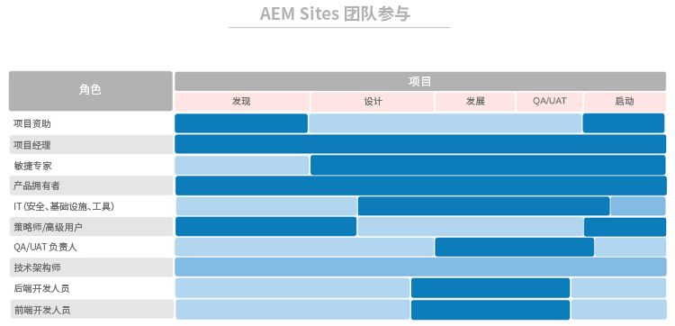

# **首先，让合适的人员担任合适的职位**

>[!CONTEXTUALHELP]
>id="aemcloud_chooseteam"
>title="选择合适的团队"
>abstract="将合适的人员放在合适的职位上，帮助推动您成功部署 Adobe Experience Manager。"
>additional-url="https://experienceleague.adobe.com/docs/experience-manager-cloud-service/onboarding/best-practices/aligning-kpis.html?lang=zh-hans" text="调整 KPI"
>additional-url="https://experienceleague.adobe.com/docs/experience-manager-cloud-service/onboarding/best-practices/assessing-kpis.html?lang=zh-hans" text="评估 KPI"

在您的组织中，可能会有多个部门负责数字体验的不同层面。如果没有合适的治理方式，这一阶段就会出现无休止的争论、内斗和混乱。

数字治理过程首先需要明确，由谁来负责什么内容，由谁来完成与数字化相关的工作。您可能需要进行一些战略性的招聘工作来补充具备所需技能的人手。而更大的挑战在于推动文化转变，树立起对新技术的全面支持，并帮助人们习惯于新的开展工作方式。该工作的一个关键部分在于创建数字社区，让人们能够从中学习和互相支持。

目前，我们侧重于将合适的人员放在合适的职位上，帮助推动 Adobe Experience Manager 部署。对于每个核心产品（Experience Manager Sites 和 Experience Manager Assets），我们已经提供了一个您需要填充的职位清单，包括在各个职位上高效开展工作所需的技能、专业知识水平和特性。

您本周的任务是与实施团队一起查看这些清单，确保在各个职位上都有具备相关资质的人员。

## **AEM Experience Manager Sites 的关键职位**

一个成功的人力团队需要有九个人位于合适的位置，就像您的部署团队一样。Adobe Experience Manager Sites 的成功与否取决于团队成员的力量以及他们协同工作的效果。请确保您将这九个职位分配给具备所建议资质的人员。

| 职位 | 技能 | 能力水平 | 素养 |
|--- |--- |--- |--- |
| 项目经理 | PMP 认证，Agile 认证，风险管理经验 | 专家 | 公正，稳定，负责，井井有条，积极，平易近人，愿意接受改变 |
| Scrum Master | ScrumMaster 认证，Agile 认证，协调经验 | 专家 | 稳定，创造性 |
| 产品负责人 | Agile 认证，对业务需求有很深的了解 | 专家 | 均衡，自信 |
| 负责安全、基础设施和工具的 IT 主管 | CISM 认证，Adobe Experience Manager 组件开发人员认证 | 专家 | 注重细节 |
| 战略专家/超级用户 | 熟练掌握 Adobe Experience Manager Sites | 新手到专家 | 坚韧，求知，缜密，开放，愿意接受改变，合作 |
| QA/UAT 主管 | Agile 认证，了解 SDLC | 新手到中等水平 | 注重细节，流程推动，稳定 |
| 技术架构师 | IT 基础设施经验 | 专家 | 注重细节，流程推动，稳定 |
| 后端开发人员 | Agile 认证，计算机编程和计算机科学方面的经验 | 新手到中等水平 | 注重细节，流程推动，稳定 |
| 前端开发人员 | Agile 认证，了解 HTML、CSS 和 JavaScript | 新手到中等水平 | 注重细节，流程推动，稳定 |

现在您已经知道了所需的职位，请查看下图以了解各个职位在实施过程中何时发挥作用。

 

**与实施团队一起查看这些清单**，确保在各个职位上都有具备相关资质的人员。不太熟悉 Adobe Experience Cloud 的团队成员可以使用 [Experience League](https://experienceleague.adobe.com/#recommended/solutions/experience-manager) 学习资源来通过 [Adobe Digital Learning](https://learning.adobe.com/certification.html) 获取认证。

## **AEM Experience Manager Assets 的关键职位**

从架构师到 ScrumMaster，此团队中的每个职位都密不可分，包括 DAM 库管理员。

您可能已经有了可成功开展 Adobe Experience Manager Assets 实施的大部分人员。此清单与 Adobe Experience Manager Sites 的清单相似，仅增加了重要的一项：您需要一位库管理员来确保以易于查找的方式整理和标记数字资源。

| 职位 | 技能 | 能力水平 | 素养 |
|--- |--- |--- |--- |
| 项目经理 | PMP 认证，Agile 认证，风险管理经验 | 专家 | 公正，稳定，负责，井井有条，积极，平易近人，愿意接受改变 |
| Scrum Master | ScrumMaster 认证，Agile 认证，协调经验 | 专家 | 稳定，创造性 |
| 产品负责人 | Agile 认证，对业务需求有很深的了解 | 专家 | 均衡，自信 |
| 负责安全、基础设施和工具的 IT 主管 | CISM 认证，Adobe Experience Manager 组件开发人员认证 | 专家 | 注重细节 |
| 战略专家/超级用户 | 熟练掌握 Adobe Experience Manager Sites | 新手到专家 | 坚韧，求知，缜密，开放，愿意接受改变，合作 |
| QA/UAT 主管 | Agile 认证，了解 SDLC | 新手到中等水平 | 注重细节，流程推动，稳定 |
| 技术架构师 | IT 基础设施经验 | 专家 | 注重细节，流程推动，稳定 |
| 后端开发人员 | Agile 认证，计算机编程和计算机科学方面的经验 | 新手到中等水平 | 注重细节，流程推动，稳定 |
| 前端开发人员 | Agile 认证，了解 HTML、CSS 和 JavaScript | 新手到中等水平 | 注重细节，流程推动，稳定 |
| DAM 库管理员 | 与库相关的学术背景和学位 | 专家 | 注重细节，流程推动，井井有条 |

现在您已经知道了所需的职位，请查看下图以了解各个职位在实施过程中何时发挥作用。

 

>[!TIP]
>
> 详细了解 Adobe Experience Cloud，并利用 [Experience League](https://experienceleague.adobe.com/#recommended/solutions/experience-manager) 上的资源来通过 [Adobe Digital Learning](https://learning.adobe.com/certification.html) 获取认证。
