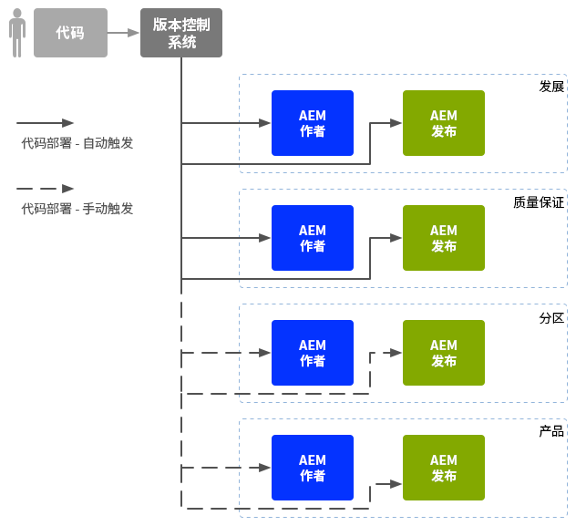

# 企业 DevOps{#enterprise-devops}

DevOps涵盖了执行以下操作所需的流程、方法和通信：

* 轻松在各种环境中部署软件。
* 简化开发、测试和部署团队之间的协作。

DevOps 旨在避免出现以下问题：

* 手动错误。
* 被遗忘的元素；例如，文件、配置详细信息。
* 不一致的情况；例如，开发人员的本地环境与其他环境之间的不一致。

## 环境 {#environments}

Adobe Experience Manager (AEM) as a Cloud Service 通常包含多个环境，分别用于不同级别的不同用途：

* [开发](#development)
* [质量保证](#quality-assurance)
* [暂存](#staging)
* [生产](#production-author-and-publish)

>[!NOTE]
>
>生产环境必须至少有一个创作环境和一个发布环境。
>
>建议所有其他环境也包含创作和发布环境，以反映生产环境并提前进行测试。

### 开发 {#development}

开发人员负责开发和自定义提议的项目（网站、移动应用程序、DAM实施等），包括所有必需的功能。 他们：

* 开发和定制必要的元素；例如，模板、组件、工作流、应用程序
* 实现设计
* 开发必要的服务和脚本，以便您实施所需的功能

的配置 [开发](/help/implementing/developing/introduction/development-guidelines.md) 环境可能取决于多种因素，但通常包括：

* 具有版本控制的集成开发系统，用于提供集成的代码库。 此集成代码库用于合并和合并来自每个开发人员使用的各个开发环境的代码。
* 每个开发人员的个人环境；通常驻留在其本地计算机上。在适当的时间间隔，代码与版本控制系统同步

根据系统的规模，开发环境可以同时具有创作实例和发布实例。

### 质量保证 {#quality-assurance}

质量保证团队使用此环境来对新系统进行全面测试；包括设计和功能。它应同时具有创作和发布环境（包含适当的内容），并提供所有必要的服务以启用完整的测试套件。

### 暂存 {#staging}

暂存环境应该是生产环境（配置、代码和内容）的镜像：

* 可以将该环境用于测试用于实施实际部署的脚本。
* 在部署到生产环境之前，可将其用于最终测试（设计、功能和界面）。
* 尽管暂存环境并不总是能够与生产环境相同，但应该使其尽可能的接近生产环境，以便启用性能和负载测试。

### 生产 - 创作和发布 {#production-author-and-publish}

生产环境由以下环境组成 [创作和发布](/help/sites-cloud/authoring/getting-started/concepts.md) 您的实施。

生产环境至少包含一个作者实例和一个发布实例：

* 用于内容输入的[创作](#author)实例。
* 向访客/用户提供内容的[发布](#publish)实例。

根据项目的规模，它通常由多个作者或/和发布者组成。 在较低的级别上，存储库也可群集到多个实例。

#### 创作 {#author}

通常，创作实例位于内部防火墙之后。 此内部防火墙是您和您的同事执行创作任务的环境，例如：

* 管理整个系统
* 输入内容
* 配置内容的布局和设计
* 激活内容以将其传输到发布环境

已激活的内容将打包，并被放置在创作环境的复制队列中。然后，复制流程会将该内容传输到发布环境。

要将发布环境中生成的数据反向复制回创作环境，创作环境中的复制侦听器会轮询发布环境，并从发布环境的反向复制发件箱中检索此类内容。

#### 发布 {#publish}

通常，发布环境位于“非军事区”(DMZ)中。 在这种环境中，访客可以访问您的内容（例如，通过网站或以移动应用程序的形式）并与之交互，可以是公共的，也可以是在内部网络中。 发布环境：

* 拥有从创作环境复制的内容
* 向访客提供该内容
* 存储由访客生成的用户数据，例如注释或其他表单提交
* 可以配置为将此类用户数据添加到发件箱，以便反向复制回创作环境

发布环境可实时动态生成您的内容，并且可以针对每位用户个性化内容。

## 代码移动 {#code-movement}

始终从下到上传播代码：

* 代码最初是在本地环境开发，然后是在集成的开发环境中开发
* 接着在QA环境中进行全面测试
* 接着在暂存环境中再次进行测试
* 直到那时才能将代码部署到生产环境

通常，通过在不同的内容存储库之间导出和导入包来传输代码（例如，自定义的Web应用程序功能和设计模板）。 在需要的地方，可以将此复制配置为一个自动流程。

AEMas a Cloud Service上的项目通常会触发代码部署：

* 自动：用于传输到开发和 QA 环境。
* 手动：部署到暂存和生产环境的方式更加可控，通常手动进行；但如果需要，也可以自动进行。

## 内容移动 {#content-movement}

为生产创建的内容应&#x200B;**始终**&#x200B;在生产创作实例上进行创作。

内容不应跟随代码从较低级别的环境移动到较高级的环境。 也就是说，让作者在本地计算机或较低级别环境中创建内容，然后将其移动到生产环境中，这并不是一种好的做法。 原因在于，这可能会导致错误和不一致。

应将生产内容从生产环境移动到暂存环境，以确保暂存环境可提供高效、准确的测试环境。

>[!NOTE]
>
>此方法并不意味着暂存内容必须与生产内容持续同步；定期更新便已足够，但在测试新的代码迭代之前尤其如此。 QA和开发环境中的内容无需频繁更新。 它必须很好地呈现生产内容。

内容可以传输：

* 在不同环境之间 - 通过导出和导入包。
* 在不同实例之间 — 通过直接复制(AEMas a Cloud Service复制)内容（使用HTTP或HTTPS连接）。

