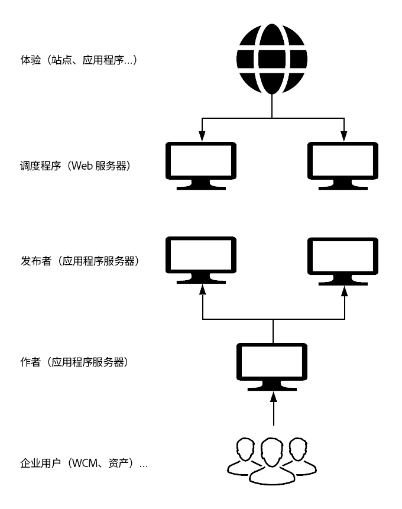
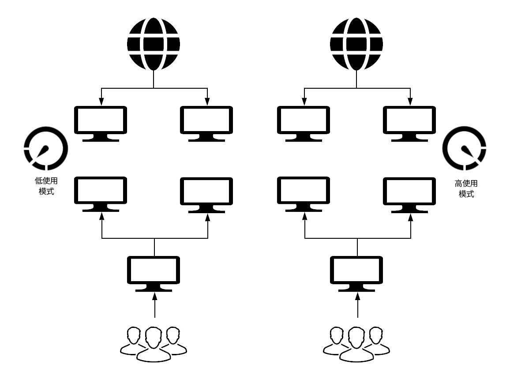

# 新增功能与不同功能 {#what-is-new-and-what-is-different}

多年来，AEM一直可用于：

* On-Premise

* 作为托管服务

以前的方法与AEM作为云服务存在内在差异：

* [架构](#architecture)
* [升级次数](#upgrades)
* [Cloud Manager](#cloud-manager)
* [入职](#onboarding)
* [开发](#developing)
* [操作和性能](#operations-and-performance)
* [身份管理](#identity-management)
* [创作用户界面](#authoring-user-interface)
* [AEM Sites](#aem-sites)
* [AEM Assets](#aem-assets)

>[!NOTE]
>
>这些概述并非详尽无遗，但旨在介绍一下。

<!-- change link when 6.5 hub page migrated -->

>[!NOTE]
>
>有关内部部署和托管服务版本的更多详细信息，请参阅 [AEM 6.5文档集](https://helpx.adobe.com/support/experience-manager/6-5.html)。

## 架构 {#architecture}

>[!NOTE]
>
>有关更多详细信息，请参 [阅架构](/help/core-concepts/architecture.md)。

<!--
### Previous Versions {#previous-versions-architecture}

Both AEM on-premise, and AEM under Managed Services used a static architecture comprised of a fixed number of machines and instances. 

These:

* Were sized for *peak* traffic (internet) and *peak* activity (marketing), which resulted in them being idle for significant periods of time:

* Were monolithic applications (the quickstart).

* Had a single author instance; which was subject to downtime during maintenance windows.

### AEM as a Cloud Service {#aem-as-a-cloud-service-architecture}
-->

AEM作为云服务现在具有：

* 具有可变数量AEM图像的动态架构。

此架构：

* 根据实际流量和实 *际活* 动进 *行缩放* 。

* 具有仅在需要时运行的单个实例。

* 使用模块化应用程序。

* 默认设置作者群集；这可避免维护任务的停机。

这为不同的使用模式启用了自动缩放功能：

## 升级次数 {#upgrades}

>[!NOTE]
>
>有关更多详细信息，请参 [阅部署简介](/help/implementing/deploying/overview.md)。

<!--
### Previous Versions {#previous-versions-upgrades}

Both AEM on-premise, and AEM under Managed Services were subject to a fixed pattern of a yearly major release augmented by service packs, feature packs and hot-fixes. Often instances would run a major version for two or more years. 

Depending on the upgrade type, the process could require significant preparation consisting of analysis, development and testing, followed with a window of downtime for the actual upgrade.

### AEM as a Cloud Service {#aem-as-a-cloud-service-upgrades}
-->

AEM作为云服务，现在使用持续集成和持续交付(CI/CD)来确保您的项目完全处于最新状态。 这意味着所有升级操作都是完全自动化的，因此不需要为用户中断任何服务。

Adobe会主动将服务的所有操作实例更新到最新版本的AEM代码库：

* 错误修复：

   * 可以每天发布。

   * 实例经常使用最新的错误修复进行更新。 由于更改会定期应用，因此影响会逐渐增加，从而减少对服务的影响。

   * 大多数更新是出于维护和安全方面的考虑。

* 新增功能：

   * 将通过可预测的月度计划发布。

>[!NOTE]
>
>有关更多详细信息，请 [参阅部署架构](/help/core-concepts/architecture.md#deployment-architecture)。

## Cloud Manager {#cloud-manager}

Adobe Cloud manager是AEM作为云服务的持续升级方法的一部分，因为它控制了对您实例的所有更新——这是必需的。

当有新版本的云服务可用时，Adobe可以触发更新。 或者，您也可以使用Cloud manager提供的管道触发应用程序更新。

云管理器包括：

* 用于管理AEM程序和环境，

* 作为云服务的AEM的基本组件；每个新租户都首先为Cloud manager访问提供，

* 为您的运营和开发人员提供单一入口点。

具体而言，可从云管理器创建的AEM程序的数量和类型可派生：

* 客户许可协议中，

* 当AEM作为云服务用于启用或培训时，从内部驱动的人员

* 从外部驱动的流程（如从Adobe.com开始的试用版）。

Cloud manager已发展为自助服务门户，可在该门户中创建和配置AEM的主要组件作为云服务：

* 创建和管理新程序。

* 在这些程序中创建和管理AEM环境。

* 创建和管理管道，将客户代码和相关配置部署到特定环境。

* 收到这些组件的重要生命周期事件通知（例如，产品更新）。

目前，Cloud manager能够在3个地理区域创建环境（下面还有更多区域）:

* 美国（东部）

* EMEA（荷兰）

* APAC（澳大利亚）

## 入职 {#onboarding}

>[!NOTE]
>
>有关更多详细信息，请 [参阅入门](/help/onboarding/home.md)。

<!--
### Previous Versions {#previous-versions-onboarding}

Implementing an AEM project basically followed traditional project management methods.  

### AEM as a Cloud Service {#aem-as-a-cloud-service-onboarding}

Starting and managing an AEM project is significantly easier when using AEM as a Cloud service as Adobe is responsible for many aspects:
-->

在将AEM用作云服务时，启动和管理AEM项目很简单，因为Adobe负责许多方面：

* 基线AEM图像已针对特定用例进行优化。

* 许多手动配置任务已变得多余。

与现在的情况也有很大不同：

* 评估阶段，以确保满足所有先决条件；包括，例如：

   * 法律要求

   * 合同协议

   * 客户自定义的任何现有内容和／或代码的技术要求

* 部署要求：

   * 代码更新；需要审阅为AEM的早期版本开发的任何客户应用程序，并可能进行更新。

   * 内容迁移

## 开发 {#developing}

>[!NOTE]
>
>有关更多详细信息，您可以从开 [发指南和](/help/implementing/developing/introduction/development-guidelines.md) 开 [发- WKND教程开始](/help/implementing/developing/introduction/develop-wknd-tutorial.md)。

<!--
### Previous Versions {#previous-versions-developing}
-->

<!-- needs more detail -->

<!-- 
Development was an intensive task performed locally, followed by deployment to the production instance. 

### AEM as a Cloud Service {#aem-as-a-cloud-service-developing}
-->

<!-- Will need information for new customers -->
支持AEM作为云服务的新架构涉及对整体开发人员体验的一些关键更改。 AEM云服务的主要目标之一是允许经验丰富的客户（在预置型或Adobe Managed services的上下文中使用AEM）尽可能快地将AEM作为云服务迁移到AEM，而无需重写他们的大量自定义代码。 但是，可能仍需要做出一些调整。

<!-- adjusting title level -->

### 云开发 {#aem-as-a-cloud-service-developing-cloud-development}

对于要在AEM上作为云服务运行的现有AEM应用程序，需要执行以下步骤：

* 应用程序代码和配置必须存储在关联的Cloud manager程序的Git代码存储库中。
* 应用程序代码和配置必须与基准AEM图像的最新版本兼容（可能每天都会更改）。
   * 客户应用程序必须使用与Cloud manager环境关联的Cloud manager管道构建和部署。
* 客户应用程序必须通过管道中实施的所有代码质量、安全性和性能门。
* 为客户应用程序构建的映像必须通过Cloud manager管道部署。

<!-- duration of what? -->
此过程通常称为云优先开发。 由于端到端的持续时间预计需要几分钟（取决于应用程序的复杂性，从20分钟到50分钟），因此在尝试在云中更改挂起的代码和配置之前，必须采用快速开发方法。

<!-- is this really relevant at this point? -->
Web控制台（其中管理OSGI捆绑包及其关联配置，并且之前是AEM quickStart的一部分）不再作为云服务环境直接供AEM用户访问。 此界面仍可通过使用新的开发人员控制台以只读模式访问。 使用此控制台，开发人员可以选择创作或发布服务的任何特定节点并直接登录，然后访问默认阻止的区域。

开发人员的另一个常见要求是快速访问各种环境的日志文件。 将AEM作为云服务，创作和发布节点中不同节点的日志文件可通过云管理器（以可下载的文件形式或通过API）使用。

由于代码和内容的明确分离，开发人员可以使用特定流程在部署过程中更新内容。 可变内容的典型用例有：

* 客 *户项目* （例如，文件夹、模板、工作流等）的标准默认内容

* 搜索索引定义

* ACL和权限

* 服务用户和用户组

<!-- adjusting title level -->

### 本地开发 {#aem-as-a-cloud-service-developing-local-development}

为了支持快速迭代和开发，还可以将AEM外的AEM应用程序作为云服务上下文进行开发。 为此，开发人员可以使用以下对象：

* AEM作为云服务快速入门：最新 `.jar` AEM代码库的基于的独立安装程序，具有相同的功能和API界面。

* AEM作为Cloud Service Dispatcher SDK:本地测试和验证调度程序配置的基于映像的过程

>[!NOTE]
>
>请注意，云快速入门不允许所有AEM Sites和AEM Assets功能。 它由一个简单的创作环境组成，在该环境中可以开发和测试大部分扩展。

## 操作和性能 {#operations-and-performance}

>[!NOTE]
>
>有关更多详细信息， [请从备份](/help/operations/backup.md)、索 [引和其](/help/operations/indexing.md)他维护任务开始 。

<!--
### Previous Versions {#previous-versions-operations-and-performance}

In the past, especially on the author side, there was a need to periodically stop an instance; for routine maintenance operations, as well as upgrades and updates. For some customers, this resulted in hours of scheduled downtime on a weekly basis. 

### AEM as a Cloud Service {#aem-as-a-cloud-service-operatioms-and-performance}
-->

将AEM作为云服务，这些操作将实现自动化，因此不再需要任何服务中断。

在以下方面：

* 许多任务已自动完成。

* 拓扑经过优化，可实现最大的恢复力和效率；例如，无二进制复制是默认值。

* 大负载任务（如队列、作业和批量处理任务）已从核心AEM实例中移出，以便由共享和专用微型服务处理。

AEM云服务操作还支持新的监视、报告和警报基础结构。 这使Adobe SRE（站点可靠性工程师）能够主动保持服务的健康。 建筑的各种元素都配备了各种健康检查。 如果由于某种原因认为体系结构的特定节点不健康，则从服务中删除该节点并用新的、健康的节点进行无提示替换。

## 身份管理 {#identity-management}

>[!NOTE]
>
>有关更多详细信息， [请参阅安全- IMS支持](/help/security/ims-support.md)。

<!--
### Previous Versions {#previous-versions-identity-management}

By default, identity management was internal to AEM.

>[!NOTE]
>
>AEM 6.4.3.0 introduced:
>
>* Admin Console support for AEM instances. 
>* Adobe IMS (Identity Management System) based authentication for AEM Managed Services customers.

### AEM as a Cloud Service {#aem-as-a-cloud-service-identity-management}
-->

对AEM云服务的主要更改是完全集成地使用Adobe ID访问创作层。

这需要使用 [Adobe Admin Console](https://helpx.adobe.com/enterprise/using/admin-console.html) 来管理用户和用户组。 用户帐户使您的用户能够访问Adobe产品和服务，因为用户配置文件信息集中在Adobe Identity Management System(IMS)中，以便在所有云服务中共享。 在分配了对AEM的访问权限后，用户帐户可以在AEM中作为云服务进行引用（如之前）;例如，用于从AEM security用户界面定义角色和权限。

这综合了以下优点：

* 使用Adobe Identity Management System(IMS)在所有Adobe云应用程序中提供单点登录。

* 作为云服务，AEM的每个特定实例的用户首选项仍为本地设置。

## 创作用户界面 {#authoring-user-interface}

>[!NOTE]
>
>有关更多详细信息， [基本操作](/help/sites-cloud/authoring/getting-started/basic-handling.md) (Basic Handling)是一个不错的起点。

<!--
### Previous Versions {#previous-versions-authoring}

The user interface of the author instance (UI), for both Sites and Assets, was progressively developed and optimized to cater for all use-cases, using both the touch-enabled and classic UIs.

### AEM as a Cloud Service {#aem-as-a-cloud-service-authoring}
-->

对于过去使用过AEM的任何人来说，站点和资产的创作用户界面(UI)的基本原则都很熟悉。

主要区别在于UI完全支持触控；经典UI不再可用。 否则，基本内容将保持不变，只显示少量更改。

## AEM Sites {#aem-sites}

Adobe Experience Manager Sites作为云服务，通过将AEM内容管理系统的强大功能与AEM数字资产管理相结合，您可以为客户提供个性化的内容导向体验。

有关详细信息，请参阅对站 [点的更改概述](/help/sites-cloud/sites-cloud-changes.md)。

## AEM Assets {#aem-assets}

Adobe Experience Manager Assets作为云服务，为企业提供云本机SaaS解决方案，不仅可以快速、有影响地执行其数字资产管理和Dynamic Media操作，而且可以在始终处于最新状态、始终可用且始终学习的系统中使用下一代智能功能，如AI/ML。

资产服务包括云中的下一代资产处理以及高性能的资产获取和搜索。

有关详细信息，请 [参阅概述和Assets as a Cloud service简介](/help/assets/overview.md)。
