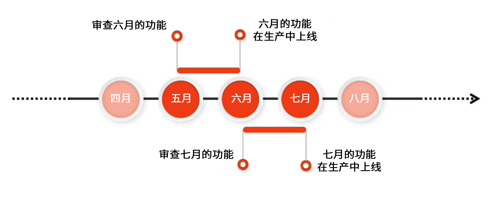

# 版本信息 {#release-information}

| 产品 | Adobe Experience Manager as a Cloud Service |
|---|---|
| 版本 | 2025.5.0 |
| 类型 | 连续更新 |
| 发行日期 | 持续更新 |

## AEM的发布计划 {#release-schedule}

使用[!DNL Adobe Experience Manager] as a Cloud Service中的连续发布模型，应用程序会持续自动更新。 有两种类型的更新，功能版本和维护版本：

* **功能版本**&#x200B;按可预测的每月频率发布，侧重于新功能和产品创新。
   * 有关最新功能版本的详细信息，请参阅[最新发行说明](/help/release-notes/release-notes-cloud/release-notes-current.md)。
* **维护版本**&#x200B;经常发布，侧重于安全更新、错误修复和性能增强。
   * 这可确保使用任何关键修复来使 [!DNL Adobe Experience Manager] as a Cloud Service 始终保持最新。
   * 有关最新维护版本的详细信息，请参阅[当前维护版本说明](/help/release-notes/maintenance/latest.md)。

此模型可确保持续发行而不会中断服务。 即将推出的功能通常在一个版本中宣布，然后在后续版本中公开发布。 通过这种方式，您可以评估即将推出的功能，并计划其可能在您自己的项目中的实施。 它可让您提前计划功能可用的下一个功能发布。

例如，如果是5月，您可以评估即将推出的功能，这些功能将在即将发布的版本（例如6月）中正式提供。

这种节奏为您提供了一个滚动窗口，用于评估任何即将推出的功能对您的项目和自定义的影响，并计划推出此类功能、测试和用户培训。

有关即将发行的版本的详细信息，请查看[Experience Manager发行路线图](https://experienceleague.adobe.com/docs/experience-manager-release-information/aem-release-updates/update-releases-roadmap.html#aem-as-cloud-service)。

## 如何准备发布 {#how-to-prepare}

要准备发布，请执行以下操作：

1. [标记您的日历](#mark-calendars)
1. [查看发行说明](#release-notes)
1. [访问并尝试即将推出的功能](#upcoming-features)
1. [培训您的用户](#train-users)

## 标记您的日历 {#mark-calendars}

提前安排好功能版本，并在 [Adobe Experience League](https://experienceleague.adobe.com/docs/experience-manager-release-information/aem-release-updates/update-releases-roadmap.html#aem-as-cloud-service) 上公布功能版本激活日期。

记下发行日期，以便您可以计划时间来查看和测试即将推出的功能。

## 查看发行说明 {#release-notes}

在日历中标记发行日期后，请务必在发布当天查看 [Adobe Experience League](/help/release-notes/release-notes-cloud/release-notes-current.md) 网站以获取最新的发行说明。

每个版本都附有发行说明，其中不仅记录了该版本中的新增功能，还记录了可用于评估的即将推出的功能。 提前了解，并计划利用 AEMaaCS 的最新功能！

您还可以[检查与每个版本一起发布的已知问题](/help/release-notes/maintenance/latest.md)，这样您也可以了解可能对您的评估或最终采用任何新功能带来挑战的任何技术问题。

## 访问和尝试即将推出的功能 {#upcoming-features}

即将推出的功能通常通过以下两种方式之一提供：

* 作为率先采用者方案的一部分
* 作为预发行渠道的一部分

[发行说明将详细介绍即将推出的功能的可用方式。](#release-notes)

* 如果它是率先采用程序的一部分，则通常需要联系Adobe以启用它，如发行说明中所述。
* 如果它是预发行版渠道的一部分，则您需要[在开发或沙盒环境中启用预发行版渠道。](/help/release-notes/prerelease.md)

## 培训您的用户 {#train-users}

一旦您测试了即将推出的功能并决定在您的项目中使用它们，您就需要培训您的用户。

Adobe Experience League 提供了大量学习 AEMaaCS 的资源。

* [AEMaaCS 文档](https://experienceleague.adobe.com/docs/experience-manager-cloud-service.html)
* [教程](https://experienceleague.adobe.com/docs/experience-manager-learn/aem-tutorials/overview.html)
* 发行说明中的[每月发行概述视频](/help/release-notes/release-notes-cloud/release-notes-current.md#release-video)

## 关键发行信息 {#key-articles}

* [功能发行说明](/help/release-notes/release-notes-cloud/release-notes-current.md)
* [维护发行说明](/help/release-notes/maintenance/latest.md)
* [新增功能](what-is-new.md)
* [重要更改](aem-cloud-changes.md)
* [已弃用和已删除的功能](deprecated-removed-features.md)
