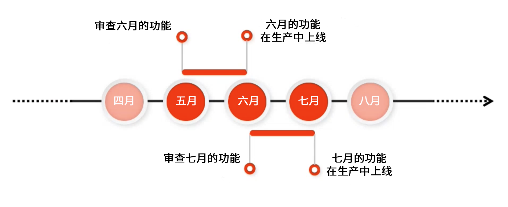

# Adobe Experience Manager as a Cloud Service 预发行渠道 {#prerelease-channel}

了解如何使用预发行渠道预览 AEM as a Cloud Service 即将推出的功能。

## 简介 {#introduction}

Adobe Experience Manager as a Cloud Service 根据 [Experience Manager 发布路线图](https://experienceleague.adobe.com/docs/experience-manager-release-information/aem-release-updates/update-releases-roadmap.html#aem-as-cloud-service)上的时间表，每月提供新功能。

要熟悉计划于下个月推出的功能，您可以订阅预发行版渠道。要访问该渠道，可通过配置您的开发环境或任何沙盒程序环境。您可以预览可通过 AEM UI 访问的更改，以及根据任何新的预发布 API 构建代码。

[每月发行说明](/help/release-notes/release-notes-cloud/release-notes-current.md)中发布了给定月份的预发行版功能的列表。

## AEM as a Cloud Service 版本 {#releases}

AEM as a Cloud Service 有两种类型的版本。

* **每月发行**&#x200B;将功能和特性添加到 AEM as a Cloud Service
* **关键更新**&#x200B;添加了安全更新、性能增强和错误修复，并每天应用。

此模式可确保持续发行而不会中断服务。

预发行频道允许您预览为即将到来的每月发行安排的功能，以便评估即将推出的功能，并为其可能在您自己项目中的实施进行计划。它允许您提前计划下一个月的发行。

例如，如果现在是 5 月并且您订阅了预发行频道，则可以评估即将发行的 6 月版本中的功能。



预发行版为您提供为期一个月的滚动窗口，了解即将推出的 AEMaaCS 功能，让您有时间评估任何新功能对您的项目和自定义的影响，以及计划推出此类功能、测试和用户培训。

有效利用预发行渠道需要四个步骤。

1. [标记您的日历](#mark-calendars)
1. [查看发行说明](#release-notes)
1. [访问并尝试新功能](#new-features)
1. [培训您的用户](#train-users)

## 标记您的日历 {#mark-calendars}

每月发行都提前安排好，发行日期发布在 [Adobe Experience League。](https://experienceleague.adobe.com/docs/experience-manager-release-information/aem-release-updates/update-releases-roadmap.html#aem-as-cloud-service)

记下发行日期，以便您可以计划时间来查看和测试即将推出的功能。

## 查看发行说明 {#release-notes}

在日历中标记发行日期后，请务必在发布当天查看 [Adobe Experience League](/help/release-notes/release-notes-cloud/release-notes-current.md) 网站以获取最新的发行说明。

每个版本都附有发行说明，其中不仅记录了该版本中的新功能，还记录了可用于预发行评估的功能。提前了解，并计划利用 AEMaaCS 的最新功能！

您还可以[检查与每个版本一起发布的已知问题](/help/release-notes/known-issues.md)，这样您也可以了解可能对您的评估或最终采用任何新功能带来挑战的任何技术问题。

## 启用预发行频道访问并尝试新功能 {#new-features}

可以在任何开发或沙盒环境中启用预发行渠道。无法在暂存或生产环境中启用预发行。

可通过不同的方式体验预发行版功能：

* [云环境](#cloud-environments)
* [本地 SDK](#local-sdk)

### 云环境 {#cloud-environments}

要更新云环境以使用预发行版，您必须添加新的环境变量。您可以使用 Cloud Manager UI 或通过 CLI 执行此操作。

#### 通过 UI 添加环境变量 {#add-with-ui}

1. 在 [my.cloudmanager.adobe.com](https://my.cloudmanager.adobe.com/) 登录 Cloud Manager 并选择适当的组织。

1. 导航到要启用预发行的项目。

1. 选择要启用预发行的环境，并通过&#x200B;**项目**>**环境**>**环境配置**&#x200B;访问其配置。

1. 添加新的[环境变量：](../implementing/cloud-manager/environment-variables.md)

   | 名称 | 值 | 已应用服务 | 类型 |
   |------|-------|-----------------|------|
   | `AEM_RELEASE_CHANNEL` | `prerelease` | 所有 | 变量 |

1. 保存更改，并且环境将在启用预发布功能后进行刷新。

   

#### 通过 CLI 添加环境变量 {#add-with-cli}

您也可以使用 Cloud Manager API 和 CLI 来更新环境变量。

* 使用 [Cloud Manager API 的环境变量端点](https://developer.adobe.com/experience-cloud/cloud-manager/reference/api/#operation/patchEnvironmentVariables)将 `AEM_RELEASE_CHANNEL` 环境变量设置为值 `prerelease`。

   ```text
   PATCH /program/{programId}/environment/{environmentId}/variables
   [
           {
                   "name" : "AEM_RELEASE_CHANNEL",
                   "value" : "prerelease",
                   "type" : "string"
           }
   ]
   ```

* [也可以使用 Cloud Manager CLI](https://github.com/adobe/aio-cli-plugin-cloudmanager#aio-cloudmanagerset-environment-variables-environmentid)

   ```shell
   aio cloudmanager:environment:set-variables <ENVIRONMENT_ID> --programId=<PROGRAM_ID> --variable AEM_RELEASE_CHANNEL “prerelease
   ```

如果要让环境恢复到常规（非预发行版）渠道的表现，可以删除该变量或者将其设置为其他值。

### 本地 SDK {#local-sdk}

通过配置您的 maven 项目引用 Maven Central 中的预发行版 `API Jar`，可以在本地快速入门 SDK 的站点控制台中查看新功能，并针对预发行版中的新 API 进行编码。您还可以通过在预发行版模式下启动常规快速入门 SDK，在本地开发环境中查看这些预发行版功能。

#### 以预发行模式启动“快速启动 SDK” {#prerelease-mode}

1. 按照[访问 AEM as a Cloud Service SDK](/help/implementing/developing/introduction/aem-as-a-cloud-service-sdk.md) 中的说明执行操作，从软件分发门户下载 SDK 并进行安装。
1. 在启动快速入门 SDK 时，请包含参数 `-r prerelease`。

值为 sticky，因此，只能在第一次启动时选择它。重新安装 SDK 可更改命令行选项。

由于每月发布功能间隔可能会有多个 AEM 维护版本，因此，您可以下载这些新的 SDK，并在 maven 项目中引用新的 SDK API Jar 版本。维护版本将不会添加额外的预发行版功能，但可能包括其他较小的更改，例如错误修复、安全修复和性能增强。
Javadocs 将发布到 Maven Central。

#### 针对预发行版 SDK 进行构建 {#build-sdk}

1. 修改您的 maven 项目的 `pom.xml`，以引用已发布到 Maven Central 的其他预发行版 SDK API jar。它包含用于预发行版功能的任何新的 Java API，并且与 SDK API jar 存在依赖关系。它使用相同的版本。

   例如，以下父 pom 的依赖项管理部分中引用常规 API jar 的片段：

   ```
   <dependencyManagement>
    <dependencies>
        <dependency>
            <groupId>com.adobe.aem</groupId>
            <artifactId>aem-sdk-api</artifactId>
            <version>${aem.sdk.api}</version>
            <scope>provided</scope>
        </dependency>
   ```

   随后是模块中的使用情况：

   ```
    <dependencies>
     <dependency>
         <groupId>com.adobe.aem</groupId>
         <artifactId>aem-sdk-api</artifactId>
     </dependency>
   ```

   要更改预发行版 SDK，只需将依赖关系从 `com.adobe.aem:aem-sdk-api` 更改为 `com.adobe.aem:aem-prerelease-sdk-api`，如下所述：

   ```
   <dependencyManagement>
    <dependencies>
      <dependency>
            <groupId>com.adobe.aem</groupId>
            <artifactId>aem-prerelease-sdk-api</artifactId>
            <version>${aem.sdk.api}</version>
            <scope>provided</scope>
      </dependency>
   <dependencies>
      <dependency>
         <groupId>com.adobe.aem</groupId>
         <artifactId>aem-prerelease-sdk-api</artifactId>
      </dependency>
   ```

   像往常一样，单个项目可以使用依赖关系。

1. 部署到您的本地服务器。

1. 如果对它在本地按预期方式工作感到满意，请将代码提交到开发分支，并使用 Cloud Manager 非生产管道部署到订阅预发行版渠道的环境。

>[!CAUTION]
> 
> 在部署到暂存或生产环境时，绝不能使用 `aem-prerelease-sdk-api` artifactId。在通过生产管道进行部署时，始终使用 `aem-sdk-api`。同样，不应通过生产管道部署引用预发行版 API 的代码。

[AEM CS SDK 构建分析器 Maven 插件 v1.0 和更高版本](https://experienceleague.adobe.com/docs/experience-manager-core-components/using/developing/archetype/build-analyzer-maven-plugin.html?lang=zh-Hans#developing)将通过检查依赖关系，检测项目中是否使用了预发行版 API。如果分析器找到它，将使用预发行版 SDK API 来分析项目。

## 培训您的用户 {#train-users}

一旦您在预发行渠道中测试了新功能并决定在您的项目中利用它们，您就需要培训您的用户。

Adobe Experience League 提供了大量学习 AEMaaCS 的资源。

* [AEMaaCS 文档](https://experienceleague.adobe.com/docs/experience-manager-cloud-service.html)
* [教程](https://experienceleague.adobe.com/docs/experience-manager-learn/aem-tutorials/overview.html)
* 发行说明中的[每月发行概览视频](/help/release-notes/release-notes-cloud/release-notes-current.md#release-video)

## 注意事项 {#considerations}

当使用预发行版渠道时，需要注意以下几项。

* 预发行频道不一定包含将在下一版本中推出的所有新功能。
* 预发行版本中的功能已经过严格测试，有质量保证，旨在提供该功能的完整版而非 Beta 版。如果您发现任何问题，请向我们报告，就像在您怀疑常规 AEM 版本中的功能存在错误时所采取的行动一样。
* 要确定是否为预发行版渠道配置了环境，请转至 AEM 控制台的&#x200B;**关于**&#x200B;页面，并检查 AEM 版本号是否包含 *prerelease* 后缀，例如 ```Adobe Experience Manager 2021.4.5226.20210427T070726Z-210429-PRERELEASE```。


