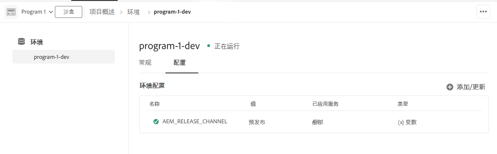

# [!DNL Adobe Experience Manager] as a Cloud Service 预发行版渠道 {#prerelease-channel}


## 简介 {#introduction}

[!DNL Adobe Experience Manager] as a Cloud Service 根据 [Experience Manager 发布路线图](https://experienceleague.adobe.com/docs/experience-manager-release-information/aem-release-updates/update-releases-roadmap.html?lang=zh-Hans#aem-as-cloud-service)上的时间表，每月提供新功能。要熟悉计划于下个月推出的功能，客户可以订阅预发行版渠道。要访问该渠道，可通过在标准程序开发环境或任何沙盒程序环境中进行适当的配置。客户可以预览对站点控制台的更改，以及针对任何新的预发行版 API 的生成代码的更改。

[每月发行说明](/help/release-notes/release-notes-cloud/release-notes-current.md)中发布了给定月份的预发行版功能的列表。

>[!VIDEO](/help/release-notes/assets/prerelease-overview.mp4)

## 如何启用预发行版 {#enable-prerelease}

可通过不同的方式体验预发行版功能：

* 云环境（标准程序开发环境或任何沙盒程序环境类型）
* 本地 SDK

### 云环境 {#cloud-environments}

要更新云环境以使用预发行版本，请使用 Cloud Manager 中的环境配置 UI 添加新的[环境变量](../implementing/cloud-manager/environment-variables.md)：

1. 导航到&#x200B;**“项目”**>**“环境”**>您希望更新的&#x200B;**“环境配置”**。
1. 添加新 [环境变量](../implementing/cloud-manager/environment-variables.md):

   | 名称 | 值 | 已应用服务 | 类型 |
   |------|-------|-----------------|------|
   | `AEM_RELEASE_CHANNEL` | `prerelease` | 所有 | 变量 |

1. 保存更改，并且环境将在启用预发布功能后进行刷新。

   


**或者，**&#x200B;您可以使用 Cloud Manager API 和 CLI 来更新环境变量：

* 使用 [Cloud Manager API 的环境变量端点](https://developer.adobe.com/experience-cloud/cloud-manager/reference/api/#operation/patchEnvironmentVariables)将 **AEM_RELEASE_CHANNEL** 环境变量设置为值 **prerelease**。

   ```
   PATCH /program/{programId}/environment/{environmentId}/variables
   [
           {
                   "name" : "AEM_RELEASE_CHANNEL",
                   "value" : "prerelease",
                   "type" : "string"
           }
   ]
   ```

* 也可以按照 [https://github.com/adobe/aio-cli-plugin-cloudmanager#aio-cloudmanagerset-environment-variables-environmentid](https://github.com/adobe/aio-cli-plugin-cloudmanager#aio-cloudmanagerset-environment-variables-environmentid) 上的说明使用 Cloud Manager CLI

   ```aio cloudmanager:environment:set-variables <ENVIRONMENT_ID> --programId=<PROGRAM_ID> --variable AEM_RELEASE_CHANNEL “prerelease”```


如果要让环境恢复到常规（非预发行版）渠道的表现，可以删除该变量或者将其设置为其他值。

### 本地 SDK {#local-sdk}

通过让您的 maven 项目引用 Maven Central 中的预发行版 `API Jar`，可以在本地快速入门 SDK 的站点控制台中查看新功能，并针对预发行版中的新 API 进行编码。您还可以通过在预发行版模式下启动常规快速入门 SDK，在本地计算机上查看这些预发行版功能：

* 按照[访问 AEM as a Cloud Service SDK](/help/implementing/developing/introduction/aem-as-a-cloud-service-sdk.md) 中的说明执行操作，从软件分发门户下载 SDK 并进行安装。
* 在启动快速入门 SDK 时，请包含参数 `-r prerelease`。
* 值为 *sticky*，因此，只能在第一次启动时选择它。重新安装 SDK 可更改命令行选项。

由于每月发布功能间隔可能会有多个 AEM 维护版本，因此，您可以下载这些新的 SDK，并在 maven 项目中引用新的 SDK API Jar 版本。维护版本将不会添加额外的预发行版功能，但可能包括其他较小的更改，例如错误修复、安全修复和性能增强。
Javadocs 将发布到 Maven Central。

要针对预发行版 SDK 进行构建，请执行以下操作：

1. 修改您的 maven 项目的 pom.xml，以引用已发布到 Maven Central 的其他预发行版 SDK API Jar。它包含用于预发行版功能的任何新的 Java API，并且与 SDK API Jar 存在依赖关系。它使用相同的版本。

   例如，以下父 pom 的依赖项管理部分中引用常规 API Jar 的片段：

   ```
   <dependencyManagement>
    <dependencies>
        <dependency>
            <groupId>com.adobe.aem</groupId>
            <artifactId>aem-sdk-api</artifactId>
            <version>${aem.sdk.api}</version>
            <scope>provided</scope>
        </dependency>
   ```

   随后是模块中的使用情况：

   ```
    <dependencies>
     <dependency>
         <groupId>com.adobe.aem</groupId>
         <artifactId>aem-sdk-api</artifactId>
     </dependency>
   ```

   要更改预发行版 SDK，只需将依赖关系从 `com.adobe.aem:aem-sdk-api` 更改为 `com.adobe.aem:aem-prerelease-sdk-api`，如下所述：

   ```
   <dependencyManagement>
    <dependencies>
      <dependency>
            <groupId>com.adobe.aem</groupId>
            <artifactId>aem-prerelease-sdk-api</artifactId>
            <version>${aem.sdk.api}</version>
            <scope>provided</scope>
      </dependency>
   <dependencies>
      <dependency>
         <groupId>com.adobe.aem</groupId>
         <artifactId>aem-prerelease-sdk-api</artifactId>
      </dependency>
   ```

   像往常一样，单个项目可以使用依赖关系。

1. 部署到您的本地服务器。
1. 如果对它在本地按预期方式工作感到满意，请将代码提交到开发分支，并使用 Cloud Manager 非生产管道部署到订阅预发行版渠道的环境。

>[!CAUTION]
> 
> 在部署到暂存或生产环境时，绝不能使用 `aem-prerelease-sdk-api` artifactId。在通过生产管道进行部署时，始终使用 aem-sdk-api。同样，不应通过生产管道部署引用预发行版 API 的代码。

[AEM CS SDK 构建分析器 Maven 插件 v1.0 和更高版本](https://experienceleague.adobe.com/docs/experience-manager-core-components/using/developing/archetype/build-analyzer-maven-plugin.html?lang=zh-Hans#developing)将通过检查依赖关系，检测项目中是否使用了预发行版 API。如果分析器找到它，将使用预发行版 SDK API 来分析项目。

## 注意事项 {#considerations}

关于预发行版渠道，需要注意以下几点：

* 将在下个月发布的一些功能可能未包含在预发行版渠道中。
* 预发行版本中的功能已经过严格测试，有质量保证，旨在提供该功能的完整版而非 Beta 版。如果您发现任何问题，请向我们报告，就像在您怀疑常规 AEM 版本中的功能存在错误时所采取的行动一样。
* 要确定是否为预发行版渠道配置了环境，请转至 AEM 控制台的&#x200B;**关于**&#x200B;页面，并检查 AEM 版本号是否包含 *prerelease* 后缀，例如 ```Adobe Experience Manager 2021.4.5226.20210427T070726Z-210429-PRERELEASE```。


