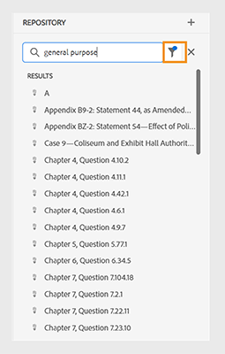

# [!DNL Adobe Experience Manager] as a Cloud Service 的最新发行说明 {#release-notes}

以下部分概述了当前（最新）版本的 [!DNL Experience Manager] as a Cloud Service 的功能发行说明。

>[!NOTE]
>
>您可以在此部分中导航到早期版本的发行说明；例如，2021 版或 2022 版等的发行说明。
>
>查看 [Experience Manager 版本发行路线图](https://experienceleague.adobe.com/zh-hans/docs/experience-manager-release-information/aem-release-updates/update-releases-roadmap)，了解即将推出的 [!DNL Experience Manager] as a Cloud Service 的功能激活。

>[!NOTE]
>
>有关未与版本直接相关的文档更新的详细信息，请参阅[最新文档更新](https://experienceleague.adobe.com/zh-hans/docs/experience-manager-release-information/aem-release-updates/doc-updates/documentation-updates)。

## 发布日期 {#release-date}

[!DNL Adobe Experience Manager] as a [!DNL Cloud Service] 最新功能版本 (2024.4.0) 的发布日期为 2024 年 4 月 25 日。下一个功能版本 (2024.5.0) 计划于 2024 年 5 月 30 日发布。

## 维护发行说明 {#maintenance}

您可以在[此处](/help/release-notes/maintenance/latest.md)找到最新的维护发行说明。

<!-- ## Release Video {#release-video}

Have a look at the April 2024 Release Overview video for a summary of the features added in the 2024.4.0 release:

>[!VIDEO](https://video.tv.adobe.com/v/3428342?quality=12)

-->

## [!DNL Experience Manager Sites] as a [!DNL Cloud Service] {#sites}

### 早期采用者计划 {#sites-early-adopter}

**生成变体**

通过 AEM 的新功能[生成变体](/help/generative-ai/generate-variations.md)利用 GenAI，现在可在云服务中使用。生成变体功能可以帮助您通过使用生成式 AI 来生成和扩展内容创作。请与您的 Adobe 帐户团队联系，申请加入该项目。

**内容片段控制台中的资产浏览功能**

内容作者现在可以浏览、查看图像和其他资产并对其执行操作，而无需离开内容片段控制台。

是否有兴趣试用该功能并分享反馈？从您的官方电子邮件 ID 向 aemcs-headless-adopter@adobe.com 发送电子邮件即可详细了解早期采用者计划。

## [!DNL Experience Manager Assets] as a [!DNL Cloud Service] {#assets}

### 资源视图中的新增功能 {#assets-view-new-features}

**上下文搜索**

您现在还可以[通过定义文本提示来搜索存储库中可用的资产](/help/assets/search-assets-view.md#contextual-search)。Experience Manager Assets 会自动将这些文本提示转换为搜索过滤器，并显示搜索结果。您可以使用“过滤器窗格”查看和修改自动过滤器，进一步缩小搜索结果。

**Express 视频快速操作**

Experience Manager Assets 现在包括[由 Adobe Express 提供支持的简单而直观的视频编辑工具](/help/assets/edit-videos-assets-view.md)，可提高内容重用率，并加快内容创建速度。编辑选项包括修剪、裁切、调整视频大小以及将 MP4 转换为 GIF 文件。

**动态演绎版**

您现在可以在 Experience Manager Assets 中 [查看和下载动态演绎版（包括智能裁切）](/help/assets/renditions.md)。动态演绎版是实时创建的图像资产的定制版本，以满足特定需求，例如根据设备分辨率调整图像大小，或通过裁切来适应不同的纵横比。这些演绎版使组织能够根据不同受众的需求提供个性化的优化体验。

**就地重命名资产和文件夹**

Experience Manager Assets 现在提供[通过单击来重命名资产或文件夹](/help/assets/manage-organize-assets-view.md)的功能，从而简化用户体验。

**将元数据表单分配或移除到多个文件夹**

您现在可以[将元数据表单分配或移除到多个文件夹](/help/assets/metadata-assets-view.md#assign-metadata-form-to-a-folder)。

## [!DNL Experience Manager Forms] as a [!DNL Cloud Service] {#forms}

<!-- 

* **Configure a shard for Adobe Sign for AEM Forms**: Adobe distributes Acrobat Sign API around the globe in many deployment units called "shards." Each shard serves a customer's account, such as NA1, NA2, NA3, EU1, JP1, AU1, IN1, and others. The shard names correspond to geographic locations. You can now use more than one shard while using Adobe Sign integration with AEM Forms. 

-->

### AEM Forms中的新增功能 {#forms-new-features}

* **基于核心组件的自适应表单的增强型可视化规则编辑器**：此版本对基于核心组件的自适应表单的可视化规则编辑器进行了重大升级。此版本对基于核心组件的自适应表单的可视化规则编辑器进行了重大升级。此次更新的重点在于简化与自定义函数的交互，使您能够构建更为稳健、高效的表单。

  您现在可以通过以下方式简化自定义函数交互：

   * [利用新的注释功能，提供更清晰的函数定义](/help/forms/create-and-use-custom-functions.md#supported-javascript-annotations-for-custom-function)。
   * [使用自定义函数的缓存机制，实现表单性能的快速提升](/help/forms/create-and-use-custom-functions.md#caching-support-for-custom-function)。
   * [在自定义函数内无缝地处理全局对象](/help/forms/create-and-use-custom-functions.md#field-and-global-scope-objects-in-custom-functions)。
   * [在自定义函数中定义和使用可选参数](/help/forms/create-and-use-custom-functions.md#parameter)。

  此更新还在以下方面增强了规则编辑器的功能。您可以：

   * 为条件执行实施强大的 [&quot;when-then-else&quot;](/help/forms/rule-editor-core-components.md#when) 逻辑。
   * 利用现代 JavaScript 功能，如 let 和 arrow 函数（ES10 支持）。
   * 不仅能够验证或重置字段，还可以验证或重置整个面板和表单，从而扩大对用户交互的控制。

  这些功能提升为在可视化规则编辑器中制定规则和自定义功能提供了更直观、更强大的体验。

* **[创建自适应表单的多个版本](/help/forms/add-comments-annotations-versioning-adaptive-form-core-components.md)**：您现在可以轻松管理现有表单的变体。这简化了版本控制，有助于表单优化比较，所有这些都在一个简化的工作流中进行。

* **[比较自适应表单](/help/forms/compare-forms.md)**：您现在可以轻松比较两种表单，以识别这两种表单之间的差异。它使团队成员能够比较修订内容，并有效地讨论相关变化，从而促进顺利协作。

* **涂鸦签名组件的可访问性增强**：此更新在可访问性方面为涂鸦签名组件带来了显著的改进：

  **改进的键盘导航：**
   * 按下 Tab 键，用户可以浏览签名对话框中的所有交互式元素。
   * 使用画笔或键盘签名，并按 Enter 键关闭对话框。
   * 签名并单击“确定”后，焦点仍然在签名控件上。

  **清晰的签名功能：**

   * 可以通过 Tab 键访问用于擦除签名的清晰十字图标。
   * 还可以通过“选项卡”导航访问“清除签名确认”对话框。

  **增强的标签和控件：**
   * 键盘签名按钮的标签现在更清晰了，其中使用“aria-label”来宣布功能（例如“aria-label=&#39;Sign using Keyboard&#39;”）。
   * 改进的对比度确保了涂鸦签名中的所有控件都易于区分。
   * 现在，“确定/复选标记”按钮可以直观地指示其何时处于非活动状态。

  **屏幕阅读器的签名反馈：**
   * 输入签名后，屏幕阅读器用户可以听到用于创建签名的文本。

此更新通过改进涂鸦签名组件的导航、清晰度和反馈，确保为残障用户提供更具包容性的体验。

### 早期采用者计划 {#forms-early-adopter}

* **[将自适应表单提交到 Adobe Workfront Fusion 场景](/help/forms/submit-adaptive-form-to-workfront-fusion.md)**：Forms as a Cloud Service 提供一个现成的选项，可轻松地将自适应表单与 Adobe Workfront 建立联系。这简化了将自适应表单提交到 Adobe Workfront 场景的过程，使您可在提交自适应表单时触发 Workfront Fusion 场景。

       使用 Adobe Workfront Fusion Connector，您可以设计在提交自适应表单时自动触发的工作流程。例如，设想一种场景，启动工作流程，为特定个人分配审查提交数据的任务，允许根据通过自适应表单捕获的信息批准或拒绝申请。这种简化的集成方法提高了效率，并为您的工作流程带来了全新的自动化水平。|

* **[阅读器扩展服务](/help/forms/aem-forms-cloud-service-communications-introduction.md#reader-extension-service)**：AEM Forms Communication API 带来了阅读器扩展服务，允许您向常规 PDF 添加表单填写和评论等功能，使用户能够使用免费的 Adobe Reader 与其进行交互。

* [支持从右向左书写的语言](/help/forms/supporting-new-language-localization-core-components.md)：现在可用从右向左书写 (RTL) 的语言（如阿拉伯语、波斯语和乌尔都语）展示基于核心组件构建的自适应表单。全球有超过 20 亿人使用 RTL 语言。使用 RTL 语言的表单可扩大您自适应表单的覆盖范围，以满足这些不同受众的需求并选择进入 RTL 市场。在某些地区，提供当地语言的表单还是一项法律规定。通过使用当地语言，您不仅可以满足更广泛的受众的需求，还可以确保遵守相关法律法规。

* **[用 DocAssurance API（Communication API 的一部分）保护文档](/help/forms/aem-forms-cloud-service-communications-introduction.md#document-assurance-doc-assurance)**：DocAssurance API 使您能够通过为文档签名和加密来保护敏感信息。通过加密，可将文档内容转换为无法读取的格式，从而确保只有获得授权的用户可访问。这一层加强的保护不仅防止未经授权地查看宝贵的数据，还能让人安心。利用 Signature API，您的组织可以保护其分发和接收的 Adobe PDF 文档的安全和隐私。此服务使用数字签名和认证确保只有预期的接收者可更改文档。

  您可以通过您的官方电子邮件 ID 向 `aem-forms-ea@adobe.com` 发送电子邮件，以加入早期采用者计划并请求对该功能的访问权限。

* **[您可以利用真实用户监控 (RUM) 数据服务](/help/implementing/cloud-manager/content-requests.md#real-user-monitoring-for-aem-as-a-cloud-service)**为 AEM as a Cloud Service 启用客户端收集。
真实用户监控 (RUM) 数据服务能够更准确地反映用户交互，确保可靠地衡量网站参与度。这是一个深入了解页面性能的绝佳机会。而这对于使用 Adobe 管理的 CDN 或非 Adobe 管理的 CDN 的客户都很有用。此外，对于使用非 Adobe 管理的 CDN 的客户，现在可为其启用自动流量报告，这样即无需与 Adobe 共享任何流量报告。

  如果您有兴趣测试这项新功能并分享您的反馈，请从您与您的 Adobe ID 关联的电子邮件地址将一封电子邮件发送到 `aemcs-rum-adopter@adobe.com`，其中包含您要为其启用 RUM 的每个环境的域名。Adobe 的产品团队随后将为您启用真实用户监控 (RUM) 数据服务。

## [!DNL Experience Manager] as a [!DNL Cloud Service] Foundation {#foundation}

### CDN 配置 {#cdn-config}

通过以下方式在 Adobe CDN 上配置流量：

* [请求变换](/help/implementing/dispatcher/cdn-configuring-traffic.md#request-transformations)：在传入请求路由到 AEM 之前，修改它们的各个方面，包括路径、查询参数和 HTTP 标头。
* [响应变换](/help/implementing/dispatcher/cdn-configuring-traffic.md#response-transformations)：在传出响应传送至浏览器之前更改其 HTTP 标头。
* [来源选择器](/help/implementing/dispatcher/cdn-configuring-traffic.md#response-transformations#origin-selectors)：通过 CDN 将流量路由到 AEM 以外的站点和应用程序。

在源代码控制 (git) 中声明这些规则后，您就可以使用 Cloud Manager 配置管道将它们部署到 CDN。另请参阅下面早期采用者部分中的客户端重定向功能。

### 自定义 CDN 错误页面 {#cdn-error-pages}

如果 CDN 无法将流量路由到 AEM 来源，则可以通过声明自定义错误页面来替换通用版本。[了解详情](/help/implementing/dispatcher/cdn-error-pages.md)如何提供品牌错误页面。

### 早期采用者计划 {#foundation-early-adopter}

#### 客户端重定向（早期采用者项目） {#client-side-redirects-early-adopter}

在源代码控制中配置 301/302 客户端重定向，并部署到 CDN。[了解详情](/help/implementing/dispatcher/cdn-configuring-traffic.md#client-side-redirectors)并通过向 **<aemcs-cdn-config-adopter@adobe.com>** 发送电子邮件加入早期采用者计划。

#### 流量过滤规则警报（早期采用者计划） {#traffic-filter-rules-alerts-early-adopter}

最近发布的[流量过滤规则](/help/security/traffic-filter-rules-including-waf.md)包括可选择许可的 Web 应用程序防火墙 (WAF) 规则，可让您配置应允许或拒绝哪些流量。

现在您可以向 **<aemcs-cdn-config-adopter@adobe.com>** 发送电子邮件，以加入早期采用者计划，这样当您的流量过滤规则触发时，您就可以收到警报。当出现某些流量状况时，“操作中心”会通过发送电子邮件来通知您，以便采取适当的措施。

#### Apache/Dispatcher 运行时重写映射的引入（早期采用者计划） {#apache-rewritemaps-early-adopter}

与 AEM 6.5 类似，Apache/dispatcher 将会引入放置在发布存储库中特定位置的重写映射并对其进行加载，而无需执行 Web 层管道。这为商业用户提供了使用 UI 声明重定向的机会，例如 ACS Commons Redirect Map Manager 提供的 UI。请联系 **<aemcs-cdn-config-adopter@adobe.com>** 了解更多信息。

#### Edge Side Includes (ESI)，用于加载动态内容（早期采用者计划） {#esi-early-adopter}

Adobe Managed CDN 现在支持 Edge Side Includes (ESI)，这是一种用于边缘级动态 Web 内容组装的标记语言。通过加入 ESI 片段，您可以在具有更高 TTL 的 CDN 上缓存整个 HTML 页面，同时更频繁地从原始位置获取那些需要更高节奏更新（更低的 TTL）的较小部分。请联系 **<aemcs-cdn-config-adopter@adobe.com>** 了解更多信息。

#### RDE 支持使用站点主题和站点模板的前端代码（早期采用者计划） {#rde-frontend-early-adopter}

对于早期采用者，[快速开发环境 (RDE)](/help/implementing/developing/introduction/rapid-development-environments.md) 现在支持基于[站点主题](/help/sites-cloud/administering/site-creation/site-themes.md)和[站点模板](/help/sites-cloud/administering/site-creation/site-templates.md)的前端代码。在 RDE 的情况下，使用命令行指令而非[前端管道](/help/sites-cloud/administering/site-creation/enable-front-end-pipeline.md)实现这一点。请联系 **<aemcs-rde-support@adobe.com>** 试用并提供反馈。

#### 增强 RDE 日志记录（早期采用者计划） {#rde-logging-early-adopter}

在[快速开发环境 (RDE) ](/help/implementing/developing/introduction/rapid-development-environments.md)中调试代码时，开发人员现在可以使用命令行更有效地配置和传输日志，而无需修改版本控制中的 OSGI 属性。功能包括：

* 在每个包或类级别上声明日志级别
* 自定义日志输出格式
* 并行传输多个日志

请联系 **<aemcs-rde-support@adobe.com>** 试用并提供反馈。

## [!DNL Experience Manager] 指南 {#guides}

### 能够使用预配置的语言组将内容翻译成多种语言

Experience Manager指南现在允许您创建语言组并轻松地将内容翻译成多种语言。 此功能可帮助您根据组织的需求组织和管理翻译。

例如，如果您需要为某些欧洲国家/地区翻译您的内容，则可以创建一个欧洲语言的语言组，如英语(EN)、法语(FR)、德语(DE)、西班牙语(ES)和意大利语(IT)。

*选择要翻译文档的语言组或语言。*

>[!NOTE]
>
>如果缺少语言的目标文件夹，或者目标语言与源语言相同，则文件夹将呈灰色显示，并显示一个警告符号。

作为管理员，您可以创建语言组并将它们配置为多个文件夹配置文件。 作为作者，您可以查看在文件夹配置文件中配置的语言组。

总体而言，创建语言组可提高翻译项目的效率和生产率，最终改进跨多种语言的本地化流程。

了解如何 [从Web编辑器翻译文档](https://experienceleague.adobe.com/en/docs/experience-manager-guides/using/user-guide/author-content/create-preview-topics/author-content-aem-guides/work-with-web-editor/translate-documents-web-editor)

### 改版后的在存储库视图中搜索和筛选文件的体验

现在，您在筛选文件时有了增强的体验。 经过改进的文件过滤功能提供了一种改进的方法，让您能够轻松地搜索和浏览文件。

*搜索包含文本的文件`general purpose.`*

享受以下好处：更快地访问相关文件以及更直观的用户界面，让您的搜索体验更顺畅、更有效。

*使用快速筛选器搜索DITA和非DITA文件。*

了解关于 **筛选搜索** 中的功能 [左侧面板](https://experienceleague.adobe.com/en/docs/experience-manager-guides/using/user-guide/author-content/create-preview-topics/author-content-aem-guides/work-with-web-editor/web-editor-features#id2051EA0M0HS) 部分。

### 数据源连接器的增强功能

对2024.4.0版本的数据源连接器进行了以下增强：

#### 连接到Salsify、Akeneo和Microsoft Azure DevOps Boards (ADO)数据源

除了现有的开箱即用连接器外，Experience Manager指南还为Salsify、Akeneo和Microsoft Azure DevOps Boards (ADO)数据源提供连接器。 作为管理员，您可以下载并安装这些连接器。 然后，配置已安装的连接器。

#### 复制并粘贴示例查询以创建内容片段或主题

您可以在生成器中轻松复制并粘贴示例数据查询，以创建内容片段或主题。 使用此功能，您无需记住语法或手动创建查询。 您可以复制并粘贴示例查询，编辑该查询，然后按照您的要求使用它获取数据，而不是手动键入查询。

*复制并编辑示例查询以创建内容片段。*

#### 使用文件连接器连接到JSON数据文件

现在，作为管理员，您可以配置JSON文件连接器，以使用JSON数据文件作为数据源。 使用连接器从您的计算机或Adobe Experience Manager Assets导入JSON文件。 然后，作为作者，您可以使用生成器创建内容片段或主题。

此功能可帮助您使用JSON文件中存储的数据并在各种代码片段中重复使用。 每次更新JSON文件时，内容也会动态更新。

#### 为连接器配置多个资源URL以创建内容片段或主题

作为管理员，您可以为某些连接器(如Generic REST Client、Salsify、Akeneo和Microsoft Azure DevOps Boards (ADO))配置多个资源URL。
然后，作为作者，与数据源连接以使用生成器创建内容片段或主题。 此功能非常方便，因为您不必为每个URL创建数据源。 它可帮助您从单个内容片段或主题中特定数据源的任何资源快速获取数据。 查看有关数据源连接器和操作方法的更多详细信息 [从用户界面配置数据源连接器](https://experienceleague.adobe.com/en/docs/experience-manager-guides/using/install-guide/cs-ig/web-editor-configs-cs/conf-data-source-connector-tools). 了解如何 [使用来自数据源的数据](https://experienceleague.adobe.com/en/docs/experience-manager-guides/using/user-guide/author-content/create-preview-topics/author-content-aem-guides/work-with-web-editor/web-editor-content-snippet).

有关新增功能和增强功能的详细信息，请查看 [2024.04.0版本中的新增功能](https://experienceleague.adobe.com/en/docs/experience-manager-guides/using/release-info/release-notes/cloud-release-notes/2024-releases/2404-release/whats-new-2024-04-0).

有关此版本中修复的问题列表，请查看 [修复了2024.4.0版本中的问题](https://experienceleague.adobe.com/en/docs/experience-manager-guides/using/release-info/release-notes/cloud-release-notes/2024-releases/2404-release/fixed-issues-2024-04-0).

## Cloud Manager {#cloud-manager}

您可以在[此处](/help/implementing/cloud-manager/release-notes/current.md)找到 Cloud Manager 每月发布的完整列表。

## 迁移工具 {#migration-tools}

您可以在[此处](/help/journey-migration/release-notes/release-notes-migration-tools-current.md)找到迁移工具版本的完整列表。
