# 为 AEM as a Cloud Service 配置高级联网功能 {#configuring-advanced-networking}

本文介绍 AEM as a Cloud Service 中的各种高级联网功能，包括 VPN、非标准端口以及专用出口 IP 地址的自助服务和 API 配置。

>[!TIP]
>
>除了本文档之外，还有一系列教程旨在引导您了解此[位置](https://experienceleague.adobe.com/zh-hans/docs/experience-manager-learn/cloud-service/networking/advanced-networking)的每个高级网络选项。

## 概述 {#overview}

AEM as a Cloud Service 提供以下高级网络选项：

* [灵活端口出口](#flexible-port-egress) – 将 AEM as a Cloud Service 配置为允许从非标准端口传出流量。
* [专用出口 IP 地址](#dedicated-egress-ip-address) – 将 AEM as a Cloud Service 的流量配置为从唯一 IP 传出。
* [虚拟专用网络（VPN）](#vpn) - 如果您有 VPN，则保护您的基础架构与 AEM as a Cloud Service 之间的流量。

本文详细描述了每个选项以及为什么您可能会使用它们，然后描述如何使用 Cloud Manager UI 和 API 配置它们。本文最后介绍了一些高级用例。

>[!CAUTION]
>
>如果您已配置了旧版专用出口技术并希望配置这些高级网络选项之一，[请联系 Adobe 客户服务。](https://experienceleague.adobe.com/?support-solution=Experience+Manager#home)
>
>尝试使用传统出口技术配置高级网络可能会影响站点连接。

### 要求和限制 {#requirements}

配置高级网络功能时，存在以下限制。

* 程序可以提供单个高级网络选项（灵活端口出口、专用出口 IP 地址或 VPN）。
* 高级联网对[沙盒程序](/help/implementing/cloud-manager/getting-access-to-aem-in-cloud/program-types.md)不可用。
* 用户必须具有&#x200B;**管理员**&#x200B;角色才能在您的程序中添加和配置网络基础架构。
* 必须先创建生产环境，然后才能将网络基础架构添加到程序中。
* 您的网络基础架构必须与生产环境的主要区域位于同一区域。
   * 如果您的生产环境有[额外的发布区域，](/help/implementing/cloud-manager/manage-environments.md#multiple-regions)您可以创建另一个网络基础架构来镜像每个额外的区域。
   * 您创建的网络基础架构数量不得超过生产环境中配置的最大区域数量。
   * 您可以定义与生产环境中的可用区域一样多的网络基础架构，但新基础架构必须与之前创建的基础架构类型相同。
   * 创建多个基础架构时，只能选择尚未创建高级网络基础架构的区域。

### 配置和启用高级网络 {#configuring-enabling}

使用高级网络功能需要两个步骤：

1. 配置高级网络选项，无论是[灵活端口出口、](#flexible-port-egress)[专用出口 IP 地址](#dedicated-egress-ip-address)还是 [VPN，](#vpn)必须首先在程序级别完成。
1. 要使用高级网络选项，必须[在环境级别启用。](#enabling)

这两个步骤都可以使用 Cloud Manager UI 或 Cloud Manager API 来完成。

* 使用 Cloud Manager UI 时，这意味着使用程序级别的向导创建高级网络配置，然后编辑您希望启用配置的每个环境。

* 使用 Cloud Manager API 时，会在项目级别调用 `/networkInfrastructures` API 端点来声明所需的高级网络类型。随后调用每个环境的 `/advancedNetworking` 端点来启用基础设施，并配置特定于环境的参数。

## 灵活端口出口 {#flexible-port-egress}

此高级联网功能让您对 AEM as a Cloud Service 进行配置，通过默认打开的 HTTP（端口 80）和 HTTPS（端口 443）以外的端口来传入流量。

>[!TIP]
>
>在灵活端口出口和专用出口 IP 地址之间做出选择时，如果不需要特定的 IP 地址，则建议您选择灵活的端口出口。其原因是 Adobe 可以优化灵活端口传出流量的性能。

>[!NOTE]
>
>创建后，灵活端口出口基础架构类型将无法编辑。更改配置值的唯一方法是删除并重新创建它们。

### UI 配置 {#configuring-flexible-port-egress-provision-ui}

1. 在 [my.cloudmanager.adobe.com](https://my.cloudmanager.adobe.com/) 登录 Cloud Manager 并选择适当的组织。

1. 在&#x200B;**[我的程序](/help/implementing/cloud-manager/navigation.md#my-programs)**&#x200B;控制台上，选择该程序。

1. 从&#x200B;**程序概述**&#x200B;页面，导航至&#x200B;**环境**&#x200B;选项卡，然后在左侧面板中选择&#x200B;**网络基础架构**。

   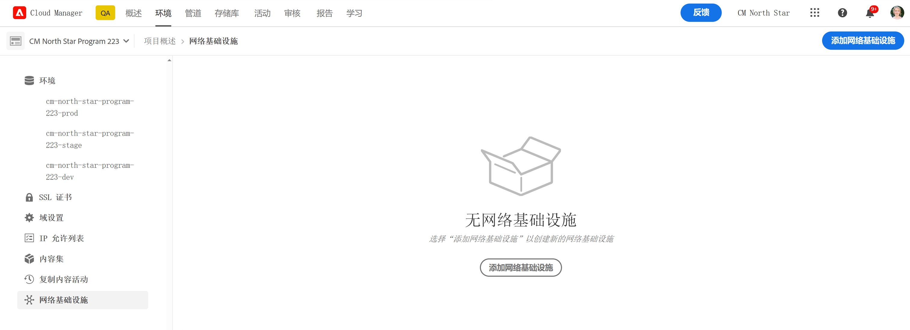

1. 在&#x200B;**添加网络基础架构**&#x200B;向导中，选择&#x200B;**灵活端口出口**&#x200B;并从&#x200B;**区域**&#x200B;下拉菜单中选择应创建它的区域，然后单击&#x200B;**继续**。

   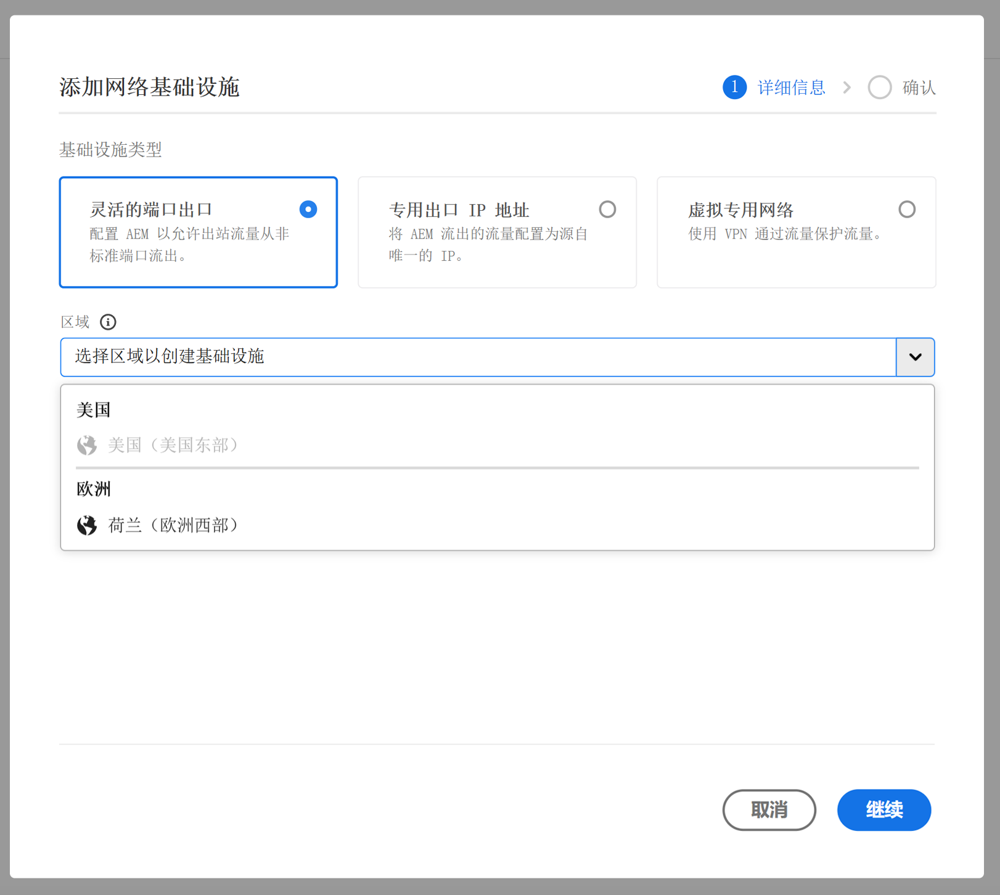

1. **确认**&#x200B;选项卡总结了您的选择和后续步骤。单击&#x200B;**保存**&#x200B;以创建基础架构。

   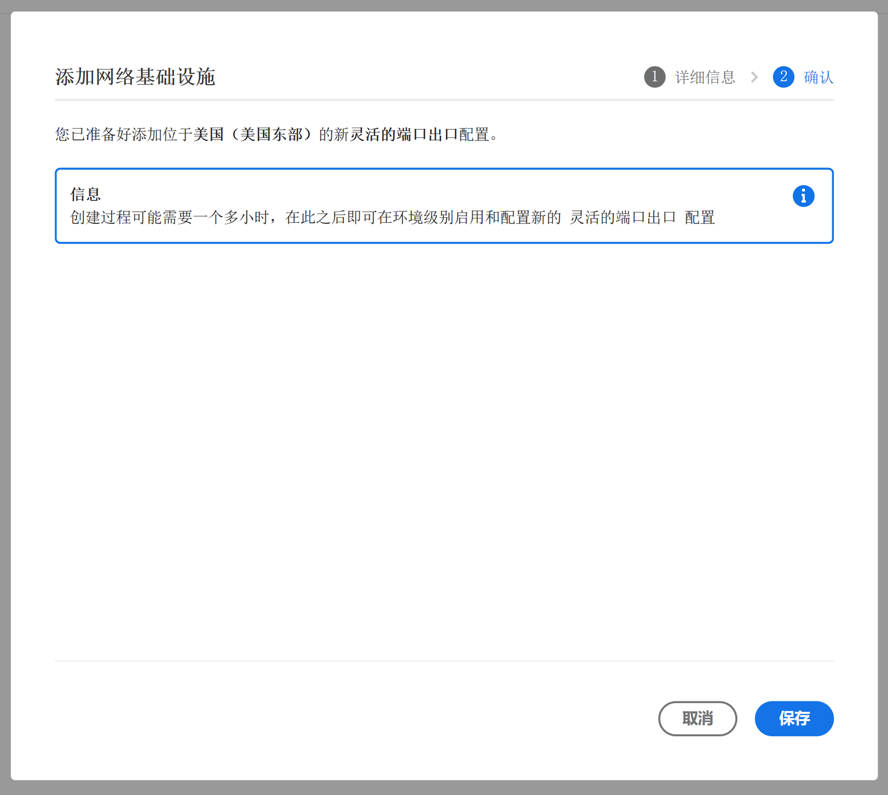

侧面板中&#x200B;**网络基础架构**&#x200B;标题下方将显示一条新记录，其中包括基础架构类型、状态、区域以及已启用该记录的环境的详细信息。

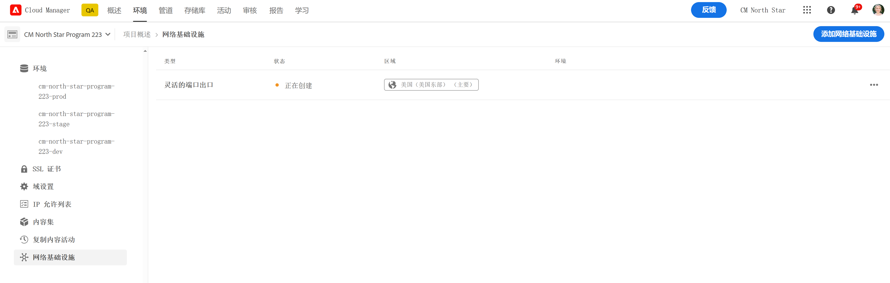

>[!NOTE]
>
>创建灵活端口出口的基础构架可能需要长达一个小时的时间，之后可以在环境级别进行配置。

### API 配置 {#configuring-flexible-port-egress-provision-api}

每个程序调用一次 POST `/program/<programId>/networkInfrastructures` 端点，只需传递 `kind` 参数和区域的 `flexiblePortEgress` 值。端点使用 `network_id` 以及包括状态在内的其他信息进行响应。

在调用后，通常需要大约 15 分钟来预配联网基础设施。对 Cloud Manager 的[网络基础架构 GET 端点](https://developer.adobe.com/experience-cloud/cloud-manager/reference/api/#operation/getNetworkInfrastructure)的调用将显示状态&#x200B;**“就绪”**。

>[!TIP]
>
>[API 文档中可以引用](https://developer.adobe.com/experience-cloud/cloud-manager/reference/api/#operation/createNetworkInfrastructure)完整的参数集和准确的语法，以及以后无法更改的参数等重要信息。

### 流量路由 {#flexible-port-egress-traffic-routing}

对于流向 80 或 443 端口以外端口的 http 或 https 流量，应使用以下主机和端口环境变体来配置代理。

* 对于 HTTP：`AEM_PROXY_HOST`/`AEM_HTTP_PROXY_PORT `（在 AEM 版本 6094 之前，默认为 `proxy.tunnel:3128`）
* 对于 HTTPS：`AEM_PROXY_HOST`/`AEM_HTTPS_PROXY_PORT `（在 AEM 版本 6094 之前，默认为 `proxy.tunnel:3128`）

例如，以下是发送请求到 `www.example.com:8443` 的示例代码：

```java
String url = "www.example.com:8443"
String proxyHost = System.getenv().getOrDefault("AEM_PROXY_HOST", "proxy.tunnel");
int proxyPort = Integer.parseInt(System.getenv().getOrDefault("AEM_HTTPS_PROXY_PORT", "3128"));
HttpClient client = HttpClient.newBuilder()
      .proxy(ProxySelector.of(new InetSocketAddress(proxyHost, proxyPort)))
      .build();
 
HttpRequest request = HttpRequest.newBuilder().uri(URI.create(url)).build();
HttpResponse<String> response = client.send(request, BodyHandlers.ofString());
```

如果使用非标准 Java™ 联网库，请使用以上属性为所有流量配置代理。

如果非 http/https 流量流经 `portForwards` 参数中声明的端口，应该引用名为 `AEM_PROXY_HOST` 的属性以及映射的端口。例如：

```java
DriverManager.getConnection("jdbc:mysql://" + System.getenv("AEM_PROXY_HOST") + ":53306/test");
```

下表描述了流量路由：

<table>
<thead>
  <tr>
    <th>流量</th>
    <th>目标条件</th>
    <th>端口</th>
    <th>连接</th>
    <th>外部目标示例</th>
  </tr>
</thead>
<tbody>
  <tr>
    <td><b>Http 或 https 协议</b></td>
    <td>标准 http/https 流量</td>
    <td>80 或 443</td>
    <td>允许</td>
    <td></td>
  </tr> 
  <tr>
    <td></td>
    <td>非标准流量（在 80 或 443 以外的端口上），这些流量流经使用以下环境变体和代理端口号配置的 http 代理。不要在 Cloud Manager API 调用的 portForwards 参数中声明目标端口：<br><ul>
     <li>AEM_PROXY_HOST（在 AEM 版本 6094 之前，默认为“proxy.tunnel”）</li>
     <li>AEM_HTTPS_PROXY_PORT（在 AEM 版本 6094 之前，默认为端口 3128）</li>
    </ul>
    <td>80 或 443 以外的端口</td>
    <td>允许</td>
    <td>example.com:8443</td>
  </tr>
  <tr>
    <td></td>
    <td>不使用 http 代理的非标准流量（位于端口 80 或 443 之外的其他端口）</td>
    <td>80 或 443 以外的端口</td>
    <td>已阻止</td>
    <td></td>
  </tr>
  <tr>
    <td><b>非 http 或非 https</b></td>
    <td>客户端使用在 <code>portForwards</code> API 参数中声明的 <code>portOrig</code> 连接到 <code>AEM_PROXY_HOST</code> 环境变体。</td>
    <td>任意</td>
    <td>允许</td>
    <td><code>mysql.example.com:3306</code></td>
  </tr>
  <tr>
    <td></td>
    <td>其他所有条件</td>
    <td>任意</td>
    <td>已阻止</td>
    <td><code>db.example.com:5555</code></td>
  </tr>
</tbody>
</table>

#### Apache / Dispatcher 配置 {#apache-dispatcher}

AEM Cloud Service Apache/Dispatcher 层的 `mod_proxy` 指令可以使用上述属性进行配置。

```
ProxyRemote "http://example.com:8080" "http://${AEM_PROXY_HOST}:3128"
ProxyPass "/somepath" "http://example.com:8080"
ProxyPassReverse "/somepath" "http://example.com:8080"
```

```
SSLProxyEngine on //needed for https backends
 
ProxyRemote "https://example.com:8443" "http://${AEM_PROXY_HOST}:3128"
ProxyPass "/somepath" "https://example.com:8443"
ProxyPassReverse "/somepath" "https://example.com:8443"
```

## 专用出口 IP 地址 {#dedicated-egress-ip-address}

在与 SaaS 供应商（例如 CRM 供应商）集成，或者对于在 AEM as a Cloud Service 之外提供 IP 地址允许列表的其他集成时，专用 IP 地址可以增强安全性。通过将专用 IP 地址添加到允许列表，可以确保只有来自 AEM Cloud Service 的流量允许流向外部服务。这是在允许的其他所有 IP 之外的流量。

相同的专用 IP 应用于您 Adobe 组织中的所有程序以及每个程序中的所有环境。它适用于“创作”和“发布”服务。

如果不启用专用 IP 地址功能，来自 AEM as a Cloud Service 的流量会流经与 AEM as a Cloud Service 的其他客户共享的一组 IP。

专用出口 IP 地址的配置方法与[灵活端口出口相同。](#flexible-port-egress)主要差别在于，配置后，流量始终从专用的唯一 IP 地址传出。要查找该 IP，请使用 DNS 解析器来确定与 `p{PROGRAM_ID}.external.adobeaemcloud.com` 关联的 IP 地址。该 IP 地址不应改变，但如果必须改变，则会提供提前通知。

>[!TIP]
>
>在灵活端口出口和专用出口 IP 地址之间做出选择时，如果不需要特定的 IP 地址，则选择灵活的端口出口。其原因是 Adobe 可以优化灵活端口传出流量的性能。

>[!NOTE]
>
>如果您在 2021.09.30 之前（即 2021 年 9 月版本之前）配置了专用出口 IP，则您的专用出口 IP 功能仅支持 HTTP 和 HTTPS 端口。
>
>这包括 HTTP/1.1 以及加密的 HTTP/2。此外，专用出口端点可以分别通过端口 80/443 上的 HTTP/HTTPS 与任何目标通信。

>[!NOTE]
>
>创建后，专用出口 IP 地址基础设施类型将无法编辑。更改配置值的唯一方法是删除并重新创建它们。

>[!INFO]
>
>如果配置了专用出口 IP，Splunk 转发将继续使用动态出口范围。无法将 Splunk 转发配置为使用专用出口 IP。

### UI 配置 {#configuring-dedicated-egress-provision-ui}

1. 在 [my.cloudmanager.adobe.com](https://my.cloudmanager.adobe.com/) 登录 Cloud Manager 并选择适当的组织。

1. 在&#x200B;**[我的程序](/help/implementing/cloud-manager/navigation.md#my-programs)**&#x200B;控制台上，选择该程序。

1. 从&#x200B;**程序概述**&#x200B;页面，导航至&#x200B;**环境**&#x200B;选项卡，然后在左侧面板中选择&#x200B;**网络基础架构**。

   

1. 在启动的&#x200B;**添加网络基础架构**&#x200B;向导中，选择&#x200B;**专用出口 IP 地址**&#x200B;以及从&#x200B;**区域**&#x200B;下拉菜单中选择应创建它的区域，然后单击&#x200B;**继续**。

   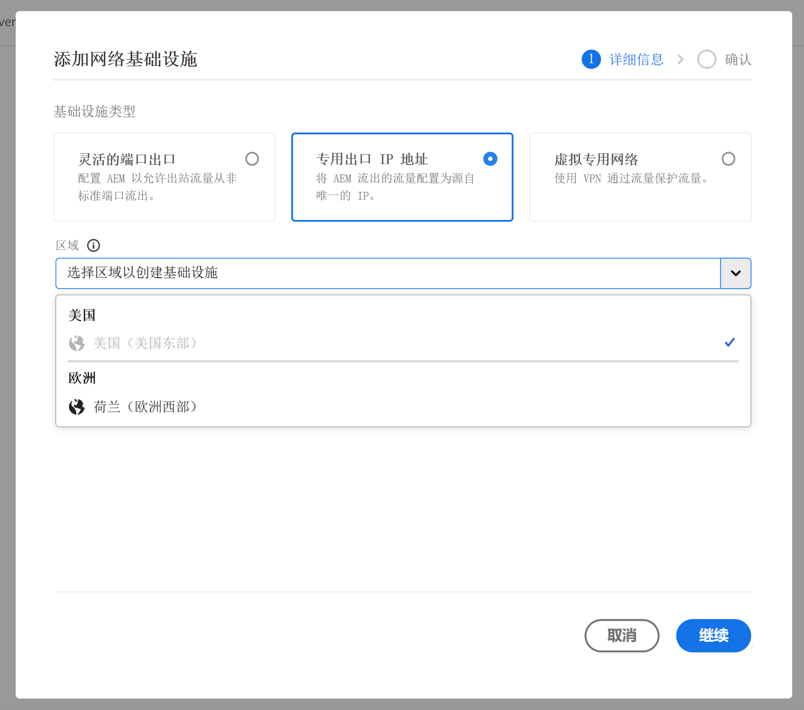

1. **确认**&#x200B;选项卡总结了您的选择和后续步骤。单击&#x200B;**保存**&#x200B;以创建基础架构。

   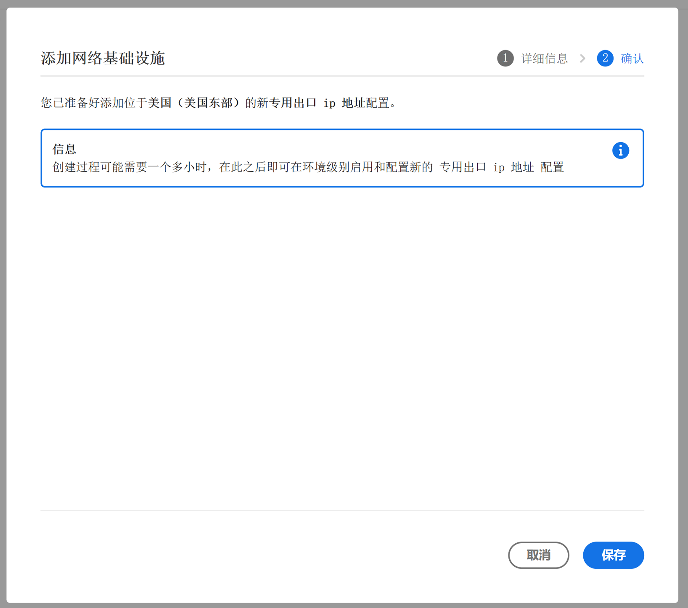

侧面板中&#x200B;**网络基础架构**&#x200B;标题下方将显示一条新记录，其中包括基础架构类型、状态、区域以及已启用该记录的环境的详细信息。


>[!NOTE]
>
>创建灵活端口出口的基础构架可能需要长达一个小时的时间，之后可以在环境级别进行配置。

### API 配置 {#configuring-dedicated-egress-provision-api}

每个程序调用一次 POST `/program/<programId>/networkInfrastructures` 端点，只需传递 `kind` 参数和区域的 `dedicatedEgressIp` 值。端点使用 `network_id` 以及包括状态在内的其他信息进行响应。

在调用后，通常需要大约 15 分钟来预配联网基础设施。对 Cloud Manager 的[网络基础架构 GET 端点](https://developer.adobe.com/experience-cloud/cloud-manager/reference/api/#operation/getNetworkInfrastructure)的调用将显示状态&#x200B;**“就绪”**。

>[!TIP]
>
>[API 文档中可以引用](https://developer.adobe.com/experience-cloud/cloud-manager/reference/api/#operation/createNetworkInfrastructure)完整的参数集和准确的语法，以及以后无法更改的参数等重要信息。

### 流量路由 {#dedicated-egress-ip-traffic-routing}

Http 或 https 流量将通过预配置的代理，前提是它们使用标准 Java™ 系统属性进行代理配置。

如果非 http/https 流量流经 `portForwards` 参数中声明的端口，应该引用名为 `AEM_PROXY_HOST` 的属性以及映射的端口。例如：

```java
DriverManager.getConnection("jdbc:mysql://" + System.getenv("AEM_PROXY_HOST") + ":53306/test");
```

<table>
<thead>
  <tr>
    <th>流量</th>
    <th>目标条件</th>
    <th>端口</th>
    <th>连接</th>
    <th>外部目标示例</th>
  </tr>
</thead>
<tbody>
  <tr>
    <td><b>Http 或 https 协议</b></td>
    <td>流向 Azure 或 Adobe 服务的流量</td>
    <td>任意</td>
    <td>通过共享集群 IP（而非专用 IP）</td>
    <td>adobe.io<br>api.windows.net</td>
  </tr>
  <tr>
    <td></td>
    <td>主机匹配 <code>nonProxyHosts</code> 参数</td>
    <td>80 或 443</td>
    <td>通过共享集群 IP</td>
    <td></td>
  </tr>
  <tr>
    <td></td>
    <td>主机匹配 <code>nonProxyHosts</code> 参数</td>
    <td>80 或 443 以外的端口</td>
    <td>已阻止</td>
    <td></td>
  </tr>
  <tr>
    <td></td>
    <td>通过 http 代理配置，默认情况下使用标准 Java™ HTTP 客户端库为 http/https 流量进行配置</td>
    <td>任意</td>
    <td>通过专用出口 IP</td>
    <td></td>
  </tr>
  <tr>
    <td></td>
    <td>忽略 http 代理配置（例如，如果明确从标准 Java™ HTTP 客户端库中删除，或者如果使用的 Java™ 库忽略标准代理配置）</td>
    <td>80 或 443</td>
    <td>通过共享集群 IP</td>
    <td></td>
  </tr>
  <tr>
    <td></td>
    <td>忽略 http 代理配置（例如，如果明确从标准 Java™ HTTP 客户端库中删除，或者如果使用的 Java™ 库忽略标准代理配置）</td>
    <td>80 或 443 以外的端口</td>
    <td>已阻止</td>
    <td></td>
  </tr>
  <tr>
    <td><b>非 http 或非 https</b></td>
    <td>客户端使用在 <code>portForwards</code> API 参数中声明的 <code>portOrig</code> 连接到 <code>AEM_PROXY_HOST</code> 环境变体</td>
    <td>任意</td>
    <td>通过专用出口 IP</td>
    <td><code>mysql.example.com:3306</code></td>
  </tr>
  <tr>
    <td></td>
    <td>其他所有条件</td>
    <td></td>
    <td>已阻止</td>
    <td></td>
  </tr>
</tbody>
</table>

### 功能用法 {#feature-usage}

该功能与产生传出流量的 Java™ 代码或库兼容，前提是它们的代理配置使用了标准 Java™ 系统属性。实际上，这应该包括了大多数常用库。

下面是代码示例：

```java
public JSONObject getJsonObject(String relativePath, String queryString) throws IOException, JSONException {
  String relativeUri = queryString.isEmpty() ? relativePath : (relativePath + '?' + queryString);
  URL finalUrl = endpointUri.resolve(relativeUri).toURL();
  URLConnection connection = finalUrl.openConnection();
  connection.addRequestProperty("Accept", "application/json");
  connection.addRequestProperty("X-API-KEY", apiKey);

  try (InputStream responseStream = connection.getInputStream(); Reader responseReader = new BufferedReader(new InputStreamReader(responseStream, Charsets.UTF_8))) {
    return new JSONObject(new JSONTokener(responseReader));
  }
}
```

一些库需要明确配置，以便为代理配置使用标准 Java™ 系统属性。

使用 Apache HttpClient 的示例，其中需要明确调用 
[`HttpClientBuilder.useSystemProperties()`](https://hc.apache.org/httpcomponents-client-4.5.x/current/httpclient/apidocs/org/apache/http/impl/client/HttpClientBuilder.html) 或使用
[`HttpClients.createSystem()`](https://hc.apache.org/httpcomponents-client-4.5.x/current/httpclient/apidocs/org/apache/http/impl/client/HttpClients.html#createSystem())：

```java
public JSONObject getJsonObject(String relativePath, String queryString) throws IOException, JSONException {
  String relativeUri = queryString.isEmpty() ? relativePath : (relativePath + '?' + queryString);
  URL finalUrl = endpointUri.resolve(relativeUri).toURL();

  HttpClient httpClient = HttpClientBuilder.create().useSystemProperties().build();
  HttpGet request = new HttpGet(finalUrl.toURI());
  request.setHeader("Accept", "application/json");
  request.setHeader("X-API-KEY", apiKey);
  HttpResponse response = httpClient.execute(request);
  String result = EntityUtils.toString(response.getEntity());
}
```

### 调试注意事项 {#debugging-considerations}

为了验证该流量是否确实在预期的专用 IP 地址上传出，请查看目标服务中的日志（如果可用）。否则，调用 [https://ifconfig.me/ip](https://ifconfig.me/ip) 等调试服务可能会有帮助，调试服务会返回调用 IP 地址。

## 虚拟专用网络 (VPN) {#vpn}

VPN 允许从创作、发布或预览实例连接到内部部署基础架构或数据中心。例如，这对于保护数据库访问很有用。它还允许连接到 SaaS 供应商（例如支持 VPN 的 CRM 供应商），或者允许从公司网络连接到 AEM as a Cloud Service 的创作、预览或发布实例。

支持大部分采用 IPSec 技术的 VPN 设备。请参阅[此设备列表中&#x200B;**RouteBased 配置说明**&#x200B;列中的信息。](https://learn.microsoft.com/zh-cn/azure/vpn-gateway/vpn-gateway-about-vpn-devices#devicetable)按表中所述配置该设备。

>[!NOTE]
>
>以下是 VPN 基础设施的限制：
>
>* 仅限于支持单个 VPN 连接
>* 无法在 VPN 连接上使用 Splunk 转发功能。
>* 必须在网关地址空间中列出 DNS 解析器才能解析私有主机名。

### UI 配置 {#configuring-vpn-ui}

1. 在 [my.cloudmanager.adobe.com](https://my.cloudmanager.adobe.com/) 登录 Cloud Manager 并选择适当的组织。

1. 在&#x200B;**[我的程序](/help/implementing/cloud-manager/navigation.md#my-programs)**&#x200B;控制台上，选择该程序。

1. 从&#x200B;**程序概述**&#x200B;页面，导航至&#x200B;**环境**&#x200B;选项卡，然后在左侧面板中选择&#x200B;**网络基础架构**。

   

1. 在启动的&#x200B;**添加网络基础架构**&#x200B;向导中，选择&#x200B;**虚拟专用网络**&#x200B;并在单击&#x200B;**继续**&#x200B;之前提供必要的信息。

   * **区域** – 这是应该创建基础架构的区域。
   * **地址空间**：地址空间只能是您自己空间中的 1 /26 CIDR（64 个 IP 地址）或更大的 IP 范围。
      * 该值以后无法更改。
   * **DNS 信息** – 这是远程 DNS 解析器的列表。
      * 按 `Enter` 输入 DNS 服务器地址后可添加另一个地址。
      * 单击地址后的 `X` 将其移除。
   * **共享密钥** – 这是您的 VPN 预共享密钥。
      * 选择&#x200B;**显示共享密钥**&#x200B;可显示密钥，以便仔细检查其值。

   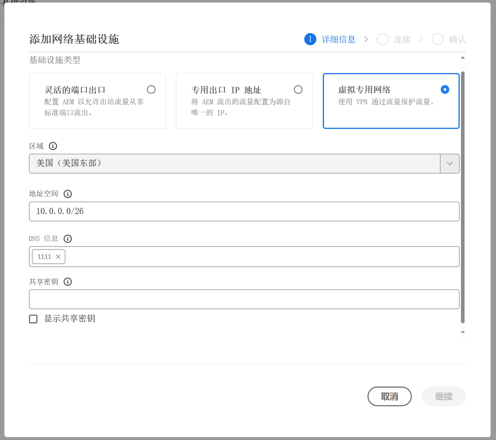

1. 在&#x200B;**连接**&#x200B;向导选项卡中，提供&#x200B;**连接名称**&#x200B;识别您的 VPN 连接并单击&#x200B;**添加连接**。

   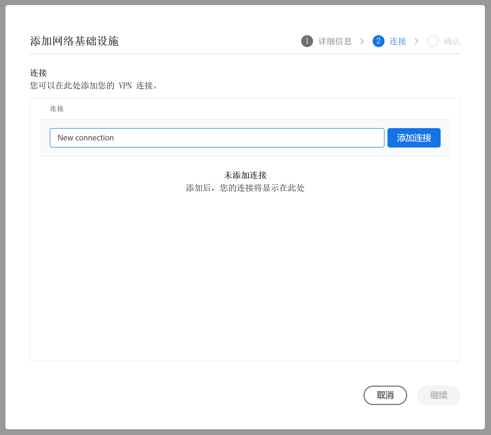

1. 在&#x200B;**添加连接**&#x200B;对话框中，定义您的 VPN 连接，然后单击&#x200B;**保存**。

   * **连接名称** – 这是您的 VPN 连接的描述性名称，您在上一步中提供了该名称，可以在此处更新。
   * **地址** - 这是 VPN 设备 IP 地址。
   * **地址空间** – 这些是通过 VPN 路由的 IP 地址范围。
      * 按 `Enter` 输入一个范围后可添加另一个范围。
      * 单击范围后的`X`将其删除。
   * **IP 安全策略** – 根据需要调整默认值

   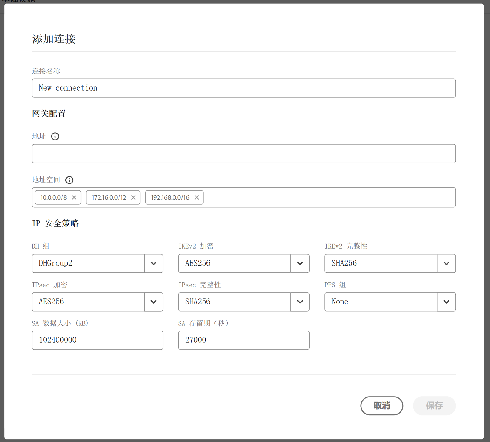

1. 对话框关闭，您返回到&#x200B;**连接**&#x200B;向导的选项卡。单击&#x200B;**继续**。

   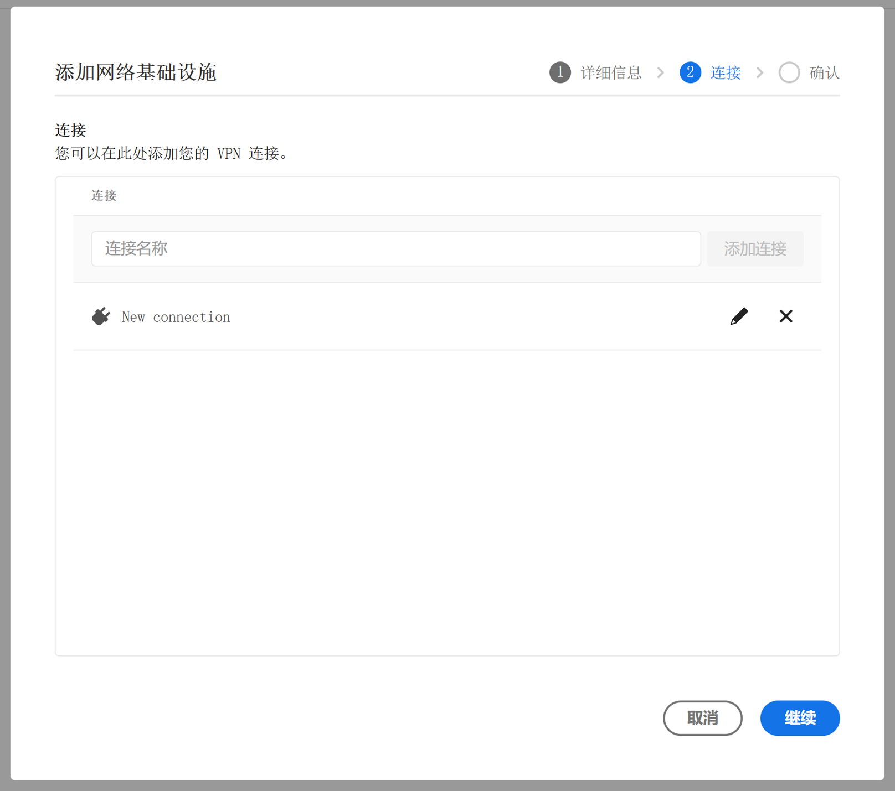

1. **确认**&#x200B;选项卡总结了您的选择和后续步骤。单击&#x200B;**保存**&#x200B;以创建基础架构。

   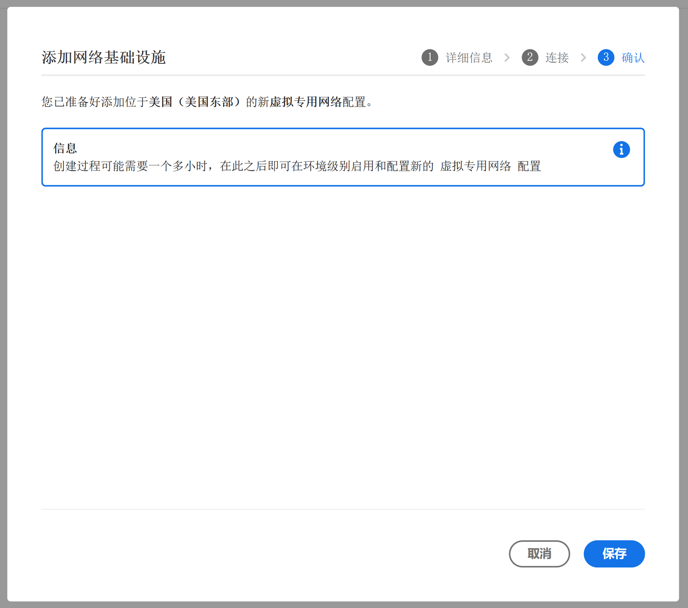

侧面板中&#x200B;**网络基础架构**&#x200B;标题下方将显示一条新记录，其中包括基础架构类型、状态、区域以及已启用该记录的环境的详细信息。

### API 配置 {#configuring-vpn-api}

每个程序调用一次 POST `/program/<programId>/networkInfrastructures` 端点。它会传递配置信息的负载。该信息包括 `kind` 参数的 **vpn** 值、区域、地址空间（CIDR 列表；请注意，该信息稍后无法修改）、DNS解析器（用于解析网络中的名称）。它还包括 VPN 连接信息，例如网关配置、共享 VPN 密钥和 IP 安全性策略。端点使用 `network_id` 以及包括状态在内的其他信息进行响应。

在调用后，通常需要 45 到 60 分钟才能提供网络基础设施。可以调用 API 中的 GET 方法，以返回状态，该状态最终会从 `creating` 翻转到 `ready`。请参考 API 文档来了解所有状态。

>[!TIP]
>
>[API 文档中可以引用](https://developer.adobe.com/experience-cloud/cloud-manager/reference/api/#operation/createNetworkInfrastructure)完整的参数集和准确的语法，以及以后无法更改的参数等重要信息。

### 流量路由 {#vpn-traffic-routing}

下表描述了流量路由。

<table>
<thead>
  <tr>
    <th>流量</th>
    <th>目标条件</th>
    <th>端口</th>
    <th>连接</th>
    <th>外部目标示例</th>
  </tr>
</thead>
<tbody>
  <tr>
    <td><b>Http 或 https 协议</b></td>
    <td>流向 Azure 或 Adobe 服务的流量</td>
    <td>任意</td>
    <td>通过共享集群 IP（而非专用 IP）</td>
    <td>adobe.io<br>api.windows.net</td>
  </tr>
  <tr>
    <td></td>
    <td>主机匹配 <code>nonProxyHosts</code> 参数</td>
    <td>80 或 443</td>
    <td>通过共享集群 IP</td>
    <td></td>
  </tr>
  <tr>
    <td></td>
    <td>主机匹配 <code>nonProxyHosts</code> 参数</td>
    <td>80 或 443 以外的端口</td>
    <td>已阻止</td>
    <td></td>
  </tr>
  <tr>
    <td></td>
    <td>如果 IP 处于 <i>VPN 网关地址</i>空间范围内，并且通过 http 代理配置传输流量（默认情况下使用标准 Java™ HTTP 客户端库为 http/https 流量进行配置）</td>
    <td>任意</td>
    <td>通过 VPN</td>
    <td><code>10.0.0.1:443</code><br>这也可以是主机名。</td>
  </tr>
  <tr>
    <td></td>
    <td>如果 IP 没有处于 <i>VPN 网关地址</i>空间范围内，并且通过 http 代理配置传输流量（默认情况下使用标准 Java™ HTTP 客户端库为 http/https 流量进行配置）</td>
    <td>任意</td>
    <td>通过专用出口 IP</td>
    <td></td>
  </tr>
  <tr>
    <td></td>
    <td>忽略 http 代理配置（例如，如果明确从标准 Java™ HTTP 客户端库中删除，或者如果使用省略了标准代理配置的 Java™ 库）
</td>
    <td>80 或 443</td>
    <td>通过共享集群 IP</td>
    <td></td>
  </tr>
  <tr>
    <td></td>
    <td>忽略 http 代理配置（例如，如果明确从标准 Java™ HTTP 客户端库中删除，或者如果使用省略了标准代理配置的 Java™ 库）</td>
    <td>80 或 443 以外的端口</td>
    <td>已阻止</td>
    <td></td>
  </tr>
  <tr>
    <td><b>非 http 或非 https</b></td>
    <td>如果 IP 处于 <i>VPN 网关地址空间</i>范围内，并且客户端使用在 <code>portForwards</code> API 参数中声明的 <code>portOrig</code> 连接到 <code>AEM_PROXY_HOST</code> 环境变体</td>
    <td>任意</td>
    <td>通过 VPN</td>
    <td><code>10.0.0.1:3306</code><br>这也可以是主机名。</td>
  </tr>
  <tr>
    <td></td>
    <td>如果 IP 没有处于 <i>VPN 网关地址空间</i>范围内，并且客户端使用在 <code>portForwards</code> API 参数中声明的 <code>portOrig</code> 连接到 <code>AEM_PROXY_HOST</code> 环境变体</td>
    <td>任意</td>
    <td>通过专用出口 IP</td>
    <td></td>
  </tr>
  <tr>
    <td></td>
    <td>其他所有条件</td>
    <td>任意</td>
    <td>已阻止</td>
    <td></td>
  </tr>
</tbody>
</table>

### 对配置非常有用的域 {#vpn-useful-domains-for-configuration}

下图直观地展示了在配置和开发时非常有用的一组域和关联 IP。该图下方的表进一步说明了这些域和 IP。


<table>
<thead>
  <tr>
    <th>域模式</th>
    <th>出口（自 AEM）含义</th>
    <th>入口（至 AEM）含义</th>
  </tr>
</thead>
<tbody>
  <tr>
    <td><code>p{PROGRAM_ID}.external.adobeaemcloud.com</code></td>
    <td>专用出口 IP 地址用于流向 Internet 的流量，而非通过专用网络的流量 </td>
    <td>来自 VPN 的连接将在 CDN 上显示为来自此 IP。要仅允许来自 VPN 的连接进入 AEM，请将 Cloud Manager 配置为仅允许此 IP 并阻止其他所有流量。有关详细信息，请参阅“将传入限制为 VPN 连接”。</td>
  </tr>
  <tr>
    <td><code>p{PROGRAM_ID}.{REGION}-gateway.external.adobeaemcloud.com</code></td>
    <td>不适用</td>
    <td>AEM 侧 VPN 网关的 IP。您的网络工程团队可以使用此项来仅允许源自特定 IP 地址的 VPN 连接进入您的 VPN 网关。 </td>
  </tr>
  <tr>
    <td><code>p{PROGRAM_ID}.{REGION}.inner.adobeaemcloud.net</code></td>
    <td>流量从 AEM 端的 VPN 流向您所在的一端时使用的 IP。这可以列入您的配置的允许列表中，以确保只接受来自 AEM 的连接。</td>
    <td>如果您希望允许通过 VPN 访问 AEM，则应该配置 CNAME DNS 条目以将您的自定义域和/或 <code>author-p{PROGRAM_ID}-e{ENVIRONMENT_ID}.adobeaemcloud.com</code> 和/或 <code>publish-p{PROGRAM_ID}-e{ENVIRONMENT_ID}.adobeaemcloud.com</code> 映射到此项。</td>
  </tr>
</tbody>
</table>

### 将传入限制为 VPN 连接 {#restrict-vpn-to-ingress-connections}

如果您希望只允许通过 VPN 访问 AEM，则可以在 Cloud Manager 中配置环境允许列表，这样可以只允许 `p{PROGRAM_ID}.external.adobeaemcloud.com` 定义的 IP 与环境通信。此操作与在 Cloud Manager 中定义其他任何基于 IP 的允许列表相同。

如果规则必须基于路径，则在 Dispatcher 级别使用标准 http 指令来拒绝或允许特定 IP。它们可以确保所需路径在 CDN 上不可缓存，因此请求始终将获取到来源。

#### Httpd 配置示例 {#httpd-example}

```
Order deny,allow
Deny from all
Allow from 192.168.0.1
Header always set Cache-Control private
```

## 在环境中启用高级网络配置 {#enabling}

一旦为程序配置了高级网络选项，无论是[灵活的端口出口，](#flexible-port-egress)[专用出口 IP 地址，](#dedicated-egress-ip-address)还是 [VPN](#vpn)，要使用这些选项，必须在环境级别启用。

当您为环境启用高级网络配置时，您也可以启用可选的端口转发和非代理主机。可以根据各个环境来配置参数以提供灵活性。

* **转发端口** – 应为除 80/443 之外的任何目标端口声明端口转发规则，但前提是不使用 http 或 https 协议。
   * 端口转发规则是通过指定目标主机集（名称或 IP 和端口）来定义的。
   * 通过 http/https 使用端口 80/443 的客户端连接仍必须在其连接中使用代理设置，以便将高级联网属性应用于此连接。
   * 对于每个目标主机，您必须将指向的目标端口映射到 30000 到 30999 之间的端口。
   * 端口转发规则适用于所有高级网络类型。

* **非代理主机**：非代理主机允许您声明一组主机，这些主机应通过共享的 IPS 地址范围而不是专用的 IP 进行路由。
   * 这可能很有用，因为通过共享 IPS 流出的流量可以进一步优化。
   * 非代理主机仅适用于专用出口 IP 地址和 VPN 高级网络类型。

>[!NOTE]
>
>如果环境处于&#x200B;**更新中**&#x200B;状态，则无法为该环境启用高级网络配置。

### 启用使用 UI {#enabling-ui}

1. 在 [my.cloudmanager.adobe.com](https://my.cloudmanager.adobe.com/) 登录 Cloud Manager 并选择适当的组织。

1. 在&#x200B;**[我的程序](/help/implementing/cloud-manager/navigation.md#my-programs)**&#x200B;控制台上，选择该程序。

1. 从&#x200B;**程序概述**&#x200B;页面，导航至&#x200B;**环境**&#x200B;选项卡，然后在左侧面板的&#x200B;**环境**&#x200B;标题下选择您希望启用高级网络配置的环境。然后选择所选环境的&#x200B;**高级网络配置**&#x200B;选项卡，单击&#x200B;**启用网络基础架构**。

   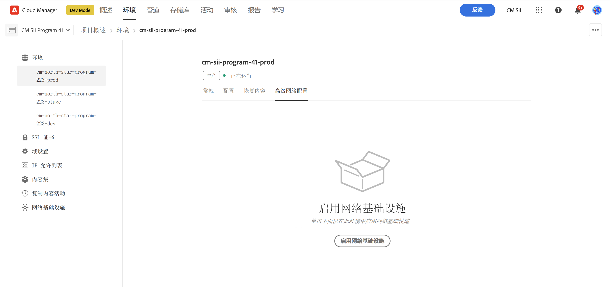

1. **配置高级网络**&#x200B;对话框打开。

1. 在&#x200B;**非代理主机**&#x200B;选项卡上，对于专用出口 IP 地址和 VPN，您可以选择定义一组主机。这些定义的主机应该通过共享的 IP 地址范围（而不是专用的 IP）进行路由，其方法是在&#x200B;**非代理主机**&#x200B;字段中提供主机名，然后单击&#x200B;**添加**。

   * 该主机将添加到选项卡上的主机列表中。
   * 如果要添加多个主机，请重复此步骤。
   * 如果想要删除主机，请单击该行右侧的 X。
   * 此选项卡不适用于灵活端口出口配置。

   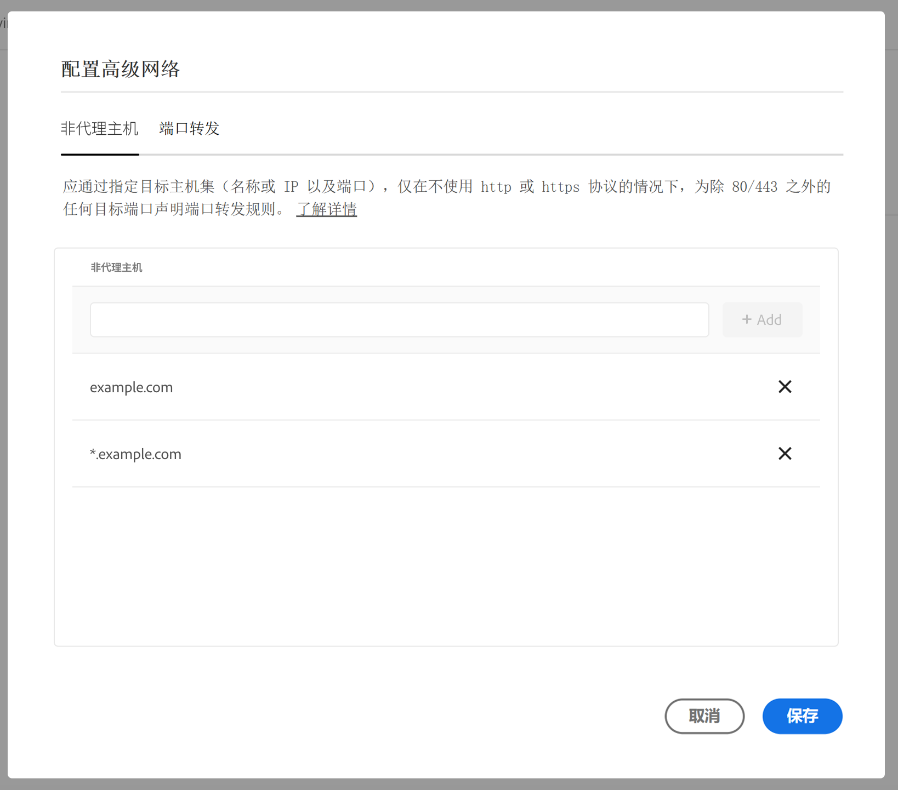

1. 在&#x200B;**端口转发**&#x200B;选项卡上，如果不使用 HTTP 或 HTTPS，您可以选择为除 80/443 之外的任何目标端口定义端口转发规则。提供&#x200B;**名称**、**原始端口**&#x200B;和&#x200B;**目标端口**，然后单击&#x200B;**添加**。

   * 该规则将添加到选项卡上的规则列表中。
   * 如果要添加多个规则，请重复此步骤。
   * 如果想要移除规则，请单击该行右侧的 X。

   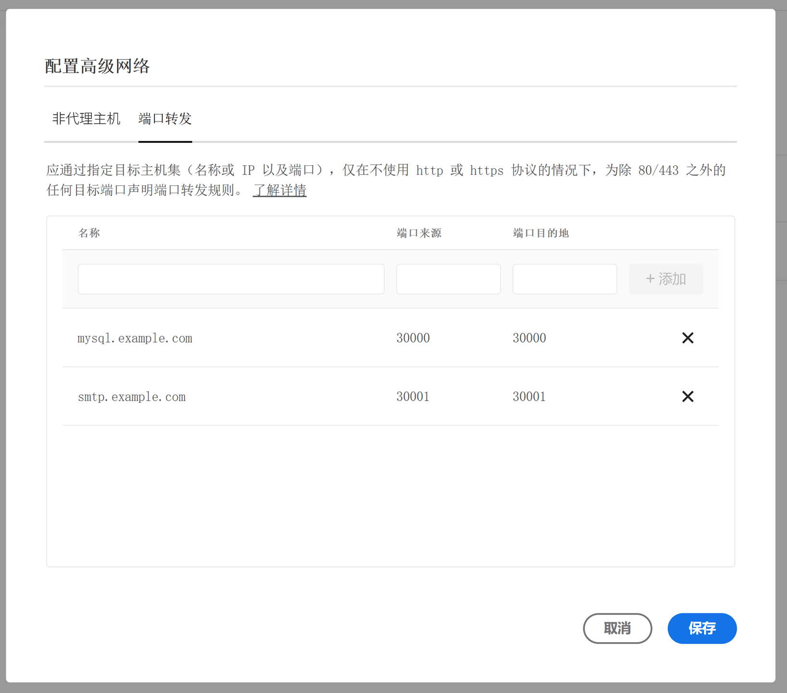

1. 单击对话框中的&#x200B;**保存**&#x200B;将配置应用到环境。

高级网络配置将应用于所选环境。返回&#x200B;**环境**&#x200B;选项卡，您可以查看应用于所选环境的配置的详细信息及其状态。

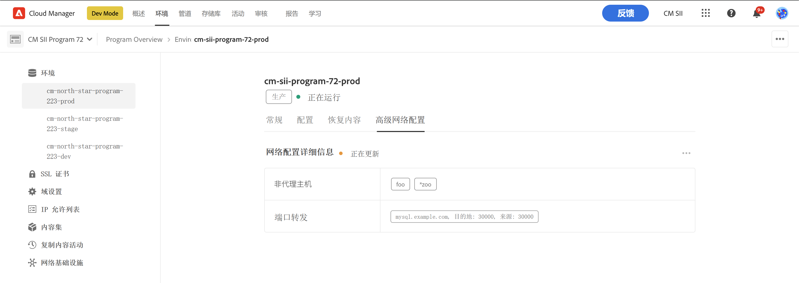

### 启用使用 API {#enabling-api}

要为环境启用高级网络配置，必须为每个环境调用 `PUT /program/<program_id>/environment/<environment_id>/advancedNetworking` 端点。

API 应该会在几秒钟内做出响应，并且状态会显示为 `updating`。大约 10 分钟后，对 Cloud Manager 环境 GET 端点的调用显示的状态为  `ready`，表明已应用对环境的更新。

每个环境的端口转发规则可以通过调用 `PUT /program/{programId}/environment/{environmentId}/advancedNetworking` 端点进行更新，包括完整的配置参数集而不是其子集。

专用出口 IP 地址和 VPN 高级网络类型支持`nonProxyHosts`参数。这使您可以声明一组主机，这些主机应通过共享的 IP 地址范围而不是专用的 IP 进行路由。`nonProxyHost` URL 可能会遵循 `example.com` 或 `*.example.com` 的模式，这种情况下仅支持在域的开头使用通配符。

即使没有环境流量路由规则（托管或绕过），仍必须调用 `PUT /program/<program_id>/environment/<environment_id>/advancedNetworking`，只不过在调用时使用空负载。

>[!TIP]
>
>[API 文档中可以引用](https://developer.adobe.com/experience-cloud/cloud-manager/reference/api/#operation/createNetworkInfrastructure)完整的参数集和准确的语法，以及以后无法更改的参数等重要信息。

## 编辑和删除环境中的高级网络配置 {#editing-deleting-environments}

 [为环境启用高级网络配置后，](#enabling) 您可以更新这些配置的详细信息或将其删除。

>[!NOTE]
>
>如果网络基础架构的状态为&#x200B;**正在创建**、**正在更新**&#x200B;或&#x200B;**正在删除**，则无法编辑网络基础架构。

### 使用 UI 编辑或删除 {#editing-ui}

1. 在 [my.cloudmanager.adobe.com](https://my.cloudmanager.adobe.com/) 登录 Cloud Manager 并选择适当的组织。

1. 在&#x200B;**[我的程序](/help/implementing/cloud-manager/navigation.md#my-programs)**&#x200B;控制台上，选择该程序。

1. 从&#x200B;**程序概述**&#x200B;页面，导航至&#x200B;**环境**&#x200B;选项卡，然后在左侧面板的&#x200B;**环境**&#x200B;标题下选择您希望启用高级网络配置的环境。然后选择所选环境的&#x200B;**高级网络配置**&#x200B;选项卡，单击省略号按钮。

   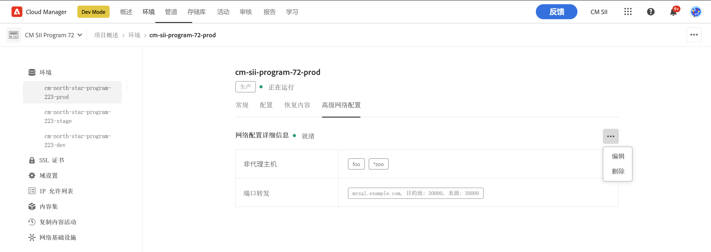

1. 在省略号菜单中，选择&#x200B;**编辑**&#x200B;或&#x200B;**删除**。

   * 如果您选择&#x200B;**编辑**，请按照上一节[启用用户界面](#enabling-ui)中描述的步骤更新信息，然后单击&#x200B;**保存**。
   * 如果您选择 **删除**，请在&#x200B;**删除网络配置**&#x200B;对话框中使用“**删除**”确认删除或使用“**取消**”中止。

更改将反映在&#x200B;**环境**&#x200B;选项卡上。

### 使用 API 编辑或删除 {#editing-api}

要删除特定环境的高级网络，请调用 `DELETE [/program/{programId}/environment/{environmentId}/advancedNetworking]()`。

>[!TIP]
>
>[API 文档中可以引用](https://developer.adobe.com/experience-cloud/cloud-manager/reference/api/#operation/createNetworkInfrastructure)完整的参数集和准确的语法，以及以后无法更改的参数等重要信息。

## 编辑和删除程序的网络基础架构 {#editing-deleting-program}

一旦为程序创建了网络基础架构，就只能编辑有限的属性。如果您不需要它，您可以删除整个程序的高级网络基础架构。

>[!NOTE]
>
>以下是编辑和删除网络基础架构的限制：
>
>* 只有在所有环境都禁用其高级网络的情况下，删除操作才会删除基础架构。
>* 如果网络基础架构的状态为&#x200B;**正在创建**、**正在更新**&#x200B;或&#x200B;**正在删除**，则无法编辑网络基础架构。
>* 创建后，只能编辑 VPN 高级网络基础架构类型，并且只能编辑有限的字段。
>* 出于安全原因，在编辑高级 VPN 网络基础架构时，必须始终提供&#x200B;**共享密钥**，即使您没有编辑密钥本身。

### 使用 UI 进行编辑和删除 {#delete-ui}

1. 在 [my.cloudmanager.adobe.com](https://my.cloudmanager.adobe.com/) 登录 Cloud Manager 并选择适当的组织。

1. 在&#x200B;**[我的程序](/help/implementing/cloud-manager/navigation.md#my-programs)**&#x200B;控制台上，选择该程序。

1. 从&#x200B;**程序概述**&#x200B;页面，导航至&#x200B;**环境**&#x200B;选项卡，然后在左侧面板中选择&#x200B;**网络基础架构**&#x200B;标题。然后单击要删除的基础架构旁边的省略号按钮。

   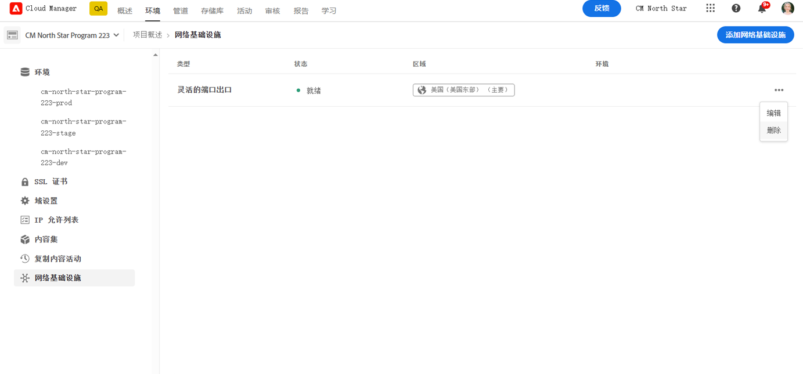

1. 在省略号菜单中，选择&#x200B;**编辑**&#x200B;或&#x200B;**删除**。

1. 如果您选择&#x200B;**编辑**，则会打开&#x200B;**编辑网络基础架构**&#x200B;向导。按照创建基础架构时所述的步骤根据需要进行编辑。

1. 如果您选择&#x200B;**删除**，请在&#x200B;**删除网络配置**&#x200B;对话框中使用“**删除**”确认删除或使用“**取消**”中止。

更改将反映在&#x200B;**环境**&#x200B;选项卡上。

### 使用 API 进行编辑和删除 {#delete-api}

要&#x200B;**删除**&#x200B;项目的网络基础架构，请调用 `DELETE /program/{program ID}/networkinfrastructure/{networkinfrastructureID}`。

## 更改程序的高级网络基础架构类型 {#changing-program}

一次只能为程序配置一种类型的高级网络基础架构。高级网络基础设施必须是灵活的端口出口、专用出口 IP 地址或 VPN。

如果您决定需要另一种高级网络基础架构类型而不是已配置的网络基础架构类型，则删除现有的网络基础架构类型，并再创建一个网络基础架构类型。执行以下操作：

1. [删除所有环境中的高级网络。](#editing-deleting-environments)
1. [删除高级网络基础架构。](#editing-deleting-program)
1. 创建您现在需要的高级网络基础架构类型，[灵活端口出口、](#flexible-port-egress)[专用出口 IP 地址](#dedicated-egress-ip-address)或 [VPN。](#vpn)
1. [在环境级别启用高级网络。](#enabling)

>[!WARNING]
>
> 此过程会导致在删除和重新创建之间停用高级网络服务。
> 如果停机会对业务产生重大影响，请联系客户支持以寻求帮助，并说明已创建的内容和更改的原因。

## 其他发布区域的高级网络配置 {#advanced-networking-configuration-for-additional-publish-regions}

当将附加区域添加到已配置高级网络的环境中时，来自与高级网络规则匹配的附加发布区域的流量将默认路由通过主要区域。但是，如果主要区域变得不可用，在附加区域中未启用高级网络时，高级网络流量会被丢弃。如果您希望在其中一个区域发生中断时优化延迟并提高可用性，则有必要为附加发布区域启用高级网络。以下部分描述了两种不同的场景。

>[!NOTE]
>
>所有区域共享[环境高级网络配置](https://developer.adobe.com/experience-cloud/cloud-manager/reference/api/#tag/Environment-Advanced-Networking-Configuration)，因此无法根据流量流出的区域将流量路由到不同的目标。

### 专用出口 IP 地址 {#additional-publish-regions-dedicated-egress}

#### 高级网络已在主要区域启用 {#already-enabled}

如果已在主要区域启用高级网络配置，请执行以下步骤：

1. 如果您已锁定基础设施，使得专用 AEM IP 地址被列入允许列表，请暂时禁用该基础设施中的任何拒绝规则。如果不这样做，您自己的基础设施会在短时间内拒绝来自新区域的 IP 地址的请求。如果您已通过完全限定域名 (FQDN) 锁定您的基础设施（例如，`p1234.external.adobeaemcloud.com`），则没有必要这样做，因为所有 AEM 区域都会从相同的 FQDN 输出高级网络流量
1. 如高级网络文档中所述，通过对 Cloud Manager Create Network Infrastructure API 的 POST 调用，为次要区域创建程序范围的网络基础设施。负载的 JSON 配置相对于主要区域的唯一区别是区域属性
1. 如果您的基础设施必须由 IP 锁定以允许 AEM 流量，请添加与 `p1234.external.adobeaemcloud.com` 匹配的 IP。每个区域应该有一个匹配的 IP。

#### 尚未在任何区域配置高级网络 {#not-yet-configured}

该过程与前面的说明大体相似。但是，如果生产环境尚未启用高级网络，则有机会通过首先在暂存环境中启用配置来测试配置：

1. 通过 POST 调用 [Cloud Manager 创建网路基础设施 API](https://developer.adobe.com/experience-cloud/cloud-manager/reference/api/#tag/Network-infrastructure/operation/createNetworkInfrastructure) 为所有区域创建网络基础设施。负载的 JSON 配置相对于主要区域的唯一区别是区域属性。
1. 对于暂存环境，通过运行 `PUT api/program/{programId}/environment/{environmentId}/advancedNetworking` 启用和配置环境范围内的高级网络。有关更多信息，请在[此处](https://developer.adobe.com/experience-cloud/cloud-manager/reference/api/#tag/Environment-Advanced-Networking-Configuration/operation/enableEnvironmentAdvancedNetworkingConfiguration)参阅该 API 文档。
1. 如有必要，最好通过 FQDN（例如 `p1234.external.adobeaemcloud.com`）锁定外部基础设施。您可以通过 IP 地址进行锁定
1. 如果暂存环境按预期工作，请为生产启用并配置环境范围内的高级网络配置。

#### VPN {#vpn-regions}

该过程与专用出口 IP 地址指令几乎相同。唯一的区别是，除了区域属性的配置与主要区域不同之外，还可以选择配置 `connections.gateway` 字段。该配置可以路由到您的组织运营的地理位置上更靠近新区域的其他 VPN 端点。

## 疑难解答

请注意，以下要点仅供参考，包含故障排除的最佳实践。这些建议旨在帮助您有效诊断和解决问题。

### 连接池 {#connection-pooling-advanced-networking}

连接池是一种专门用于创建和维护连接存储库的技术，可供任何可能需要连接的线程立即使用。在各种在线平台和资源中可以找到许多连接池技术，每种技术都有其独特的优点和注意事项。我们鼓励客户研究这些方法，找出最适合其系统架构的方法。

实施适当的连接池策略是一种主动措施，可以纠正系统配置中常见的疏忽，这种疏忽往往会导致性能不佳。通过正确建立连接池，Adobe Experience Manager (AEM) 可以提高外部调用的效率。这不仅减少了资源消耗，还降低了服务中断的风险，并减少了与上游服务器通信时请求失败的可能性。

鉴于此，Adobe 建议重新评估您当前的 AEM 配置，并考虑将连接池与高级网络设置结合使用。通过管理并行连接的数量并最大程度降低连接过时的可能性，这些措施可以降低代理服务器达到连接限制的风险。因此，此战略实施旨在降低请求无法到达外部端点的可能性。

#### 连接限制常见问题解答

使用高级网络时，连接数量受到限制，以确保跨环境的稳定性并防止较低环境耗尽可用的连接。

每个 AEM 实例的连接数限制为 1000 个，当连接数达到 750 个时会向客户发送警报。

##### 连接限制是否仅适用于非标准端口的出站流量或所有出站流量？

此限制仅适用于使用高级网络的连接（非标准端口上的出口、使用专用出口 IP 或 VPN）。

##### 我们没有看到传出连接的数量有显著差异。为什么我们现在收到通知？

如果客户动态创建连接（例如，每个请求创建一个或多个连接），则流量的增加可能会导致连接激增。

##### 我们以前是否也经历过类似的情况而没有得到警告？

仅当达到软限制时才会发送警报。

##### 如果达到最大限制会发生什么情况？

当达到硬限制时，通过高级网络（非标准端口上的出口、使用专用出口 IP 或 VPN）从 AEM 发出的新出口连接将被丢弃，以防止 DoS 攻击。

##### 可以提高限额吗？

不可以，大量连接会对性能造成严重影响，并导致跨 pod 和环境的 DoS。

##### AEM 系统会在一段时间后自动关闭连接吗？

是的，连接在 JVM 级别和网络基础设施的不同点关闭。然而，这对于任何生产服务来说都太晚了。当使用连接池时，当不再需要连接时应明确关闭连接或将其返回到池中。否则，资源消耗过高，可能造成资源耗尽。

##### 如果达到最大连接限制，是否会影响任何许可证并导致额外费用？

否，此限制不需要许可证或费用。这是一个技术限制。

##### 我们距离极限还有多远？最高限额是多少？

当连接数超过 750 时会触发警报。每个 AEM 实例的最大限制为 1000 个连接。

##### 此限制适用于 VPN 吗？

是的，该限制适用于使用高级网络（包括 VPN）的连接。

##### 如果我们使用专用出口 IP，此限制仍然适用吗？

是的，如果使用专用出口 IP，该限制仍然适用。
