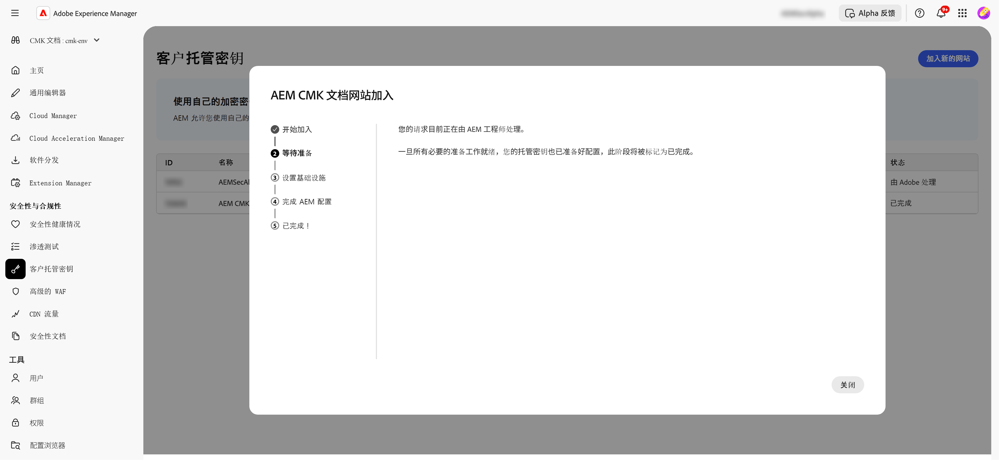

# AEM as a Cloud Service 客户管理的密钥设置 {#customer-managed-keys-for-aem-as-a-cloud-service}

AEM as a Cloud Service 当前将客户数据存储在 Azure Blob Storage 和 MongoDB 中，默认情况下利用提供商管理的加密密钥来保护数据。虽然这种设置满足了众多组织的安全需求，但在受管制行业或需要增强数据安全性的企业可能会寻求对其加密实践的更大控制权。对于那些优先考虑数据安全、合规性以及管理加密密钥能力的组织来说，客户管理密钥 (CMK) 解决方案提供了一个关键的增强功能。

## 正在解决的问题 {#the-problem-being-solved}

对于需要额外隐私和完整性的企业而言，提供商管理的密钥可能会引发担忧。如果不能控制密钥管理，组织在满足合规要求、实施自定义安全策略以及确保完整的数据安全方面将面临挑战。

客户管理密钥 (CMK) 的引入解决了这些问题，它赋予 AEM 客户对其加密密钥的完全控制权。通过使用 Microsoft Entra ID（前身为 Azure Active Directory）进行身份验证，AEM CS 能够安全地连接到客户的 Azure 密钥存储库，使他们能够管理加密密钥的生命周期——包括密钥的创建、轮换和撤销。

CMK 具有以下几个优点：

* **控制数据和应用程序加密：** 通过对 AEM 应用程序和数据加密密钥的直接管理来增强安全性。
* **提高保密性和完整性：** 通过全面的加密管理，降低敏感或专有数据被无意访问和泄露的风险。
* **Azure Key Vault 支持：** 使用 Azure Key Vault 可以进行密钥存储、处理机密操作以及执行密钥轮换。

通过采用 CMK，客户可以增强对其数据安全和加密实践的控制，加强安全并降低风险，同时继续享受 AEM CS 的可扩展性和灵活性。

AEM as a Cloud Service 允许您使用自己的加密密钥来加密静态数据。本指南提供了在 Azure 密钥存储库中为 AEM as a Cloud Service 设置客户管理密钥 (CMK) 的步骤。

>[!WARNING]
>
>在设置 CMK 后，您无法恢复到系统管理的密钥。您有责任安全地管理您的密钥，并在 Azure 中提供对您的密钥存储库、密钥和 CMK 应用程序的访问权限，以防止失去对数据的访问权限。

您还将被引导完成以下步骤，以创建和配置所需的基础设施：

1. 设置环境
1. 从 Adobe 获取应用程序 ID
1. 创建新资源组
1. 创建密钥保管库
1. 授予Adobe对密钥库的访问权限
1. 创建加密密钥

您需要与 Adobe 共享密钥存储库 URL、加密密钥名称以及有关密钥存储库的信息。

## 设置环境 {#setup-your-environment}

Azure 命令行界面 (CLI) 是本指南的唯一要求。如果您尚未安装 Azure CLI，请按照[此处](https://learn.microsoft.com/en-us/cli/azure/install-azure-cli)的官方安装说明进行操作。

在继续本指南的其余部分之前，请使用`az login`登录您的CLI。

>[!NOTE]
>
>虽然本指南使用 Azure CLI，但也可以经由 Azure 控制台执行相同的操作。如果您更喜欢使用 Azure 控制台，请使用以下命令作为参考。


## 启动AEM as a Cloud Service的CMK配置过程 {#request-cmk-for-aem-as-a-cloud-service}

您需要通过UI为AEM as a Cloud Service环境请求客户管理的密钥(CMK)配置。 为此，请导航到&#x200B;**客户管理的密钥**部分下的AEM主页安全UI。
然后，您可以通过单击**开始载入**&#x200B;按钮来开始载入流程。


## 从 Adobe 获取应用程序 ID {#obtain-an-application-id-from-adobe}

开始载入流程后，Adobe将提供Entra应用程序ID。 该应用程序ID是本指南其余部分所必需的，将用于创建允许Adobe访问您的密钥库的服务主体。 如果您还没有应用程序ID，则需要等待Adobe提供此ID。



请求完成后，您将能够在CMK UI中看到应用程序ID。


## 创建新资源组 {#create-a-new-resource-group}

在您选择的位置创建一个新的资源组。

```powershell
# Choose a location and a name for the resource group.
$location="<AZURE LOCATION>"
$resourceGroup="<RESOURCE GROUP>"

# Create the resource group.
az group create --location $location --resource-group $resourceGroup
```

如果您已经有资源组，请随意使用它。在本指南的其余部分，资源组的位置和其名称分别用 `$location` 和 `$resourceGroup`标识。

## 创建密钥存储库 {#create-a-key-vault}

您需要创建一个密钥存储库来保存您的加密密钥。密钥存储库必须启用清除保护。清除保护对于加密来自其他 Azure 服务的静态数据是必要的。必须启用公共网络访问，以确保Adobe服务可以访问密钥保管库。

>[!IMPORTANT]
>创建禁用了公共网络访问权限的密钥存储库会强制所有与密钥存储库相关的操作（如密钥创建或轮换）必须从具有密钥存储库网络访问权限的环境中执行（例如，可以访问密钥存储库的虚拟机）。

```powershell
# Reuse this information from the previous step.
$location="<AZURE LOCATION>"
$resourceGroup="<RESOURCE GROUP>"

# Choose a name for the key vault.
$keyVaultName="<KEY VAULT NAME>"

# Create the key vault.
az keyvault create `
  --location $location `
  --resource-group $resourceGroup `
  --name $keyVaultName `
  --default-action=Allow `
  --enable-purge-protection `
  --enable-rbac-authorization `
  --public-network-access Enabled
```

## 授予 Adobe 访问密钥存储库的权限 {#grant-adobe-access-to-the-key-vault}

在此步骤中，您将允许 Adobe 通过 Entra 应用程序访问您的密钥存储库。Entra 应用程序的 ID 应该已经由 Adobe 提供。

首先，您必须创建一个附加到Entra应用程序的服务主体，并为其分配&#x200B;**密钥保管库Reader**&#x200B;和&#x200B;**密钥保管库加密用户**&#x200B;角色。 这些角色仅限于本指南中创建的密钥存储库。

```powershell
# Reuse this information from the previous steps.
$resourceGroup="<RESOURCE GROUP>"
$keyVaultName="<KEY VAULT NAME>"

# The application ID is provided by Adobe.
$appId="<APPLICATION ID>"

# Retrieve the ID of the key vault.
$keyVaultId=(az keyvault show --resource-group $resourceGroup --name $keyVaultName --query id --output tsv)

# Create a new service principal.
$servicePrincipalId=(az ad sp create --id $appId --query id --out tsv)

# Assign the roles to the service principal.
az role assignment create --assignee $servicePrincipalId --role "Key Vault Reader" --scope $keyVaultId
az role assignment create --assignee $servicePrincipalId --role "Key Vault Crypto User" --scope $keyVaultId
```

## 创建加密密钥 {#create-an-encryption-key}

最后，您可以在密钥存储库中创建加密密钥。请注意，您需要&#x200B;**密钥存储库加密官员**&#x200B;角色才能完成此步骤。如果登录用户没有此角色，请联系您的系统管理员为您授予此角色，或请求已拥有该角色的用户为您完成此步骤。

需要通过网络访问密钥存储库才能创建加密密钥。首先验证您是否可以访问密钥存储库并继续创建密钥：

```powershell
# Reuse this information from the previous steps.
$keyVaultName="<KEY VAULT NAME>"

# Choose a name for your key.
$keyName="<KEY NAME>"

# Create the key.
az keyvault key create --vault-name $keyVaultName --name $keyName
```

## 共享密钥存储库信息 {#share-the-key-vault-information}

至此，您已全部设置完毕。您只需通过CMK UI共享一些必需的信息，这将启动环境配置过程。

```powershell
# Reuse this information from the previous steps.
$resourceGroup="<RESOURCE GROUP>"
$keyVaultName="<KEY VAULT NAME>"

# Retrieve the URL of your key vault.
$keyVaultUri=(az keyvault show --name $keyVaultName `
    --resource-group $resourceGroup `
    --query properties.vaultUri `
    --output tsv)

# In addition we would need the tenantId and the subscriptionId in order to setup the connection.
$tenantId=(az keyvault show --name $keyVaultName `
    --resource-group $resourceGroup `
    --query properties.tenantId `
    --output tsv)
$subscriptionId="<Subscription ID>"
```
在CMK UI中提供以下信息：


## 撤销密钥访问权限的影响 {#implications-of-revoking-key-access}

撤销或禁用对密钥库、密钥或 CMK 应用程序的访问可能会导致严重中断，包括对您的平台操作的破坏性更改。一旦这些密钥被禁用，平台中的数据可能变得无法访问，任何依赖这些数据的下游操作将停止运行。在对关键配置进行任何更改之前，充分理解下游影响至关重要。

如果您决定撤销平台对您数据的访问权限，您可以通过从 Azure 内的密钥存储库中移除与应用程序关联的用户角色来实现。

## 后续步骤 {#next-steps}

在CMK UI中提供所需信息后，Adobe将为您的AEM as a Cloud Service环境启动配置过程。 此过程可能需要一些时间，完成后，您将收到通知。


## 完成CMK设置 {#complete-the-cmk-setup}

配置过程完成后，您将能够在UI中查看CMK设置的状态。 您还可以看到密钥保管库和加密密钥。


## 问题和支持 {#questions-and-support}

如果您对AEM as a Cloud Service的客户托管密钥设置有任何疑问、查询或需要帮助，请联系我们。 Adobe支持可以帮助您解答您可能遇到的任何问题。